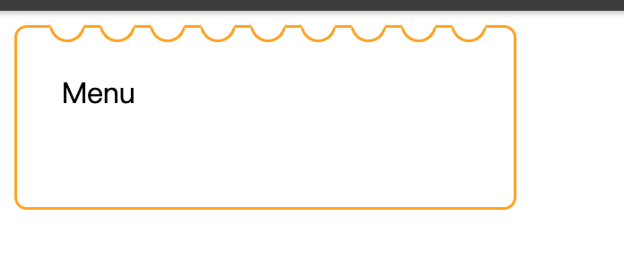

It is an interesting hook called `useSyncExternalStore` came from [React 18](https://github.com/reactwg/react-18/discussions/86). After I went through the [doc](https://react.dev/reference/react/useSyncExternalStore), I had totally no idea about how to use it and why it works. Luckily, I got a task I thought I can use this hook, and meanwhile I traced the source code to understand `useSyncExternalStore` implementation. In this article, I will explain how it works internally and show a demo which is differ from [the doc](https://react.dev/reference/react/useSyncExternalStore).

<!-- toc -->

<!-- more -->

### `useSyncExternalStore` source code

Let us read this helper `checkIfSnapshotChanged` first. It compares the return value of `getSnapshot` with `prevValue`, and return true if they are different.
```typescript
function checkIfSnapshotChanged<T>(inst: {
  value: T,
  getSnapshot: () => T,
}): boolean {
  const latestGetSnapshot = inst.getSnapshot;
  const prevValue = inst.value;
  try {
    const nextValue = latestGetSnapshot();
    return !is(prevValue, nextValue); // Object.is
  } catch (error) {
    return true;
  }
}
```

Since we have `checkIfSnapshotChanged` helper, we can  now proceed to `useSyncExternalStore`.
```typescript
function useSyncExternalStore<T>(
  subscribe: (() => void) => () => void,
  getSnapshot: () => T,
  getServerSnapshot?: () => T,
): T {
  // Read the current snapshot from the store on every render.
  const value = getSnapshot();
  const [{inst}, forceUpdate] = useState({inst: {value, getSnapshot}});

  useLayoutEffect(() => {
    inst.value = value;
    inst.getSnapshot = getSnapshot;
    if (checkIfSnapshotChanged(inst)) {
      // Force a re-render.
      forceUpdate({inst});
    }
  }, [subscribe, value, getSnapshot]);

  useEffect(() => {
    if (checkIfSnapshotChanged(inst)) {
      // Force a re-render.
      forceUpdate({inst});
    }
    const handleStoreChange = () => {
      if (checkIfSnapshotChanged(inst)) {
        // Force a re-render.
        forceUpdate({inst});
      }
    };
    // Subscribe to the store and return a clean-up function.
    return subscribe(handleStoreChange);
  }, [subscribe]);

  return value;
}
```

On every render, it retrieves a `getSnapshot` value (Line 32) and sets both `value` and `getSnapshot` into state. It's important to note that they use `forceUpdate` as the setter name. Subsequently, it forces a re-render by `forceUpdate({ inst })` if `checkIfSnapshotChanged` passed (line 38, 45, and 50).

Continuing further, in the `useEffect`, it returns a clean-up function by invoking `subscribe` with a `handleStoreChange` callback function (Line 56). Therefore, `useSyncExternalStore` should pass a subscribe function with a type with `(callback) => () => {}`.

### `useSyncExternalStore` demonstration




According to the width, I have to generate many half circles on the top of menu card. Thus I use `useSyncExternalStore` hook, listen resize as subscribe, and calculate the count depends on getBoundingClientRect. 

```typescript
function subscribe(callback) {
    window.addEventListener('resize', callback)
    return () => window.removeEventListener('resize', callback)
}
const DynamicHalfCircle = ({ parentRef }) => {
    const circleData = useSyncExternalStore(
      subscribe,
      () => {
        const { width } = parentRef.current?.getBoundingClientRect() || { width: 0 }
        const count = Math.ceil((width - 7 * 2 - PADDING_Y - CIRCLE_GAP) / (CIRCLE_RADIUS * 2 + CIRCLE_GAP))
        const initLeft = Math.max((width - count * CIRCLE_RADIUS * 2 - (count - 1) * CIRCLE_GAP) / 2, 0)
        return JSON.stringify({
          count: Math.max(count, 0),
          width,
          initLeft,
        })
      },
      () =>
        JSON.stringify({
          count: 0,
          width: 0,
          initLeft: 0,
        }),
    )

    const circleInfo = JSON.parse(circleData || '{}')

    return (
      <CircleWrapper>
        {Array.from({ length: circleInfo?.count || 0 }, (_, i) => i).map((i) => (
          <HalfCircle key={i} style={{ left: (CIRCLE_GAP + CIRCLE_RADIUS * 2) * i + (circleInfo.initLeft ?? 0) }} />
        ))}
      </CircleWrapper>
	)
}
```
> Just try to resize codepen below.
{% iframe https://codepen.io/joseph780116/embed/QWojadB?default-tab=html%2Cresult %}


### Conclusion

Without `useSyncExternalStore`, I would need to use `useEffect` and `useState`. Now, I just need to use `useSyncExternalStore` hook and subscribe to changes in getBoundingClientRect when window is resized. It is quite useful, isn't it?
