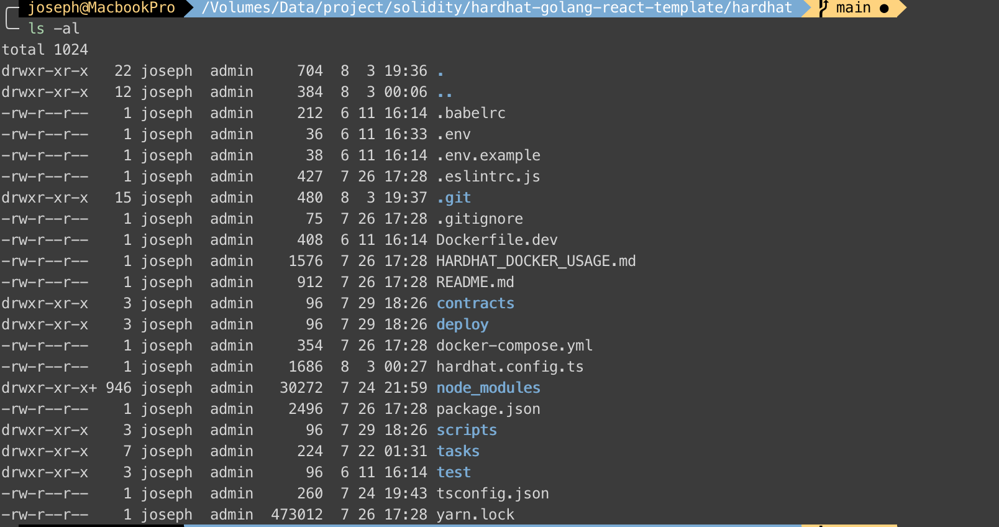
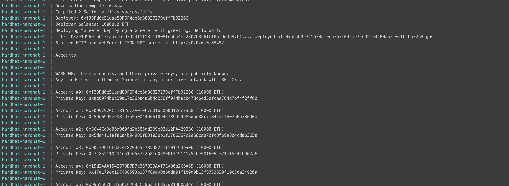

This is a series articles of Blockchain fullstack structure, please read  first. In this part, I will show how to set docker to Hardhat, but this is simpler than my previous article .
<!-- more -->

### Project structure
Look my hardhat project structure first:


Let's check my Dockerfile:
**Dockerfile.dev**
```
FROM node:16

ENV APP_ROOT /app

RUN mkdir ${APP_ROOT}
WORKDIR ${APP_ROOT}
ADD . ${APP_ROOT}

RUN yarn install
RUN yarn global add \
  solhint \
  solc \
  eslint \
  typescript

EXPOSE 8545

CMD [ "yarn", "dev" ]
```

**docker-compose.yml**
```yaml
version: '3'

services:
  ####### Blockchain hardhat ##############
  hardhat:
    build:
      context: .
      dockerfile: Dockerfile.dev
    volumes:
      - .:/app
      - ./node_modules:/app/node_modules
    ports:
      - 8545:8545
```
I expose **8545** port so that I can connect to hardhat by **http://docker.for.mac.localhost:8545** on my MacOS.

And, as I mentioned in , I use `hardhat-abi-exporter`, so I have to run `yarn` to install it.
```bash
docker-compose exec hardhat yarn add --dev hardhat-abi-exporter

# OR
# docker-compose run --rm hardhat yarn add --dev hardhat-abi-exporter
```

And I add `abiExporter` config to `hardhat.config.ts`
```typescript
// import other packages.......
import 'hardhat-abi-exporter'

const config: HardhatUserConfig = {
    solidity: "0.8.4",
    defaultNetwork: 'localhost',
    networks: {
      ...
      ...
    },
    abiExporter: {
      path: './data/abi',
      runOnCompile: true,
      clear: true,
      flat: true,
      spacing: 2,
      format: 'json'
    }
  }
```

Because of this config, I can generate ABI by:
> `docker-compose run --rm hardhat yarn run hardhat export-abi --no-compile`

Lastly, I use the simplest contract only `set` and `get` functions:
```solidity
//SPDX-License-Identifier: Unlicense
pragma solidity ^0.8.4;

import "hardhat/console.sol";

contract Greeter {
  string greeting;

  constructor(string memory _greeting) {
    console.log("Deploying a Greeter with greeting:", _greeting);
    greeting = _greeting;
  }

  function greet() public view returns (string memory) {
    console.log("greet function called ");
    console.log("------ %s", greeting);
    return greeting;
  }

  function setGreeting(string memory _greeting) public {
    console.log("Changing greeting from '%s' to '%s'", greeting, _greeting);
    console.log("sender: ", msg.sender);
    greeting = _greeting;
  }
}
```

This contract just test the functions can be called from  backend and frontend. That's quite enough.
The output is:


### References
- Github: [dApp-hardhat](https://github.com/josephMG/dApp-hardhat)
- Hardhat docker example: [Hardhat-template](https://github.com/garethfuller/hardhat-template)
