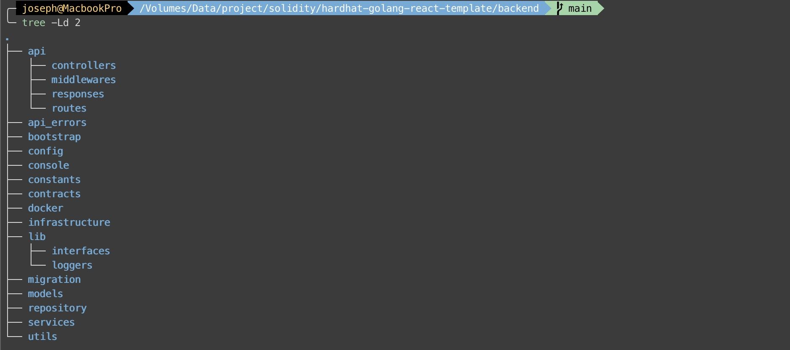
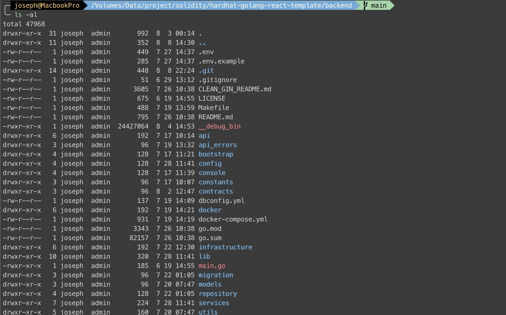
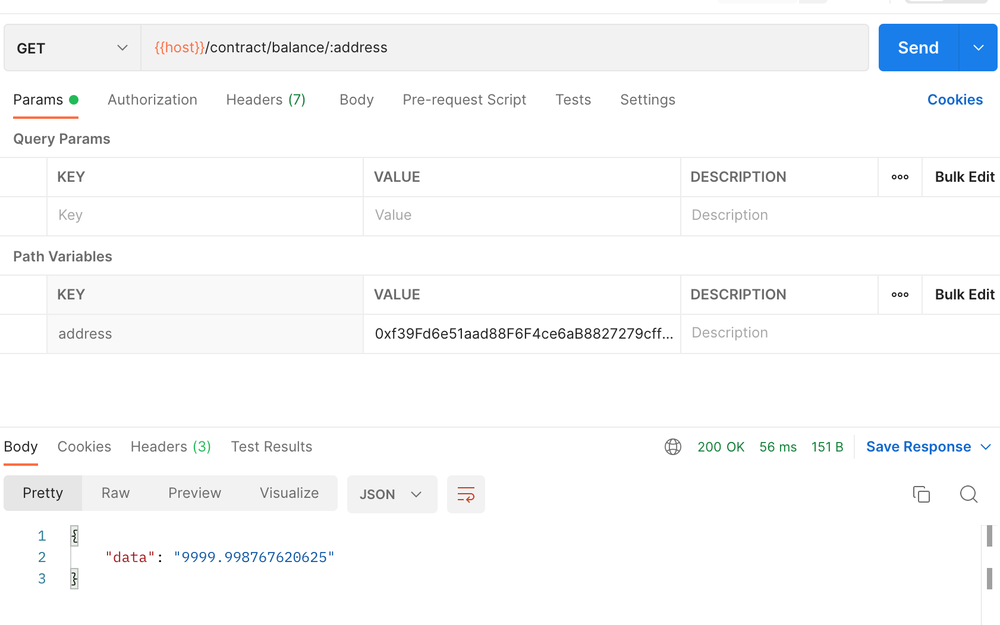
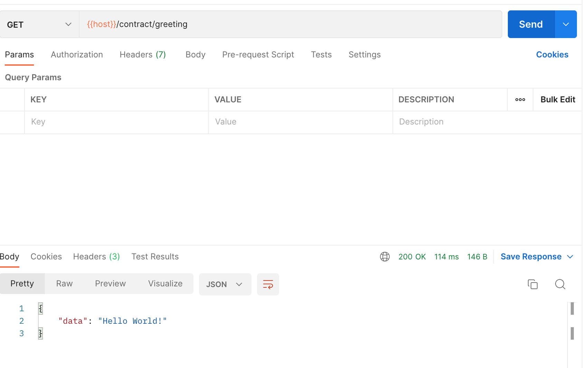
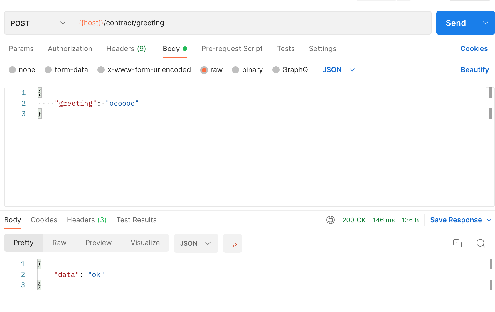

It's time to Blockchain with Golang. If you haven't seen my previous post  and , please read them first.

Again, does Dapp need a Backend? 
> [reddit](https://www.reddit.com/r/ethdev/comments/nxvk43/do_dapps_really_need_backend/)
> - You can pretty much make a dapp without backend, but there are some things that can't be done with a smart contract. 
> - You need a backend among other reasons for off-chain or metadata that won’t be stored in the smart contracts. 

Have you ever thought about how [Moralis](https://moralis.io) works?
> **Off-chain**: Backend infrastructure that collects data from the blockchain, offers an API to clients like web apps and mobile apps, indexes the blockchain, provides real-time alerts, coordinates events that are happening on different chains, handles the user life-cycle and so much more.
> Moralis Dapp is used in order to speed up the implementation of the off-chain infrastructure. Moralis Dapp is a bundled solution of all the features most Dapps need in order to get going as soon as possible.

<!-- more -->
Although I'm more familiar with Node.js and Ruby than Golang, I choose Golang [Gin web framework](https://gin-gonic.com/) to implement a backend, and use [go-ethereum](https://geth.ethereum.org/) to communicate with blockchain. But I totally have no idea about organizing Golang/Gin file structure, Ruby on rails and [Adonis / Node.js](https://adonisjs.com/) handles it very well. After some survey, I find a [Go clean architechture](https://github.com/wesionaryTEAM/go_clean_architecture) repo. It file structure is similar to RoR and Adonis, and it integrates with [Go Fx](https://github.com/uber-go/fx) to make dependency injection easy. That's why I use it in my backend project.

### Files and Folder structure



> Let me focus on DApp part, and just skip the folder structure introduction.

### Docker

The Docker compose includes 3 services such as `api`, `database`, and `adminer`. There are many files so I hope you can go through [the repo](https://github.com/wesionaryTEAM/go_clean_architecture) yourself.

### Migration database

Check `Makefile` and `migration` first. It's important to run migration in the beginning.
```makefile
include .env

MIGRATE=docker-compose exec api sql-migrate

ifeq ($(p),host)
        MIGRATE=sql-migrate
endif

migrate-status:
        $(MIGRATE) status

migrate-up:
        $(MIGRATE) up

migrate-down:
        $(MIGRATE) down

redo:
        @read -p  "Are you sure to reapply the last migration? [y/n]" -n 1 -r; \
        if [[ $$REPLY =~ ^[Yy] ]]; \
        then \
                $(MIGRATE) redo; \
        fi

create:
        @read -p  "What is the name of migration?" NAME; \
        ${MIGRATE} new $$NAME

.PHONY: migrate-status migrate-up migrate-down redo create
```

**migration/xxxxxxx-create_users_table.sql**
```sql
-- +migrate Up
CREATE TABLE IF NOT EXISTS `users` (
  `id` BINARY(16) NOT NULL,
  `email` VARCHAR(100) NOT NULL,
  `name` VARCHAR(20) NOT NULL,
  `birthday` DATETIME,
  `wallet_address` VARCHAR(42) NOT NULL,
  `member_number` VARCHAR(100),
  `created_at` DATETIME NOT NULL,
  `updated_at` DATETIME NOT NULL,
  PRIMARY KEY (`id`),
  CONSTRAINT email_unique UNIQUE(email),
  CONSTRAINT wallet_address_unique UNIQUE INDEX (wallet_address)
)ENGINE = InnoDB DEFAULT CHARSET=utf8mb4;

-- +migrate Down
DROP TABLE IF EXISTS `users`;
```

The migration shows to create a `users` tables when migrate up, and I use the following command to run migration:
> `make migrate-up`

### Step 1: Authencation

Users need to sign up or sign in when they clicked the **connect wallet** button, so I add auth route and controller logics first.

**api/routes/auth_route.go**
```go
package routes

import (
  "hardhat-backend/api/controllers"
  "hardhat-backend/infrastructure"
  "hardhat-backend/lib/loggers"
)

// AuthRoutes struct
type AuthRoutes struct {
  logger         loggers.Logger
  handler        infrastructure.Router
  authController controllers.JWTAuthController
}

// Setup user routes
func (s *AuthRoutes) Setup() {
  s.logger.Info("Setting up routes")
  auth := s.handler.Group("/api").Group("/auth")
  {
    auth.POST("/login", s.authController.SignIn)
  }
}

// NewAuthRoutes creates new user controller
func NewAuthRoutes(
  handler infrastructure.Router,
  authController controllers.JWTAuthController,
  logger loggers.Logger,
) *AuthRoutes {
  return &AuthRoutes{
    handler:        handler,
    logger:         logger,
    authController: authController,
  }
}
```

**api/controllers/jwt_auth_controller.go**
```Go
package controllers

import (
  "hardhat-backend/api_errors"
  "hardhat-backend/lib/loggers"
  "hardhat-backend/services"
  "hardhat-backend/utils"

  "github.com/gin-gonic/gin"
)

// JWTAuthController struct
type JWTAuthController struct {
  logger      loggers.Logger
  service     services.JWTAuthService
  userService *services.UserService
}

type SignInRequest struct {
  WalletAddress string `json:"walletAddress"`
}

// NewJWTAuthController creates new controller
func NewJWTAuthController(
  logger loggers.Logger,
  service services.JWTAuthService,
  userService *services.UserService,
) JWTAuthController {
  return JWTAuthController{
    logger:      logger,
    service:     service,
    userService: userService,
  }
}

// SignIn signs in user
func (jwt JWTAuthController) SignIn(c *gin.Context) {
  jwt.logger.Info("SignIn route called")
  var request SignInRequest
  err := c.BindJSON(&request)
  if err != nil {
    utils.HandleValidationError(jwt.logger, c, api_errors.ErrInvalidRequest)
    return
  }
  walletAddress := request.WalletAddress

  user, newUser, err := jwt.userService.GetOneUserByWalletAddress(walletAddress)
  if err != nil {
    utils.HandleError(jwt.logger, c, err)
    return
  }
  // token := jwt.service.CreateToken(user)
  c.JSON(200, gin.H{
    "message": "logged in successfully",
    "data": gin.H{
      "user":    user,
      "newUser": newUser,
    },
  })
}
```

**services/user_service.go**
```go
...

// GetOneUserByWalletAddress find first or create a user by wallet address
func (s UserService) GetOneUserByWalletAddress(walletAddress string) (user models.User, newUser int64, err error) {
  result := s.repository.FirstOrCreate(&user, models.User{WalletAddress: walletAddress})
  return user, result.RowsAffected, result.Error
}
...
```

The **UserService** called [Gorm](https://gorm.io/) `FirstOrCreate` method to get the user by `WalletAddress` string. Hence the `/api/auth/login` endpoint can return the user to frontend.

### Step 2: Sign-in with Ethereum (SIWE)

Sometimes, I need to verify the message from client, so I add SIWE controller to handle it.
> I'm supposed to add an endpoint to get `nonce`, but this version `nonce` is generated from frontend.


**api/routes/siwe_route.go**
```go
package routes

import (
  "hardhat-backend/api/controllers"
  "hardhat-backend/infrastructure"
  "hardhat-backend/lib/loggers"
)

// SiweRoutes struct
type SiweRoutes struct {
  logger         loggers.Logger
  handler        infrastructure.Router
  siweController controllers.SiweController
}

// Setup siwe routes
func (s *SiweRoutes) Setup() {
  s.logger.Info("Setting up routes")
  api := s.handler.Group("/api")
  {
    api.POST("/siwe/verify", s.siweController.PostVerify)
  }
}

// NewSiweRoutes creates new siwe controller
func NewSiweRoutes(
  handler infrastructure.Router,
  logger loggers.Logger,
  siweController controllers.SiweController,
) *SiweRoutes {
  return &SiweRoutes{
    handler:        handler,
    logger:         logger,
    siweController: siweController,
  }
}
```

**api/controllers/siwe_controller.go**
```go
package controllers

import (
  "hardhat-backend/api_errors"
  "hardhat-backend/lib/loggers"
  "hardhat-backend/services"
  "hardhat-backend/utils"

  "github.com/gin-gonic/gin"
)

// SiweController data type
type SiweController struct {
  service *services.SiweService
  logger  loggers.Logger
}

type VerifyRequest struct {
  Message   string `json:"message"`
  Signature string `json:"signature"`
}

// NewSiweController creates new siwe controller
func NewSiweController(siweService *services.SiweService, logger loggers.Logger) SiweController {
  return SiweController{
    service: siweService,
    logger:  logger,
  }
}
// PostVerify verify message string
func (s SiweController) PostVerify(c *gin.Context) {
  var request VerifyRequest
  err := c.BindJSON(&request)
  if err != nil {
    utils.HandleValidationError(s.logger, c, api_errors.ErrInvalidRequest)
    return
  }

  _, err = s.service.Verify(request.Message, request.Signature)
  if err != nil {
    utils.HandleError(s.logger, c, err)
    return
  }

  c.JSON(200, gin.H{
    "data": "Verified",
  })
}
```

In the `SiweService`, I install the `Sign-In with Ethereum` package [siwe-go](https://docs.login.xyz/), which is the same package I used in Next.js frontend.

> SIWE-go usage: [https://docs.login.xyz/libraries/go](https://docs.login.xyz/libraries/go)

**services/siwe_service.go**
```go
package services

import (
  "hardhat-backend/lib/loggers"

  siwe "github.com/spruceid/siwe-go"
)

// SiweService service layer
type SiweService struct {
  logger loggers.Logger
}

// NewSiweService creates a new userservice
func NewSiweService(
  logger loggers.Logger,
) *SiweService {
  return &SiweService{
    logger: logger,
  }
}

// Verify the messageStr and signature
func (s SiweService) Verify(messageStr string, signature string) (message *siwe.Message, err error) {
  message, err = siwe.ParseMessage(messageStr)
  if err != nil {
    return nil, err
  }

  _, err = message.Verify(signature, nil, nil, nil)
  if err != nil {
    return nil, err
  }

  return message, err
}
```

### Final Step: Interact with contract:
> Final step should be a focal point of this post. [Go-etherneum](https://geth.ethereum.org/)!

In order to follow the project structure, I have to create `Ether.go` lib to manipulate `go-ethereum`. In `Ether.go`, I have 2 functions with different ways to **get greeting**, a function to **post greeting**, a function to **get account balance**, and a internal function to **get auth**.

**lib/ether.go**
```go
package lib

import (
  "bytes"
  "context"
  "crypto/ecdsa"
  "encoding/hex"
  "hardhat-backend/config"
  "hardhat-backend/lib/loggers"
  "math"
  "math/big"
  "strings"

  "github.com/ethereum/go-ethereum"
  "github.com/ethereum/go-ethereum/accounts/abi/bind"
  "github.com/ethereum/go-ethereum/common"
  "github.com/ethereum/go-ethereum/common/hexutil"
  "github.com/ethereum/go-ethereum/crypto"
  "github.com/ethereum/go-ethereum/ethclient"

  greeter "hardhat-backend/contracts"
)

// EtherClient modal
type EtherClient struct {
  *ethclient.Client
  loggers.Logger
  Env *config.Env
}

// NewEther creates a new ehter client instance
func NewEther(env *config.Env, logger loggers.Logger) EtherClient {
  client, err := ethclient.Dial(env.EthereumURL)
  if err != nil {
    logger.Error(err.Error())
  }
  defer client.Close()

  logger.Info("we have a connection")
  _ = client // we'll use this in the upcoming sections
  return EtherClient{
    Client: client,
    Logger: logger,
    Env:    env,
  }
}

// GetBalance get balance from address
func (c EtherClient) GetBalance(address string) *big.Float {
  account := common.HexToAddress(address)
  balance, err := c.Client.BalanceAt(context.Background(), account, nil)
  if err != nil {
    c.Logger.Error(err.Error())
  }
  fbalance := new(big.Float)
  fbalance.SetString(balance.String())
  ethValue := new(big.Float).Quo(fbalance, big.NewFloat(math.Pow10(18)))
  return ethValue
}

// GetGreeting get greeting string from contract function address
func (c EtherClient) GetGreeting() string {
  blockHeader, _ := c.Client.HeaderByNumber(context.Background(), nil)

  contractAddr := common.HexToAddress(c.Env.ContractAddr)
  data, _ := hexutil.Decode("0xcfae3217")
  callMsg := ethereum.CallMsg{
    To:   &contractAddr,
    Data: data,
  }
  res, err := c.Client.CallContract(context.Background(), callMsg, blockHeader.Number)
  if err != nil {
    c.Logger.Fatalf("Error calling contract: %v", err)
  }

  s, _ := hex.DecodeString(common.Bytes2Hex(res[:]))
  c.Logger.Info(res[:])
  c.Logger.Info(string(s))
  res = bytes.Trim(res[:], "\x00 \x0c")
  return strings.TrimSpace(string(res[:]))
}

// GetGreetingFromInstance get greeting string from contract instance
func (c EtherClient) GetGreetingFromInstance() string {
  contractAddr := common.HexToAddress(c.Env.ContractAddr)
  instance, err := greeter.NewGreeter(contractAddr, c.Client)

  tx, err := instance.Greet(new(bind.CallOpts))
  if err != nil {
    c.Logger.Fatal(err)
  }
  return tx
}

// PstGreeting post greeting string to contract instance
func (c EtherClient) PostGreetingToInstance(greeting string) string {
  auth, err := GetAuth(c, c.Env.AccountPrivateKey)

  contractAddr := common.HexToAddress(c.Env.ContractAddr)
  instance, err := greeter.NewGreeter(contractAddr, c.Client)

  tx, err := instance.SetGreeting(auth, greeting)
  if err != nil {
    c.Logger.Fatal(err)
  }

  c.Logger.Infof("tx sent: %s", tx.Hash().Hex()) // tx sent: 0x8d490e535678e9a24360e955d75b27ad307bdfb97a1dca51d0f3035dcee3e870

  return "ok"
}

func GetAuth(c EtherClient, accountAddress string) (*bind.TransactOpts, error) {
  privateKey, err := crypto.HexToECDSA(accountAddress)
  if err != nil {
    c.Logger.Fatal(err)
    return nil, err
  }

  publicKey := privateKey.Public()
  publicKeyECDSA, ok := publicKey.(*ecdsa.PublicKey)

  if !ok {
    c.Logger.Fatal("cannot assert type: publicKey is not of type *ecdsa.PublicKey")
    return nil, err
  }

  fromAddress := crypto.PubkeyToAddress(*publicKeyECDSA)
  nonce, err := c.Client.PendingNonceAt(context.Background(), fromAddress)
  if err != nil {
    c.Logger.Fatal(err)
    return nil, err
  }

  gasPrice, err := c.Client.SuggestGasPrice(context.Background())
  if err != nil {
    c.Logger.Fatal(err)
    return nil, err
  }

  auth := bind.NewKeyedTransactor(privateKey)
  auth.Nonce = big.NewInt(int64(nonce))
  auth.Value = big.NewInt(0)     // in wei
  auth.GasLimit = uint64(300000) // in units
  auth.GasPrice = gasPrice

  return auth, nil
}
```

- `GetBalance`: gets account balance from `ethclient`.
- `GetGreeting`: uses contract deployed address `c.Env.ContractAddr` and  function address `0xcfae3217` in `CallMsg` to call solidity `greeting(). and `Line 79` to remove some char from the string result.
- `GetGreetingFromInstance`: imports `greeter` module generated from `AbiGen` to get solidity `greeting()` result.
- `PostGreetingToInstance`: gets auth with `c.Env.AccountPrivateKey` private key that might belong to a contract owner, aka a backend's administractor. and calls solidity `setGreeting(string)` by `greeter` instance.

Now, just add `route`, `controller`, and `service`. There are three endpoints:

**api/routes/contract_route.go**
```go
package routes

import (
  "hardhat-backend/api/controllers"
  "hardhat-backend/infrastructure"
  "hardhat-backend/lib/loggers"
)

// ContractRoutes struct
type ContractRoutes struct {
  logger             loggers.Logger
  handler            infrastructure.Router
  contractController controllers.ContractController
}

// Setup contract routes
func (s *ContractRoutes) Setup() {
  s.logger.Info("Setting up routes")
  api := s.handler.Group("/api")
  {
    api.GET("/contract/balance/:address", s.contractController.GetBalance)
    api.GET("/contract/greeting", s.contractController.GetGreeting)
    api.POST("/contract/greeting", s.contractController.PostGreeting)
  }
}

// NewContractRoutes creates new contract controller
func NewContractRoutes(
  logger loggers.Logger,
  handler infrastructure.Router,
  contractController controllers.ContractController,
) *ContractRoutes {
  return &ContractRoutes{
    handler:            handler,
    logger:             logger,
    contractController: contractController,
  }
}
```

**api/controllers/contract_controller.go**
```go
package controllers

import (
  "hardhat-backend/api_errors"
  "hardhat-backend/lib/loggers"
  "hardhat-backend/services"
  "hardhat-backend/utils"

  "github.com/gin-gonic/gin"
)

// ContractController data type
type ContractController struct {
  service services.ContractService
  logger  loggers.Logger
}

type GreetingRequest struct {
  GreetingStr string `json:"greeting"`
}

// NewContractController creates new user controller
func NewContractController(contractService services.ContractService, logger loggers.Logger) ContractController {
  return ContractController{
    service: contractService,
    logger:  logger,
  }
}

// GetBalance gets the balance from address
func (contract ContractController) GetBalance(c *gin.Context) {
  address := c.Param("address")
  c.JSON(200, gin.H{"data": contract.service.GetBalance(address)})
}

// GetGreeting gets the greeting from contract
func (contract ContractController) GetGreeting(c *gin.Context) {
  c.JSON(200, gin.H{"data": contract.service.GetGreeting()})
}

// PostGreeting post the greeting to contract
func (contract ContractController) PostGreeting(c *gin.Context) {
  var request GreetingRequest
  err := c.BindJSON(&request)
  if err != nil {
    utils.HandleValidationError(contract.logger, c, api_errors.ErrInvalidRequest)
    return
  }
  c.JSON(200, gin.H{"data": contract.service.PostGreeting(request.GreetingStr)})
}
```

**services/contract_service.go**
```go
package services

import (
  "hardhat-backend/lib"
  "hardhat-backend/lib/loggers"
  "math/big"
)

// ContractService service layer
type ContractService struct {
  logger loggers.Logger
  client lib.EtherClient
}

// NewContractService creates a new userservice
func NewContractService(logger loggers.Logger, client lib.EtherClient) ContractService {
  return ContractService{
    logger: logger,
    client: client,
  }
}

func (c ContractService) GetBalance(address string) *big.Float {
  return c.client.GetBalance(address)
}

func (c ContractService) GetGreeting() string {
  // return c.client.GetGreeting()
  return c.client.GetGreetingFromInstance()
}

func (c ContractService) PostGreeting(greeting string) string {
  return c.client.PostGreetingToInstance(greeting)
}
```
You can change Line 28 and 29 to try to get greeting by different ways.

Everything's done. To test it, I use Postman app.
> Please also check docker logs for each request.

**Get Balance**


**Get Greeting (initial greeting message)**


**Set Greeting**



To be honestly, I'm a junior in Golang, and I'm still learning how to use Golang. After coding this backend, I'm getting familiar with it.

Okay, backend part is finished! Next article will introduce how to interact with contract with frontend.
