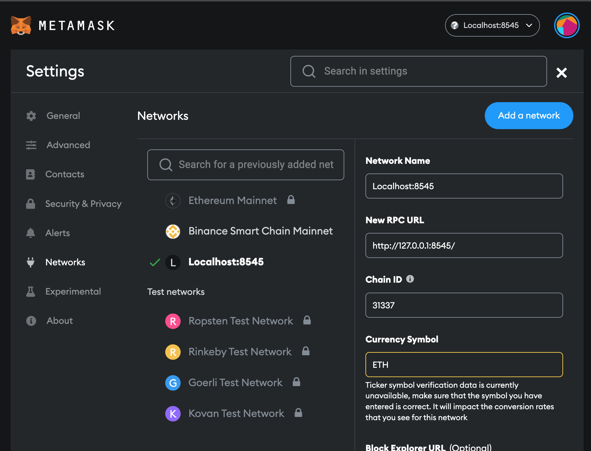
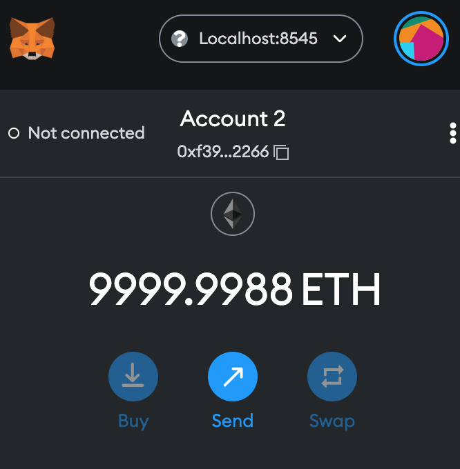
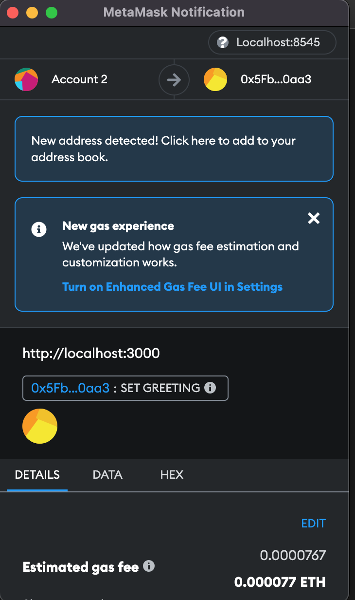

Alright, the series of articles goes to frontend part. I post an article related to Blockchain with React.js and Next.js. If you haven't seen my previous posts [Part 1 Introduction](./Blockchain-fullstack-structure-Part-1-Introduction), [Part 2 Hardhat](./Blockchain-fullstack-structure-Part-2-Hardhat), and [Part 3 Golang Gin](./Blockchain-fullstack-structure-Part-3-Golang-Gin), please read them first.

In this article, I demonstrate how to use React.js (Next.js) to interact with smart contract by Golang Gin API and hardhat RPC URL, and implement a simple Sign-in with Ethereum (SIWE) authentication and `setGreeting` to Solidity.

Okay, let's start it.

### TOC

<!-- more -->
### Prerequisite

- [Metamask](https://metamask.io/): It's a crypto wallet, and you can install it's [Google chrome extension](https://chrome.google.com/webstore/detail/metamask/nkbihfbeogaeaoehlefnkodbefgpgknn).

After you get the wallet and the extension, you have to use Hardhat localhost network to Metamask by setting `RPC URL` to `http://127.0.0.1:8545/` and `Chain ID` to `31337`.


And then, you can get a rich wallet account by importing an account with the private key hardhat gave you.


### Project Initiation

I choose the [create-m2-app](https://www.npmjs.com/package/create-m2-app) to generate [nextjs-ts](https://github.com/MileTwo/nextjs-ts) template as my frontend project. It already includes Typescript, Material UI, ESLint, Jest, and React Testing Library.

```shell
cd frontend
npx create-next-app --example https://github.com/MileTwo/nextjs-ts app
```

Okay, I have a project now. Let's set docker for it.

**Dockerfile**
```docker
FROM node:18-alpine3.15
RUN apk add --no-cache git

# Install app dependencies
RUN mkdir -p /app/node_modules
WORKDIR /app
COPY ./app /app

RUN npm install --legacy-peer-deps
```

**docker-compose.yml**
```yaml
version: '3.8'
services:
  frontend:
    build:
      context: .
      dockerfile: Dockerfile
    volumes:
      - ./app:/app
      - ./app/node_modules:/app/node_modules
    command: sh -c 'npm run dev'
    ports:
      - "3000:3000"
    stdin_open: true
```

Well done. I can go to next step!

### React hooks for Ethereum - Wagmi

What is [Wagmi](https://wagmi.sh/)?

> Wagmi is a collection of React Hooks containing everything you need to start working with Ethereum. wagmi makes it easy to "Connect Wallet," display ENS and balance information, sign messages, interact with contracts, and much more — all with caching, request deduplication, and persistence.

You can also call [ethers.js](https://docs.ethers.io/v5/) or [web3.js](https://web3js.readthedocs.io/en/v1.7.5/) directly, but I don't need to reinvent the wheel.

**app/src/components/WagmiProvider.tsx**
```typescript
import { ReactElement } from 'react';
import { chain, WagmiConfig, createClient, configureChains, defaultChains } from 'wagmi';
import { jsonRpcProvider } from 'wagmi/providers/jsonRpc';
import { publicProvider } from 'wagmi/providers/public';
import { InjectedConnector } from 'wagmi/connectors/injected';

interface WagmiProviderProps {
  children: ReactElement[] | ReactElement | string;
}

const { chains, provider, webSocketProvider } = configureChains(
  [chain.hardhat, chain.localhost, ...defaultChains],
  [
    jsonRpcProvider({
      rpc: () => ({
        http: process.env.NEXT_PUBLIC_RPC_URL || 'http://localhost:8545',
      }),
    }),
    publicProvider(),
  ]
);

// Set up client
const client = createClient({
  autoConnect: true,
  connectors: [new InjectedConnector({ chains })],
  provider,
  webSocketProvider,
});

const DappWagmiProvider = ({ children }: WagmiProviderProps): ReactElement => (
  <WagmiConfig client={client}>{children}</WagmiConfig>
);

export default DappWagmiProvider;
```

I set `NEXT_PUBLIC_RPC_URL` to hardhat RPC URL, and create a client with a `InjectedConnector`. I will import `DappWagmiProvider` in `pages/_app.tsx` later. Actually, `WagmiConfig` uses `React Context`, so that `wagmi` can use `hooks` anywhere.

### Authentication - NextAuth + SIWE

In previous article [Part 3 Golang Gin](./Blockchain-fullstack-structure-Part-3-Golang-Gin), I mentioned that I use the [SIWE](https://docs.login.xyz/) to verify sign-in messages. You can also follow [this tutorial](https://docs.login.xyz/integrations/nextauth.js) to integrate **wagmi** and **siwe**.

Don't worry. There are only three mainly files: `nextauth api endpoint`, `ConnectWallet component`, and `protected page`.
 Okay! First, I create an api endpoint in **pages/api/auth**.

> What's the three dots meaning? [three dots usage](https://nextjs.org/docs/api-routes/dynamic-api-routes#catch-all-api-routes)

**pages/api/auth/[...nextauth].ts**

```javascript
import NextAuth from 'next-auth';
import CredentialsProvider from 'next-auth/providers/credentials';
import { NextApiRequest, NextApiResponse } from 'next';
import { SiweMessage } from 'siwe';
import { getCsrfToken } from 'next-auth/react';
import fetcher from '@/libs/fetcher';

export default async function auth(req: NextApiRequest, res: NextApiResponse) {
  const providers = [
    CredentialsProvider({
      name: 'Ethereum',
      credentials: {
        message: {
          label: 'Message',
          type: 'text',
          placeholder: '0x0',
        },
        signature: {
          label: 'Signature',
          type: 'text',
          placeholder: '0x0',
        },
      },
      async authorize(credentials) {
        try {
          const siwe = new SiweMessage(JSON.parse(credentials?.message || '{}'));
          const nextAuthUrl = new URL(process.env.NEXTAUTH_URL || '');
          if (siwe.domain !== nextAuthUrl.host) {
            return null;
          }

          if (siwe.nonce !== (await getCsrfToken({ req }))) {
            return null;
          }

          await siwe.validate(credentials?.signature || '');
          const { data } = await fetcher('/auth/login', 'POST', {
            dataObj: {
              walletAddress: siwe.address,
            },
          });

          return {
            id: data.user.id,
            address: siwe.address,
          };
        } catch (e) {
          console.log(e);
          return null;
        }
      },
    }),
  ];

  return await NextAuth(req, res, {
    // https://next-auth.js.org/configuration/providers/oauth
    providers,
    session: {
      strategy: 'jwt',
      maxAge: 30 * 24 * 60 * 60, // 30 days
    },
    secret: process.env.SECRET,
    callbacks: {
      async session({ session, token }) {
        session.user = {
          id: token.sub,
          address: token.address,
          name: token.name,
          email: token.email,
          image: 'https://www.fillmurray.com/128/128',
        };
        return session;
      },
      async jwt({ token, user }) {
        if (user) {
          token.address = user.address as string;
        }
        return token;
      },
    },
    debug: false,
  });
}
```
- Line 10-50: creates a `CredentialsProvider` named Ethereum, and assigns `authorize` callback verifing message and fetching login with `walletAddress`.
- Line 63-80: defines asynchronous functions when an action is performed.
- data flow: `authorize` return data --> `jwt` return data --> `session`.

Next, let me prepare `ConnectWallet` component to connect metamask and login.

**src/components/ConnectWallet.tsx**
```javascript
import { useCallback, useEffect, useState } from 'react';
import Blockies from 'react-blockies';
import { makeStyles } from '@mui/styles';
import { SiweMessage } from 'siwe';
import { getCsrfToken, signIn, signOut } from 'next-auth/react';
import { useSignMessage, useAccount, useDisconnect, useConnect } from 'wagmi';
import { truncateAddress } from '@/libs/helpers';
import fetcher from '@/libs/fetcher';

const ConnectWallet = () => {
  const classes = useStyles();
  const [state, setState] = useState<{
    loading?: boolean;
    nonce?: string;
  }>({});

  useEffect(() => {
    fetchNonce();
  }, []);

  const fetchNonce = async () => {
    try {
      // const { data: nonce } = await fetcher('/siwe/nonce');
      const nonce = await getCsrfToken();
      setState((x) => ({ ...x, nonce }));
    } catch (error) {
      setState((x) => ({ ...x, error: error as Error }));
    }
  };
  const connectData = useConnect();
  const { signMessageAsync } = useSignMessage();
  const { address } = useAccount();
  const { disconnect } = useDisconnect();

  const handleClickConnect = async () => {
    try {
      const res = await connectData.connectAsync({ connector: connectData.connectors[0] });
      const callbackUrl = '/protected';

      setState((x) => ({ ...x, loading: true }));
      const message = new SiweMessage({
        domain: window.location.host,
        address: res.account,
        statement: 'Sign in with Ethereum to the app.',
        uri: window.location.origin,
        version: '1',
        chainId: res.chain?.id,
        nonce: state.nonce,
      });
      const signature = await signMessageAsync({
        message: message.prepareMessage(),
      });

      // Verify signature
      const verifyRes = await fetcher('/siwe/verify', 'POST', {
        dataObj: {
          message: message.prepareMessage(),
          signature,
        },
      });
      if (!verifyRes.ok) throw new Error('Error verifying message');

      signIn('credentials', { message: JSON.stringify(message), redirect: true, signature, callbackUrl });
      setState((x) => ({ ...x, loading: false }));
    } catch (error) {
      setState((x) => ({ ...x, loading: false, nonce: undefined }));
      fetchNonce();
    }
  };

  const handleClickAddress = useCallback(async () => {
    disconnect();
    signOut({ callbackUrl: '/' });
  }, []);

  return (
    <button
      className={classes.btn}
      disabled={!state.nonce || state.loading}
      onClick={address ? handleClickAddress : handleClickConnect}
    >
      <Blockies className={classes.img} seed={address?.toLowerCase() || ''} size={8} scale={3} />
      <div>{address ? truncateAddress(address) : 'Connect Wallet'}</div>
    </button>
  );
};

const useStyles = makeStyles((_theme) => ({
  btn: {
    background: 'rgb(183,192,238)',
    cursor: 'pointer',
    border: 0,
    outline: 'none',
    borderRadius: 9999,
    height: 35,
    display: 'flex',
    alignItems: 'center',
  },
  img: {
    borderRadius: 999,
    marginRight: 5,
  },
}));

export default ConnectWallet;
```

- Line 21-29: includes the different ways `fetch api` and `getCsrfToken` to `fetchNonce`. I use `getCsrfToken` because I do not have `/siwe/nonce` api.
- Line 35-70: prepares sign-in with Ethereum message and signature to `POST` to `/siwe/verify`, and calls `signIn` to NextAuth authentication.

> Note: Because of `wagmi` version, there is a little different on **Line 37** between [SIWE example](https://docs.login.xyz/integrations/nextauth.js) and mine.

Lastly, I build a simple `protected` page to send message to contract.

**pages/protected.tsx**
```javascript
import Layout from '@/components/layout';
import fetcher from '@/libs/fetcher';
import { Button, Container, Grid, Stack, TextField, TextFieldProps } from '@mui/material';
import { makeStyles } from '@mui/styles';
import { getSession, useSession } from 'next-auth/react';
import { useEffect, useRef } from 'react';
import { usePrepareContractWrite, useContractWrite } from 'wagmi';
// import ContractABI from '@/contracts/Greeter.json';

const useStyles = makeStyles(() => ({
  root: {
    flexGrow: 1,
    margin: 'auto',
    marginTop: 10,
    maxWidth: 1100,
    boxShadow: 'none',
  },
}));

const Protected = () => {
  const classes = useStyles();
  const textRef = useRef<TextFieldProps>(null);
  const { status } = useSession({
    required: true,
  });

  const { config } = usePrepareContractWrite({
    addressOrName: process.env.NEXT_PUBLIC_CONTRACT_ADDRESS as string,
    contractInterface: ['function setGreeting(string)'],
    functionName: 'setGreeting',
    args: [''],
  });
  const { write } = useContractWrite(config);

  const sendToContract = async () => {
    const message = textRef.current?.value as string;
    write?.({ recklesslySetUnpreparedArgs: [message] });
  };

  const sendToBackend = async () => {
    const message = textRef.current?.value || '';
    await fetcher('/contract/greeting', 'POST', {
      dataObj: {
        greeting: message,
      },
    });
  };

  if (status === 'loading') {
    return <Layout title="Next.js protected">{'Loading or not authenticated...'}</Layout>;
  }

  return (
    <Layout title="Next.js protected">
      <Container className={classes.root}>
        <Grid container spacing={2}>
          <Grid item xs={6}>
            <Stack direction="column" spacing={2}>
              <TextField
                id="sign-message"
                inputRef={textRef}
                label="Sign messages"
                placeholder="Please input message here"
                multiline
                fullWidth
                rows={4}
              />
              <Button onClick={sendToBackend} fullWidth color="secondary" variant="outlined">
                Send to backend
              </Button>
              <Button onClick={sendToContract} fullWidth color="secondary" variant="outlined">
                Send to contract
              </Button>
            </Stack>
          </Grid>
        </Grid>
      </Container>
    </Layout>
  );
};

export default Protected;
```

- Line 27-38: prepares and sends message to contract from frontend by using **wagmi** `usePrepareContractWrite` and `useContractWrite`; in addition, You can use contract ABI.
- Line 40-47: calls backend `POST /contract/greeting` api to set greeting.

Yeah, everything's done. Just try to click button and send messages.



> Do you notice that gas fee do not show when you send message to backend?

### Conclusion

Eventually, the last article is finished. The whole blockchain infrastructure project might contains many insufficient and untested codes, but I think I can modify in the future. Moreover, through this infrastructure project, I start using **Golang**, learn how to use **Gin**, and make sense of interacting with smart contract from backend and frontend. If you have any improvement in codes, please feel free send PR to me. And, if you need a blockchain developer, I'm glad to help you too.
