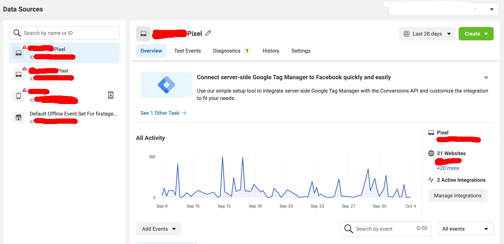
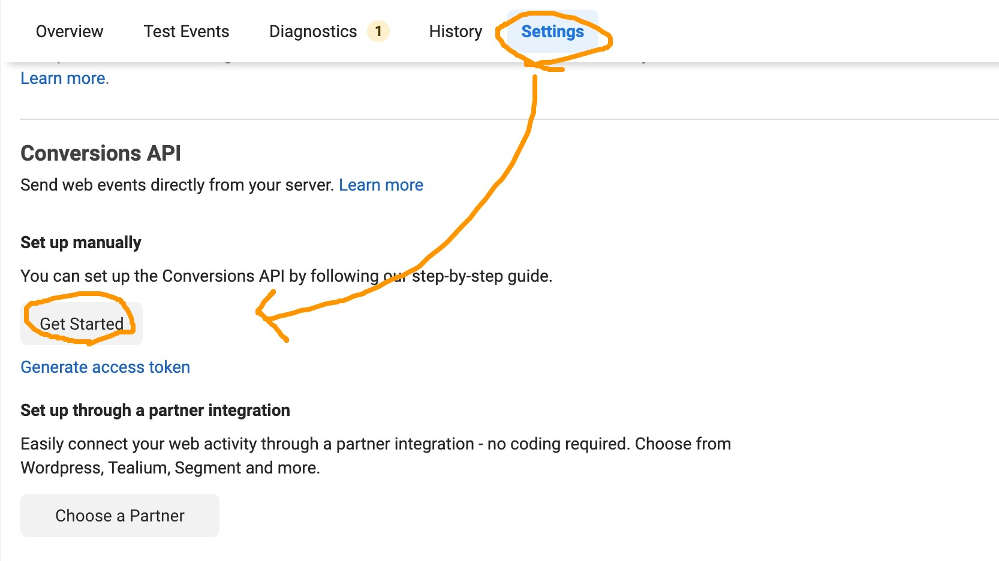
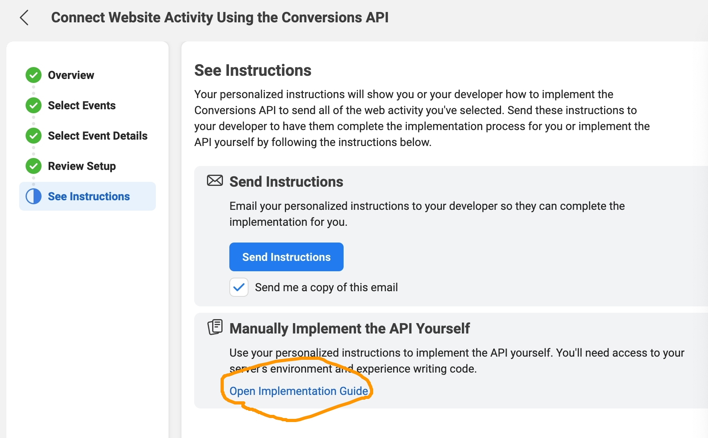
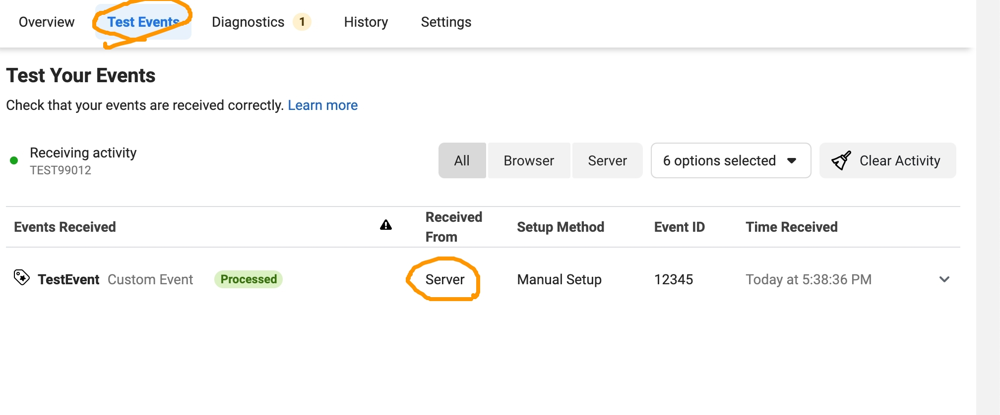

Recently I got a Trello ticket to add [Facebook Pixel](https://www.facebook.com/business/learn/facebook-ads-pixel) tracking code, and they gave me a token to use. As a frontend engineer on that project, it's confusing to me, because the token is for [Facebook Conversions API](https://developers.facebook.com/docs/marketing-api/conversions-api/). The biggest difference between [Facebook Conversions API](https://developers.facebook.com/docs/marketing-api/conversions-api/) and [Facebook Pixel](https://www.facebook.com/business/learn/facebook-ads-pixel) is Facebook conversions API is invoked on the server, and Facebook Pixel is on the client. Besides, Facebook Conversions API is to solve [IOS 14 updates](https://blog.hootsuite.com/facebook-conversion-api/). Now, let me write the usage of Facebook Conversions API down.

# Get Facebook Conversions API token.


<!-- more -->
You may be familiar with this page if you're using Facebook Pixel. Let's go to `Settings` and click `Get Started` in `Conversions API`, and select `Events` we are interested.


In the final step, clicking `Open Implementation Guide` then redirects to `Using the Conversions API` page to `Generate Access Token`.



# Make a POST request

> To send new events, make a `POST` request to this API's `/events` edge from this path: `https://graph.facebook.com/{API_VERSION}/{PIXEL_ID}/events?access_token={TOKEN}`.

As we saw [here](https://developers.facebook.com/docs/marketing-api/conversions-api/using-the-api#send), it's just a POST request. We can try it with `Graph API Explorer`.


```json
{
  "data": [
    {
      "action_source": "website",
      "event_id": 12345,
      "event_name": "TestEvent",
      "event_time": 1633340316,
      "user_data": {
        "client_user_agent": "Mozilla/5.0 (iPhone; CPU iPhone OS 13_3_1 like Mac OS X) AppleWebKit/605.1.15 (KHTML, like Gecko) Version/13.0.5 Mobile/15E148 Safari/604.1",
        "em": "f660ab912ec121d1b1e928a0bb4bc61b15f5ad44d5efdc4e1c92a25e99b8e44a",
        "client_ip_address": "11.22.33.44" 
      }
    }
  ],
  "test_event_code": "TEST99012"
}
```

You have to add `client_ip_address` to JSON, or the POST request won't be tracked. Now back to the **Test Events** tab to see the result.


Also, the **View Details** of `TestEvents` in **Overview** shows the POST request log.


# Let's Code.

I run serverless lambda by AWS CDK, and set the token to AWS SecretManager. The following code is my Stack sample.

```
import * as cdk from '@aws-cdk/core';
import * as lambda from '@aws-cdk/aws-lambda';
import * as apigw from '@aws-cdk/aws-apigatewayv2';
import { CorsHttpMethod } from '@aws-cdk/aws-apigatewayv2/lib/http/api';
import * as secretsmanager from '@aws-cdk/aws-secretsmanager';
import * as apigwIntergration from '@aws-cdk/aws-apigatewayv2-integrations';

const params = {
  ApiStack: {
    ENV: 'staging',
    secretManager: {
      arn: '{SecretARN}',
      keys: ['facebookConversionApiToken']
    },
    fbPixelID: 'YOUR_PIXEL_ID'
  },
}

export class ApiStack extends cdk.Stack {
  constructor(scope: cdk.App, id: "ApiStack", props?: cdk.StackProps) {
    super(scope, id, props);

    const envParams = params[id];
    // Dynamoose();
    const { ENV } = envParams;
    const layerCommon: lambda.ILayerVersion = new lambda.LayerVersion(this, "LayerCommon", {
      compatibleRuntimes: [lambda.Runtime.NODEJS_14_X],
      code: lambda.Code.fromAsset('layer/common'),
    });

    const secret = secretsmanager.Secret.fromSecretCompleteArn(scope, 'ImportedSecret', envParams.secretManager.arn);
    const secretParams = envParams.secretManager.keys.reduce((params, key) => ({ ...params, [key]: secret.secretValueFromJson(key) }), {}) as { facebookConversionApiToken: string };
    const funcDefaultProps = {
      runtime: lambda.Runtime.NODEJS_14_X,
      code: new lambda.AssetCode('src'),
      memorySize: 1536,
      environment: { ENV }
    };
    const facebookConversionLambda = (layers: lambda.ILayerVersion[]) => new lambda.Function(scope, 'facebookConversion', {
      ...funcDefaultProps,
      handler: 'controllers/facebook_conversion/index.handler',
      layers,
      tracing: lambda.Tracing.ACTIVE,
      timeout: cdk.Duration.seconds(300),
    })

    const FacebookConversionLambda = facebookConversionLambda([layerCommon]);

    [ FacebookConversionLambda ].forEach((lambdaFunc) => {
      const envs: {[key: string]: string} = { fbToken: secretParams.facebookConversionApiToken, fbPixelID: envParams.fbPixelID }
      Object.keys(envs).forEach((key) => {
        lambdaFunc.addEnvironment(key, envs[key]);
      });
    });

    const eventLambdaMapping = {
      facebookConversion: FacebookConversionLambda,
    };

    const httpApi = new apigw.HttpApi(scope, id, {
      createDefaultStage: false,
      corsPreflight: {
        allowHeaders: ['Authorization', 'Content-Type'],
        allowMethods: [CorsHttpMethod.GET, CorsHttpMethod.HEAD, CorsHttpMethod.OPTIONS, CorsHttpMethod.POST, CorsHttpMethod.PUT, CorsHttpMethod.DELETE],
        allowOrigins: ['*'],
      },
    })
    httpApi.addRoutes({
      path: '/fb_conversion',
      methods: [apigw.HttpMethod.POST],
      integration: new apigwIntergration.LambdaProxyIntegration({
        handler: eventLambdaMapping["facebookConversion"],
      }),
    });
  }
}
```

And here is my lambda and class.
**lambda**
```javascript
import {
  responseSuccess,
  responseError,
} from '../../helpers/response';

const baseHandler = async (event: APIGatewayProxyEventV2) => {
  /***** Controller actions begin ******/
  const postConversion = async () => {
    const { event_name, event_id, event_source_url, user_data = {}, custom_data = {} } = JSON.parse(event.body || '{}');
    const facebookSsApi = new FacebookServerSideApi(
      { eventName: event_name, eventId: event_id, eventSourceUrl: event_source_url },
      user_data,
      custom_data
    );
    const result = await facebookSsApi.request();
    return result ? responseSuccess({}) : responseError({ statusCode: 400, message: 'Facebook Conversions Api request failed' });
  };

  switch (event.requestContext.http.method) {
    case "POST":
      return await postConversion();
    default:
      break;
  }
  return responseError({ message: "Undefined method" });
};

export const handler = baseHandler;
```

**FacebookServerSideApi**
```javascript
const fetch = require("node-fetch");

class FacebookServerSideApi {
  private uri: string;
  private fbToken: string;
  private eventName: string;
  private eventId: string;
  private eventSourceUrl: string;
  private userData: Record<string, any>;
  private customData: Record<string,any>;

  constructor(eventObj: {eventName: string, eventId: string, eventSourceUrl?: string}, userData: Record<string, any>, customData: Record<string, any>) {
    const pixelId = process.env.fbPixelID as string;
    this.fbToken = process.env.fbToken as string;
    this.uri = `https://graph.facebook.com/v11.0/${pixelId}/events`;

    this.eventName = eventObj.eventName;
    this.eventId = eventObj.eventId;
    this.eventSourceUrl = eventObj.eventSourceUrl;
    this.userData = userData; //Should hash some key-value
    this.customData = customData;
  }

  public async request(): Promise<boolean> {
    if (!this.fbToken) return false;
    try {
      const event = {
        data: [
          {
            event_name: this.eventName,
            event_id: this.eventId,
            event_source_url: this.eventSourceUrl,
            event_time: Math.floor(+(new Date()) / 1000),
            user_data: this.userData,
            custom_data: this.customData,
            action_source: "website"
          }
        ],
      };
      const body = JSON.stringify(event);

      const response = await fetch(`${this.uri}?access_token=${this.fbToken}`, {
        method: 'POST',
        body,
        headers: {'Content-Type': 'application/json'}
      });
      const data = await response.json();
      return data['events_received'] == 1;
    } catch (e) {
      return false;
    }
  }
}

export default FacebookServerSideApi;
```

I removed hashing logic used on `Line 20`, and it should hash each key described [here](https://developers.facebook.com/docs/marketing-api/conversions-api/parameters/customer-information-parameters). Finally, after Deploying to AWS and sending the request by Postman or the frontend library, the **Overview** should show the event log.

That's all. Now we can send such as `PageView` or other events defined by Facebook Pixel and Facebook Conversions API on the same page.
