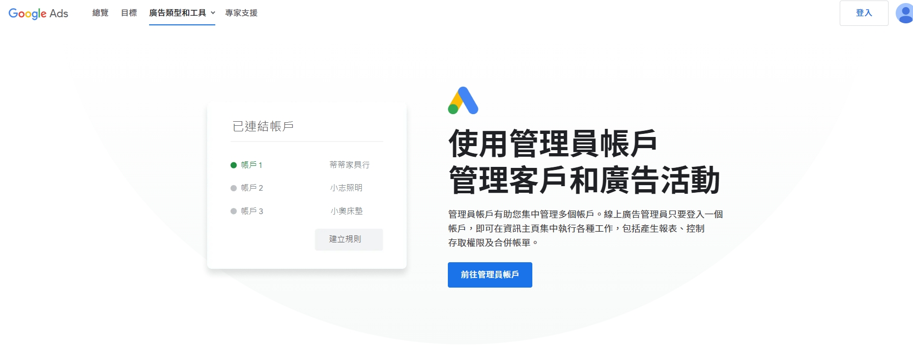
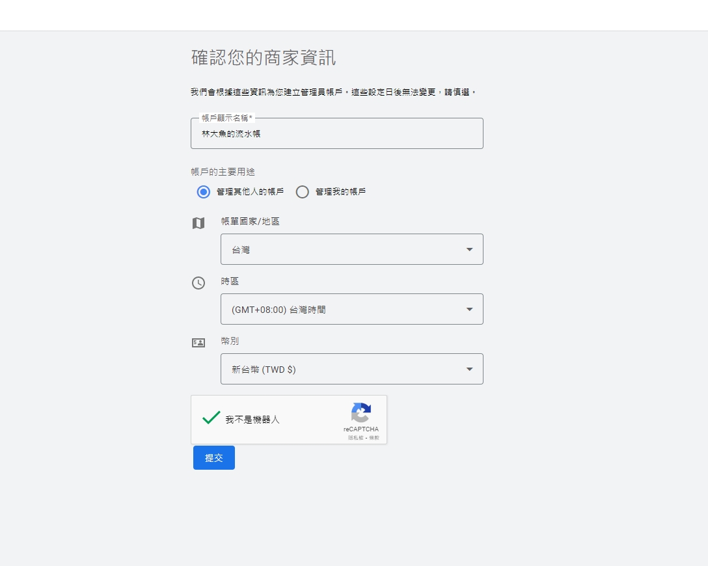
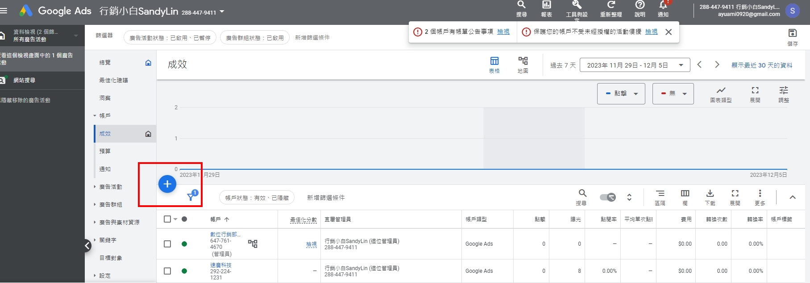
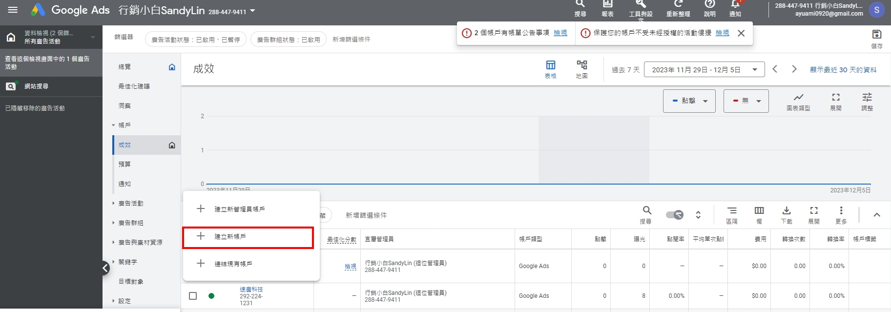
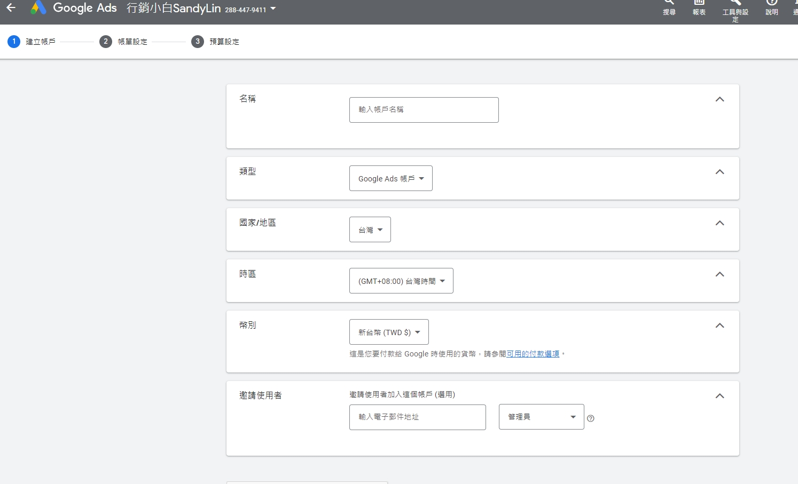
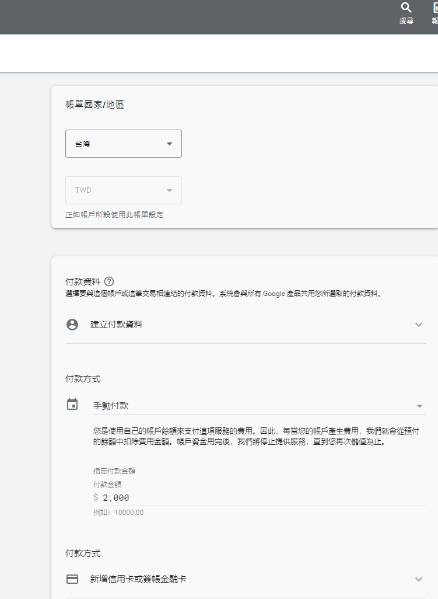
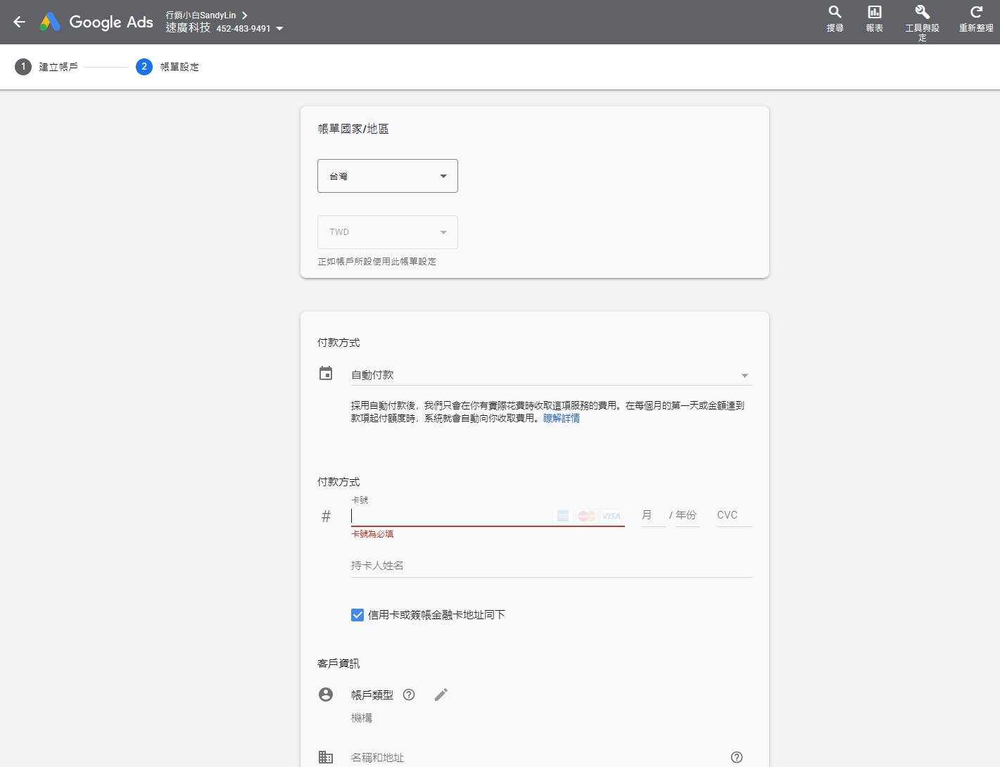

# Google Ads廣告帳戶基本設定
數位科技蓬勃時代，多數人大部分時間都在使用手機及社群媒體分享生活圈維持情感連繫，品牌電商想要快速累積知名度及訂單，在社群或搜尋引擎投放廣告是最快達成成效的行銷方式，那要選擇哪個廣告平台呢?

如果你的廣告預算有限，可以先從受眾精準的**Google ads搜尋廣告**開始 !

##  Google Ads搜尋廣告優點

-   **付費方式多元** 
除了信用卡刷卡付費，也可以使用預先儲值廣告費用在廣告帳戶扣款方式付費 ，廣告帳戶有餘額廣告才會放送，不怕增加廣告花費。
    
-   **投放受眾更精準**
搜尋廣告投放方式是顧客在Google搜尋引擎主動搜尋你設定的關鍵字，點擊出價高及廣告品質分數高，廣告才會曝光，顧客有點擊廣告才會收費。

<!-- more -->

瞭解品牌網站資訊後，就可以開始規劃關鍵字、廣告文案，然後進行廣告帳戶的基本設定。
由於自己是代理商，所以用**管理員帳戶**幫品牌建立廣告帳戶，以下是我的操作過程，廣告新手可以參考! 

### 1.先登入Google信箱，前往管理員帳戶

### 2.填寫管理員帳戶資訊

廣告帳戶其他使用者也會看到你帳戶名稱，之後想改也可以再從帳戶設定去編輯
但其他資訊就沒辦法再次修改編輯，切記填完要再次確認 !

### 3.進入總覽畫面後點選帳戶 > 按+即可建立新廣告帳戶

### 4.填寫廣告帳戶資訊

帳戶名稱之後想改可以再從帳戶設定去編輯
新增使用者設定如果客戶還沒給你信箱就先略過，之後再從工具設定裡的**存取權和安全性**去新增。

### 5.填寫帳單資訊

我是設定手動付款的方式付費，填寫你要付款的金額，付費後廣告費就直接儲值到你的廣告帳戶，廣告有實際花費會從帳戶扣款，付費上相對安全，要切記帳戶有餘額廣告才會放送，開始廣告投放後若是餘額快用完系統會發信提醒。

如果不想要程序上這麼麻煩，也可以選擇自動付款，當你廣告有實際花費的時候在每個月的第一天或是金額達到起付額度，系統就會自動收費囉!

依照Google說明完成付費設定，就可以進入廣告設定新增廣告關鍵字及文案囉~
到廣告投放完成還有一哩路也有很多設定上的小細節，下篇再來分享廣告活動的設定。

