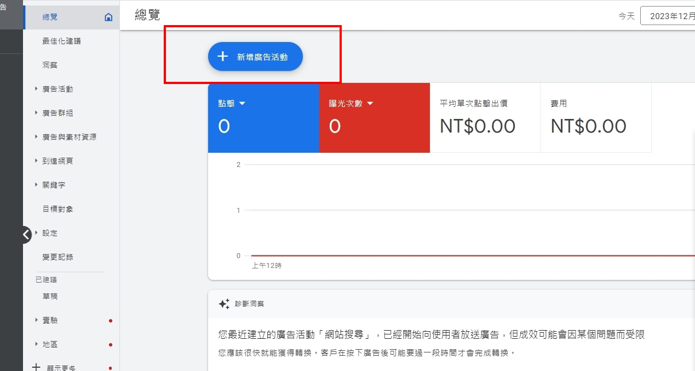
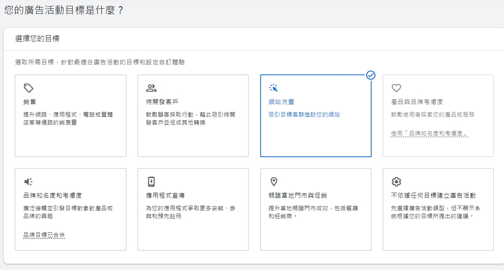
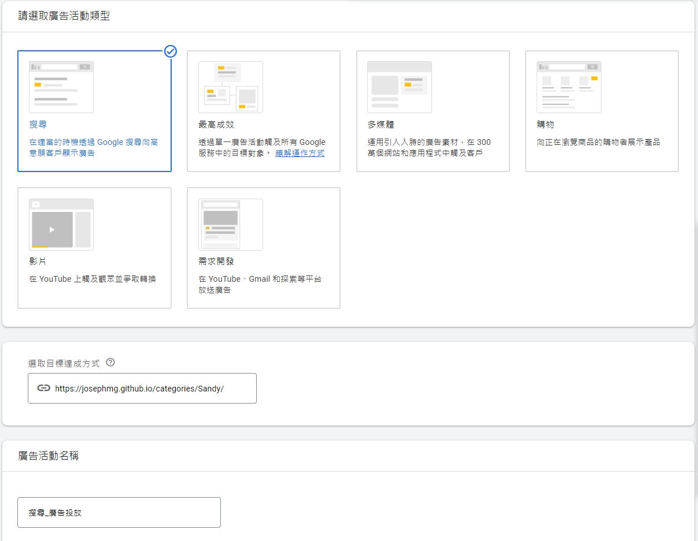
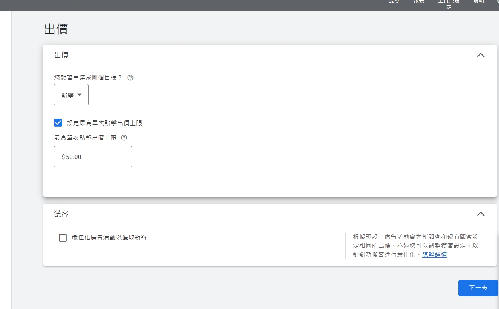
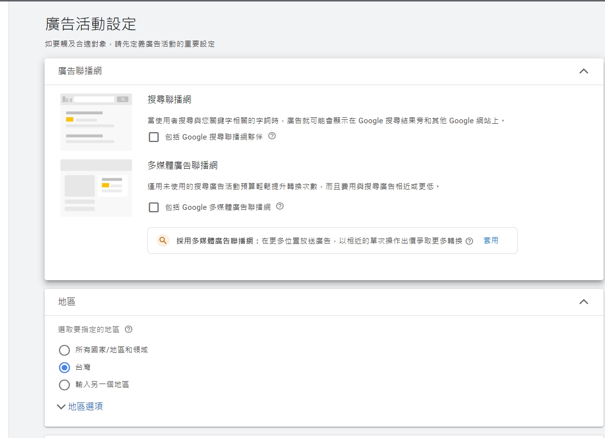
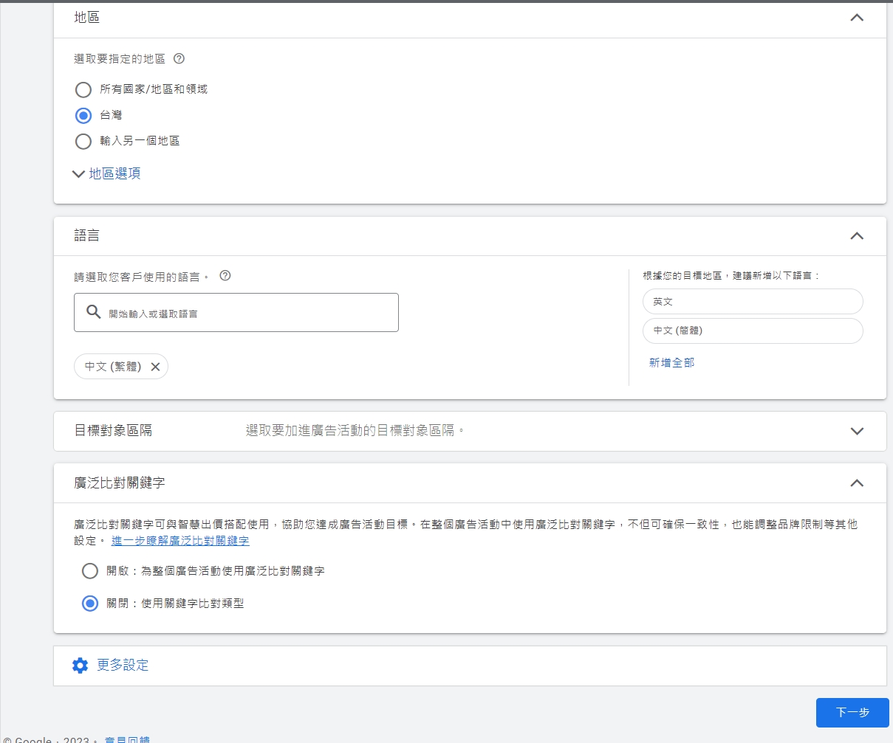
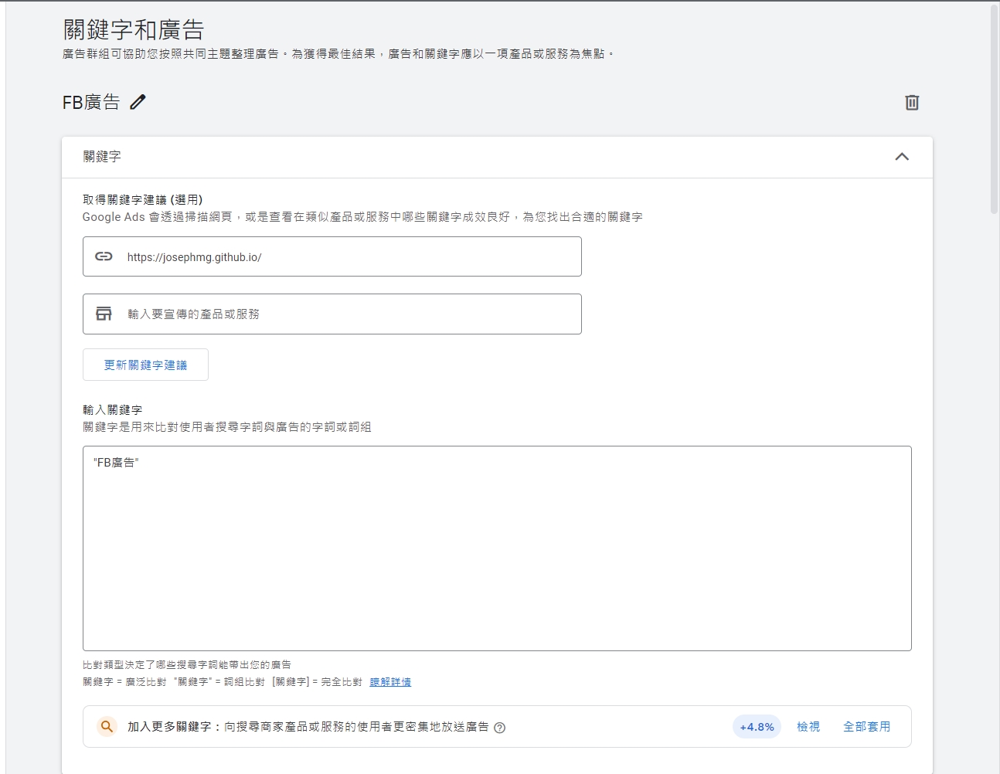
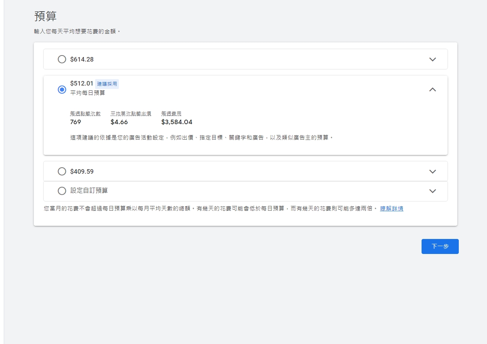

# Google Ads搜尋關鍵字廣告設定
當我們有需要被解決的需求，像牙齒痛，想知道哪裡有診所可以治療?
要買電視，想知道電視的商品資訊及評價?多數人會使用Google搜尋引擎搜尋找解答，用戶搜尋意圖明確，因此在Google搜尋引擎可以接觸到精準的潛在顧客，已是電商品牌行銷布局必要的媒體工具之一。

想投放Google搜尋關鍵字廣告卻不知道要怎麼開始？本篇整理我投放Google關鍵字廣告設定過程，現在就來製作第一則廣告吧~

## 投放廣告前準備事項
#### **1. 訂好廣告目標**
業主想提升網站流量，投放以流量為主的搜尋廣告及點擊出價做設定，
需依照廣告目標，選擇適合的廣告類型及出價策略，才能提升廣告投放的效益!
<!-- more -->

#### **2. 決定廣告產品(服務)內容**
以活動折扣商品或季節性商品優先考量，折扣可以引起潛在顧客興趣，讓廣告CTR(點擊率)增加，有效降低廣告成本。

#### **3. 關鍵字研究、廣告文案製作**
從消費者角度思考他們會搜尋的字詞、商品名稱、商品別名三個方向規劃產品關鍵字，使用Google關鍵字規劃工具及Google Trend研究產品關鍵字流量，選擇高流量關鍵字做後續設定。

製作廣告文案標題需包含關鍵字，廣告敘述說明包含商品特色、服務優勢、優惠資訊，越能切中潛在顧客搜尋需求，可增加廣告的CTR(點擊率)，降低CPC(點擊費用)對於廣告成效會是很大的助益。

##  廣告後台設定

### 新增廣告活動
按+新增廣告活動

### 選擇廣告目標、廣告活動類型
針對提升流量，選擇網站流量為目標的廣告類型

投放關鍵字廣告選擇搜尋廣告活動

### 選擇出價方式
以提升流量為目標，出價策略選擇點擊出價，要掌控預算設定最高點擊出價上限

### 廣告聯播網
搜尋聯播網及多媒體聯播網都先不要選，避免廣告預算花的太快

### 關鍵字及廣告設定
輸入想要的關鍵字，關鍵字皆使用詞組比對

廣告標題需包含關鍵字，才能切中潛在顧客搜尋需求

廣告敘述內容說明商品特色、服務優勢、優惠資訊或一些潛在顧客想瞭解的資訊

### 預算
剛開始投放選擇Google建議的預算，投放一段時間想掌控預算可以再調整

以上都完成，付款資訊新增好，廣告就會開始投放出去 ! 其他廣告也是類似這樣的操作流程，希望大家都可以順利完成廣告~
