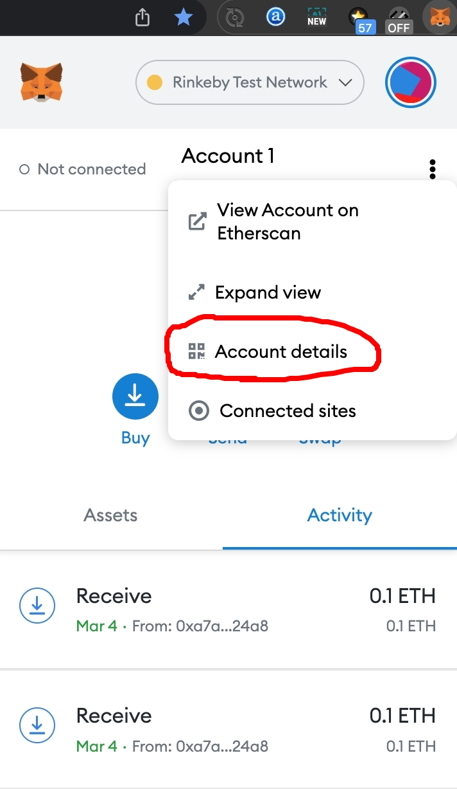
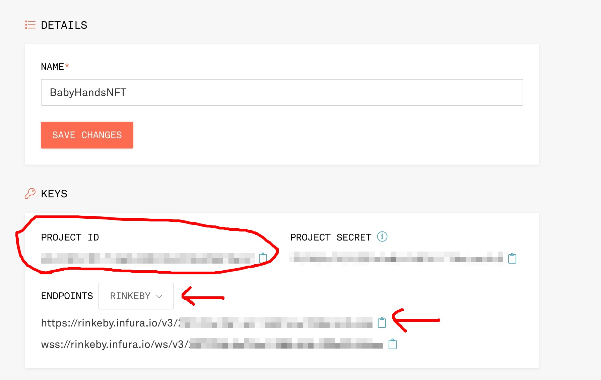

農曆年前結束了一個博弈業的案子，開啟了虛擬貨幣及區塊鏈的契機。年後，整個2月都在研究區塊鏈的各種應用，NFT、opensea、solidity、hardhat、ipfs、testnet，今天這篇文章來記錄一下我用Solidity / Hardhat上架NFT的過程，以免以後金魚腦忘光。

### Prerequisite: Sign-up these services.
+ [Etherscan](https://etherscan.io/) (這個服務是之後用來verify contract用的，如果不想驗證可以跳過申請。)
+ [Metamask](https://metamask.io/)
+ [Infura](https://infura.io/)
+ [NFTStorage](https://nft.storage/)

### Init project

我是使用docker, docker-compose，所以先來看看我的初始專案架構及`docker-compose.yml`跟`Dockerfile`。


**docker-compose.yml**
```YML
version: '3'

services:
  hardhat:
    build:
      context: ./hardhat
      dockerfile: Dockerfile.dev
    volumes:
      - ./hardhat:/app
      - /app/node_modules
    ports:
      - 8545:8545
```
<!-- more -->

**hardhat/Dockerfile.dev**
```Dockerfile
FROM node:16

ENV APP_ROOT /app

RUN mkdir ${APP_ROOT}
WORKDIR ${APP_ROOT}
ADD . ${APP_ROOT}

RUN yarn install
RUN yarn global add \
  solhint \
  solc \
  eslint \
  typescript

EXPOSE 8545

CMD [ "yarn", "dev" ]
```

接下來，用npx建立一個新的hardhat專案：


都完成以後，就可以看到我們的專案架構了。


### Settings
我們前面申請過 [Metamask](https://metamask.io/)、[Infura](https://infura.io/)、[Etherscan](https://etherscan.io/)，現在把相關參數設定到.env裡
```
PRIVATE_KEY=YOUR_METAMASK_PRIVATE_KEY
INFURA_ID=
RINKEBY_URL=
ETHERSCAN_API_KEY=
NFT_CONTRACT_ADDRESS=YOUR_CONTRACT_ADDRESS
```
##### Metamask private key (PRIVATE_KEY)
在你申請完錢包以後，可以在Chrome extension裡找到`Account details`


> 記得先選測試網路 `rinkeby test network`，測試網路的eth可以在這邊申請: [https://faucet.rinkeby.io/](https://faucet.rinkeby.io/)

> 注意這個key不要外流，否則你的metamask錢包可能會不安全。

##### Infura id and url (INFURA_ID, RINKEBY_URL)
先建立Infura project以後，進到setting就可以找到id and url了



##### Etherscan (ETHERSCAN_API_KEY)
在[Profile](https://etherscan.io/myapikey)裡Add Key以後就有個API Key可以使用了。


參數設定到這邊告一個段落，`NFT_CONTRACT_ADDRESS`之後deploy才會有，然後我們稍微修改一下`hardhat.config.ts`，把預設的測試網路設定改掉。
```typescript
import * as dotenv from "dotenv";

import { HardhatUserConfig } from "hardhat/config";
import "@nomiclabs/hardhat-etherscan";
import "@nomiclabs/hardhat-waffle";
import "@typechain/hardhat";
import "hardhat-gas-reporter";
import "solidity-coverage";

dotenv.config();

// You need to export an object to set up your config
// Go to https://hardhat.org/config/ to learn more

const config: HardhatUserConfig = {
  solidity: "0.8.4",
  networks: {
    rinkeby: {
      url: process.env.RINKEBY_URL || "",
      accounts:
        process.env.PRIVATE_KEY !== undefined ? [process.env.PRIVATE_KEY] : [],
    },
  },
  gasReporter: {
    enabled: process.env.REPORT_GAS !== undefined,
    currency: "USD",
  },
  etherscan: {
    apiKey: {
      rinkeby: process.env.ETHERSCAN_API_KEY,
    },
  },
};

export default config;
```

到這邊我們可以試試看能不能跑起docker，先加上`scripts`在package.json裡：
```
{
  "name": "hardhat-project",
  "scripts": {
    "dev": "hardhat node --network hardhat",
    "console": "hardhat console",
    "test": "hardhat test --network hardhat",
    "compile": "hardhat compile",
    "rinkeby:deploy": "hardhat --network rinkeby deploy --export-all tmp/contracts/manifest.json",
    "mainnet:deploy": "hardhat --network mainnet deploy --export-all tmp/contracts/manifest.json"
  },
  "devDependencies": {
    ...
    ...
    ...
  }
```
有了scripts以後，我們就可以`docker-compose up`了。


好囉，看到上面的圖就正常了，這一篇就先到這邊，我們下一篇要開始上架NFT還有部署contract了。
