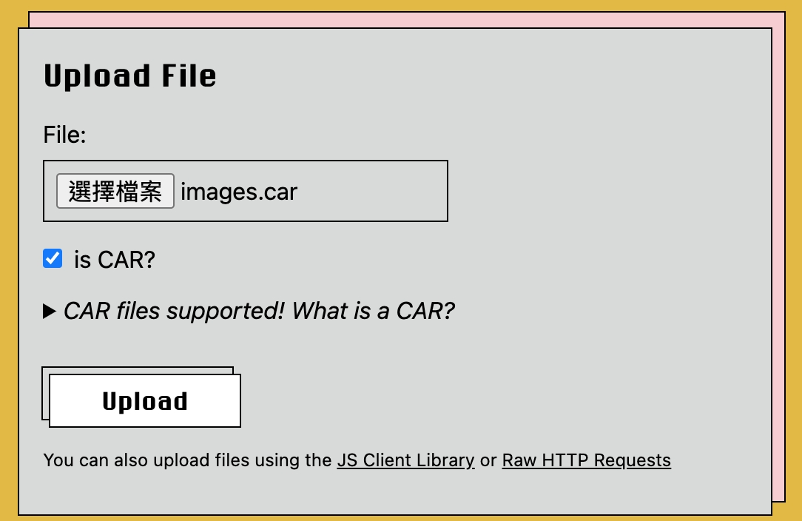
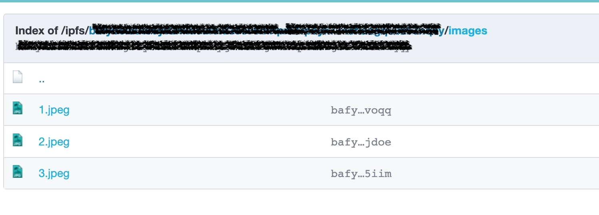
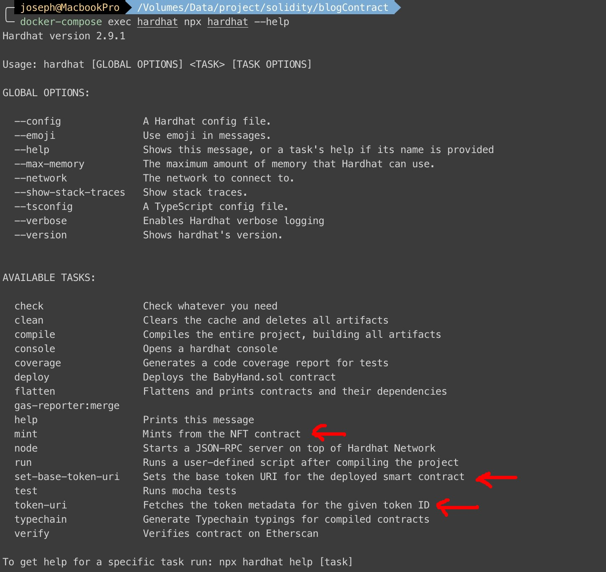

我們已經設定好docker及hardhat專案，這一篇就從NFT開始。

### Generate NFT metadata
先建立一個`images`資料夾後，把你想要的圖片放進去，並存成1, 2, 3....之類的檔名，然後用`ipfs-car`指令打包在一起。
> 找不到圖可以先用[opensea doc](https://docs.opensea.io/docs/part-3-adding-metadata-and-payments-to-your-contract)裡的圖當練習


接著到[NFT Storage](https://nft.storage/)上傳`images.car`檔案就可以了。


<!-- more -->
在[NFT Storage](https://nft.storage/)點開剛剛上傳檔案，找到image url，等一下要塞到metadata裡的`image`欄位。


再來建立一個`metadata`資料夾，設計metadata json，每個metadata裡的資訊對應到每一張圖片，所以`metadata`資料夾裡會有3個json file，檔名則是單純的`1`, `2`, `3`，之後在solidity裡會對應到`tokenId`。

**1**
```json
{
  "description" : "This is my daughter's hand NFT.",
  "external_url" : "https://example.com/?token_id=1",
  "image" : <YOUR IPFS IMAGE 1.jpg>,
  "name" : "Tearing off paper"
}
```
**2**
```json
{
  "attributes" : [
    {
      "trait_type" : "level",
      "value" : 3
    },
    {
      "trait_type" : "stamina",
      "value" : 11.7
    },
    {
      "trait_type" : "personality",
      "value" : "sleepy"
    },
    {
      "display_type" : "boost_number",
      "trait_type" : "aqua_power",
      "value" : 30
    },
    {
      "display_type" : "boost_percentage",
      "trait_type" : "stamina_increase",
      "value" : 15
    },
    {
      "display_type" : "number",
      "trait_type" : "generation",
      "value" : 1
    }
  ],
  "description" : "This is my daughter's hand NFT.",
  "external_url" : "https://example.com/?token_id=2",
  "image" : <YOUR IPFS IMAGE 2.jpg>,
  "name" : "Playing with building blocks"
}
```
**3**
```json
{
  "description" : "This is my daughter's hand NFT.",
  "external_url" : "https://example.com/?token_id=1",
  "image" : <YOUR IPFS IMAGE 3.jpg>,
  "name" : "Grabbing her dinner"
}
```
> 其中有個`json`裡有`attributes`，這資訊會顯示在Opensea上，詳細欄位可以在[Opensea Docs](https://docs.opensea.io/docs/metadata-standards)上看到

然後一樣用`car`打包，上傳到[NFTStorage](https://nft.storage/)


在NFTStorage上就可以得到一個metadata url，要設定在solidity `setBaseTokenUrl`裡。
到這邊準備工作就告一個段落了，我們再來就要開始Coding了，分別要寫`solidity`跟`typescript`。

### Start coding

##### Solidity
我們先來寫contract，在contract資料夾底下建立自己的solidity檔案。

**contracts/BabyHands.sol**
```solidity
// SPDX-License-Identifier: MIT
pragma solidity ^0.8.4;

import "@openzeppelin/contracts/token/ERC721/ERC721.sol";
import "@openzeppelin/contracts/utils/Counters.sol";
import "@openzeppelin/contracts/access/Ownable.sol";
import "hardhat/console.sol";

contract BabyHands is ERC721, Ownable {
  using Counters for Counters.Counter;

  // Constants
  uint256 public constant TOTAL_SUPPLY = 3;
  uint256 public constant MINT_PRICE = 0.08 ether;

  Counters.Counter private currentTokenId;
  string public baseTokenURI;

  constructor() ERC721("BabyHands", "BBH") {
    baseTokenURI = "";
  }

  function mintTo(address recipient) public payable returns (uint256) {
    uint256 tokenId = currentTokenId.current();
    require(tokenId < TOTAL_SUPPLY, "Max supply reached");
    require(msg.value == MINT_PRICE, "Mint price is not equal.");

    currentTokenId.increment();
    uint256 newItemId = currentTokenId.current();
    _safeMint(recipient, newItemId);
    return newItemId;
  }

  /// @dev Returns an URI for a given token ID
  function _baseURI() internal view virtual override returns (string memory) {
    return baseTokenURI;
  }

  /// @dev Sets the base token URI prefix.
  function setBaseTokenURI(string memory _baseTokenURI) public onlyOwner {
    baseTokenURI = _baseTokenURI;
  }

}
```

在contract裡，我們繼承了ERC721，然後開了`mintTo`, `setBaseTokenURI`兩個function，到時候會用hardhat的task去mint跟設定base URI。然後我們用`hardhat compile`去編譯我們的solidity。


> 如果缺少**@openzeppelin/contracts**的話，可以先跑 `docker-compose exec hardhat yarn add -D @openzeppelin/contracts`

##### Typescript
再來用Typescript寫task，好讓我們可以透過hardhat cli操作部署上去的contract。

**scripts/helpers.ts**
```typescript
import { getContractAt } from "@nomiclabs/hardhat-ethers/internal/helpers";

// Helper method for fetching environment variables from .env
function getEnvVariable(key: string, defaultValue?: string) {
    if (process.env[key]) {
        return process.env[key];
    }
    if (!defaultValue) {
        throw `${key} is not defined and no default value was provided`;
    }
    return defaultValue;
}

// Helper method for fetching a connection provider to the Ethereum network
function getProvider(ethers: any) {
    return ethers.getDefaultProvider(getEnvVariable("NETWORK", "rinkeby"), {
        infura: getEnvVariable("INFURA_ID"),
    });
}

// Helper method for fetching a wallet account using an environment variable for the PK
function getAccount(ethers: any) {
    return new ethers.Wallet(getEnvVariable("PRIVATE_KEY") ?? "", getProvider(ethers));
}

// Helper method for fetching a contract instance at a given address
function getContract(contractName: string, hre: any) {
    /*
       // 如果你還不想發布到測試網路，可以用hardhat預設的account取代下面的getAccount()
       const accounts = await hre.ethers.getSigners();
       const account = accounts[0]
    */
    const account = getAccount(hre.ethers);
    return getContractAt(hre, contractName, getEnvVariable("NFT_CONTRACT_ADDRESS") ?? "", account);
}

export {
  getContract,
}
```


**scripts/deploy.ts**
```typescript
import "@nomiclabs/hardhat-waffle";
import fetch from "node-fetch";
import { task } from "hardhat/config";
import { getContract } from "./helpers";

task("deploy", "Deploys the BabyHand.sol contract")
  .setAction(async function (taskArguments, hre) {
    const BabyHands = await hre.ethers.getContractFactory("BabyHands");
    const babyHands = await BabyHands.deploy();
    await babyHands.deployed();

    console.log("BabyHands deployed to:", babyHands.address);
  });

task("mint", "Mints from the NFT contract")
  .addParam("address", "The address to receive a token")
  .setAction(async function (taskArguments, hre) {
    const contract = await getContract("BabyHands", hre);
    const transactionResponse = await contract.mintTo(taskArguments.address, {
      gasLimit: 500_000,
      value: hre.ethers.utils.parseEther("0.08"),
    });
    console.log(`Transaction Hash: ${transactionResponse.hash}`);
  });

task("set-base-token-uri", "Sets the base token URI for the deployed smart contract")
  .addParam("baseUrl", "The base of the tokenURI endpoint to set")
  .setAction(async function (taskArguments, hre) {
    const contract = await getContract("BabyHands", hre);
    const transactionResponse = await contract.setBaseTokenURI(
      taskArguments.baseUrl,
      {
        gasLimit: 500_000,
      }
    );
    console.log(`Transaction Hash: ${transactionResponse.hash}`);
  });

task("token-uri", "Fetches the token metadata for the given token ID")
  .addParam("tokenId", "The tokenID to fetch metadata for")
  .setAction(async function (taskArguments, hre) {
    const contract = await getContract("BabyHands", hre);
    const response = await contract.tokenURI(taskArguments.tokenId, {
      gasLimit: 500_000,
    });

    const metadata_url = response;
    console.log(`Metadata URL: ${metadata_url}`);

    const metadata = await fetch(metadata_url).then((res) => res.json());
    console.log(
      `Metadata fetch response: ${JSON.stringify(metadata, null, 2)}`
    );
  });
```

然後回頭修改**hardhat.config.ts**檔案，載入**deploy.ts**，之後hardhat才能讀到我們寫的task

**hardhat.config.ts**
```typescript
import * as dotenv from "dotenv";

import { HardhatUserConfig } from "hardhat/config";
import "@nomiclabs/hardhat-etherscan";
import "@nomiclabs/hardhat-waffle";
import "@typechain/hardhat";
import "hardhat-gas-reporter";
import "solidity-coverage";

dotenv.config();
import "./scripts/deploy.ts"; // <<<<<<< 新增這行

const config: HardhatUserConfig = {
  solidity: "0.8.4",
  networks: {
    hardhat: { // <<<<<<<< 新增這段，如果想使用本地部署的話
      forking: {
        url: process.env.RINKEBY_URL || "",
      }
    },
    rinkeby: {
      url: process.env.RINKEBY_URL || "",
      accounts:
        process.env.PRIVATE_KEY !== undefined ? [process.env.PRIVATE_KEY] : [],
    },
  },
  gasReporter: {
    enabled: process.env.REPORT_GAS !== undefined,
    currency: "USD",
  },
  etherscan: {
    apiKey: {
      rinkeby: process.env.ETHERSCAN_API_KEY,
    },
  },
};

export default config;
```
來看看我們task有沒有載入吧！


我們會先`deploy`，然後會得到一個address，再把env裡新增一個`NFT_CONTRACT_ADDRESS`給**helpers.ts**用。


> 只要你**rinkeby**測試網路的錢包有ETH，就可以都改成`--network rinkeby`操作

> 我這邊用的account是hardhat提供的Account #19，所以`mint` address跟env裡的`PRIVATE_KEY`都是拿Account #19的資訊

操作都正常以後，我們就可以上opensea看mint到的NFT了。我**rinkeby**測試網路的在這裡 > [BabyHands](https://testnets.opensea.io/collection/babyhands)

最後呢，如果要你的Etherscan contract可以看到solidity code，只要多跑一個指令就行：
> `docker-compose exec hardhat npx hardhat verify 0x23E4673d7B7F494b328A967B60Daa58E2D19a947 "BabyHands" "BBH" --contract contracts/BabyHands.sol:BabyHands --network rinkeby`


好囉，看到你的NFT的，要更深入研究可以多看opensea其他項目的合約，可以有更多變化。

----------------------------------

References:
1. Opensea doc: [https://docs.opensea.io/docs/creating-an-nft-contract](https://docs.opensea.io/docs/creating-an-nft-contract)
2. Azuki contract: [https://etherscan.io/address/0xed5af388653567af2f388e6224dc7c4b3241c544#code](https://etherscan.io/address/0xed5af388653567af2f388e6224dc7c4b3241c544#code)
