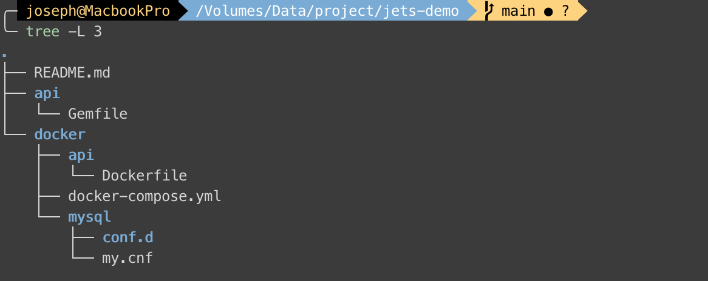
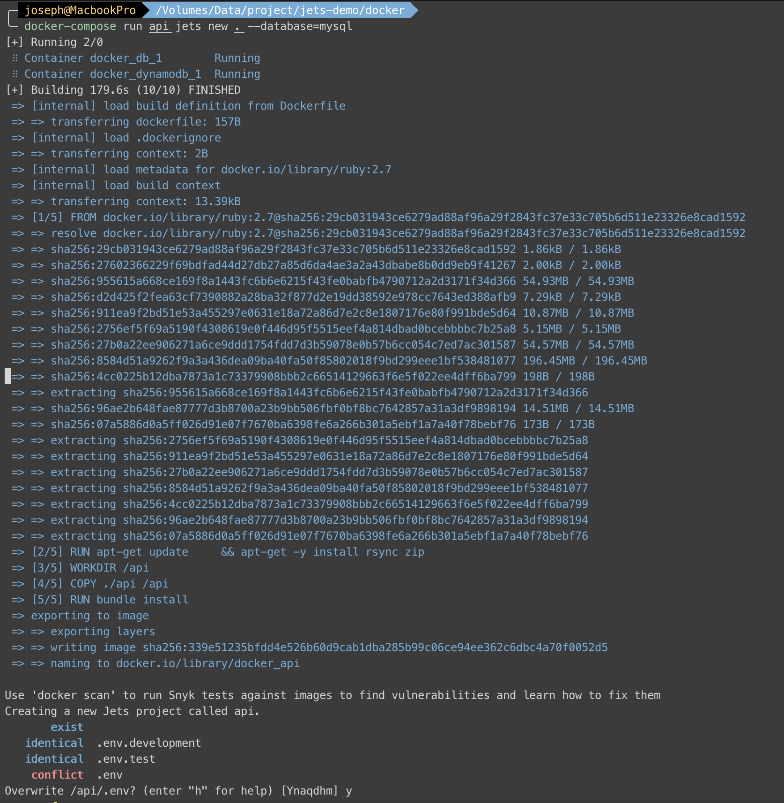
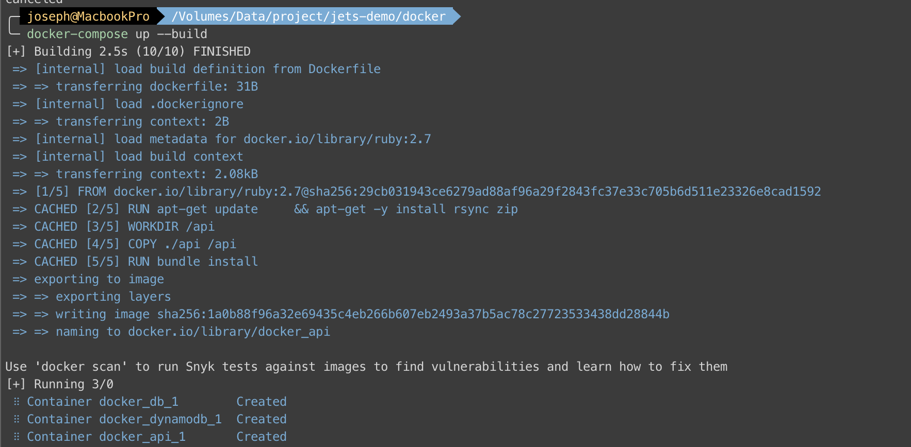
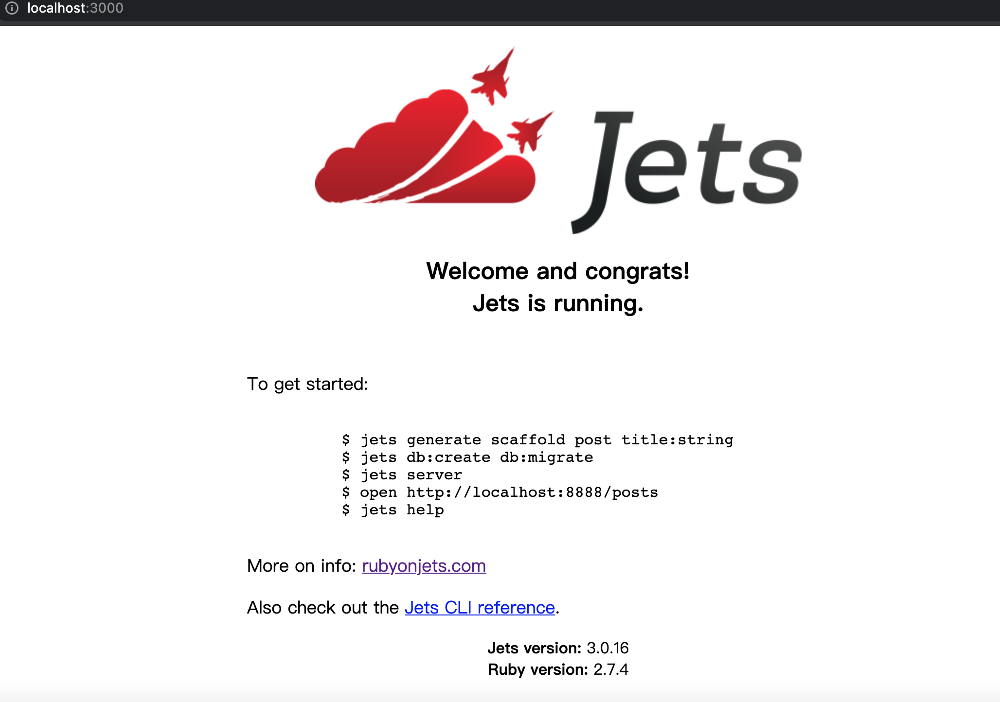
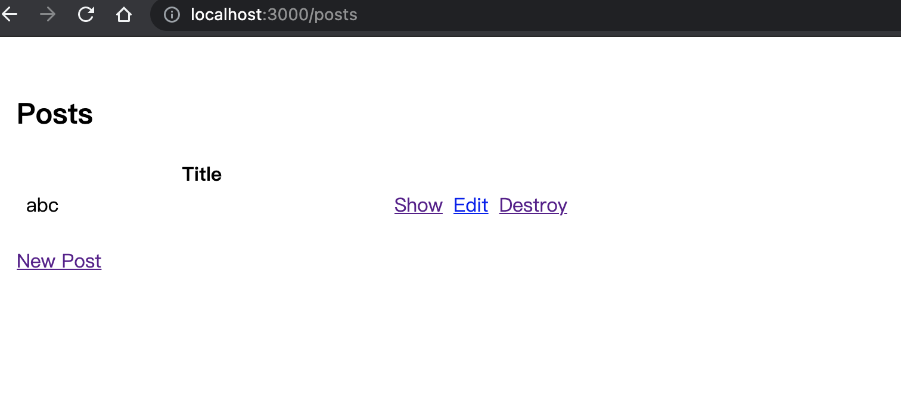
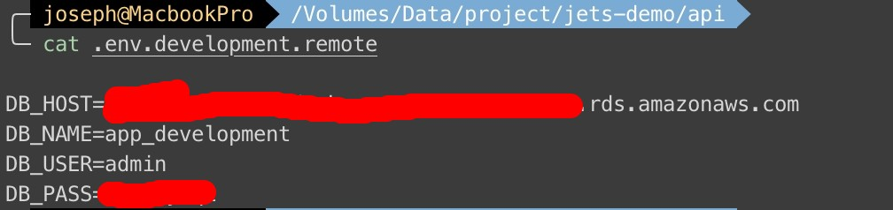
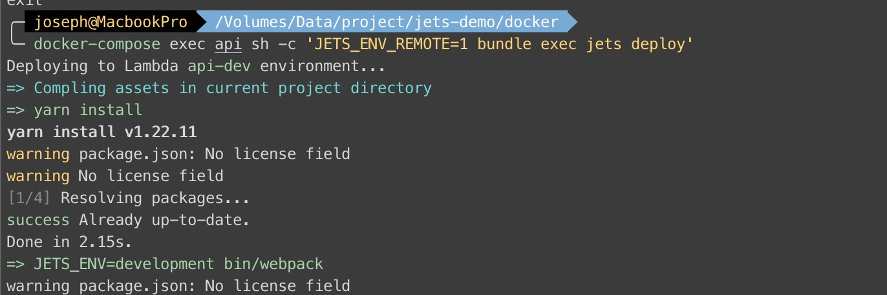
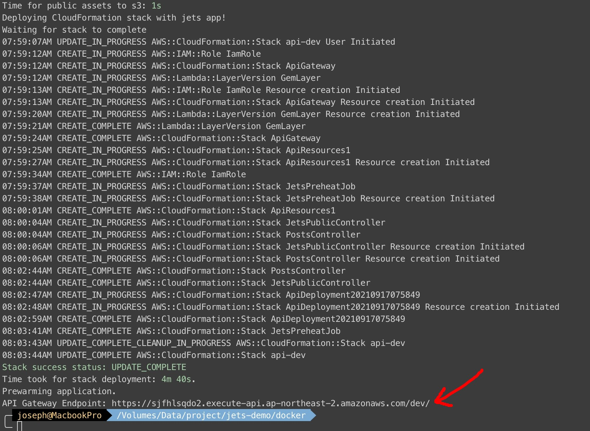
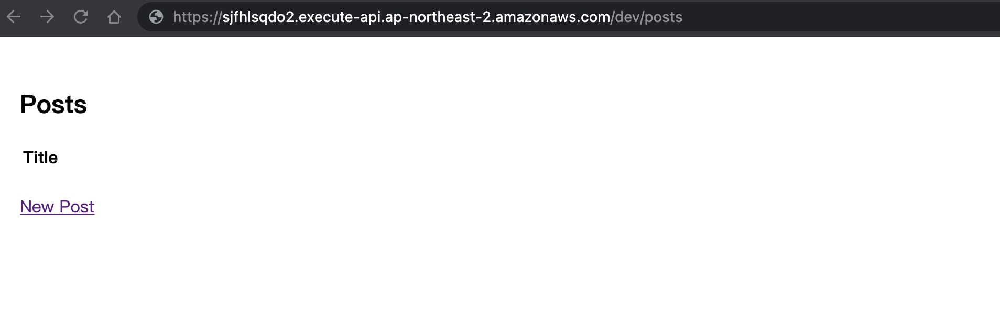

Ruby on Rails (RoR) is my favorite web framework, and today I will share an AWS serverless framework of RoR: [Ruby on Jets](https://rubyonjets.com/). I’m not an AWS expert and even have no AWS certifications, and besides, this is my first time to use AWS Lambda, API gateway, dynamodb, and other serverless services.

# Preparation:
1. Add `aws_access_key_id` and `aws_secret_access_key` to `~/.aws/credentials`
2. Docker / Docker-compose I use in this demo.

Let's look at initial project structure:

<!-- more -->

There's my `Gemfile`, `Dockerfile`, and `docker-compose.yml`

**Gemfile**
```ruby
source "https://rubygems.org"

gem "jets", "~> 3.0.0"
```

**Dockerfile**
```shell
FROM ruby:2.7
RUN apt-get update \
    && apt-get -y install rsync zip

WORKDIR /api
COPY ./api /api
RUN bundle install
```

**docker-compose.yml**
```shell
version: '3'

services:
  api:
    build:
      context: ../
      dockerfile: docker/api/Dockerfile
    command: bash -c "bundle exec jets server --port 3000 --host 0.0.0.0"
    environment:
      - AWS_PROFILE=default
      - AWS_REGION=ap-northeast-2
    volumes:
      - '../api:/api'
      - ~/.aws:/root/.aws
    ports:
      - "3000:3000"
    depends_on:
      - dynamodb
      - db
  dynamodb:
    image: instructure/dynamo-local-admin
    ports:
      - "8000:8000"
      - "8001:8001"
      - "8002:8002"
  db:
    image: mysql:8
    environment:
      MYSQL_ROOT_PASSWORD: root
      MYSQL_DATABASE: app
      MYSQL_USER: docker
      MYSQL_PASSWORD: docker
      TZ: 'Asia/Taipei'
    ports:
      - 3306:3306
    volumes:
      - ./mysql/conf.d:/etc/mysql/conf.d

```
Then, We go to `docker` folder to run `docker-compose run api jets new . --database=mysql` to install gems and generate Jets project.


Now we can use `docker-compose up --build` to build `api`, `db`, and `dynamodb` containers.


Can you see it? >> [localhost:3000](http://localhost:3000/)



# Let's CRUD

We have to grant DB user first:

**In docker folder**
```
$ > docker-compose exec db /bin/bash
```

**In db container**
```
root@db0c0d54dfef:/# mysql -uroot -p
mysql> GRANT ALL ON *.* to docker@'%';
```

After granting `docker` permission, we can generate scaffold, create database and install webpacker by using jets:
```
docker-compose exec api jets generate scaffold post title:string
docker-compose exec api jets db:create db:migrate
docker-compose exec api jets webpacker:install
```

Go to [localhost/posts](http://localhost/posts) and see the result:


Finally, we are ready to deploy. [env-file](https://rubyonjets.com/docs/env-files/) shows how to set environments. Let's go to [AWS RDS](https://ap-northeast-2.console.aws.amazon.com/rds/home) create a MySQL RDS, and set value to **.env.development.remote**.


Well done! Deploy it.
```
docker-compose exec api sh -c 'JETS_ENV_REMOTE=1 bundle exec jets db:create db:migrate'
docker-compose exec api sh -c 'JETS_ENV_REMOTE=1 bundle exec jets deploy'
```



.......Waiting......

We will get a URL, and we can get the page by clicking URL




That's all. But I have to mention that if you get `ERROR: Limit Reached` when you deploy, you need to check [serverlessgems rate-limits](https://www.serverlessgems.com/rate-limits) page. That's why we eventually used [AWS CDK](https://aws.amazon.com/tw/cdk/) and changed the language to Typescript in our [Firstage All-in-one blog](https://firstage.io/).

Next time I will introduce [AWS CDK](https://aws.amazon.com/tw/cdk/) and which services we use.
