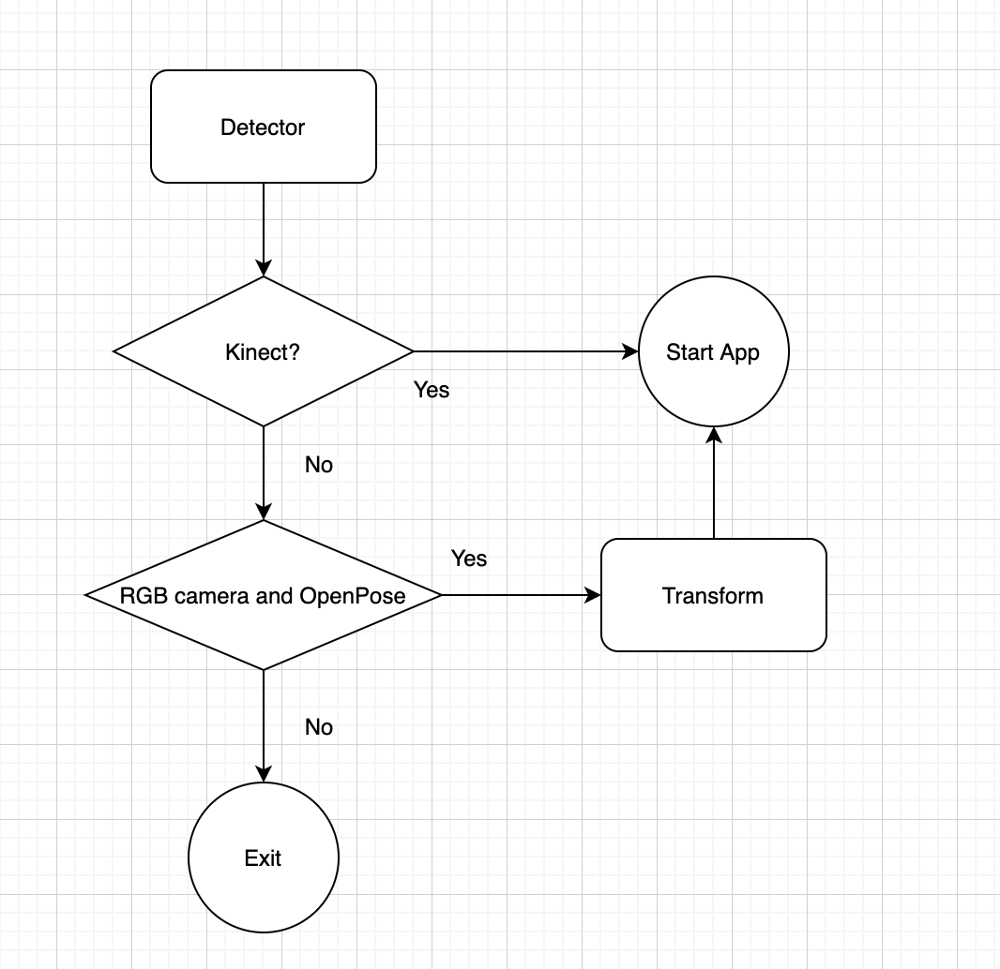

經過了三個多月的努力，終於完成了偵測器的轉換。
會有這次的side project是因為剛好看到OpenPose這套人體姿態辨識的AI函數庫，只要用單單一個RGB camera就可以偵測出人的動作，這讓我想到以前解決Asus xtion pro停產的問題，就是要轉換轉換Asus xtion到KinectV2。現在KinectV2雖已停產，但網路上還是可以透過各種管道買到KinectV2，我就想趁這機會把KinectV2轉換到OpenPose試試看，看未來是不是只要一個RGB camera，就不用再擔心KinectV2真的買不到的問題了。

OpenPose: [CMU-Perceptual-Computing-Lab / openpose](https://github.com/CMU-Perceptual-Computing-Lab/openpose)
<!-- more -->

他在安裝上還是有一些環境的限制，實際可以參考[這裡](https://github.com/CMU-Perceptual-Computing-Lab/openpose/blob/master/doc/installation/README.md#operating-systems-requirements-and-dependencies)，才不會鬼打牆太久。

接下來我就來分享一下轉換的方法。一張圖道盡前言萬語。

Code是不能講得太明白，不過應該流程圖就能推知一二。最難的就是Transform這一層，要把OpenPose的座標空間跟KinectV2做對應，才能在進入程式時順利進行。以前KinectV2轉xtion OpenNI的時候根本是悲劇，那時候又用了一個不再繼續維護的套件ZigFu，整個包得死死的，所有資料型態跟資料結構都要自己去猜。還好從那之中學到很多，這次的轉換才能順利一點。

另外Transform這一層還可以做很多應用，包含過濾特定物件、物件取代、或特定的辨識，甚至是之後有更好更快的演算法，都可以在這一層做調整跟測試。中間有一些商業機密不太能公開，不過如果有類似問題歡迎私訊，我們很樂於分享我們的經驗。
