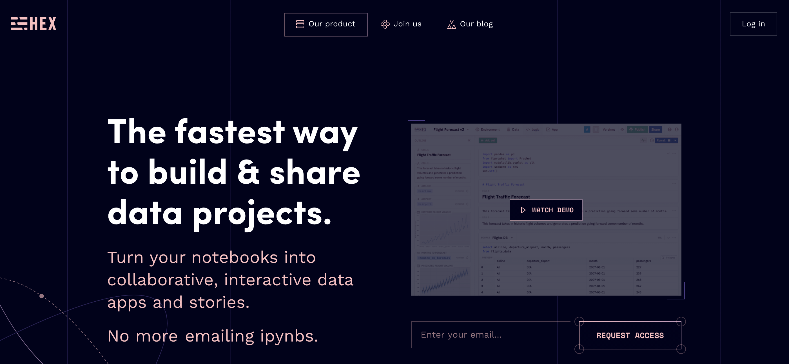

Podcast source: [Hex: Data Project Sharing with Caitlin Colgrove and Barry McCardel](https://softwareengineeringdaily.com/2020/12/03/hex-data-project-sharing-with-caitlin-colgrove-and-barry-mccardel/)

最近迷上聽podcast，裡面專門介紹新服務跟技術，同時可以練練聽力跟學習新知，既然學了乾脆把它寫成心得分享出來。今天來介紹一個新聽到的服務: [Hex](https://hex.tech)，在解決大數據專案資料共享的問題。

雖然我不是個資料工程師，但曾經使用過Python Jupyter Notebook，而且中間又經歷過換電腦，要重跑都得安裝一堆有的沒的，每次用起來都很不方便。但這次聽到這個服務也是讓我滿臉問號，Jupyter不是已經很多人用了？為什麼又有一個類似的服務出來？
<!-- more -->

這次訪問到的兩個人Caitlin跟Barry是[Palantir](https://www.palantir.com/)的同事，Palantir共同創辦人是Paypal的Peter，他們的客戶都是赫赫有名的大公司大企業或政府機關，但Caitlin跟Barry在Palantir裡看到客戶們導入Data-driven時的種種困難，才衍伸出這個[Hex](https://hex.tech)產品。當資料越來越多，就出現共享資料的問題；當團隊越來越大，就出現共同討論的問題。更宏觀一點來看，其實[Hex](https://hex.tech)是為了解決整個workflow的問題，會不會我在測試的方法別人用過了？會不會我用同樣的方法可以但你用同樣的方法不行？每次溝通都要透過切換軟體？討論結果還得匯出成PDF傳給對方？[Hex](https://hex.tech)可以讓data team的workflow又可以解決討論跟共享的問題，這很像真的挺有價值的。

中間訪問到技術面如何解決共享問題時，Caitlin提到了一個[Conflict-free replicated data type(CRDT)](https://en.wikipedia.org/wiki/Conflict-free_replicated_data_type)演算法，還有另一套[Operational Transformation(OT)](https://en.wikipedia.org/wiki/Operational_transformation)，這兩個都是他們在處理real-time功能時的tradeoff。再加上他們優化了Apollo跟GraphQL，最後才達到他們想要的協作體驗。

這篇podcast還提到了很多很多資料科學領域會用到的tools跟一些BI的工具，甚至是新的data pipeline，而這些也是現在資料科學家要一直學習的東西。或許未來pipeline會不一樣，但他們應該也會更快整合並讓大家使用。

