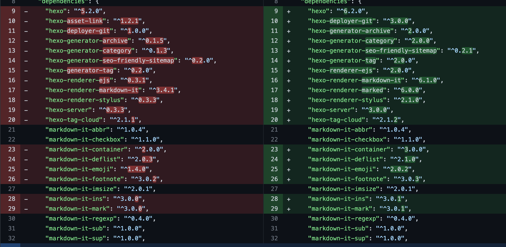

終於在年節時間把這個部落格升級到Hexo 6.2了！2019年建立這個部落格那時候還是用Hexo 4，前年曾經升級到Hexo 5，並且嘗試把[hexo-theme-materialize](https://github.com/carlos-algms/hexo-theme-materialize)一起升級到v4，不料這次theme升級幅度有點大，hexo-theme-materialize v4他們把[Stylus](https://stylus-lang.com/)都給改成scss，還改成了webpack，升級沒這麼順利，所以當時就只有先把Hexo從4升級到5.2。這次九天連假，前兩天就把動畫追完，後面只好把之前欠的補一補了。

<!-- more -->

### 事前準備

首先我們來看看Hexo版本之間的差異

| Hexo version | Minimum (Node.js version) |Less than (Node.js version) |
| ---- | ---- | ---- |
| 6.2+| 12.13.0 | latest |
| 6.0+| 12.13.0 | 18.5.0|
|5.0+ | 10.13.0 | 12.0.0|
|4.1 - 4.2 | 8.10 | 10.0.0|
|4.0 | 8.6 | 8.10.0|

升級到6.2至少要NodeJs 12.13，還好都是跑在docker裡面，這邊只要改寫Dockerfile即可

```
FROM node:18-alpine

COPY hexo /blog
WORKDIR /blog

RUN echo "http://dl-cdn.alpinelinux.org/alpine/edge/testing" >> /etc/apk/repositories

RUN apk add --update --no-cache git
RUN npm config set unsafe-perm true \
        && npm install hexo-cli -g \
  && npm install

EXPOSE 4000

ENTRYPOINT ["hexo", "server"]
```

### 開始升級！

基礎架設搞定以後呢，就可以開始把所有的package.json都更新上去：
```json
{
  "name": "hexo-site",
  "version": "2.0.0",
  "private": true,
  "hexo": {
    "version": "6.3.0"
  },
  "dependencies": {
    "hexo": "^6.2.0",
    "hexo-asset-link": "^2.2.1",
    "hexo-deployer-git": "^3.0.0",
    "hexo-generator-archive": "^2.0.0",
    "hexo-generator-category": "^2.0.0",
    "hexo-generator-seo-friendly-sitemap": "^0.2.1",
    "hexo-generator-tag": "^2.0.0",
    "hexo-renderer-ejs": "^2.0.0",
    "hexo-renderer-markdown-it": "^6.1.0",
    "hexo-renderer-marked": "^6.0.0",
    "hexo-renderer-stylus": "^2.1.0",
    "hexo-server": "^3.0.0",
    "hexo-tag-cloud": "^2.1.2",
    "markdown-it-abbr": "^1.0.4",
    "markdown-it-checkbox": "^1.1.0",
    "markdown-it-container": "^3.0.0",
    "markdown-it-deflist": "^2.1.0",
    "markdown-it-emoji": "^2.0.2",
    "markdown-it-footnote": "^3.0.3",
    "markdown-it-imsize": "^2.0.1",
    "markdown-it-ins": "^3.0.1",
    "markdown-it-mark": "^3.0.1",
    "markdown-it-regexp": "^0.4.0",
    "markdown-it-sub": "^1.0.0",
    "markdown-it-sup": "^1.0.0",
    "markdown-it-task-checkbox": "^1.0.6"
  }
}
```
我們比對一下可以發現都是滿大版號的跳動：


然後 `_config.yml`裡有個針對`external_link`的修正，原先他是吃`true|false`，現在要改成下面這樣
```yml
external_link:
  enable: true
```


除此之外，這次我還安裝了[hexo-renderer-marked](https://github.com/hexojs/hexo-renderer-marked)，讓他去處理post assets路徑的問題，更詳細的討論可以看[這裡](https://hexo.io/docs/asset-folders#Embedding-an-image-using-markdown)，
> Once enabled, an asset image will be automatically resolved to its corresponding post’s path. For example, “image.jpg” is located at “/2020/01/02/foo/image.jpg”, meaning it is an asset image of “/2020/01/02/foo/“ post, `` will be rendered as ``.

為此，對於`_config.yml`要增加
```yml
post_asset_folder: true #這可能之前有，有的話就去修改它 
marked:
  prependRoot: true
  postAsset: true
```

到此為止，Hexo 6.2算是升級完成了。緊接著是對於theme的升級步驟。

### Theme: hexo-theme-materialize

大部分人都用 [NexT theme](https://theme-next.js.org/)，但我跟他還是沒那麼對眼，所以我一直都是用[hexo-theme-materialize](https://github.com/carlos-algms/hexo-theme-materialize)，我們就直接clone他到theme folder裡。
```
git clone https://github.com/carlos-algms/hexo-theme-materialize themes/materialize
```

但我的部落格有sidebar跟categories，這些都要把他們加進去，就先來處理categories吧。先在`themes/materialize/layout`底下，增加一個`categories.ejs`

##### Add categories
**themes/materialize/layout/categories.ejs**
```js
<div class="container">
  <div class="row">
    <div class="col s12 m9">
      <header class="article-header">
      <h1 class="article-title" itemprop="name">
        <%= page.title %>
      </h1>
      </header>

      <% if (site.categories.length){ %>
      <div class="category-all-page article-type-post show">
        <%- list_categories(site.categories, {
          show_count: true,
          class: 'category-list-item',
          style: 'list',
          depth: 2,
          separator: ''
        }) %>
      </div>
      <% } %>
      <% if ( is_tag() ) { %>
        <h2 class="header color-featured">Tag: <%- page.tag %></h2>
      <% } %>
    </div>
    <div class="col s12 m3">
      <% if (theme.sidebar && theme.sidebar !== 'bottom'){ %>
        <%- partial('_partial/sidebar', null, {cache: !config.relative_link}) %>
      <% } %>
    </div>
  </div>
</div>
```
然後還缺少CSS:

**themes/materialize/src/styles/_partial/categories.scss**
```css
.category-all-page {
  position: relative;

  h2 {
    margin: 20px 0;
  }
  .category-all-title {
    text-align: center;
  }
  .category-all {
    margin-top: 20px;
  }
  .category-list {
    margin: 0;
    padding: 0;
    list-style: none;
  }
  .category-list-item-list-item {
    margin: 10px 15px;
  }
  .category-list-item-list-count {
    color: $color-grey;
    &:before {
      display: inline;
      content: " (";
      }
    &:after {
      display: inline;
      content: ") ";
    }
  }
  .category-list-item {
    margin: 10px 10px;
  }
  .category-list-count {
    color: $color-grey;
    &:before {
      display: inline;
      content: " ("
    }
    &:after {
      display: inline;
      content: ") "
    }
  }
  
  .category-list-child {
    padding-left: 10px;
  }
}
```

最後把這個partial加回去 **themes/materialize/src/styles/style.css**就好了
```css
// add it
@import '_partial/categories';
```

##### Add sidebar
然後我的sidebar呢？在每個想要有sidebar的layout裡，找到正確位置新增：

```ejs
<div class="col s12 m3">
  <% if (theme.sidebar && theme.sidebar !== 'bottom'){ %>
    <%- partial('_partial/sidebar', null, {cache: !config.relative_link}) %>
  <% } %>
</div>
```
然後將sidebar.ejs partial layout加回來，
**themes/materialize/layout/_partial/sidebar.ejs**
```ejs
<aside id="sidebar"<% if (theme.sidebar === 'bottom'){ %> class="outer"<% } %>>
  <% theme.widgets.forEach(function(widget){ %>
    <%- partial('_widget/' + widget) %>
  <% }) %>
</aside>
```

剩下這些partial widget，可以參考其他theme的設計，這邊檔案太多就不每個都show出來了。


到此終於升級完整個hexo + theme，用了一個比較冷門的theme還真的是一個挑戰。
不過升級完的另一個挑戰，是年假還有好多天，要開始來補文章了....。
