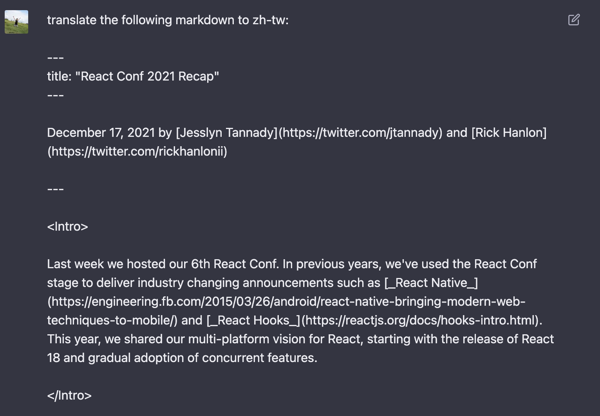
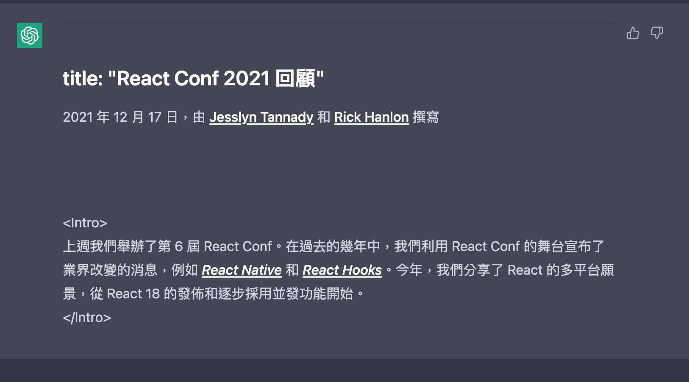
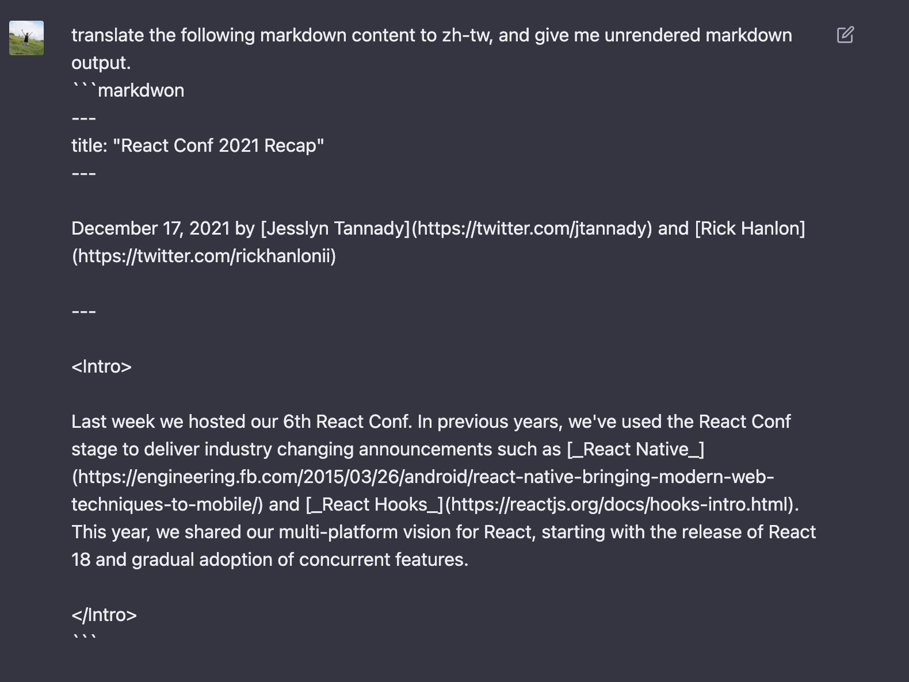
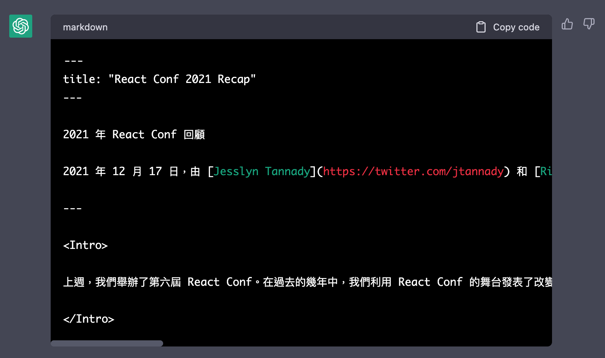
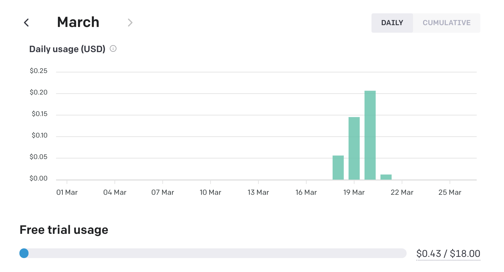
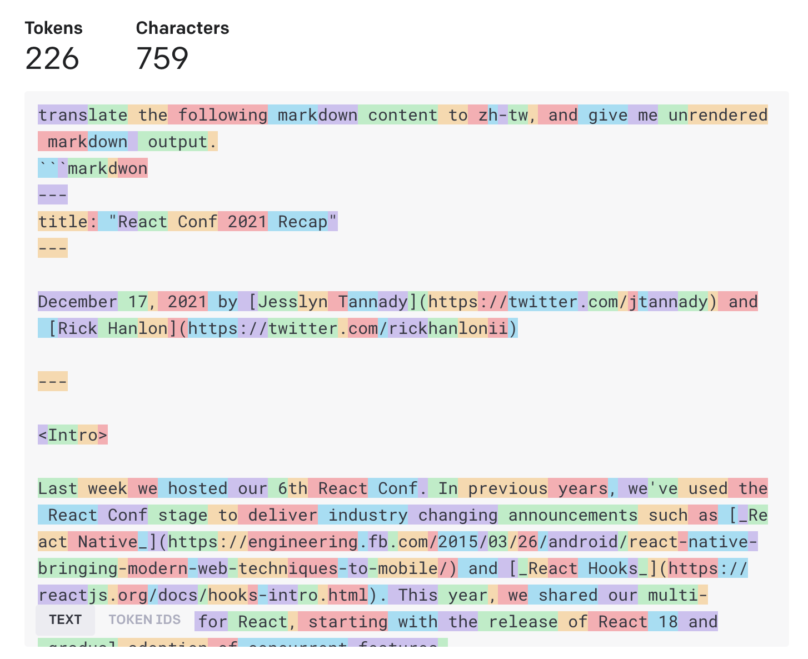
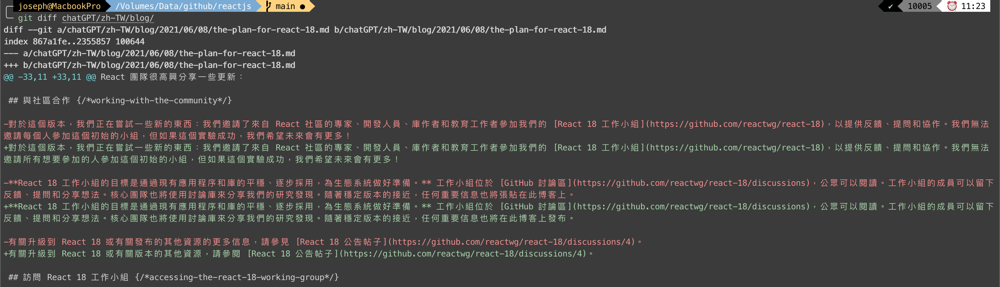

[react.dev](https://react.dev/) was released on [March 17](https://github.com/reactjs/react.dev/issues/3308#issuecomment-1472708675). I've read the beta version for a while. I love the [Escape Hatches](https://react.dev/learn/escape-hatches) section which has many correct and recommended usages about react hooks. After new [react.dev](https://react.dev/) released, I noticed that there's no translation. I haven'n played [OpenAI API](https://platform.openai.com/overview) yet, so I think this is a good opportunity to play [ChatGPT](https://chat.openai.com/chat) with its translation feature for [react.dev](https://react.dev/).

TOC
<!-- toc -->

<!-- more -->
> Repo: https://github.com/josephMG/chatGPT-translate-docs
> You can get my chatGPT translation from my repo and read README.md to check how to use.

In this repo, I use typescript and nodejs to integrate [ChatGPT](https://chat.openai.com), and you have to get a [API key](https://platform.openai.com/account/api-keys) from OpenAI if you want to run it.
### Ask ChatGPT first

First of all, I have to check feasibility of asking ChatGPT to translate a markdown, hence I copy a part of the [markdown file](https://raw.githubusercontent.com/reactjs/react.dev/main/src/content/blog/2021/12/17/react-conf-2021-recap.md). 




It seems to translate fine, but the markdown syntax is gone. So I ask next prompt:




Well done! I only need to put markdown into ChatGPT with the prompt `translate the following markdown content to zh-tw, and give me unrendered markdown output.` Let's start coding.

### Build a CLI

After doing extensive research, I finally found a [tutorial](https://fullstackladder.dev/blog/2022/03/06/node-packages-to-create-beauty-cli/) on how to implement a CLI tool by Node.js. So I just ask two prompts about inputing docs location and choosing a i18n language.

```typescript
prompts.next({
  type: 'input',
  name: 'Path',
  default: "/docs",
  message: 'What\'s the doc path?',
});

prompts.next({
  type: 'rawlist',
  name: 'Locale',
  message: 'What\'s the language you want?',
  choices: locales.map(locale => ({ name: `${locale['Display Name']} (${locale['Language Culture Name']})`, value: locale['Language Culture Name']})),
  default: 29
});
```

The `locales` is a JSON file that were converted from [this csv](https://github.com/ladjs/country-language/blob/master/dataCompilation/dataSources/language_codes_ms.csv) using [convertcsv](https://www.convertcsv.com/csv-to-json.htm). Now we have CLI tool, and we'll discuss the `token`.

### Learn the Token


When you sign up for the first time, OpenAI provides you with $18 USD. Based on [pricing](https://openai.com/pricing), the Chat API costs `$0.002 / 1K tokens`. What's token? 

> [tokenizer](https://platform.openai.com/tokenizer)
> The GPT family of models process text using tokens, which are common sequences of characters found in text. The models understand the statistical relationships between these tokens, and excel at producing the next token in a sequence of tokens.

[Each model](https://platform.openai.com/docs/models/overview) has a limited number of tokens that it can use. For example, if you use the `gpt-3.5-turbo` model, it only allows for 4,096 tokens.



In order not to exceed the maximum number, I have to seperate a markdown to multiple chunks. Thanks to [@dqbd/tiktoken](https://www.npmjs.com/package/@dqbd/tiktoken), I can easily pass a string and get length.

```typescript
import { encoding_for_model } from "@dqbd/tiktoken";
const calcToken = (paragraph: string) => {
  const enc = encoding_for_model("gpt-3.5-turbo");
  const tokens = enc.encode(paragraph)
  enc.free()
  return tokens.length
}
```

### Chunk the markdown

In this step, I hava two functions, one is seperate content to paragraph called `convertContentToParagraph`, the other is convert paragraph to chunks called `convertParagraphToChunk`.

```typescript
type TextWithTokens = {tokens: number, text: string}
const convertContentToParagraph = (content: string, cb: VoidFunction) => {
  const codeMatches = [...content.matchAll(/^```.+\n([\s\S]*?)```/gm)]
  const paragraphMatches = content.matchAll(/\n\n/g)
  let startPos = 0
  let codeIndex = 0
  const paragraph: TextWithTokens[] = []
  for (const paragraphMatch of paragraphMatches) {
    cb()
    if (codeMatches.length > 0 && codeIndex < codeMatches.length) {
      const codeMatch = codeMatches[codeIndex]
      if (paragraphMatch.index && codeMatch.index) {
        if (codeMatch.index! < paragraphMatch.index!) {
          if (codeMatch.index + codeMatch[0].length > paragraphMatch.index) {
            continue
          }
          codeIndex += 1
        }
      }
    }
    const endPos = paragraphMatch.index! + paragraphMatch[0].length
    const text = content.substring(startPos, endPos)
    paragraph.push({ tokens: calcToken(text), text })
    startPos = endPos
  }
  const text = content.substring(startPos)
  paragraph.push({ tokens: calcToken(text), text })
  return paragraph
}

const convertParagraphToChunk = (paragraphs: TextWithTokens[]): TextWithTokens[] => {
  return paragraphs.reduce((chunks, paragraph, index) => {
    let s = chunks[chunks.length - 1]
    s.text = `${s.text}${paragraph.text}`
    s.tokens = s.tokens + paragraph.tokens

    if (index === paragraphs.length - 1) {
      return [...chunks]
    }
    if (s.tokens + paragraphs[index + 1].tokens > CHUNK_TOKENS - CONTEXT_TOKEN) {
      return [...chunks, { tokens: 0, text: '' }]
    }
    chunks[chunks.length - 1] = s
    return chunks
  }, [{ tokens: 0, text: '' }])
}
```

And here is the config for my ChatGPT

```typescript
const clientOptions = {
    modelOptions: {
        model: 'gpt-3.5-turbo',
        temperature: 0,
        max_tokens: 4097 - CHUNK_TOKENS - CONTEXT_TOKEN,
    },
    maxContextTokens: 4097,
    maxPromptTokens: CHUNK_TOKENS + CONTEXT_TOKEN,
    debug: false,
};
```

> The `max_tokens` parameter is used for return, while `maxPromptTokens` specifies the maximum number of tokens that can be used in a prompt. 
> 
> `CHUNK_TOKENS` refers to the number of tokens in a paragraph, while `CONTEXT_TOKENS` refers to the number of tokens in the context.

After these processes, a markdown file is seperated into multiple chunks! Until now, I've introduced the important parts of my [repo](https://github.com/josephMG/chatGPT-translate-docs), so you can just pull and give it a try. 



### Conclusion

> ChatGPT translation: https://github.com/josephMG/chatGPT-translate-docs/blob/main/chatGPT/zh-TW/blog/2021/12/17/react-conf-2021-recap.md
>
> [react.dev](https://react.dev) source: https://github.com/reactjs/react.dev/blob/main/src/content/blog/2021/12/17/react-conf-2021-recap.md



I have translated a blog into Traditional Chinese. In the `react-conf-2021-recap` markdown file, I have divided it into three parts, and the cost was $0.02 USD. If you translate the `react-conf-2021-recap` file twice, you may notice some minor differences, but the main points remain the same.


### References:
1. [resume-builder-cli-demo - a Nodejs CLI repo](https://github.com/wellwind/resume-builder-cli-demo/tree/master)
2. [打造美觀的互動式 CLI 介面](https://fullstackladder.dev/blog/2022/03/06/node-packages-to-create-beauty-cli/)
