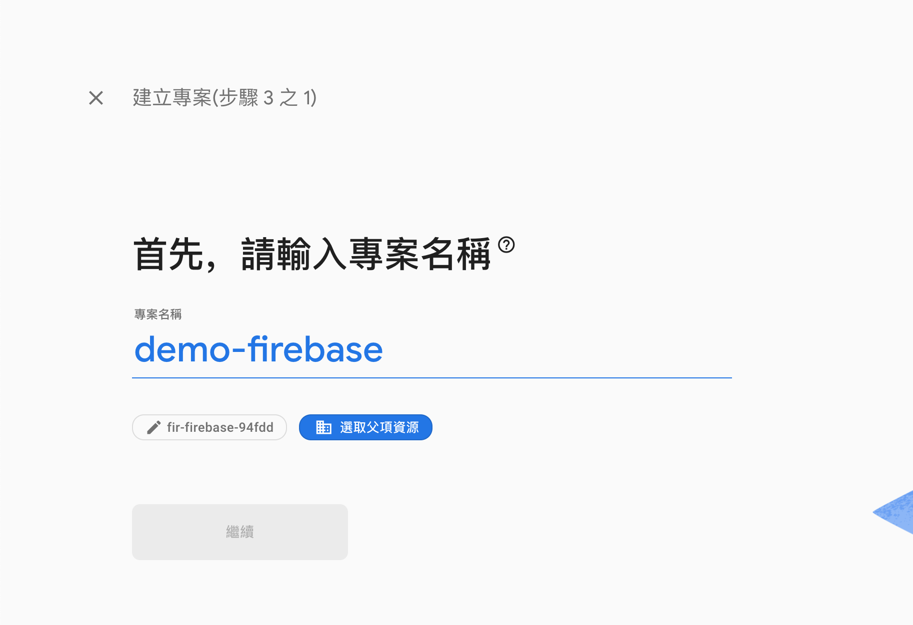
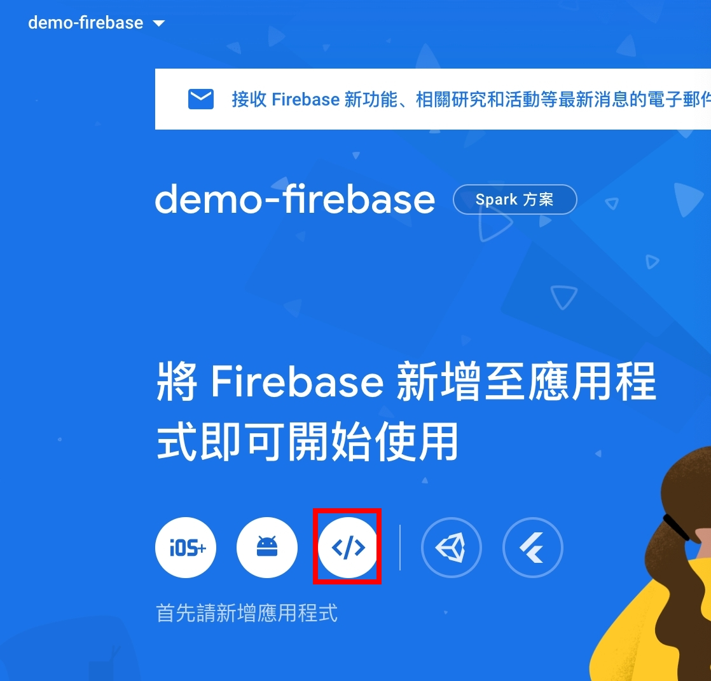
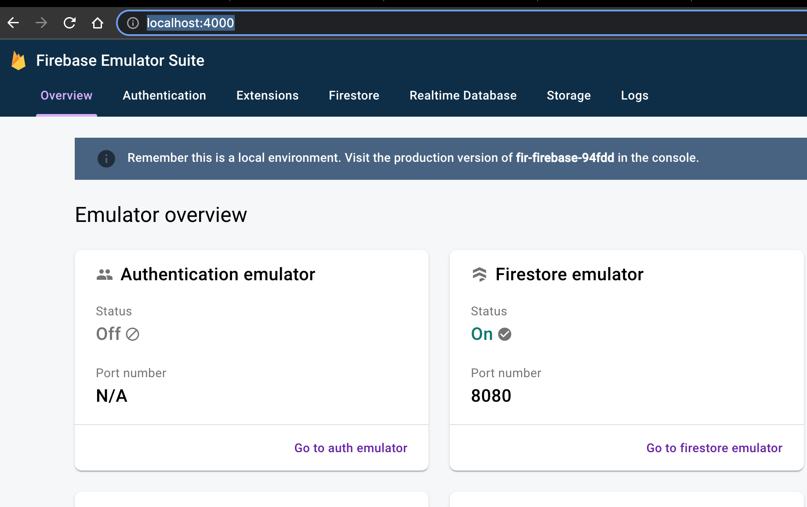

Last year, I got a case to use [firebase](https://firebase.google.com/) and [firestore](https://firebase.google.com/docs/firestore) with Next.js. I've been fullstack many years, so I haven't tried to use firebase and firestore. There was a great chance to give it a try.

In this article I'll show how to use firebase and firestore in [Docker](https://www.docker.com/) and [Next.js](https://nextjs.org/). If you don't have backend support, or you don't want to build whole backend, database, and infrastructure, you would probably think this is a useful way.
<!-- more -->

# TOC
<!-- toc -->

### Create a firebase project

Let's start it. Go to [firebase console](https://console.firebase.google.com/?pli=1) and follow the step to create a new project.

> It is just for demo, so I uncheck google analytics in step 2.

A few minutes later, it shows you the firebase console. Next we have to add `firebase` to webapp by clicking the button.


We just need to focus on Step 1 and Step 4 in the following image, because we step 2 config you can get it from project setting again and step 3 we will use docker later.


> step 4 commands:
> - firebase login
> - firebase init
> - firebase deploy

After creating firebase app, we have to create firestore database for our app (we use `test-mode` and locale use `asia-east1`):


Cool, but in this article we won't show how to create a nextjs project and setup docker-compose, you can find it in . Then, let's add firebase docker to docker-compose.

### Add firebase to docker-compose

Instead of `npm install -g firebase-tools`, we use docker-compose. The following code shows how to integrate firebase-tools to docker-compose.
> See also: https://hub.docker.com/r/andreysenov/firebase-tools

```yml
version: '3.8'
services:
  frontend:
    container_name: frontend
    build:
      context: .
      dockerfile: Dockerfile
    volumes:
      - ./app:/app
      - ./app/node_modules:/app/node_modules
    command: sh -c 'npm start'
    ports:
      - "3000:3000"
    stdin_open: true
  firebase:
    container_name: firebase
    image: andreysenov/firebase-tools
    user: node
    #command: firebase emulators:start
    command:·tail·-f·/dev/null
    ports:
      - 9005:9005
      - 9099:9099
      - 9199:9199
      - 5001:5001
      - 5000:5000
      - 8080:8080
      - 8085:8085
      - 9000:9000
      - 3003:3003
      - 4000:4000
    volumes:
      - ./:/home/node
```

Look at our file structure:

> You can type `docker-compose build` to build docker container now.
> And don't forget to install npm into `app`: `docker-compose run --rm frontend npm install`

> Before we firebase login and firebase init, use `command: tail -f /dev/null`.
> Once we have `firebase.json` we can use `command: firebase emulators:start`.

Okay, after `docker-compose up`, try to use `firebase-tool` to login first:
> `docker-compose exec firebase firebase login`
> `docker-compose exec firebase firebase init`


> If you get this message: **Error: It looks like you haven't used Cloud Firestore in this project before.**
> Please check your **Default GCP resource location** in `Project Setting`.

By the way, notice these two questions:
1. ? What do you want to use as your public directory? `app/build`
2. ? Configure as a single-page app (rewrite all urls to /index.html)? `Yes`

It's almost done. We have to add `host: 0.0.0.0` to each service of **emulators** in `firebase.json`:
```
    "firestore": {
      "host": "0.0.0.0",
      "port": 8080
    },
    "database": {
      "host": "0.0.0.0",
      "port": 9000
    },
    "hosting": {
      "host": "0.0.0.0",
      "port": 5000
    },
    "storage": {
      "host": "0.0.0.0",
      "port": 9199
    },
    "ui": {
      "enabled": true,
      "host": "0.0.0.0",
      "port": 4000
    },
    "singleProjectMode": true
```

Time to comment and uncomment our `command` part in `docker-compose.yml`, and restart `docker-compose up`.
Yeah! After clicking http://localhost:4000/, we'll see the result!




Okay! Firebase is ready for our project. Next artile we will demostrate how to use firebase with Next.js!
