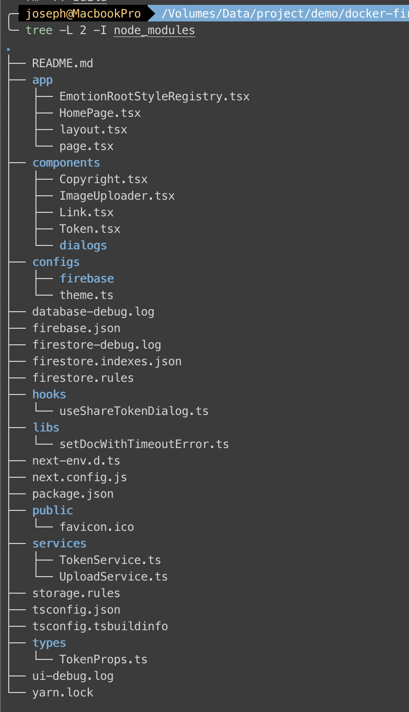
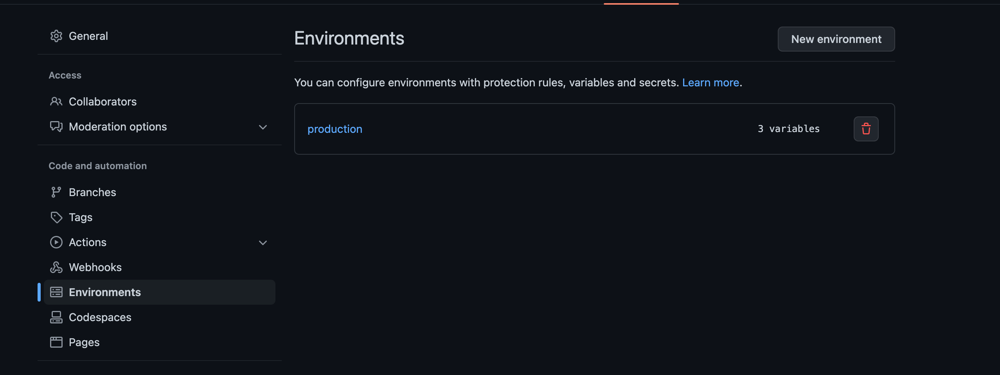

On our [previous post](./Using-Firebase-and-Firestore-in-NextJS-part-1) shows how to integrate firebase with docker. This article we will integrate Next.js with firebase, and then deploy app with Github actions.  In this webapp, we can input cryptocurrency name, and upload logo, and therefore we use `firestore` to save `Tokens` collection and `Cloud Storage` to save logo images.

<!-- more -->

### Project structure


We use NextJS 13 with `appDir` folder, so we have `layout.tsx` and `page.tsx` in `appDir`. Keep your eye on `EmotionRootStyleRegistry.tsx`, in this example we use [Material UI](https://mui.com/material-ui/getting-started/overview/) and [Emotion](https://emotion.sh/docs/introduction) so we need to wrap a `Provider` (**client component**) in our `layout.tsx`. Only by doing this, we can use them with NextJS 13.

> ref: https://github.com/emotion-js/emotion/issues/2928

### Firebase config

We configure our `Firebase` object in `configs/firebase/index.ts`

**configs/firebase/index.ts**
```typescript
import { initializeApp } from "firebase/app";
import { getStorage, connectStorageEmulator } from "@firebase/storage";
import {
  connectFirestoreEmulator,
  enableIndexedDbPersistence,
  initializeFirestore,
  CACHE_SIZE_UNLIMITED,
} from "@firebase/firestore";

const firebaseConfig = {
  apiKey: process.env.FIREBASE_API_KEY,
  authDomain: "fir-firebase-94fdd.firebaseapp.com",
  projectId: "fir-firebase-94fdd",
  storageBucket: "fir-firebase-94fdd.appspot.com",
  messagingSenderId: process.env.FIREBASE_MESSAGING_SENDER_ID,
  appId: process.env.FIREBASE_APP_ID,
};

const app = initializeApp(firebaseConfig);
const cloudStorage = getStorage(app);
// const db = getFirestore(app);
const db = initializeFirestore(app, {
  cacheSizeBytes: CACHE_SIZE_UNLIMITED,
  ignoreUndefinedProperties: true,
});
if (process.env.NODE_ENV !== "production") {
  connectStorageEmulator(cloudStorage, "localhost", 9199);
  connectFirestoreEmulator(db, "localhost", 8080);
}
if (typeof window !== "undefined") {
  enableIndexedDbPersistence(db);
}
export { cloudStorage, db };
```

Firstly, `FIREBASE_API_KEY`, `FIREBASE_MESSAGING_SENDER_ID`, and `FIREBASE_APP_ID` are set in environment variable. Secondly, we connect our `cloudStorage` and `db` with `emulator` when we are not in production. Thirdly, we set `db` as a offline-first database by `enableIndexedDbPersistence`. And lastly we export `cloudStorage` and `db` directly.

### appDir files

Now, let's dig into our `appDir` files: `layout.tsx`, `page.tsx`, and `HomePage.tsx`.

**app/layout.tsx**
```typescript
import { ReactNode } from "react";
import Copyright from "@/components/Copyright";
import EmotionRootStyleRegistry from "./EmotionRootStyleRegistry";

export default function RootLayout({ children }: { children: ReactNode }) {
  return (
    <html>
      <head></head>
      <body>
        <EmotionRootStyleRegistry>
          {children}
          <Copyright />
        </EmotionRootStyleRegistry>
      </body>
    </html>
  );
}
export const metadata = {
  title: {
    default: "NextJS and Firebase",
    template: "%s | NextJS and Firebase",
  },
  description: "Generated by create next app",
  viewport: {
    width: "device-width",
    initialScale: 1,
    maximumScale: 1,
  },
};
```

The `metadata` in `layout.tsx` will render into `<head></head>`. Besides `RootLayout`, you can have many [nested layout](https://beta.nextjs.org/docs/routing/pages-and-layouts#nesting-layouts) in each sub-routes, and use [generateMetadata](https://beta.nextjs.org/docs/api-reference/metadata#generatemetadata) with `title template` to generate title in each nested layout.

**app/page.tsx**
```typescript
import HomePage from "./HomePage";

export default function Page() {
  return <HomePage />;
}
```

Our `page.tsx` is a very simple **server component**. We can [fetch data](https://beta.nextjs.org/docs/data-fetching/fetching) or set metadata over here if necessary.

**app/HomePage.tsx**
```typescript
"use client";

import { Container, Typography, Box, Button } from "@mui/material";
import { useCallback, useEffect, useState } from "react";
import { useShareTokenDialog } from "@/hooks/useShareTokenDialog";
import TokenInfoDialog from "@/components/dialogs/TokenInfoDialog";
import * as TokenService from "@/services/TokenService";
import { TokenInfoProps } from "@/types/TokenProps";
import Token from "@/components/Token";

export default function HomePage() {
  const { setDialog } = useShareTokenDialog();
  const [tokens, setTokens] = useState<TokenInfoProps[]>([]);
  const fetchTokens = useCallback(async () => {
    const data = await TokenService.getTokens();
    setTokens(data);
  }, []);

  useEffect(() => {
    fetchTokens();
  }, [fetchTokens]);

  return (
    <Container maxWidth="lg">
      <Box
        sx={{
          my: 2,
          display: "flex",
          justifyContent: "space-between",
          alignItems: "center",
        }}
      >
        <Typography variant="h4" component="h1">
          Token List
        </Typography>
        <Button
          variant="contained"
          onClick={() => setDialog({ open: true, isCreate: true })}
        >
          Add Token
        </Button>
      </Box>
      <Box display="flex" sx={{ mx: "auto", width: "90%" }}>
        {tokens.map((token) => (
          <Token key={token.id} {...token} />
        ))}
      </Box>
      <TokenInfoDialog onSave={fetchTokens} />
    </Container>
  );
}
```

Our `HomePage.tsx` **client component** is more complicted. Let's us focus on `useShareTokenDialog` hook and `TokenService`. Instead of `redux`, in this example we use [use-between](https://www.npmjs.com/package/use-between) to share state between components. It's really easy and useful.

### hooks and Service

We won't go through every component, but you can find it on our [github repo](https://github.com/josephMG/docker-nextjs-firebase).
But how we save data to firesotre and storage? We implement it in our `TokenService` and `UploadService`!

**services/TokenService.ts**
```typescript
import { v4 as uuidv4 } from "uuid";
import { collection, getDocs, getDoc, doc } from "firebase/firestore";
import { TokenInfoProps } from "@/types/TokenProps";
import setDocWithTimeoutError from "@/libs/setDocWithTimeoutError";
import { db } from "@/configs/firebase";

export const setToken = async (
  tokenInfo: TokenInfoProps
): Promise<TokenInfoProps> => {
  if (!tokenInfo.id) {
    tokenInfo.id = uuidv4();
  }
  try {
    await setDocWithTimeoutError(`tokens/${tokenInfo.id}`, tokenInfo);
  } catch (e) {}
  return tokenInfo;
};

export const getToken = async (id: string): Promise<TokenInfoProps | null> => {
  const docRef = doc(db, "tokens", id);
  const tokenSnapshot = await getDoc(docRef);
  if (tokenSnapshot.exists()) {
    return tokenSnapshot.data() as TokenInfoProps;
  } else {
    return null;
  }
};
export const getTokens = async (): Promise<TokenInfoProps[] | []> => {
  const tokensSnapshot = await getDocs(collection(db, "tokens"));
  return tokensSnapshot.docs.map((snap) => snap.data() as TokenInfoProps);
};
```

**services/UploadService.ts**
```typescript
import { ref, uploadBytesResumable, getDownloadURL } from "firebase/storage";
import { cloudStorage } from "configs/firebase";

export const uploadFromBlobAsync = async (
  file: File,
  folder: string,
  onSuccess: (url: string) => void,
  onError = (err?: Error) => {}
) => {
  if (!file) return null;
  const storageRef = ref(cloudStorage, `/${folder}/${Date.now()}_${file.name}`);
  const uploadTask = uploadBytesResumable(storageRef, file);
  uploadTask.on(
    "state_changed",
    () => {},
    onError,
    () => {
      getDownloadURL(uploadTask.snapshot.ref).then((url) => {
        onSuccess(url);
      });
    }
  );
};
```

As you see, there are many Firestore methods such as `collection`, `getDocs`, `getDoc`, and `doc`, and we import `db` from configs so that we can manipulate firestore database. On the other hand, our `UploadService` imports `cloudStorage` and handles Storage methods.

You can implement your components as you wish, but now we're gonna to deploy to Firebase.

### Deploy

We use Github action to deploy our app. You can generate a template by `firebase init hosting`, choose `webframeworks`, and login authorize Github to deploy.

**.github/workflows/firebase-hosting-merge.yml**
```yml
name: Deploy to Firebase Hosting on merge

permissions:
  checks: write
  contents: read
  pull-requests: write

'on':
  push:
    branches:
      - main

jobs:
  build_and_deploy:
    runs-on: ubuntu-latest
    defaults:
      run:
        working-directory: ./app
    environment: production
    steps:
      - uses: actions/checkout@v3

      - name: Use Node.js ${{ matrix.node-version }}
        uses: actions/setup-node@v3
        with:
          node-version: ${{ matrix.node-version }}

      - run: yarn install --immutable && yarn build

      - name: Enable Firebase Experiments
        run: /usr/local/bin/npx firebase-tools@latest experiments:enable webframeworks

      - uses: FirebaseExtended/action-hosting-deploy@v0
        with:
          entrypoint: "./app"
          repoToken: '${{ secrets.GITHUB_TOKEN }}'
          firebaseServiceAccount: '${{ secrets.FIREBASE_SERVICE_ACCOUNT_FIR_FIREBASE_94FDD }}'
          channelId: live
          projectId: fir-firebase-94fdd
        env:
          FIREBASE_CLI_EXPERIMENTS: webframeworks
          FIREBASE_API_KEY: '${{ secrets.FIREBASE_API_KEY }}'
          FIREBASE_MESSAGING_SENDER_ID: '${{ secrets.FIREBASE_MESSAGING_SENDER_ID }}'
          FIREBASE_APP_ID: '${{ secrets.FIREBASE_APP_ID }}'
```

By the way, we set `production` environment and environment variables on Github repository settings.


It's time to commit, push, deploy, and go to your firebase url to see result.


> If you got an deploy 403 error, please add some `IAM permissions` by checking:
> 1. https://stackoverflow.com/questions/69105552/http-error-403-permission-denied-to-enable-service-cloudfunctions-googleapis
> 2. https://github.com/FirebaseExtended/action-hosting-deploy/issues/253

### Conclusion

Finally we get an opportunity to use NextJS 13 `appDir`. Although it's still an experimental feature, we feel that is more intuitive to organize server-side and client-side components. Some packages are not supported now, but you still can find a patch easily by Google or ChatGPT.

In this simple example, even through we don't build relationships in database and don't use Firebase Auth or Firebase Function, we use NextJS 13 `appDir` folder integrating with Firebase, Firestore, and Cloud Storage. And, it is also worth of reference if you want to use `Firebase Emulator` in `docker-compose`. If you need more details about this project, please go to [Github repo](https://github.com/josephMG/docker-nextjs-firebase). Hope this is useful for you.

