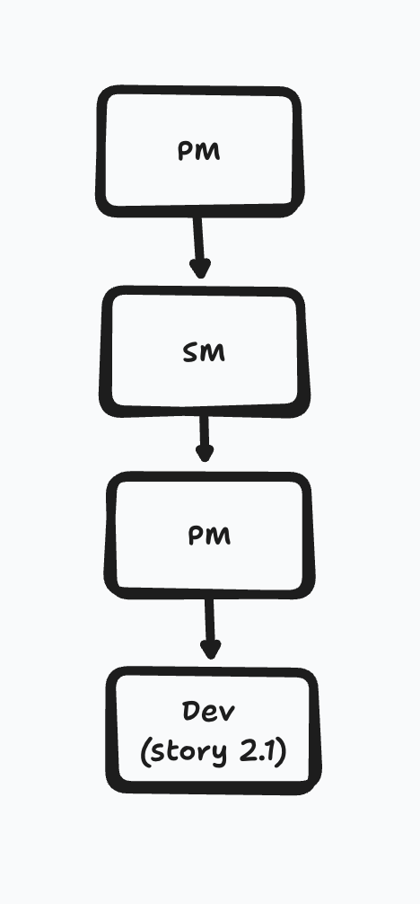
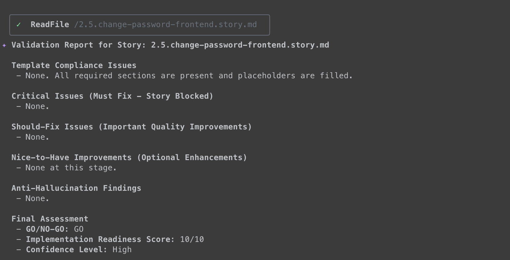
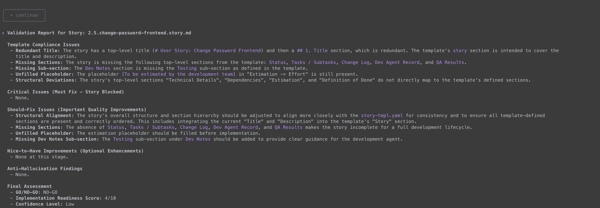
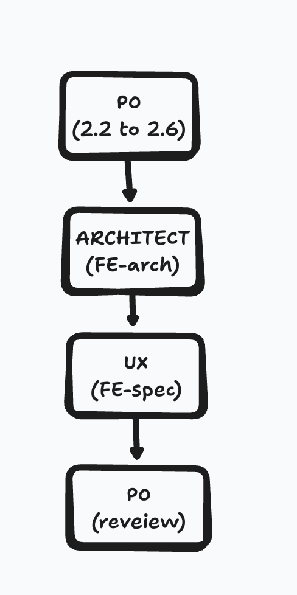

Write your content here!

我們來開個前端的專案，然後嘗試把前兩天的後端API串進來，當然這一切都讓PM去發起，這功能就有點大，所以來建立個epic先。

> create a story, I want to integrate a frontend by Nextjs with RTK Query, Redux toolkit, axois, and material-ui. The frontend needs api's come from @user-management-service, so there must be register, update, get user, fetch JWT, change password and delete user. It must be UI/UX friendly and very pretty. PLEASE SETUP and RUN EVERYTHING INSIDE DOCKER AND DOCKER-COMPOSE AS THE SAME AS @user-management-service BACKEND PROJECT.

```shell
$ git status
On branch feat/day-10
Untracked files:
  (use "git add <file>..." to include in what will be committed)
        docs/prd/epic-5-nextjs-frontend-integration.md
        docs/stories/1.6.basic-user-crud-frontend-interaction.story.md
```

<!-- more -->

### TOC

### PM 怎麼這樣？

看完這個story開法差點沒昏倒，一個story這麼大包，一怒之下怒請SM重新根據epic 5梳理一番。於是乎就有了第一版shard過後的story 2.1-2.6，不過這第一版他把docker放到了2.6才導入，我請他搬到first priority，就變成下面這個結構。

````shell


```shell
$  tree docs/ui-architecture docs/stories/ docs/ui-*
docs/stories/
├── 1.1.user-registration-and-authentication.story.md
├── 1.2.implement-tdd-practices.story.md
├── 1.3.change-user-password.story.md
├── 1.4.update-user-profile-information.story.md
├── 1.5.delete-user-account.story.md
├── 2.1.nextjs-frontend-dockerization.story.md
├── 2.2.user-registration-frontend.story.md
├── 2.3.user-login-frontend.story.md
├── 2.4.user-profile-management-frontend.story.md
├── 2.5.change-password-frontend.story.md
└── 2.6.delete-user-account-frontend.story.md
````

結果我後面就被卡住了，他一直要我先請Dev開發story 2.1，才讓我繼續進行下去。 我把docker-compose順勢搬到project root，然後他幫我建立的測試跟空的專案。
那我就先請一下Dev。然後來看看開發完story 2.1以後的架構，我們就有

1. frontend專案
2. story 2.1-2.6
3. epic
4. qa gates 2.1

所以到story 2.1時我們的flow如下。


### 文件還沒補齊，同志仍須努力。

前面的story 2.2-2.6凌亂不堪、慘不忍睹，現在開發完2.1了，再回來請PO重新整理一下story 2.2 to 2.6, 然後雖然遲了一點，但還是再叫architect跟UX補個文件，補完再修一版story 2.2 to 2.6。

> 第一次請PO把文件補完時他還會跟你說 `GO / NO-GO`

**GO**


**NO-GO**


然後我們就有了下面進入開發錢的架構了。

```shell
$  tree docs/ui-architecture docs/stories/ docs/ui-*
docs/ui-architecture
├── api-integration.md
├── component-standards.md
├── environment-configuration.md
├── frontend-developer-standards.md
├── frontend-tech-stack.md
├── index.md
├── project-structure.md
├── routing.md
├── state-management.md
├── styling-guidelines.md
└── testing-requirements.md
docs/stories/
├── 1.1.user-registration-and-authentication.story.md
├── 1.2.implement-tdd-practices.story.md
├── 1.3.change-user-password.story.md
├── 1.4.update-user-profile-information.story.md
├── 1.5.delete-user-account.story.md
├── 2.1.nextjs-frontend-dockerization.story.md
├── 2.2.user-registration-frontend.story.md
├── 2.3.user-login-frontend.story.md
├── 2.4.user-profile-management-frontend.story.md
├── 2.5.change-password-frontend.story.md
└── 2.6.delete-user-account-frontend.story.md
docs/ui-architecture
├── api-integration.md
├── component-standards.md
├── environment-configuration.md
├── frontend-developer-standards.md
├── frontend-tech-stack.md
├── index.md
├── project-structure.md
├── routing.md
├── state-management.md
├── styling-guidelines.md
└── testing-requirements.md
docs/ui-architecture.md  [error opening dir]
docs/ui-spec.md  [error opening dir]
```

看看第二段的flow:


> 但問的太多他有時候會傻掉，要再去請他`continue`, `what's next`, `tell me progress`. 他才會醒來繼續做。

到這邊算是把前端的文件準備完了，明天來進開發跟QA !

> 想看project的可以來這邊：https://github.com/josephMG/bmad-method-projects

### Conclusion

今天又是生成文件日，還好gemini-flash token很大，免費額度都還夠用，就有時候會傻掉、呆掉、睡著而已，今天也是第一次遇到NO-GO/GO的情境，如果沒有忘了要先跑Architect + UX的話應該也不會遇到。也是又上了一課。

今天到這邊就結束囉，喜歡我文章的再幫忙推廣一下喔！
