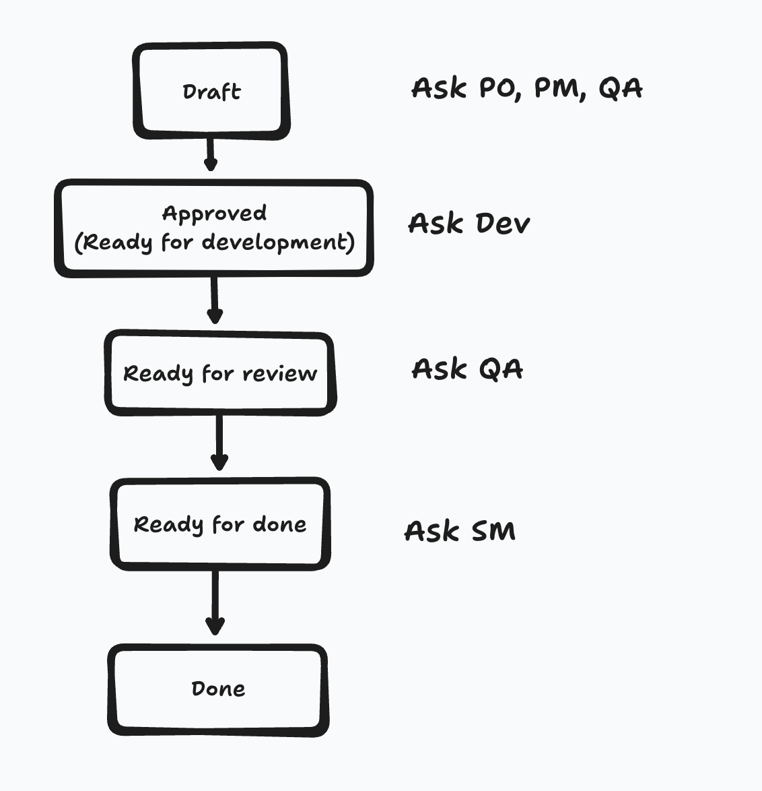
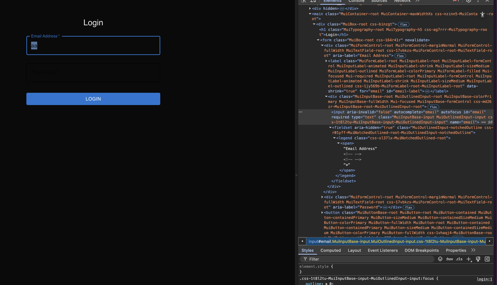
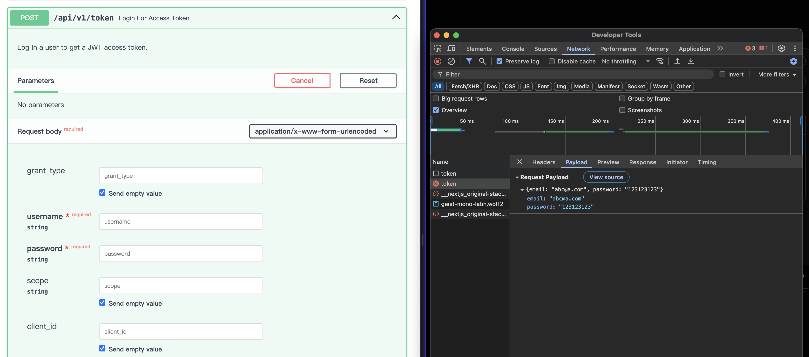

import errorHandling from './error-handling.gif';

[昨天](./day-10-bmad-method-integrate-frontend)把文件開完，每個story都可以進入開發，今天來vibe一下，讓dev, qa做事，缺什麼回去找PM，沒缺就讓他們直接幫我走到ready to done。

> 不用怕，根據經驗一次走完一定很可怕

{/*<!-- more -->*/}

### TOC

### Status Flow

這次比較拿手一點了，把flow離清楚、要找誰搞清楚，然後就是我們問、他們做。一個畫面一個畫面的產出，我們就先都不要去測他。我也不囉唆，直接上git吧

> git commit: https://github.com/josephMG/bmad-method-projects/commit/a3afd08aeb04f727236067199ebf823f1cbf2b76

然後我來寫一下可怕的點在哪。

### 可怕1: UI theme

即便我用了 Material-UI ，在Gemini的開發下，還是產生了可怕的配色，我一打開還以為只有 `Login` ，其他什麼都沒有。後續還要開一個story做一下`dark mode`，但也還好他有套用tailwindcss，加上dark mode不用動到太多code，專注於class就好

### 可怕2: 前後端分離焦慮

就算給他們review了後端專案跟architecture文件，我光登入還是發現欄位錯誤，一個收username一個送email，錯的離譜感覺文件是空殼。

### 可怕3: Error handling

或許是是因為用docker? 或許是沒有end-to-end test? 或許是偶爾用`Gemini-2.5-flash` model的關係? 總之就發生了這error handling慘烈的畫面，整個沒處理好登入失敗的樣子。

### 可怕4: Loop

當他們在開發 **story 2.5 change-password-frontend** 的時候，他想要改registration的testing，想要測試RTK query mock後的 `useRegisterMutation` 是不是有正常倍 `toHaveBeenCalledWith` ，然後就陷入了死胡同，改過去改回來改過去改回來。這邊我後來發現前一個commit可以過、到這邊就壞了，然後我人工介入調整才可可以順利跑過testing。

### 可怕5: 分批開發打亂專案架構

也是在開發story 2.5的時候發現，前面把redux放在 `src/redux/` 底下，到了story 2.5卻把redux在 `src/store/` 底下又建立了一個，還得要做點refactor把他們merge才比較完美。

> 想看project的可以來這邊：https://github.com/josephMG/bmad-method-projects

### Conclusion

到這邊發現開發完是開發完了，但中間還是有不少要調整的地方。大大小小的細節都還讓這次整合開發完但跑不過。還是下一步我們還要修error-handling, api-error, ui theme。
真不能太放心給他vibe。
明天繼續吧！

今天到這邊就結束囉，喜歡我文章的再幫忙推廣一下喔！
