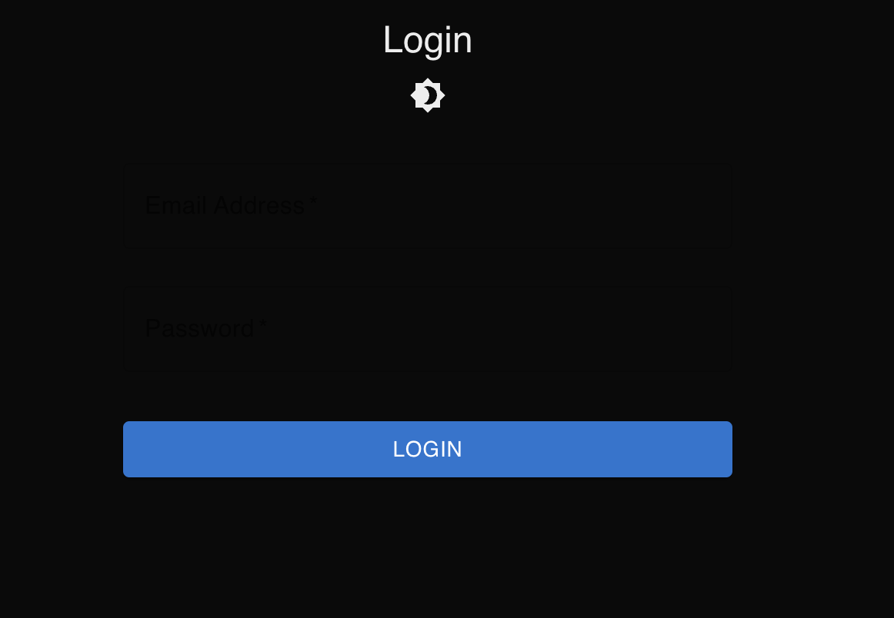
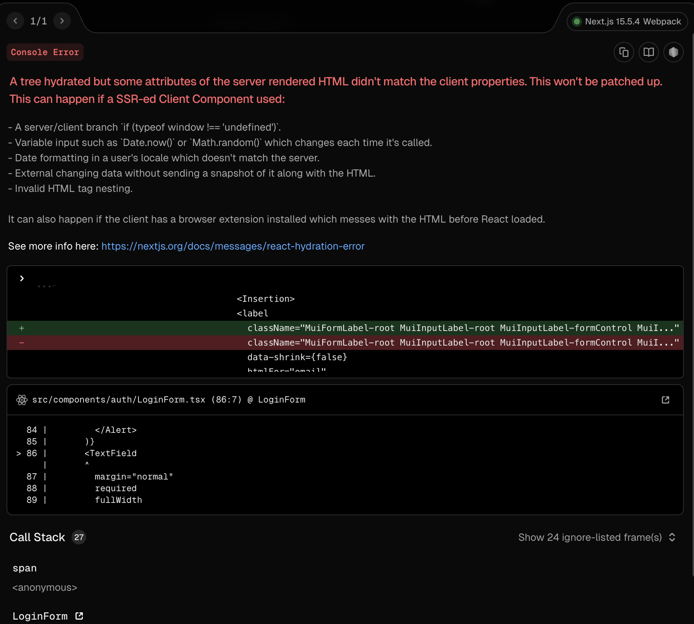
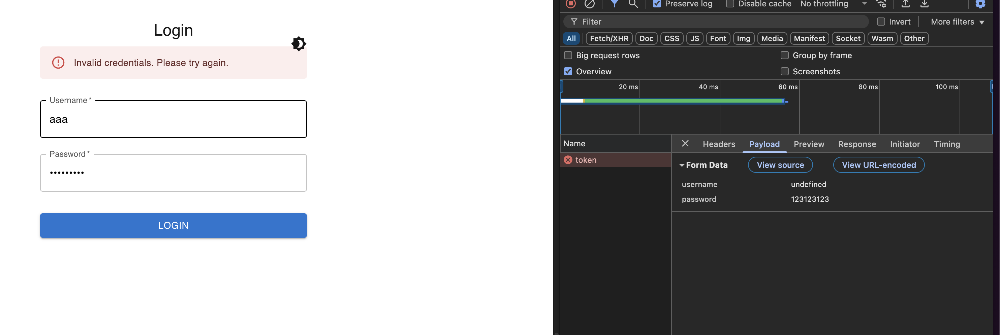
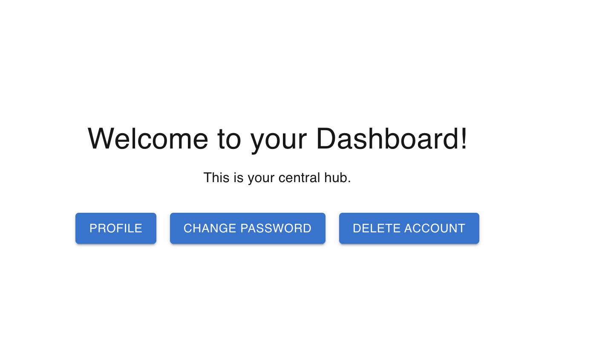
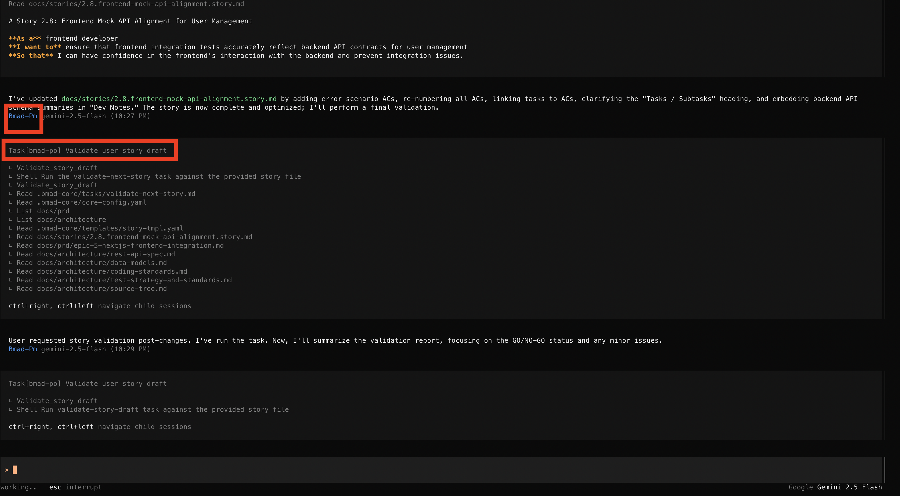

import darkMode from './dark-mode.gif';

上一篇雖然前端都開發完了，網頁也打得開，但是只有皮而已，Dark mode顏色看不到，登入根本登入不了，登入導不過去註冊，以及很多大大小小操作上的問題。
受不了了！今天的review就來把這些問題修一修吧。

{/*<!-- more -->*/}

### TOC

### 先修好dark mode

先找PO，我先跟他抱怨我一打開是黑的，看不到輸入框，然後請他根據Epic 5去加入dark mode的功能。

> @initial-page.png I can't see any input when I open the login page. I want to be able to toggle between dark and light mode, so please check epic 5 and help create a story

霹哩啪啦就產生了 `2.7.dark-mode-toggle.story.md` ，接著也很順利直接找 Dev 進行開發，最後找 QA 順利review完。很順利地失敗了。
因為他不會自己跑的關係，不知道實際錯誤在哪，我就一步一步跟他說哪裡有錯，請他幫我修正

**hydrated-error**

因為dark mode會吃localStorage，在server端執行沒吃到localStorage的時候，server跟client端render的不一樣，就會產生hydrated-error。我還要截圖跟他說hydrated error是什麼，還好講完他有順利修復。
不過login page的toggle位置有點醜，眼看目前沒有Nav header bar，就先不調整了。

### 改 API error 跟 mock testing

這部分最大的問題就是沒有去align後端的設計，因為我們先開發後端、才開發前端，又不是同個session開發完，他才會有些記憶斷層。

> Check backend @user-management-service project and review @nextjs-frontend project first, and then modify all rtk query to fit backend api endpoint payload. Please create a new story to do this.

`2.8.frontend-mock-api-alignment.story.md`產生！這邊就單純很多，他寫這種遵照文件的內容還是很穩的。改code, 改測試一氣呵成。不過最後還是有API欄位吃錯，還是截圖跟他抱怨一下。

> 這邊也有很經典、最近很熱的AI資安問題 明碼傳密碼

### navigation

當初也是沒定義好需要的flow，導致第一個版本有很多navigation的問題，清楚地列給他，還要考慮nextjs + mui Link整合的注意事項。

> I need to create a story to handle routing between pages. this is a requirement list
>
> 1.  Login and register page can go back and forth by an link
> 2.  There is no dashboard index page when login successfully, create it
> 3.  dashboard can go to profile, delete-account, and change-password page
>     `IMPORTANT: follow https://stackoverflow.com/questions/66226576/using-the-material-ui-link-component-with-the-next-js-link-component/74419666#74419666 to integrate Nextjs link with Material-ui link`

這也是很順利沒什麼大腦，當然也是沒什麼美感，也是沒什麼東西給他抄，就順便觀察看看他能做到什麼程度了。

> 想看project的可以來這邊：https://github.com/josephMG/bmad-method-projects

### Conclusion

今天在修完這三個story後也差不多告一個段落，我也是Gemini CLI + opencode交互使用，opencode我最喜歡的還是他會直接找agent處理接下來的task，而且切換agent也很方便，`tab`就可以換人、`F2`還可以快速轉換模型。下面就是渣自己去assign agent的轉換過程。

今天到這邊就結束囉，喜歡我文章的再幫忙推廣一下喔！
