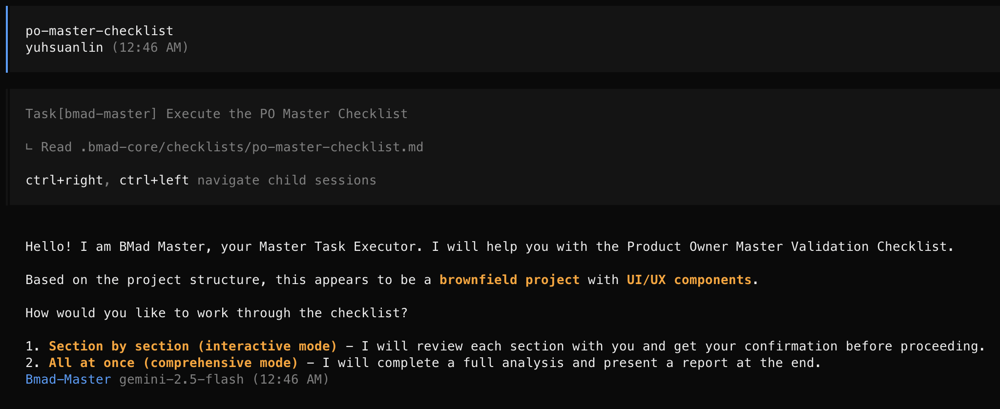

燒了好幾天專案的腦袋，今天明天讓腦子冷靜一下，我們來介紹兩個比較特殊、更高層次、負責管理或協調角色的 Agent：`meta agent`
先來認識一下他們的差異 **(from Gemini)**

| 類型       | 職責                                                                    | 例子                                      |
| ---------- | ----------------------------------------------------------------------- | ----------------------------------------- |
| 專門 Agent | 在單一領域擁有深厚的專業知識和技能，負責具體的執行工作。                | dev（寫代碼）、qa（做測試）、pm（寫 PRD） |
| Meta Agent | 負責管理、協調其他 Agent 或具備跨領域的通用能力，專注於流程和宏觀控制。 | bmad-orchestrator, bmad-master            |

### TOC

### Master Agent

Master Agent是一個什麼都會的角色，他全面且通用，精通所有`專門Agent`會執行的任務，如果不知道要做什麼，找他就對了。

這樣講有點玄，來看看他到底有什麼用途：

- BMad-Method的所有事他都懂
  - Task: 他知道所有的任務（**create-story**, **document-project**）
  - Template: 他了解跟熟悉所有樣板（**prd**, **architecture**）
  - Checklist: 他也會所有的檢查清單（**story-checklist**, **architect-checklist**）
- 可以請他做任何事
  - 因為他上面的都懂，所以你請他`建立需求文件`，他就會幫你create-doc, 產生prd
- 找他就對了
  - 你可以想像他是一個搞過技術、寫過測試、管過專案、建過架構、還畫過設計的人。

也就因為他會BMad-Method的所有東西，所以他有一個`KB (Knowledge Base)`開關，當我們輸入 `KB` 把它打開時，他會替我們解答所有BMad-Method的問題。



看看Gemini給的總結：

> BMad Master Agent 是 BMAD-METHOD 的大腦和指揮中心。它的設計目標是自動化和簡化軟體開發流程，將複雜的、多步驟的工作流（Workflows）轉化為您可以通過簡單命令來驅動的自動化任務。它通過協調一系列專業化的資源，確保了開發過程的一致性、標準化和高效率。

### Knowledge Base (KB 知識庫)

相信我，打開`bmad-master.md`看了半天還是看不懂他的 [KB](https://github.com/bmad-code-org/BMAD-METHOD/blob/main/bmad-core/data/bmad-kb.md) 到底是什麼，要來去`bmad-core/data/bmad-kb.md`才找得到。他像是一本`操作手冊`，裡面記錄了大大小小BMad-Method的所有事。先請Gemini給個總結：

```
 bmad-kb.md 文件來看，其內容非常豐富，涵蓋了：

   * BMAD 概覽：介紹其核心特性和適用場景。
   * 工作原理：解釋了 "Vibe CEO" 的概念、兩階段方法（規劃與開發）以及核心的開發循環。
   * 快速入門指南：如何在 Web UI 或 IDE 中開始使用。
   * 核心哲學：闡述了最大化 AI 槓桿、質量控制等指導原則。
   * Agent 系統：詳細介紹了每個核心 agent 和元 agent (meta agents) 的角色。
   * 工作流程：包括 Greenfield (新專案) 和 Brownfield (現有專案) 的完整開發流程。
   * 最佳實踐：關於文檔創建、環境選擇和質量保證的建議。
```

就是所、有、事。Master懂這些，把BMad-Method的這些倒背如流，才能以一擋百。

> 想看project的可以來這邊：https://github.com/josephMG/bmad-method-projects

### Conclusion

先介紹一個meta agent `Master Agent`，一個對於BMad-Method什麼都懂的人，不像我之前要換來換去，下次可以來試試靠他一人搞定全部（！

今天到這邊就結束囉，喜歡我文章的再幫忙推廣一下喔！
