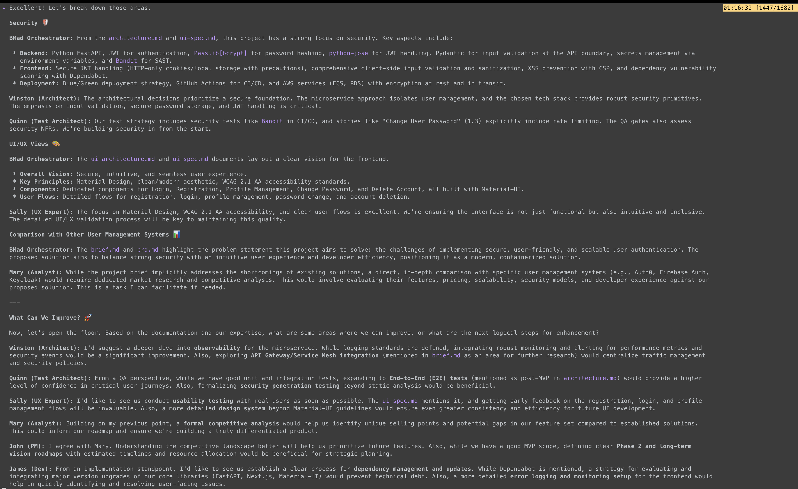

昨天講到orchestrator，他有個重要的指令我沒特別說，今天就來好好玩玩這個**Party mode**。

orchestrator發起的party就是叫大家來**開會**的意思，我們把議題丟出來，orchestrator會找需要的人去提意見。

一起來看看怎麼玩。

<!-- more -->

我拿先前user-management的專案，我們已經補完了所有story，今天來開個party看有什麼可以改善的地方。進入 `*party-mode` 以後我下一個prompt給他：

> Security, UI/UX views, and comparison with others user-management system, What can we improve?

對，安全性、UI/UX觀點、還有競品分析。丟了三個議題出來一次討論完，



- Architecture: 我想加上monitor, logging, alert去強化observability
- QA: 現在有單元測試、整合測試，應該可以再加上End-to-End testing去確保user journeys
- UX: 進行易用性測試、設計design system
- Analyst, PM: 對競品分析找出我們的特色
- Dev: 不要有技術債、同時要有詳細的 error logging and monitoring
- SM: 定期review lesson learned確保agile 有彈性而且有效率。

每個人都提出一點意見，orchestrator會先把大家的意見寫入 `improvement-plan.md` 裡，然後我們就直接讓 orchestrator 把他們都寫成story吧！

```shell
tree docs/stories/
docs/stories/
├── 1.1.user-registration-and-authentication.story.md
├── 1.2.implement-tdd-practices.story.md
├── 1.3.change-user-password.story.md
├── 1.4.update-user-profile-information.story.md
├── 1.5.delete-user-account.story.md
├── 2.1.nextjs-frontend-dockerization.story.md
├── 2.2.user-registration-frontend.story.md
├── 2.3.user-login-frontend.story.md
├── 2.4.user-profile-management-frontend.story.md
├── 2.5.change-password-frontend.story.md
├── 2.6.delete-user-account-frontend.story.md
├── 2.7.dark-mode-toggle.story.md
├── 2.8.frontend-mock-api-alignment.story.md
├── 2.9.frontend-routing-and-navigation.story.md
├── 3.1.implement-e2e-testing.story.md
├── 3.10.implement-frontend-error-logging-monitoring.story.md
├── 3.11.review-and-refine-workflow-definitions.story.md
├── 3.2.implement-observability-stack.story.md
├── 3.3.research-api-gateway-service-mesh.story.md
├── 3.4.define-security-penetration-testing-strategy.story.md
├── 3.5.plan-and-execute-usability-testing.story.md
├── 3.6.define-project-specific-design-system.story.md
├── 3.7.conduct-formal-competitive-analysis.story.md
├── 3.8.facilitate-product-roadmap-planning.story.md
└── 3.9.define-dependency-management-policy.story.md
```

我們一下就有了3.1-3.11這些story！沒事，沒有要開發，只是玩一下**party-mode** 而已。

這樣之後要開發對應的story就可以個別針對內容再去優化或改良，到時候就不需要orchestrator，而是直接下放給專門的agent了。

今天到這邊就結束囉，喜歡我文章的再幫忙推廣一下喔！
