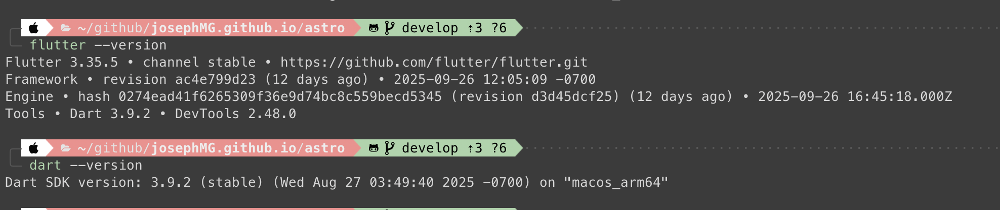
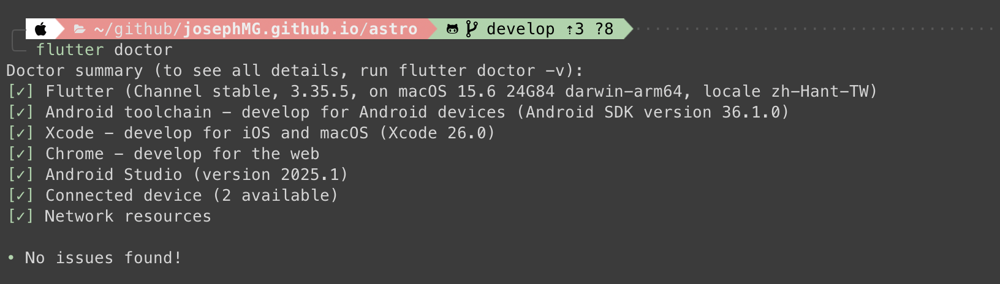

今天開始的系列要來寫一個記帳APP，先前有安裝好Xcode，這次來玩Flutter。為什麼選Flutter不選ReactNative呢？因為考量Flutter比起ReactNative對Android/iPhone的更靠近原生一些，再者Google發展的，他也會對一些Google的展品線有比較好的支援度。相比之下對於Meta生態系的ReactNative太多玩具可以玩，所以這次用Vibe coding來玩一下Flutter，再把一切記錄下來。

<!-- more -->

### TOC

這系列都是依照Flutter的安裝教學及跨平台整合教學操作的，沒有特別找其他resource，也不太需要Google半天。

### 安裝Flutter

> ref: https://docs.flutter.dev/install/manual

我不是用VS code，所以不走VS code安裝那一套，這邊是用手動安裝。因為我是Macbook M3，這邊就直接選擇`Apple Silicon (ARM64)` 這個zip檔案下載、解壓縮。我習慣把專案放在`~/development`底下，這邊就跑官網建議的指令：

```shell
$ unzip ~/Downloads/flutter_macos_3.29.3-stable.zip -d ~/development/
```

然後剛好我也是用zsh環境，就直接在`~/.zprofile`加上PATH

```shell
export PATH="$HOME/development/flutter/bin:$PATH"
```

就這樣重開terminal以後，輸入指令，就可以看到flutter / Dart 版本了。



### 安裝Android

> ref: https://docs.flutter.dev/platform-integration/android/setup

為了跑起Android Emulator或者在實體Android裝置上執行APP，我們要先安裝Android Studio，只要下載[Android Studio](https://developer.android.com/studio)就好。

但接下來要安裝Android SDK跟tools，這邊就會跑比較久，也比較麻煩。
[SDK-manager](./Android-SDK-Manager.png)
打開Android Studio的起始畫面，旁邊有三個點點，點下去可以打開`SDK Manager`，然後去Languages & Frameworks -> Android SDK 找到對應的工具安裝：

- SDK Platform
  - 找最新的API Level安裝，我安裝的是Android 16.0(Baklava) API Level 36.1，
- SDK Tools
  - Android SDK Build-Tools
  - Android SDK Command-line Tools
  - Android Emulator
  - Android SDK Platform-Tools

一個一個`Apply`套用並安裝，可能要跑一陣子，安裝好以後要跑個docker，我們要accept licenses

```shell
$ flutter doctor --android-licenses
```

都Accept以後就完成這步驟了。

[SDK-manager](./Android-SDK-Manager.png)
接下來我們再回來這個畫面，這次選`Virtual Device Manager`，我開了一個Medium Phone，選`Google APIs ARM 64 v8a System Image`，最後在`Additional settings`裡的`Emulated Performance`選擇`Hardware`硬體加速。

這樣子模擬器就建立完成了。再跑一次 doctor看有Android的部分有沒有問題

```shell
$ flutter doctor

[✓] Android toolchain - develop for Android devices (Android SDK version 36.1.0)
[✓] Android Studio (version 2025.1)
```

這樣就好了，執行 `flutter emulators && flutter devices` 應該可以跑起Android模擬器。

### 安裝Xcode

> ref: https://docs.flutter.dev/platform-integration/ios/setup

接下來安裝Xcode，但我們[Day-5](./day-5-bmad-method-with-opencode-ios-calculator)跟[Day-6](./day-6-bmad-method-with-opencode-ios-calculator-v2)有跑過iOS案子，所以這邊不用特別安裝，不然也只是按照指令安裝而已。
不過這邊最後提到 `Install CocoaPods` 的步驟，我是用 [asdf](https://asdf-vm.com/) 跑Version Manager，所以裝ruby跟cocoapod是透過下面指令

```shell
$ asdf plugin add ruby
$ asdf install ruby latest
$ asdf global ruby 3.4.6
$ gem install cocoapod
```

都要等一下，跑完以後就差不多了。執行 `open -a Simulator` 有看到模擬器就成功了。
最後來看一下doctor!



### Conclusion

大功告成，今天只是安裝，沒有什麼太難的內容，就是要等、要下載而已。明天就來讓BMad-method開跑新的案子吧。
今天到這邊就結束囉，喜歡我文章的再幫忙推廣一下喔！
