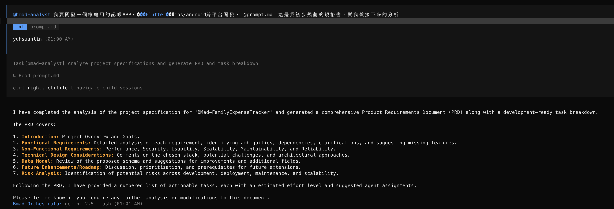
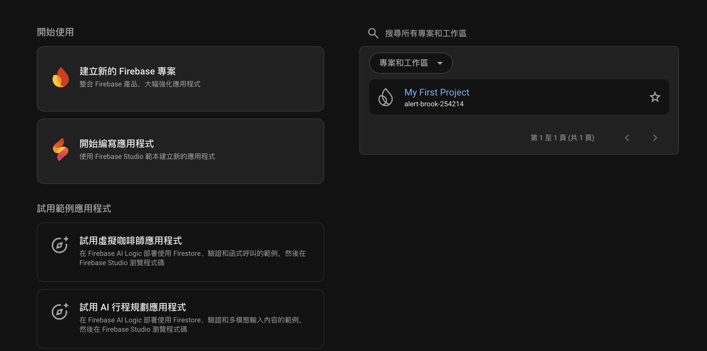
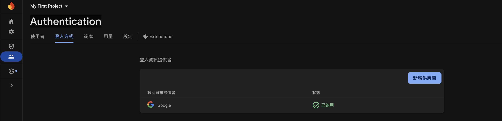

不免俗的這篇還是要先來產規格書，我們就先讓ChatGPT生出一個BMAD-Method的prompt，再讓BMAD-Method analyst agent去執行。

```shell
# ChatGPT prompt
https://github.com/bmad-code-org/BMAD-Method
你是一個BMad-Method Universal AI Agent Framework 的Prompting 專家

```

<!-- more -->

### TOC

```shell
我要用BMad-method開發一個全新的Flutter專案，可以跨ios/android雙平台，專案是家庭用的記帳APP，目前有圖中這些分類，日後可以新增刪除修改，然後會把記帳內容存入google sheet，方便共同存取。以下是我初步規劃的專案功能：
1. 記帳APP 要用Flutter支援 ios/android雙平台
2. 記帳category可以在google sheet上新增、刪除、修改，同時把所有Category存在google sheet第一個tab, named: Category
3. 每個月的內容存於ㄧ個google sheet tab裡，named YYYY-MM （以年月命名）
4. 記帳內容包含 時間、名稱、類別(category)、金額，要可以新增、刪除、修改。
5. 記帳列表列出當月的花費的項目、名稱、類別、金額，以及計算並顯示當月總消費
6. 記帳列表可以瀏覽上個月的支出，要有月份的navigator，
7. 記帳列表要可以選要瀏覽月份

請幫我把這份需求寫成BMad-Method agent看得懂的prompts，以Markdown format呈現，我要讓 BMad-method analyst分析、建立文件
```

把它產出的prompt存入 prompt.md檔以後，再切回opencode去執行。


我這次直接讓指揮家`Orchestrator`讀這prd，他直接assign `Analyst` agent去產生prd，然後洋洋灑灑地列出15個task:

```markdown
1.  **Project Setup & Core Dependencies**
    - **Task:** Initialize Flutter project, configure `pubspec.yaml` with core dependencies (e.g., `http`, `provider`/`riverpod`, `google_sign_in`, `googleapis_auth`, `googleapis`).
    - **Effort:** Small
    - **Agent:** @bmad-dev
2.  **Google OAuth Integration**
    - **Task:** Implement Google OAuth for user authentication, ensuring secure token storage and refresh mechanisms.
    - **Effort:** Medium
    - **Agent:** @bmad-dev, @bmad-architect (for security review)
3.  **Google Sheets API Client & Data Layer**
    - **Task:** Develop a service/repository to interact with Google Sheets API (read/write). Implement methods for fetching categories, reading monthly expenses, and writing/updating/deleting expense records.
    - **Effort:** Large
    - **Agent:** @bmad-dev, @bmad-architect (for API design)
4.  **Category Management Implementation**
    - **Task:** Implement logic to read categories from the `Category` sheet. Handle `ColorCode` parsing and display. Implement basic validation for category data.
    - **Effort:** Medium
    - **Agent:** @bmad-dev
5.  **Monthly Tab Management**
    - **Task:** Implement logic to check for existing `YYYY-MM` tabs and automatically create new ones if they don't exist when a user navigates to a new month.
    - **Effort:** Medium
    - **Agent:** @bmad-dev
6.  **Expense Record Data Model & CRUD Operations**
    - **Task:** Define Flutter data models for `ExpenseRecord`. Implement CRUD operations (Add, Edit, Delete) that interact with the Google Sheets API, including generating and managing `RecordID` (UUID) for each expense.
    - **Effort:** Large
    - **Agent:** @bmad-dev
7.  **Expense List UI**
    - **Task:** Design and implement the UI for displaying the current month's expense list, including date, name, category, amount, and monthly total. Implement sorting by date.
    - **Effort:** Medium
    - **Agent:** @bmad-ux-expert, @bmad-dev
8.  **Swipe-to-Delete & Long-Press-to-Edit UI/Logic**
    - **Task:** Implement swipe-to-delete functionality for expense records with confirmation. Implement long-press-to-edit, opening an edit form/dialog.
    - **Effort:** Medium
    - **Agent:** @bmad-ux-expert, @bmad-dev
9.  **Month Navigation UI**
    - **Task:** Develop the month navigator UI component (previous/next buttons, month picker). Implement logic to load data for the selected month.
    - **Effort:** Medium
    - **Agent:** @bmad-ux-expert, @bmad-dev
10. **Manual Sync & Refresh Mechanism**
    - **Task:** Implement a manual refresh mechanism (e.g., pull-to-refresh or a dedicated button) to re-fetch data from Google Sheets.
    - **Effort:** Small
    - **Agent:** @bmad-dev
11. **Error Handling & User Feedback**
    - **Task:** Implement robust error handling for API calls and network issues. Provide clear user feedback for success/failure of operations and sync status.
    - **Effort:** Medium
    - **Agent:** @bmad-dev, @bmad-ux-expert
12. **Initial Data Model Enhancements (Hidden Columns)**
    - **Task:** Modify the data layer to include `RecordID`, `RecordedBy`, `CreatedAt`, `LastModified` as hidden columns in Google Sheets for new records.
    - **Effort:** Medium
    - **Agent:** @bmad-dev, @bmad-architect
13. **Unit & Widget Testing**
    - **Task:** Write unit tests for data models, services, and state management logic. Write widget tests for key UI components.
    - **Effort:** Large (ongoing)
    - **Agent:** @bmad-dev, @bmad-qa
14. **Integration Testing**
    - **Task:** Develop integration tests to verify end-to-end flows, especially involving Google Sheets API interactions.
    - **Effort:** Medium
    - **Agent:** @bmad-dev, @bmad-qa
15. **Documentation**
    - **Task:** Document API usage, data models, state management patterns, and deployment steps.
    - **Effort:** Medium (ongoing)
    - **Agent:** @bmad-dev, @bmad-architect
```

生成了這麼多個task，也請他一起找人產出docs,

```shell
$ tree docs/
docs/
├── architecture
│   ├── coding-standards.md
│   ├── family-expense-tracker-architecture.md
│   ├── source-tree.md
│   └── tech-stack.md
├── prd
│   └── family-expense-tracker-prd.md
├── qa
│   └── gates
│       └── family-expense-tracker.google-oauth-integration.yml
└── stories
    ├── 1-application-platform.md
    ├── 10-google-sheet-sync.md
    ├── 2-google-oauth-integration.md
    ├── 4-category-management.md
    ├── 5-monthly-data-structure.md
    ├── 6-expense-record-format.md
    ├── 7-expense-list.md
    └── 9-month-navigation.md
```

但說實在請他請人產出的文件**很不齊全**，還要真的再找對應的窗口再去validate一次。我這邊就遇到幾個問題

1. 沒有產生architecture文件
2. 沒有story，導致做完task不知道要去哪更新
3. story產出但內容空泛、跟template不合

也就是幾乎都重新review + validate了一輪。

今天也一次把專案跑起來、然後做完story 2 串上google oauth。

雖然說是Vibe coding，但還是不要想得太過美好，就算是Vibe coding，有些東西還是要自己去手工做一下，像是這邊要先開firebase專案、設定google登入。



> 很久沒用firebase，發現他現在變得很華麗，還有[firebase studio](https://studio.firebase.google.com/)可以直接生成程式碼，跟[replit](https://replit.com/)和[lovable](https://lovable.dev/)滿像的。

打開firebase，要建立android跟ios的app，然後在firebase的登入方式裡啟用google登入


這過程中我還是遇到了三個問題

1. Firebase google_sign_in失敗：
   這邊後來Gemini幫我塞了log，讓我把log截圖給他 他告訴我Android少了sha-1
2. android signingReport / keytool
   建立`sha-1`又發生keytool找不到，後來去AndroidStudio底下找 `Contents/jbr/Contents/Home/bin/keytool` 手動跑一次，然後貼上firebase
3. XCode reversed_client_id
   這邊重新把xcode package bundle ID貼上去就好，重新載一次 `GoogleService-Info.plist` 就好

是不容易，但少了很多coding的時間，也是賺很大。都設定完以後我們只要 `flutter run` 就可以執行囉。

> 想看project的可以來這邊：https://github.com/josephMG/bmad-method-projects

### Conclusion

今天建立完專案，說實在我還是完全搞不懂Dart, Flutter。但他一切都跑得很順，也是BMad-Method用的越來越上手了。一次跑起兩個平台實在是很驚艷。比以前PhoneGap的順暢多了。

今天到這邊就結束囉，喜歡我文章的再幫忙推廣一下喔！
