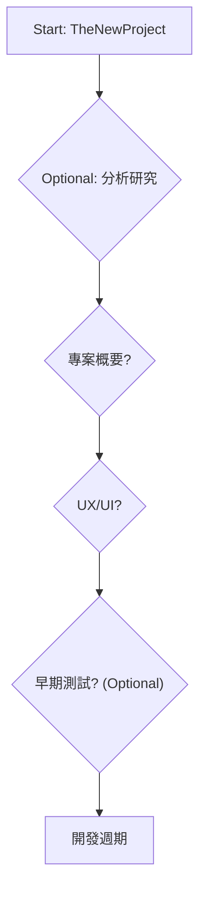

這是自發性的連續寫30篇教學文章，不是很想把文章發在ithelp，來這邊挑戰一下自己寫30天[BMAD-Method](https://github.com/bmad-code-org/BMAD-METHOD/tree/main)相關的技術文章，預計會用BMAD-Method做各種不擅長的專案。期間可能會視情況購置需要的AI agent plans，可能是Claude Code, OpenAI, 或Gemini都說不定，看token燃燒速度而定。

第一篇先來介紹介紹`BMAD-Method`這個 AI Agent Framework吧。

### TOC

<!-- more -->

### 基本介紹

常用ChatGPT的都知道，我們常常需要假定AI成為某領域專家、或者喂給他事先準備好的海量資料給他讀(RAG)，這樣AI agent才不會在他廣泛的知識庫裡迷航。這種方法像是現在1對1的家教一樣，一次只能管理一個AI agent。接著，就有專門的`cursorrule`去定義各式各樣的[roles](https://cursorrules.org/)，可以根據不同語言不同技術產生cursorrule template。然後就出現了[Subagents](https://docs.anthropic.com/en/docs/claude-code/sub-agents)跟[agents.md](https://agents.md/)，每個agent都有他自己的專業領域、能力及工具，他們也可以互相傳遞工作。

> From: https://docs.anthropic.com/en/docs/claude-code/sub-agents
>
> Subagents are pre-configured AI personalities that Claude Code can delegate tasks to. Each subagent:
>
> - Has a specific purpose and expertise area
> - Uses its own context window separate from the main conversation
> - Can be configured with specific tools it’s allowed to use
> - Includes a custom system prompt that guides its behavior

BMAD-Method恰恰就是這個概念，他把上面的事情整合在一起：

1. 很多定義好的team
2. 很多定義好且不同領域專家的角色
3. 我需要做什麼的時候，引入整個team或單一角色。

### 工作流workflow

除此之外，他還把Agile敏捷開發的概念也引入進來，讓agent與agent之間的交付更有規章也更讓大家熟悉，我們來看看下面這張流程圖：

> 詳細可以看這裡：https://github.com/bmad-code-org/BMAD-METHOD/blob/main/docs/user-guide.md#the-planning-workflow-web-ui-or-powerful-ide-agents

每個跑過Agile / Scrum的團隊應該都差不多，從 `Analyst Research` 到 `Project Brief`，然後交付給 `UI/UX`，最後`Documents Aligned`之後進入開發`Dev Cycle`。
接著就是一個sprint一個sprint的循環。

### 角色

最後我們來看看各個定義好的角色：

> 下表為ChatGPT生成，prompt:
>
> https://github.com/bmad-code-org/BMAD-METHOD/tree/main/bmad-core/agents
> 幫我介紹BMAD-Method裡面這些角色的功用

| 角色名稱              | 英文名稱                                    | 核心責任 / 功用                                                                 | 典型使用時機                               |
| --------------------- | ------------------------------------------- | ------------------------------------------------------------------------------- | ------------------------------------------ |
| **Analyst**           | Business Analyst                            | 做市場調研、競品分析、需求蒐集與創意發掘，產出 project brief 來幫助定義專案方向 | 專案剛開始，需要收集與整理需求、探索方向時 |
| **Architect**         | Architect                                   | 設計技術/系統架構，從 PRD 中規劃模組、API、資料庫與整體系統架構                 | 需求明確後，需要落實到技術架構階段         |
| **PM**                | Product Manager                             | 管理產品策略與需求文件 (PRD)，拆解 epics / user stories，設定優先順序           | 決定要做哪些功能、排定優先順序時           |
| **PO**                | Product Owner                               | 維護並排序 backlog，驗證 user stories 是否符合方向與品質標準                    | 開發過程中，確保開發團隊執行正確的功能     |
| **SM**                | Scrum Master (Story Preparation Specialist) | 將大型需求或 epics 拆成可開發的 user stories，補充驗收標準與背景                | 規劃轉入開發階段前，準備故事與任務時       |
| **Developer (Dev)**   | Developer                                   | 撰寫程式碼、實作 user story、修 bug，完成具體功能                               | 有明確 user story 可以著手開發時           |
| **QA**                | Test Architect & Quality Advisor            | 設計測試案例、評估非功能性需求，審查成果是否符合驗收標準                        | 功能完成後進行驗收，或開發中確保品質       |
| **UX Expert**         | UX-Expert                                   | 提供使用者體驗與前端設計建議，產出 UX spec 或 UI 規範                           | 專案需要 UI/UX 規劃與互動設計時            |
| **BMAD Orchestrator** | Orchestrator                                | 核心協調者，監督 agent 流程，分派任務並維持從需求到測試的順暢交接               | 整體流程中保持一致性與協調                 |
| **BMAD Master**       | Master agent                                | 全域總控者，能生成文件、檢查 checklist 或發起任務                               | 需要跨角色的總體檢查或指令下達時           |

到這邊介紹完基本的BMAD-Method了，期待明天開始安裝跟上機演練。

### References:

- BMAD-Method: https://github.com/bmad-code-org/BMAD-METHOD/tree/Machine
- Subagent: https://docs.anthropic.com/en/docs/claude-code/sub-agents
- Agents.md: https://agents.md/
