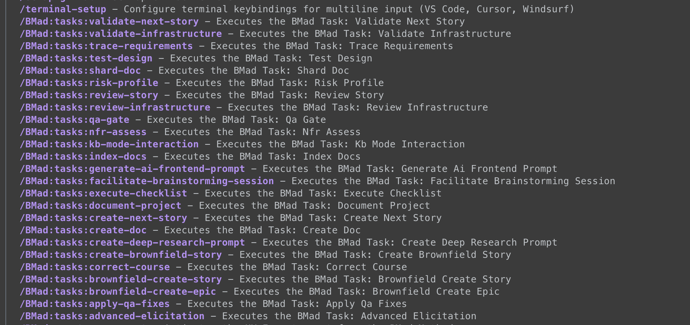

今天要講的是task，他們其實就是一個一個的command，在Gemini裡面可以透過 `/BMAD:tasks` 去執行他們，tasks很多，內容都不太一樣，讓我們來深入看看這23個tasks。

<!-- more -->



### TOC

### advanced-elicitation

#### Purpose

提供可選的思考和腦力激盪行動去提高內容品質、同時透過結構化的思考方式去幫助使用者更深入的思考

#### Usage Scenarios

文件的建立及一般具有啟發性的思考

#### Task Instructions

具有智慧方法的選擇 --> 段落性上下文的審查 --> 啓發性選項的呈現 --> 方法執行的框架結構(process and guideline)

### apply-qa-fixes

#### Purpose

在QA review完以後，讓Dev根據QA review的結果以及 gates 的內容做進一步的修復跟調整。

#### Input

執行指令時需要的參數

#### QA Sources to Read

gates 跟 assessments 的路徑與檔名pattern

#### Prerequisites

預設用來執行lint 跟 test的命令

#### Process (Do not skip steps)

跑review-qa一定要執行的步驟跟要遵守的內容，不可跳過或忽略任何一步

#### Blocking Conditions

被blocking的條件，像是沒有`story_id`就不要執行。

#### Completion Checklist

完成時要自我檢查的check list

#### Key Principles

讓Dev知道關鍵的原則，不要打破這些rule

### brownfield-create-epic

#### Purpose

對現有的專案建立epic跟story的task，其中有建議epic應該是1-3個story可以完成的。

#### When to Use This Task

這段說明了使用時機，以及什麼時候要升級到使用create full brownfield PRD/architecture。

#### Instructions

對此任務的指示: 進行專案分析(Project Analysis)、 建立Epic(Project Analysis)、 驗證checklist(validation checklist)、 交手Story manager進行開發

#### Success Criteria

定義一些成功準則跟驗收標準

#### Important Notes

這邊寫下執行這個task要注意的事情。

### brownfield-create-story

這部分跟上面類似，但顆粒度較小(就是非常小。對現有的專案建立story的task，其中有建議如果超過1個story可以完成的，建議使用epic。

### correct-course

#### Purpose

當專案有變更時，重新分析對epic, stroy, 跟MVP的影響，並列出可行性方案

#### Instructions

包含了初始設定與模式選擇、執行列表清單分析、擬出變更建議、生成及編輯sprint變更方案、定案與制定下一步驟。

#### Output Deliverables

定義輸出時要交付的文件及格式

### create-brownfield-story

看起來跟上面 **brownfield-create-story** 有點類似，但實際上還是有點差異：

- brownfield-create-story 是任務的定義和內容。
- create-brownfield-story 是一個執行該任務的命令。

#### Purpose

是一個專門設計的任務，也能將各種現有文件格式(像是專案文件輸出、PRD、史詩或使用者文件) 轉化為Dev開發代理可執行的故事。

#### When to Use This Task

定義了哪時候該用這個task、哪時候該使用 `create-next-story`

#### Task Execution Instructions

任務的執行說明。包含 文件化上下文、識別stroy及上下文收集、萃取技術性的上下文資訊、逐步收集細節以創建story、生成任務、風險評估、story驗證、定義story格式、最後交付及提供交付資訊

#### Success Criteria

定義完成準則

#### Important Notes

執行此任務時的注意事項、避免自己產生幻覺自己腦補。

### create-deep-research-prompt

#### Purpose

能夠處理來自腦力激盪會議、專案簡報、市場研究或特定研究問題的輸入，然後生成針對更深入調查的目標prompt。

#### Research Type Selection

給使用者選擇要研究的選項、對使用者輸入處理

> 研究方法分成：產品驗證研究、市場機會研究、使用者與客戶研究、競爭情報研究、技術與創新研究、產業與生態系統研究、戰略選項研究、風險與可行性研究、險與可行性研究

#### Process

定義研究提示結構、生成prompt、審查並細化定義、最後提出下一步指導建議。

---

> 下方內容請gemini根據上面格式產生

```shell
# prompt
@index.md
請依照這個markdown內容介紹BMAD-method task的方式，介紹下面幾個task

     - create-next-story.md
     - document-project.md
     - execute-checklist.md
     - facilitate-brainstorming-session.md
     - generate-ai-frontend-prompt.md
     - index-docs.md
     - kb-mode-interaction.md
     - nfr-assess.md
     - qa-gate.md
     - review-story.md
     - risk-profile.md
     - shard-doc.md
     - test-design.md
     - trace-requirements.md
     - validate-next-story.md

task內容在@.bmad-core/tasks/。
IMPORTANT: 我不要太詳細的介紹、依照@index.md 裡其他task格式介紹就好
```

### create-next-story

#### Purpose

根據專案進度和 Epic 定義，識別下一個邏輯故事，並準備一份全面、獨立且可執行的故事文件，確保故事包含所有必要的技術背景、需求和驗收標準，以便開發代理高效實施。

#### Instructions

包含載入核心配置、識別下一個要準備的故事、收集故事需求和先前的故事背景、收集架構背景、驗證專案結構對齊、使用完整上下文填充故事模板，以及故事草稿完成和審查。

### document-project

#### Purpose

為現有專案生成全面的文件，以優化 AI 開發代理。此任務創建結構化的參考資料，使 AI 代理能夠理解專案上下文、慣例和模式，從而有效地為任何程式碼庫做出貢獻。

#### Task Instructions

包含初始專案分析、深入程式碼庫分析、核心文件生成，以及文件交付。

### execute-checklist

#### Purpose

提供根據檢查清單驗證文件的說明。代理必須遵循這些說明，以確保對文件進行徹底和系統的驗證。

#### Instructions

包含初始評估、文件和工件收集、檢查清單處理、驗證方法、部分分析，以及最終報告。

### facilitate-brainstorming-session

#### Purpose

與用戶進行互動式腦力激盪會議。在應用技術時要富有創造性和適應性。

#### Process

包含會議設置、提出方法選項、互動式執行技術、會議流程、文件輸出（如果要求），以及關鍵原則。

### generate-ai-frontend-prompt

#### Purpose

生成一個精湛、全面且優化的提示，可用於任何 AI 驅動的前端開發工具（例如 Vercel v0、Lovable.ai 或類似工具），以搭建或生成前端應用程式的重要部分。

#### Key Activities & Instructions

包含核心提示原則、結構化提示框架，以及組裝主提示。

### index-docs

#### Purpose

透過掃描所有文件檔案並確保它們已正確索引並附有描述，維護 `docs/index.md` 檔案的完整性和完整性。它處理根級文件和子資料夾中的文件，並將它們分層組織。

#### Task Instructions

包含定位和掃描、解析現有條目、提取文件資訊、處理缺失或不存在的文件，以及更新 `docs/index.md`。

### kb-mode-interaction

#### Purpose

提供一個用戶友好的介面，讓用戶無需一開始就被大量資訊淹沒。

#### Instructions

包含歡迎和引導、呈現主題領域、上下文回應、互動式探索，以及優雅地退出。

### nfr-assess

#### Purpose

評估故事的非功能性需求，並生成：1. 門控檔案的 `nfr_validation` 部分的 YAML 區塊，2. 簡短的 Markdown 評估報告，儲存到 `qa.qaLocation/assessments/{epic}.{story}-nfr-{YYYYMMDD}.md`。

#### Process

包含缺少輸入的故障保護、引導範圍、檢查閾值、快速評估，以及生成輸出。

### qa-gate

#### Purpose

根據審查結果創建或更新故事的品質門控決策文件。此門控作為團隊了解品質狀態的諮詢檢查點。

#### Prerequisites

故事已審查（手動或透過 review-story 任務）、審查結果可用、了解故事需求和實施。

#### Gate Decision Criteria

包含 PASS、CONCERNS、FAIL 和 WAIVED 的決策標準。

### review-story

#### Purpose

執行全面的測試架構審查，並做出品質門控決策。這種適應性、風險感知型審查會創建故事更新和詳細的門控文件。

#### Prerequisites

故事狀態必須為「審查」、開發人員已完成所有任務並更新了文件列表、所有自動化測試都已通過。

#### Review Process - Adaptive Test Architecture

包含風險評估、全面分析、主動重構、標準合規性檢查、驗收標準驗證、文件和註釋。

### risk-profile

#### Purpose

使用機率 × 影響分析為故事實施生成全面的風險評估矩陣。

#### Risk Analysis Process

包含風險識別、風險評估、風險優先級排序，以及風險緩解策略。

### shard-doc

#### Purpose

將大型文件根據二級標題拆分為多個較小的文件、創建資料夾結構來組織分片文件，並維護所有內容的完整性，包括程式碼區塊、圖表和 Markdown 格式。

#### Primary Method: Automatic with markdown-tree

優先使用 `md-tree explode` 命令進行自動分片。

#### Manual Method (if @kayvan/markdown-tree-parser is not available or user indicated manual method)

包含識別文件和目標位置、解析和提取部分、創建單獨的文件、創建索引文件、保留特殊內容，以及驗證。

### test-design

#### Purpose

為故事實施創建全面的測試場景，並提供適當的測試級別建議。這確保了高效的測試覆蓋率，同時避免冗餘並保持適當的測試邊界。

#### Process

包含分析故事需求、應用測試級別框架、分配優先級、設計測試場景，以及驗證覆蓋率。

### trace-requirements

#### Purpose

將故事需求映射到測試案例，使用 Given-When-Then 模式進行全面的可追溯性。

#### Traceability Process

包含提取需求、映射到測試案例、覆蓋率分析，以及差距識別。

### validate-next-story

#### Purpose

在實施開始之前全面驗證故事草稿，確保其完整、準確並提供足夠的上下文以成功開發。此任務識別需要解決的問題和差距，防止幻覺並確保實施準備就緒。

#### SEQUENTIAL Task Execution (Do not proceed until current Task is complete)

包含載入核心配置和輸入、模板完整性驗證、文件結構和源代碼樹驗證、UI/前端完整性驗證（如果適用）、驗收標準滿意度評估、驗證和測試說明審查、安全考慮評估（如果適用）、任務/子任務序列驗證、反幻覺驗證、開發代理實施準備就緒，以及生成驗證報告。

### Conclustion

真的是有點多，很多task要用到才會理解，這三個專案跑起來其實也用了將近8成，再回來看task就很容易理解他為什麼這麼做了。
今天到這邊就結束囉，喜歡我文章的再幫忙推廣一下喔！
