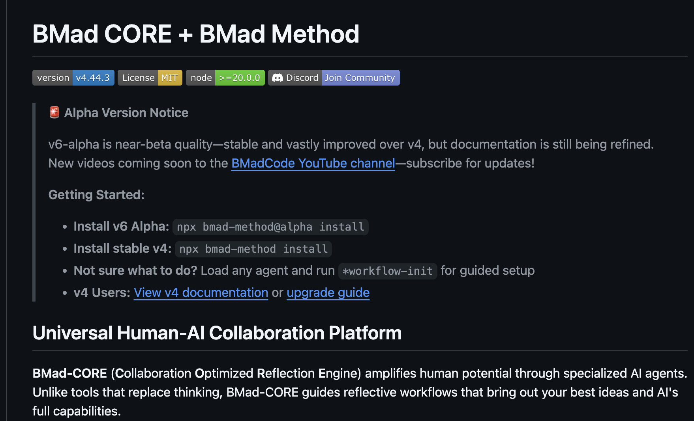

import { YouTube } from 'astro-embed';


在幾個禮拜前，[BMAD-Method v6 alpha](https://github.com/bmad-code-org/BMAD-METHOD)已經推出了，寫到這時候剛好看他推出新內容，又有題材可以加進來！這幾天來大概跑一下V6 alpha有哪些更新，同時我[Day 18 記帳app](./day-18-bmad-method-accounting-app-flutter-2)開發也即將進入尾聲，過幾天也可以整理上來了。



{/*<!-- more -->*/}

### TOC

<YouTube id="6LtrJD5Dz40" title="BMAD-Method v6 alpha" />
這部影片隆重介紹了BMAD-Method v6 alpha即將推出，他大致介紹了5個重要更新：Scale Adaptive Framework, BMad Core, Project Types & Reference Architectures, BMAD Builder
先順著講這五個大feature吧！

### 規模自適應框架 (Scale Adaptive Framework)
> https://github.com/bmad-code-org/BMAD-METHOD/blob/main/src/modules/bmm/docs/scale-adaptive-system.md

這次把story數量劃分為5個等級，每個等級產出不同量級的文件，並大致規劃了完成時間


| Level | Scope                | Stories | Documentation       |Keywords| Timeline |
| ----- | -------------------- | ------- | ------------------- | ------ | -------- |
| **0** | Single atomic change | 1       | tech-spec only      |fix, bug, typo, small change, patch| Hours    |
| **1** | Small feature        | 1-10    | tech-spec + epic    |simple, basic, small feature, add, minor| Days     |
| **2** | Medium project       | 5-15    | PRD + optional arch |dashboard, several features, admin panel, medium| Weeks    |
| **3** | Complex integration  | 12-40   | PRD + architecture  |platform, integration, complex, system, architecture| Months   |
| **4** | Enterprise scale     | 40+     | Full methodology    |enterprise, multi-tenant, multiple products, ecosystem, scale| Quarters |


當執行 `workflow-init` 的時候會用三個方式評估專案大小
1. Keyword Analysis: 描述中是否有Level特定的關鍵字
2. Story Count Estimation: 根據story數量評估，有些level會有overlap則會再根據需求做選擇。
3. Complexity Indicators: 是否有其他額外的需求要考慮


### BMad C.O.R.E.
> https://github.com/bmad-code-org/BMAD-METHOD/tree/750024fb14a86816020caa9fdabd45d2235f1639?tab=readme-ov-file#v6-core-enhancements

是C.O.R.E也是core，BMad Core 與 Method 分離，提供更乾淨的核心引擎(engine)，讓方法論(method)可以用多種模組化插件擴充。
```markdown
- Collaboration: Human-AI partnership leveraging complementary strengths
- Optimized: Battle-tested processes for maximum effectiveness
- Reflection: Strategic questioning that unlocks breakthrough solutions
- Engine: Framework orchestrating 19+ specialized agents and 50+ workflows
```

BMad-CORE 這邊最後一句話很有意思
> BMad-CORE doesn't give you answers—it helps you discover better solutions through guided reflection.

### 自訂語言和自訂 Agent (Custom Language & Custom Agents)
> https://github.com/bmad-code-org/BMAD-METHOD/tree/750024fb14a86816020caa9fdabd45d2235f1639?tab=readme-ov-file#v6-core-enhancements
`v6-alpha`提供了更高彈性、更方便自定義的方法，可以自訂要跟BMad-Method溝通的語言、同時可以自訂自己的Agent

```
- Agent Customization - Modify names, roles, personalities via bmad/_cfg/agents/
- Multi-Language - Independent language settings for communication and output
- Personalization - Agents adapt to your name, skill level, and preferences
- Persistent Config - Customizations survive module updates
- Flexible Settings - Configure per-module or globally
```

可以看到從溝通語言、人格、module、到global setting，都可以定義你或你專案想要、需要的內容。

### 專案類型和參考架構 (Project Types & Reference Architectures)

> https://github.com/bmad-code-org/BMAD-METHOD/tree/750024fb14a86816020caa9fdabd45d2235f1639/src/modules/bmm/workflows/2-plan-workflows/prd
裡面的`project-types.csv`定義了10種project types，比v4多了更多。
同時，參考架構 (Reference Architectures)透過開放社群貢獻，可以讓greenfield更快從0到1、更快開發MVP

| project_type    | detection_signals                                      | key_questions                                                                                          | required_sections                                                                                   | skip_sections                          | web_search_triggers                           | innovation_signals                 |
|------------------|--------------------------------------------------------|--------------------------------------------------------------------------------------------------------|------------------------------------------------------------------------------------------------------|----------------------------------------|-----------------------------------------------|------------------------------------|
| api_backend      | API,REST,GraphQL,backend,service,endpoints            | Endpoints needed?; Authentication method?; Data formats?; Rate limits?; Versioning?; SDK needed?       | endpoint_specs; auth_model; data_schemas; error_codes; rate_limits; api_docs                        | ux_ui; visual_design; user_journeys    | framework best practices; OpenAPI standards   | API composition; New protocol      |
| mobile_app       | iOS,Android,app,mobile,iPhone,iPad                    | Native or cross-platform?; Offline needed?; Push notifications?; Device features?; Store compliance?   | platform_reqs; device_permissions; offline_mode; push_strategy; store_compliance                    | desktop_features; cli_commands         | app store guidelines; platform requirements   | Gesture innovation; AR/VR features |
| saas_b2b         | SaaS,B2B,platform,dashboard,teams,enterprise          | Multi-tenant?; Permission model?; Subscription tiers?; Integrations?; Compliance?                      | tenant_model; rbac_matrix; subscription_tiers; integration_list; compliance_reqs                    | cli_interface; mobile_first            | compliance requirements; integration guides   | Workflow automation; AI agents     |
| developer_tool   | SDK,library,package,npm,pip,framework                 | Language support?; Package managers?; IDE integration?; Documentation?; Examples?                      | language_matrix; installation_methods; api_surface; code_examples; migration_guide                  | visual_design; store_compliance        | package manager best practices; API design patterns | New paradigm; DSL creation         |
| cli_tool         | CLI,command,terminal,bash,script                      | Interactive or scriptable?; Output formats?; Config method?; Shell completion?                         | command_structure; output_formats; config_schema; scripting_support                                 | visual_design; ux_principles; touch_interactions | CLI design patterns; shell integration | Natural language CLI; AI commands |
| web_app          | website,webapp,browser,SPA,PWA                        | SPA or MPA?; Browser support?; SEO needed?; Real-time?; Accessibility?                                 | browser_matrix; responsive_design; performance_targets; seo_strategy; accessibility_level            | native_features; cli_commands          | web standards; WCAG guidelines               | New interaction; WebAssembly use   |
| game             | game,player,gameplay,level,character                  | REDIRECT TO GAME WORKFLOWS                                                                             | game-brief; GDD                                                                                      | most_sections                          | game design patterns                         | Novel mechanics; Genre mixing      |
| desktop_app      | desktop,Windows,Mac,Linux,native                      | Cross-platform?; Auto-update?; System integration?; Offline?                                           | platform_support; system_integration; update_strategy; offline_capabilities                         | web_seo; mobile_features               | desktop guidelines; platform requirements    | Desktop AI; System automation      |
| iot_embedded     | IoT,embedded,device,sensor,hardware                   | Hardware specs?; Connectivity?; Power constraints?; Security?; OTA updates?                            | hardware_reqs; connectivity_protocol; power_profile; security_model; update_mechanism               | visual_ui; browser_support             | IoT standards; protocol specs                | Edge AI; New sensors               |
| blockchain_web3  | blockchain,crypto,DeFi,NFT,smart contract             | Chain selection?; Wallet integration?; Gas optimization?; Security audit?                              | chain_specs; wallet_support; smart_contracts; security_audit; gas_optimization                      | traditional_auth; centralized_db       | blockchain standards; security patterns      | Novel tokenomics; DAO structure    |


### BMAD Builder
> https://github.com/bmad-code-org/BMAD-METHOD?tab=readme-ov-file#bmad-builder-bmb---create-custom-solutions

這跟Core一樣都是很關鍵的一個功能，幫助使用者建立自己的工作流程、Agent，甚至是完整的自訂模組。
```
- Custom Agents: Domain experts with specialized knowledge
- Guided Workflows: Multi-step processes for any task
- Complete Modules: Full solutions for specific domains
```

值得注意的是他又把agent分成了3個type: `Full module`, `hybrid`, or `standalone`，這也更容易達成Agent-as-code、也可以設計出更符合domain領域的agnet.
> Perfect For: Creating domain-specific solutions (legal, medical, finance, education, creative, etc.) or extending BMM with custom development workflows.

也因此讓BMAD-Method更加強大。

### Conclusion

今天大略講完五大更新，光寫起來就感覺BMAD-Method v6 alpha真的很像很猛，迫不及待下個專案想來用一下他。

今天到這邊就結束囉，喜歡我文章的再幫忙推廣一下喔！
