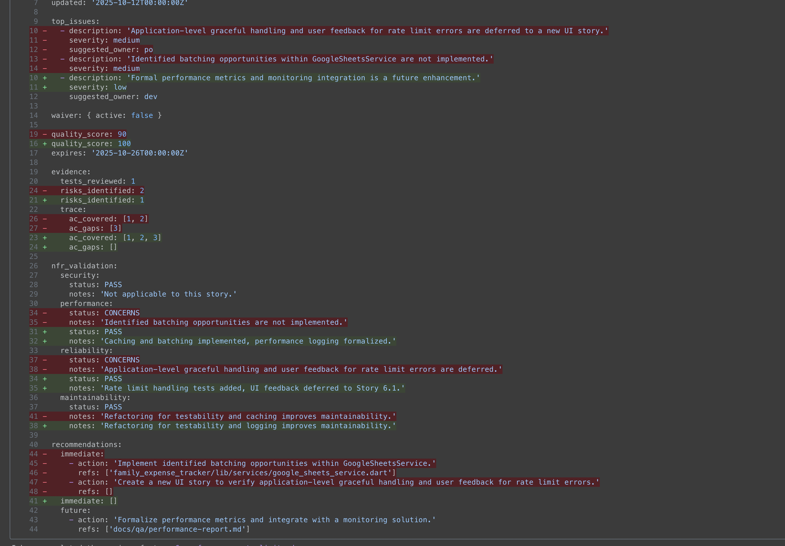
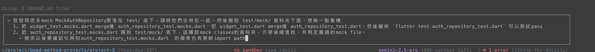

import record from './record.gif';

第29天，這本來是第19天的課題，但是發現一天內開發不完，就分了好多天實作。不要騙大家，就是隔了很久（到時候看github commit）也會被發現（！）
為什麼隔了這麼久呢，因為我原先定位這天要用flutter開發完整個app，但後面因為token不足，後來又卡了其他開發事項，所以一直沒進展，好在今天結束了，來跟大家說這不大不小的專案開發過程。

> 前情提要
> [Day 18](./day-18-bmad-method-accounting-app-flutter-2)我們開了flutter記帳的專案，也寫了story。接下來要開發完整個app。

{/*<!-- more -->*/}

不囉唆！先上結果：


對，總算是開發完了，這之中遇到幾個問題我依依列在下面，同時也説説我是怎麼解決的。

### TOC

### Orchestrator產出文件要審視

一開始我用opencode搭配Gemini 2.5-flash model，想說產文件不用太厲害的model，結果明明15個story，卻只有產生10個story.md檔，後續才用Gemini然後請PO agent產出更多更詳細的內容，才能把這第一步驟走完。
但後來開發到一半，發現還有QA要補做的或文件上缺漏的功能要進到brownfield開發，所以又多了一倍的量

```shell
$ tree docs/stories
docs/stories
├── 1-application-platform.md
├── 10-expense-list.md
├── 11-swipe-to-delete-long-press-to-edit.md
├── 12-month-navigation.md
├── 13-google-sheet-sync.md
├── 14-error-handling-user-feedback.md
├── 15-initial-data-model-enhancements.md
├── 16-unit-widget-testing.md
├── 17-integration-testing.md
├── 18-documentation.md
├── 2-google-oauth-integration.md
├── 3-google-sheets-api-client-data-layer.md
├── 4-spike-mockito-issues.md
├── 4.1-spike-upgrade-mockito.md
├── 4.2-spike-mockito-issues-followup.md
├── 5-feature-delete-expense.md
├── 6-performance-rate-limit.md
├── 6.1-ui-rate-limit-feedback.md
├── 7-category-management.md
├── 8-monthly-data-structure.md
├── 9-expense-record-format.md
├── 9.1-category-deletion-logic.md
└── 9.2-security-enhancements.md
```

原本只有1-10，硬生生多了4.1, 4.2, 6.1, 9.1, 9.2, 11-18 共13個story出來。到了這部分其實就仰賴PO agent的`create-story`跟他講需求就可以完成。
所以我的解法是：

1. 先針對Orchestrator產出的文件review一輪
2. 引入Architect對PRD review一輪architecture文件
3. 引入PO逐一對PRD及原先Orchestrator的story validate + execute checklist。

### 專注status changed


在所有的開發裡面，都要特別專注於status的change，這邊我很不喜歡用Gemini CLI的`Yes, allow always`，因為他跳太快，深怕前面有步驟一個不留神就直接無腦修改，然後這邊又允許他更改狀態，結果就很難透過agent請他往回。

最好狀態變更時都去讀一下前面改過的code的內容，以及有沒有落實TDD開發，避免後面task有太多的failed case要補。

後續要接著下一步，就照這流程，**知道找誰就找誰，不知道找誰就先問一下**，然後繼續往下跑就好。

### Testing

測試這段也讓我很頭痛，應該是我prompting沒寫好的關係，沒有給他明確TDD的開發模式，導致他都開發了一大段，才回去一起補測試。這時候他的測試又會很多failed，甚至會讓先前的測試也都崩掉，就會常常看到Gemini有點手足無措，一直觸發loop檢查機制。


這比較好的解法，就是停下來，指定他一個testcase一個testcase的修復，好處有兩個

1. 給他明確檔案跟明確目標，監督他不要亂改，divide and conquer，慢慢跑完錯誤的case
2. 針對檔案跑flutter test，不要每次都跑所有的test，token用量也比較少

### Debug


> @unknown-category.png why does my expense list show `undefined category`

Flutter跟Dart是我從來沒碰過的語言和框架，又要同時兼顧ios/android雙平台，出了問題有明確的debug流程就很重要，好在一開始Gemini就幫我埋好了很多log，以及自己有確保前面story的testcase都有跑過，後續只要針對flutter test錯誤的testcase去埋log，基本上都可以解掉

### 免費仔的痛

`Gemini-2.5-pro`真的是動不動就踩到rate limit跟quota exceeded，後續開發幾乎都是以下方式進行：

1. 一個terminal用`Gemini-2.5-pro`跑 dev agent, 一個跑QA / SM agent搭配`Gemini-2.5-flash`，文件類個工作不太跑pro。
2. 指定錯誤行號、截圖、請他跑單一測試，不要讓Gemini太多腦補的空間，浪費token。
3. 發現他在loop或覺得他偏題，就及早止損。

> 想看project的可以來這邊：https://github.com/josephMG/bmad-method-projects

### Conclusion

經過了上面一連串的調整，也真的玩了Orchestrator agent，終於還是開發完了這版記帳軟體雛形。也就是把先前用Google sheet記帳的一些內容開發進這款app裡。不過，雖然這專案是開發完了，但我對Flutter跟Dart的理解老實說還是不到20%，要接觸其他專案應該有會很吃力。這專案就留給後續要進一步學習Flutter時的參考文件，還是需要花時間深入鑽研才行。

今天到這邊就結束囉，喜歡我文章的再幫忙推廣一下喔！
