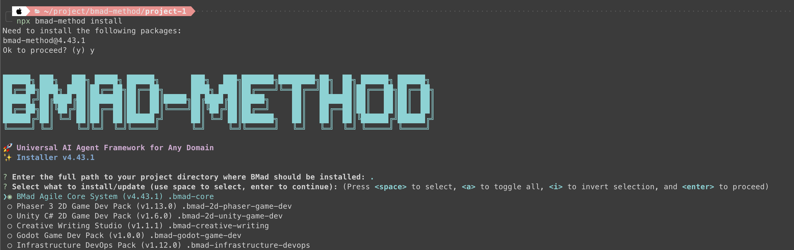
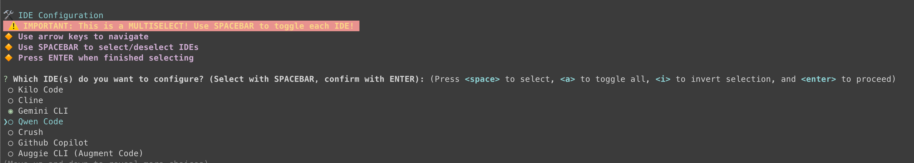
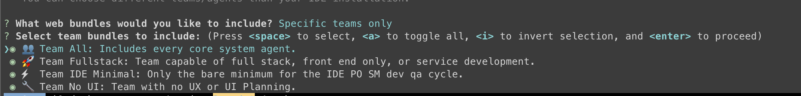
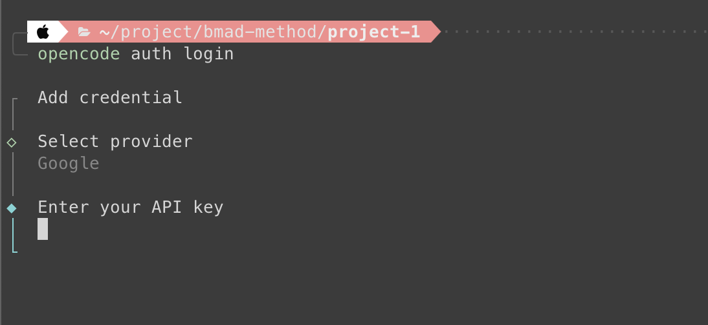
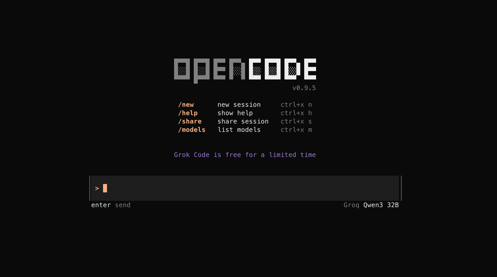
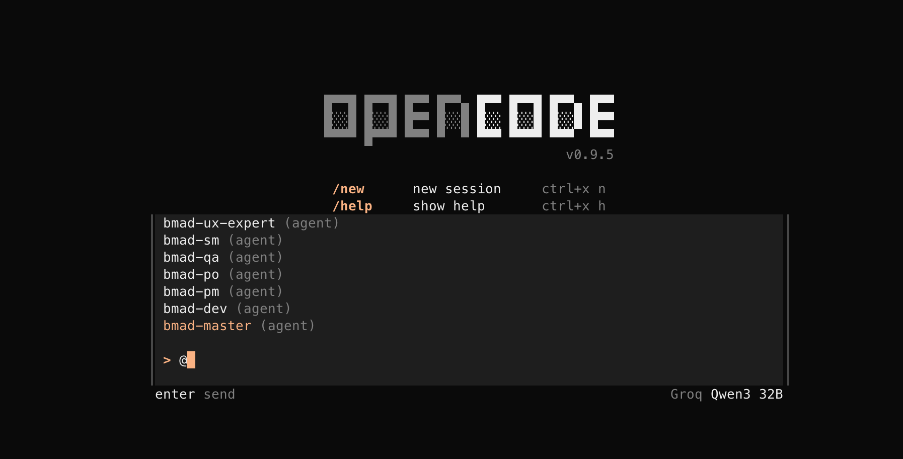
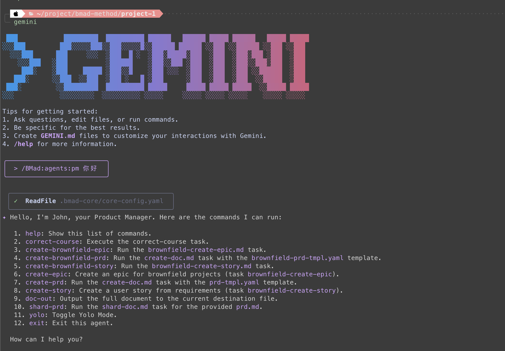

今天來個單純一點的，安裝[BMAD-Method](https://github.com/bmad-code-org/BMAD-METHOD)跟[OpenCode](https://opencode.ai/)。BMAD-Method在專案根目錄安裝就好，他只是把流程跟team, role的設定黨寫入資料夾而已。而OpenCode則是像Gemini, Claude code那樣的 **The AI coding agent built for the terminal** ，但因為我IDE是neovim，用他是為了方便在neovim裡使用。

> 參考影片：https://www.youtube.com/watch?v=70cN9swORE8

### TOC

<!-- more -->

### BMAD-Method

首先我們先建立一個專案資料夾 `project-1`，然後在資料夾下操作安裝。

```shell
$ mkdir ~/project/bmad-method/project-1
$ cd ~/project/bmad-method/project-1 
```

接著跑下關鍵指令，讓安裝精靈一步一步帶你決策

> `npx bmad-method install`


很快迎來我的第一個問題：**我們要安裝什麼擴充包 expansion packs？**

> 所有的pack可以雌考：
>
> 1. https://github.com/bmad-code-org/BMAD-METHOD/tree/main/expansion-packs
> 2. https://github.com/bmad-code-org/BMAD-METHOD/blob/main/docs/expansion-packs

我這邊單純的就選 `.bmad-core` 跟 `.bmad-infrastructure-devops`

第2, 3個問題直覺一些，就是問要不要把文件切小，我這邊選`Y`

> ? Will the PRD (Product Requirements Document) be sharded into multiple files? (Y/n) Y
>
> ? Will the architecture documentation be sharded into multiple files? (Y/n) Y

然後就看習慣的IDE，去選擇下一個`IDE Configuration`的選項，我這邊先暫時選 `Gemini CLI`跟`OpenCode`


接下來是問你team的組成，我這邊先來個自己選，然後再決定要哪些teams


跑完以後就可以看到我們專案底下安裝了很多很多的markdown files了

```shell
$ tree -L 1 -a
.
├── .bmad-core
│   ├── agent-teams
│   ├── agents
│   ├── checklists
│   ├── core-config.yaml
│   ├── data
│   ├── enhanced-ide-development-workflow.md
│   ├── install-manifest.yaml
│   ├── tasks
│   ├── templates
│   ├── user-guide.md
│   ├── utils
│   ├── workflows
│   └── working-in-the-brownfield.md
├── .bmad-infrastructure-devops
│   ├── agents
│   ├── checklists
│   ├── config.yaml
│   ├── data
│   ├── install-manifest.yaml
│   ├── README.md
│   ├── tasks
│   ├── templates
│   └── utils
├── .gemini
│   └── commands
├── AGENTS.md
├── opencode.jsonc
└── web-bundles
    ├── expansion-packs
    └── teams

```

> 但不要忘了他重要的警語
>
> 📖 IMPORTANT: Please read the user guide at docs/user-guide.md (also installed at .bmad-core/user-guide.md)
>
> This guide contains essential information about the BMad workflow and how to use the agents effectively.

### OpenCode

接下來是 `OpenCode`，我這邊也用`npm`安裝

```shell
$ npm install -g opencode-ai
```

然後跑完後直接執行 `opencode auth login` 先選擇你的授權登入方式，我選擇的是`Google` 並貼上[API key](https://aistudio.google.com/apikey)就好



最後執行 `opencode` 就可以打開啦。


這也很簡單，到這邊就結束了。
我們來看看Gemini跟opencode的執行結果

> opencode 輸入 `@`，就可以看到bmad-method的夥伴們了



> Gemini 輸入 `/` 找到`/BMad:agents`開頭的夥伴



這樣就有multi-agents啦！

今天到這邊就結束囉，幾個指令稍微安裝設定一下，為了接下來幾天鋪路。
喜歡我文章的再幫忙推廣一下喔！
