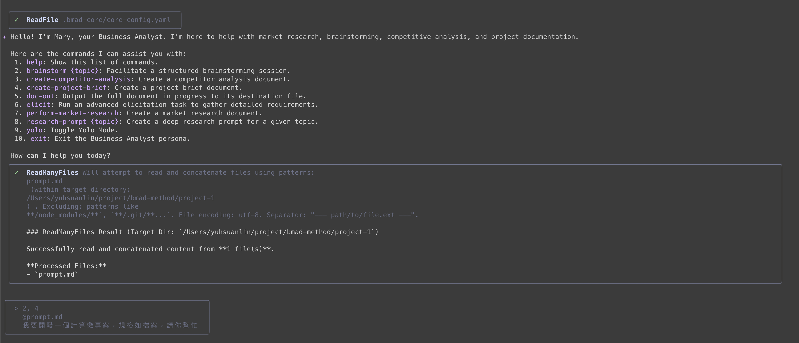
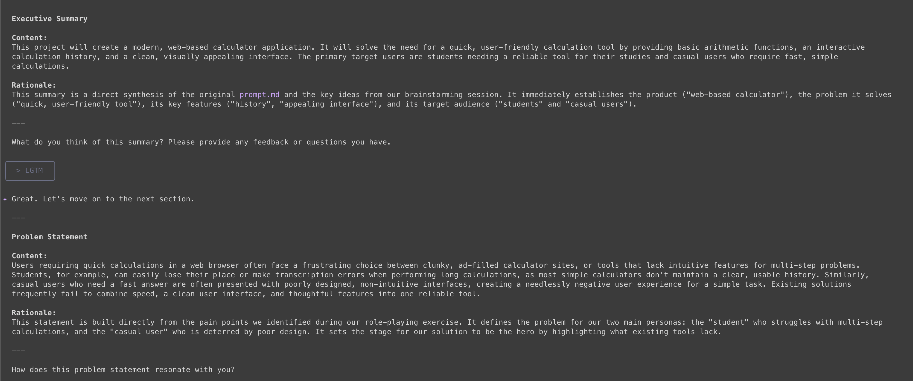
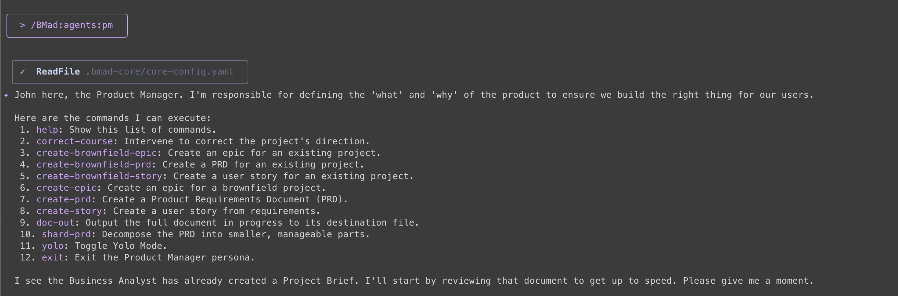
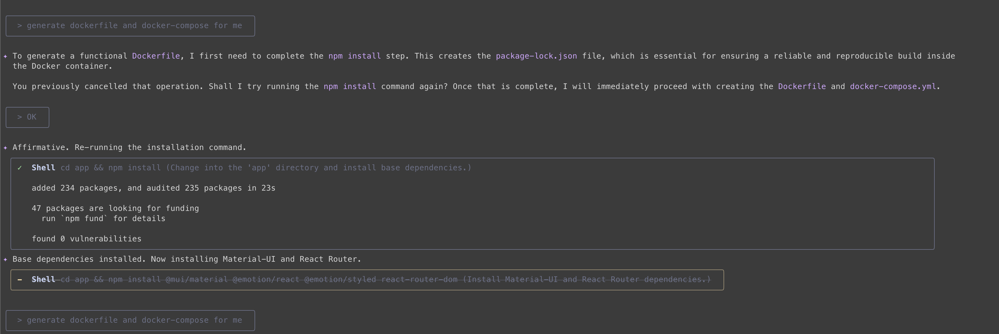
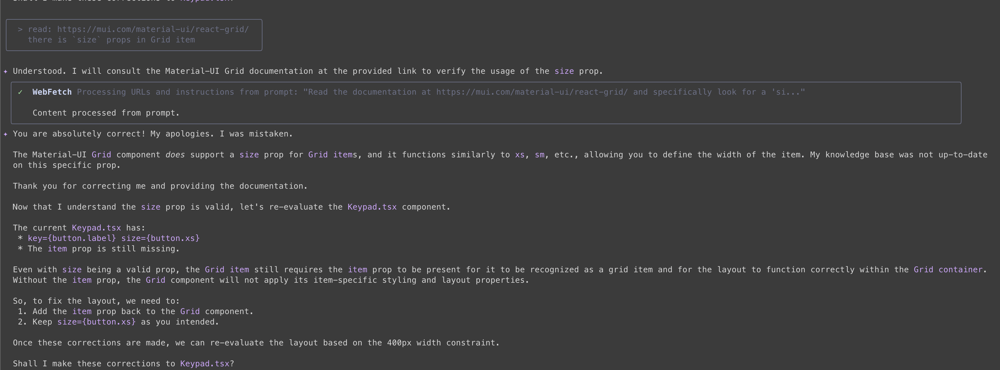
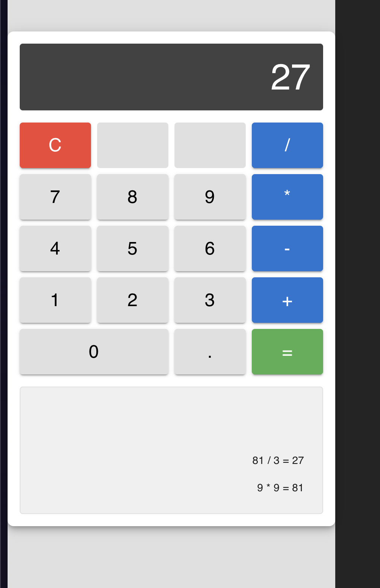

第一個project來個簡單的計算機，我打算用Reactjs做一個純前端的計算機出來，他會需要容器化技術docker。先用這個簡單的專案來做暖身。

### TOC

<!-- more -->

### First agent: `analyst`

首先， 我用ChatGPT產生一段準備給BMAD-Method的文件，prompt如下：

```shell
https://github.com/bmad-code-org/BMAD-METHOD
你現在是一個專業的AI Prompting engineer
我要用React做一個計算機，要用docker-compose開啟，然後要給BMAD-Method AI agent framework做。
請幫我用英文生成一段prompt 讓我給BMAD-Method agents使用。
輸出格式：markdown format
```

接著把它存起來，準備餵給`BMad:agents:analyst`。

根據[user-guide 裡的 Flow](https://github.com/bmad-code-org/BMAD-METHOD/blob/main/docs/user-guide.md#the-planning-workflow-web-ui-or-powerful-ide-agents)，第一步我們要去找 `/BMad:agents:analyst` 問話。


結果分析了很多問題

1. 要給誰用 對象是誰
2. 有什麼規格要注意的
3. 有些計算機常用的功能沒提到：像是記憶、重選重算 需不需要實作
4. 有什麼特殊需求？美觀或速度？

blablabla，終於結束了。


```
✦ The Project Brief has been successfully created and saved to docs/brief.md.
  We have completed both the brainstorming and the project brief creation. This document now serves as a strong foundation for the rest of the team to begin their work.
  My role as the Business Analyst for this initial phase is now complete. It has been a pleasure working with you to define this project! I'll now hand you back to the main orchestrator.
  /exit
```

最後，Analyst會產生一份`brief.md`檔案，裡面就像是剛剛訪談內容的筆記，有興趣可以打開看一下內容。

### Step 2: `PM`

有了project brief以後，我們先去諮詢PM。

> /BMad:agents:pm


PM 一上來也是一堆問題，我選7, 10，產生個PRD出來。
後續幾個問題我都選 `1. Proceed to the next section.` 加快開發速度， 最後產生 `docs/prd.md` 檔案，我可以直接跑下一步UX or Architect。

> 有時候如果不知道要做什麼 可以直接問 ** what my next step **, 他們會給你指示。
> 這很像不太需要UX，我就先跳過他了

### Step 3: `architect`

> /BMad:agents:architect Please review the attached Product Requirements Document (docs/prd.md). Your task is to create the technical architecture document for this project, adhering to all 'Technical Assumptions' and breaking down the implementation plan according to the Epics and Stories provided.

這一步出現了專案 **Frontend Tech Stack**:

| Category         | Technology                    | Version | Purpose                              | Rationale                                                |
| ---------------- | ----------------------------- | ------- | ------------------------------------ | -------------------------------------------------------- |
| Framework        | React                         | 18+     | Core application framework           | Mandated by PRD.                                         |
| UI Library       | Material-UI (MUI)             | 5+      | Component library for UI             | Mandated by PRD for rapid, high-quality UI development.  |
| State Management | React Hooks                   | 18+     | Local component state                | Mandated by PRD. Sufficient for the app's complexity.    |
| Routing          | N/A                           | N/A     | Not required for a single–page app   | The application exists on a single view.                 |
| Build Tool       | Vite                          | 5+      | Fast development server and bundling | Modern, fast, and provides a great developer experience. |
| Styling          | Emotion / TSS                 | 11+     | Styling components via MUI           | Comes built-in with Material-UI.                         |
| Testing          | Vitest, React Testing Library | Latest  | Unit and Integration testing         | Modern test runner that integrates seamlessly with Vite. |

最後產生了`docs/ui-architecture.md`，讓我拿去找`Developer agent`

### Step 4: `developer`


這部分就是讓 developer agent 建立專案，我插手了幾次。

- 請他建立docker file
- 拿掉dockerfile裡的nginx
- run command by `docker-compose run`

到了這邊 gemini-pro 免費的quota，改用 gemini-2.5-flash 取代。
最後開始實作，基本上這邊就是照著`prd.md`裡的story一步一步做下去。每做完一個story會需要你檢查跟approved。有他不懂的地方時，給他適當的參考文件或指令，我這邊就遇到他不是很懂[Mui Grid](https://mui.com/material-ui/react-grid/)，告訴他要看文件以後她才看懂。


跑完所有的story以後，我們就得到一個計算機了！


### Conclusion

雖然跳過了些步驟，但還是滿好玩的。每個步驟的問題都很明確，要確認的時候也會跟你說。除了有時候會需要介入開發、給他明確檔案外，就沒什麼太大的問題了。

明天再來看要做什麼吧～。
