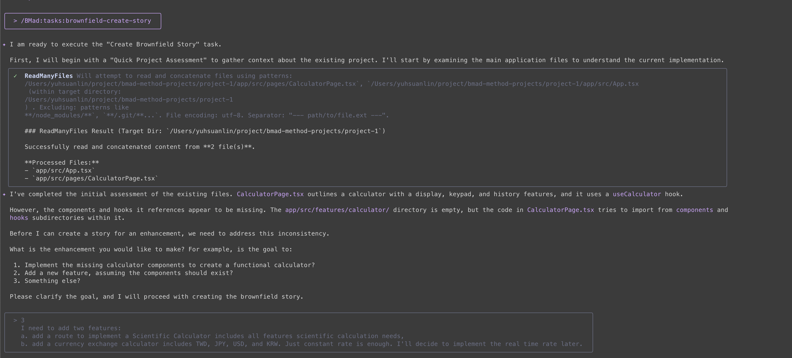
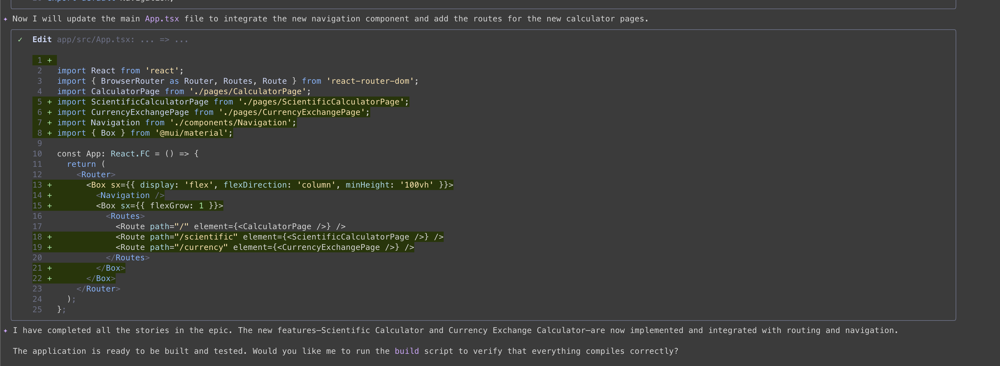
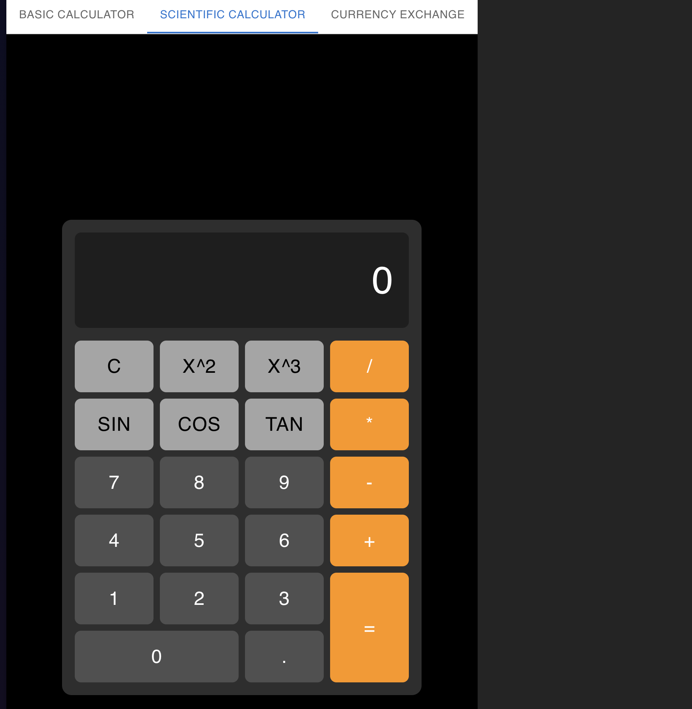
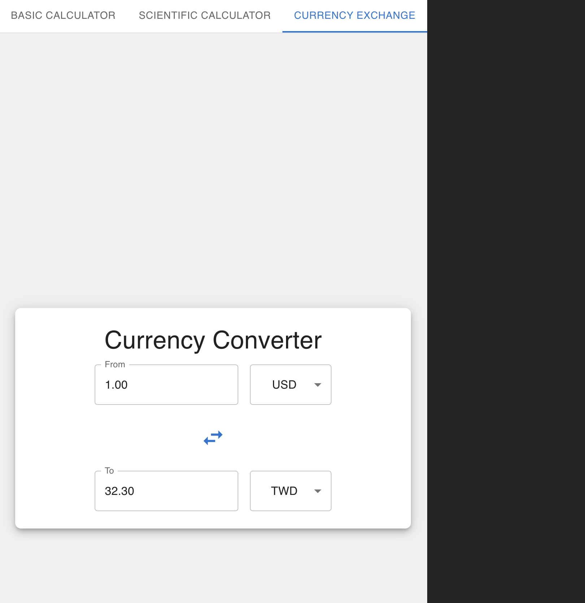

今天來把[昨天](../[day-3]-bmad-method-project-1-calculator)的計算機專案做一點需求擴充。

1. 讓他可以變成科學用計算機
2. 多一個匯率轉換計算機

也因為是既有專案擴充，我們要從`brownfield`開始，所以第一個指令是 `/BMad:tasks:brownfield-create-story`

<!-- more -->


可以看到當我們使用 `BMad:tasks:brownfield-create-story` 的時候，他會先去讀取整個專案，然後先給個總結，再去問我們要實作什麼功能。
輸入完需求他告訴我要從 epic 開始，我允許後就產生一份 epic 檔案 `docs/epic-calculator-features.md.`

> ✦ I have created the ScientificCalculatorPage.tsx component and the useScientificCalculator.ts hook, which include the requested features.
>
> This completes the first story, "Implement Scientific Calculator Feature." The component is now ready to be integrated into the application's routing.
>
> What would you like to do next? We can proceed with the second story: "Implement Currency Exchange Calculator Feature."

一下子他就先做完了科學計算機元件，接著要去實作匯率轉換計算機。

```
 const RATES = {
   USD: 1,
   TWD: 32.3,
   JPY: 155.8,
   KRW: 1377.5,
 };
```

他確實先塞一個固定匯率給我，讓之後有機會擴充成即時匯率。

> ✦ I have created the CurrencyExchangePage.tsx component and its corresponding hook. This completes the second story.
>
> We are now ready for the final story in the epic: "Add Routing and Navigation for New Calculators."
>
> Shall I proceed?

計算機元件也做完以後，他要開始實作navigation了。



> ✦ I have completed all the stories in the epic. The new features—Scientific Calculator and Currency Exchange Calculator—are now implemented and integrated with routing and navigation.

> The application is ready to be built and tested. Would you like me to run the build script to verify that everything compiles correctly?

加完route跟navigation以後，我開始介入檢查畫面跟初步功能。果不其然他還是一開始做的有點醜，我又叫它美化了一下，最後完工變成這樣：

**科學計算機**


**匯率轉換**


### Conclusion

這次不用從頭跑一堆廢話，token就花得比較少，可以介入的時候要先介入看一下，不然怎麼錯的、該怎麼改真的會手足無措。而且他老是把mui Grid 看成舊版，我總是要塞新版Grid文件給他，每次參數都塞錯，都可以預判他會怎麼錯了。
這次開發速度算快，比昨天順多了。不過這個專案應該就先到這邊為止，明天再來開發其他idea。
