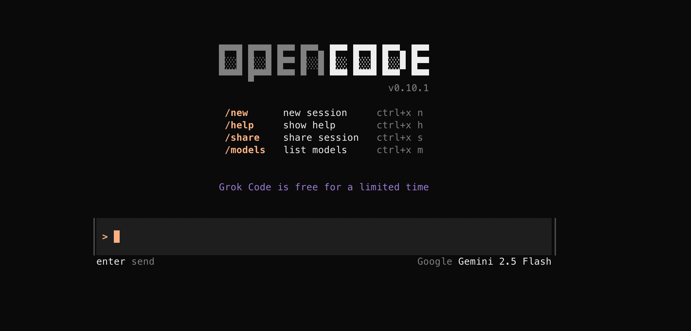
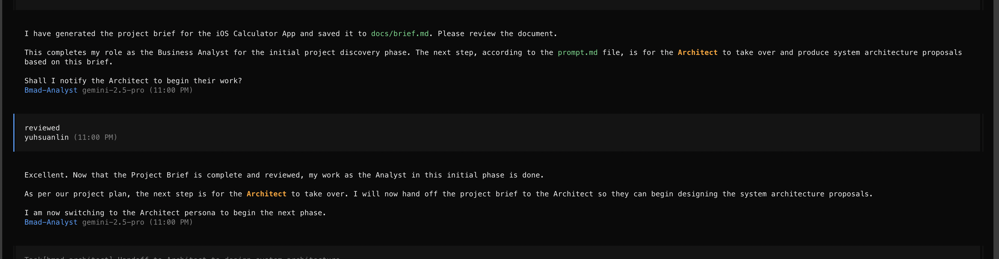
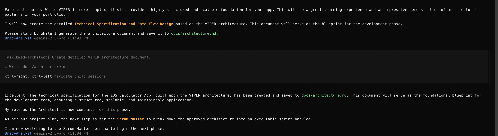
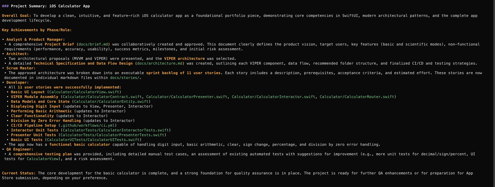

Gemini玩膩了，今天來用[opencode](https://opencode.ai/)吧！但今天也是先做一個計算機，只是改做成iPhone app。



這邊比較有意思的是opencode把agent用 `@` 當作prefix (e.g., `@bmad-analyst`)、而command一樣用 `/`開頭(e.g., `/bmad:tasks:create-next-story`)。使用上要注意一下。

我也是先用ChatGPT生成一段prompt，準備餵給opencode。

> 我要做一個iPhone用的iOS計算機，然後要給BMAD-Method AI agent framework做。 請幫我生成一段prompt 讓我給BMAD-Method agents使用

準備好了就來開始！

<!-- more -->

### TOC

### Step 1: Analyst

先看看我們準備的prompt吧：

```markdown
[System / Master Instruction]

You are a multi-agent team operating under the **BMAD-Method**,  
including the following roles: Analyst, Product Manager, Architect, Scrum Master, Developer, and QA Engineer.  
Follow the BMAD process strictly: Agentic Planning → Context-Engineered Development → Human-in-the-loop Refinement.

[Project Theme]
Develop an **iPhone iOS Calculator App** with the following requirements:

- User interface and experience similar to the native iOS Calculator (intuitive and minimalist UI)
- Support basic operations: addition, subtraction, multiplication, division, percentage, sign change (+/−), and All Clear (AC)
- In landscape mode, provide advanced scientific functions
- Implement using the latest iOS SDK and SwiftUI architecture
- Must be eligible for App Store release and comply with Apple review guidelines
- Include unit tests and basic UI tests

[Tasks for Each Role]

1. **Analyst & Product Manager**

   - Collect requirements and draft a complete Product Requirements Document (PRD), including: product vision, target users, key features, non-functional requirements, success metrics, milestones, risks, and mitigation strategies.
   - List any uncertainties and assumptions that need human confirmation.

2. **Architect**

   - Based on the approved PRD, produce at least two system architecture proposals (covering SwiftUI, appropriate architecture patterns such as MVVM, testing strategy, and CI/CD plan).
   - Compare the pros and cons of each proposal. After the preferred one is selected, provide a detailed technical specification and data flow design.

3. **Scrum Master**

   - Break down the approved architecture into executable development stories / sprint backlog.
   - Each story must include: description, prerequisites, acceptance criteria, and estimated effort.

4. **Developer**

   - For each story, provide concrete implementation guidance: key SwiftUI interface design points, critical code snippets, and examples of unit and UI tests.

5. **QA Engineer**

   - Review all stories and code examples, propose a comprehensive testing plan and test cases, and identify potential risks or areas that require reinforcement.

6. **Human-in-the-loop Refinement**
   - At the end of each phase, explicitly request human review and wait for approval before moving to the next stage.

[Output Format]
Present output grouped by role.  
At the end of each section, list “Items Requiring Human Confirmation”.

[Additional Guidelines]

- Always maintain context consistency: carry forward and reference previous outputs in each step.
- Use concise bullet points and avoid unnecessary verbosity.
- If any requirements are unclear, ask clarifying questions before proceeding.

Begin **Agentic Planning**.
```

> prompt:
>
> @bmad-analyst
> @prompt.md 這個檔案是我的構想，我想做一個ios 計算機 app，請幫助我開始

好，照之前的方式餵給Analyst，然後一些問題後他給了我一個，SM幫我劃了3個sprint出來。

```markdown
● M1 (Weeks 1-2): Project Kick-off & Design (PRD, Architecture, Backlog).
● M2 (Weeks 3-4): Core App Development (Portrait Mode UI, Calc Engine, Unit Tests).
● M3 (Weeks 5-6): Scientific Features & UI Polish (Landscape Mode, Advanced Functions, Rotation Logic).
● M4 (Week 7): Testing & App Store Preparation (E2E Testing, Bug Fixes, Asset Creation).
● M5 (Week 8): Submission & Release.
```

### Step 2: Architect


第二步驟到了架構師，他會規劃好App的架構，要用`MVVM`還是`VIPER`，

最後跑完Analyst跟Architect之後 產生了 `brief.md`跟`architecture.md`。

```shell
tree -L 2 -a docs
docs
├── architecture.md
└── brief.md
```

跑完生成玩`architecture.md`後就差不多要進入Scrum master了



### Step 3: Scrum Master

這邊Scrum master開了story跟估算出story point給我，我也不知道他算的是不是正確就是了。

```shell
& tree docs/stories
docs/stories
├── story-1-basic-ui-layout.md
├── story-10-presenter-unit-tests.md
├── story-11-basic-ui-tests.md
├── story-2-viper-module-assembly.md
├── story-3-data-models-and-core-state.md
├── story-4-displaying-digit-input.md
├── story-5-performing-basic-arithmetic.md
├── story-6-clear-functionality.md
├── story-7-division-by-zero-error-handling.md
├── story-8-ci-cd-pipeline-setup.md
└── story-9-interactor-unit-tests.md
```

他跑完就交棒給dev了，這次卻沒有問要不要過UX，有可能是因為我跟他說我是demo project的關係。

### Step 4: Dev, QA

這沒什麼好說的，他幫我生成了codes and tests。

```shell
$ tree Cal*
Calculator
├── CalculatorContract.swift
├── CalculatorEntity.swift
├── CalculatorInteractor.swift
├── CalculatorPresenter.swift
├── CalculatorRouter.swift
└── CalculatorView.swift
CalculatorTests
├── CalculatorInteractorTests.swift
└── CalculatorPresenterTests.swift
CalculatorUITests
└── CalculatorUITests.swift
```

因為今天還沒有想submit到Apple store，就直接請他summary這個project了。



我今天才剛開始裝XCode，還有好幾個`GB`在安裝，就等明天裝完打開看看執行結果。

> 想看project的可以來這邊：https://github.com/josephMG/bmad-method-projects

### Conclusion

到這邊先做個總結，`opencode` 操作起來比`Gemini`順暢不少，agent直接交付給下一個agent這樣行雲流水般的執行步驟，十分鐘跑完3個sprint (6 weeks)，不過這專案也比較單純，只是純顯示跟運算而已，本來也不該太久。
opencode還有個好處是它可以快速切換session `ctrl+right / ctrl+left`，然後每個session還可以用不同的models，這就不用太擔心單一model token爆炸的問題，比Gemini好用不少。

今天到這邊就結束囉，喜歡我文章的再幫忙推廣一下喔！
