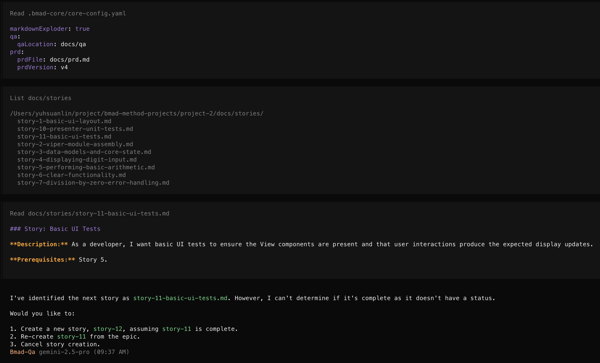
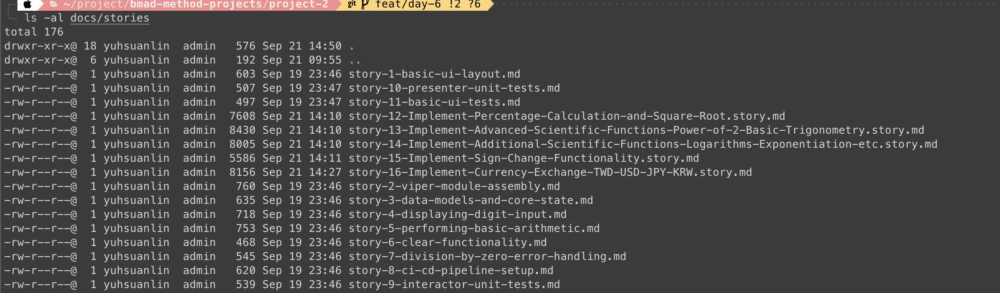
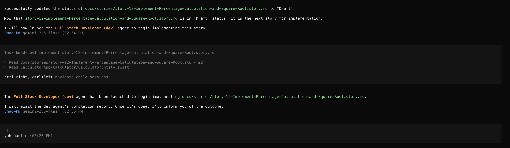
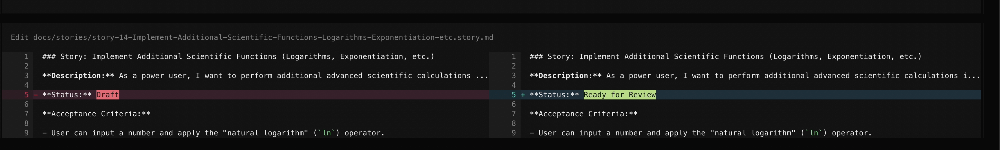
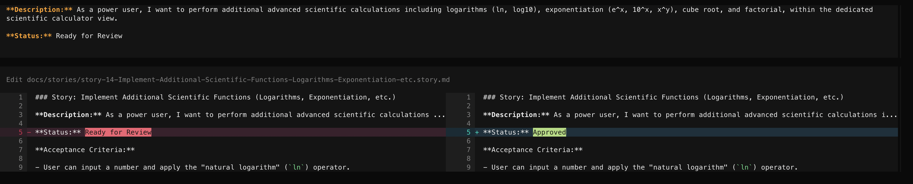

import runTasks from './run-tasks.gif';
import demoGif from './demo.gif';

來把昨天的iOS計算幾驗收一下，裝了xcode後可以看到他跑起來就像原生ios計算機一樣中規中矩，連配色都差不多。


然後再跟前一個project react calculator一樣升級一下。

{/*<!-- more -->*/}

記得[上次](./day-4-bmad-method-project-1-react-calculator-v2)我本來要先開story，可是他建議我從epic開始，這次不跑他們，因為我上次有把story拆開，這次換成 `/bmad:tasks:create-next-story`。



他讀取了前一次的所有story，然後問了下一個問題：

```markdown
     Would you like to:

     1. Create a new story, story-12, assuming story-11 is complete.
     2. Re-create story-11 from the epic.
     3. Cancel story creation.
```

> 跑完他發現我沒有docs/prd.md，我又去跑了一次 create-prd，

一連串跑完，他根據`科學計算機`與`匯率轉換器`，產出了story-12, story-13, story-14, story-15, story-16共五個story。

```
$ tree docs/stories
docs/stories
├── story-1-basic-ui-layout.md
├── story-10-presenter-unit-tests.md
├── story-11-basic-ui-tests.md
├── story-12.story.md
├── story-13.story.md
├── story-14.story.md
├── story-15.story.md
├── story-16.story.md
├── story-2-viper-module-assembly.md
├── story-3-data-models-and-core-state.md
├── story-4-displaying-digit-input.md
├── story-5-performing-basic-arithmetic.md
├── story-6-clear-functionality.md
├── story-7-division-by-zero-error-handling.md
├── story-8-ci-cd-pipeline-setup.md
└── story-9-interactor-unit-tests.md
```

檔名有點不一致，我又請他把檔名加上title。就變成下圖的樣子


然後，他會請示我們是不是要進入開發，他要把棒子交給下一棒dev。



**注意在你進開發的時候，都還是在Draft** 的story，等他們開發完就會變成 `Ready for Review`，等我們review完，他會再改成`Approved`!




看看他一步一步跑tasks的樣子，滿療癒的。


> 想看project的可以來這邊：https://github.com/josephMG/bmad-method-projects

### Conclusion

每個story都開發完以後，run起xcode果不其然又有很多bug，有可能是因為我這次用 `Gemini 2.5 Flash` model的關係，品質不是很好，其次是我發現沒有切換功能，又不想多開一個story，所以我又跑起Gemini去run Gemini-2.5-pro model，實作並修復剩下的功能。除了UI還需要微調外，成果還算是不錯。


今天到這邊就結束囉，喜歡我文章的再幫忙推廣一下喔！
