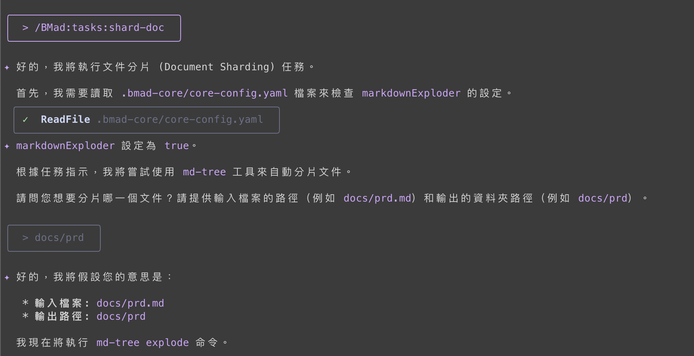

今天禮拜天，來寫一點簡單的內容，下面透過chatGPT把commands整理在一起，也把用圖跟使用時機一一列出來。
讓之後需要可以再回來查找。

<!-- more -->

這些commands會根據我們用的AI工具有不同的prefix，Gemini都是用 `/BMad:tasks` 開頭，而opencode則有些是 `/bmad:tasks` 有些是 `/bmad:infrastructure-devops`

| 分類 (Category) | 任務名稱 (Task Name)               | 用途 (Purpose)                                                                                                                     | 使用時機 (Usage)                                                                                         |
| :-------------- | :--------------------------------- | :--------------------------------------------------------------------------------------------------------------------------------- | :------------------------------------------------------------------------------------------------------- |
| **核心**        | `advanced-elicitation`             | 透過結構化的引導技巧（如多角度分析、風險識別），深入探索想法、提升內容品質。                                                       | 1. 在產出文件章節後，用於反思和深化內容。<br>2. 在任何對話中，當使用者想要對某個觀點進行更深入的探討時。 |
| **核心**        | `apply-qa-fixes`                   | 系統性地讀取 QA 的產出（品質閘門報告、評估文件），建立修復計畫並執行程式碼和測試的修正。                                           | 當一個使用者故事（Story）經過 QA 審查後，發現了問題（Bugs）或待改進項目，需要開發人員進行修復時。        |
| **核心**        | `correct-course`                   | 當計畫發生變更（如需求變更、發現重大問題）時，引導團隊進行結構化分析，評估變更衝擊，並草擬解決方案。                               | 當 Sprint 進行中出現預期外的變化，需要調整方向、範圍或計畫時。                                           |
| **核心**        | `create-doc`                       | 根據標準化的 YAML 模板，以互動方式引導使用者逐步完成一份結構完整的文件（如 PRD、架構文件等）。                                     | 當需要創建一份遵循特定結構和品質標準的正式專案文件時。                                                   |
| **核心**        | `create-next-story`                | 根據史詩（Epic）的定義和專案進度，自動識別下一個應開發的使用者故事，並從架構文件中提取所需技術細節，產生一份可立即執行的故事文件。 | 在遵循標準 BMad 流程的專案中，當一個故事完成後，用來準備下一個故事的開發。                               |
| **核心**        | `document-project`                 | 為現有的（Brownfield）專案產生全面的技術文件，使其對 AI 開發代理人更易於理解和貢獻。                                               | 當接手一個缺乏文件、或文件不完整的現有專案時，用來建立給 AI 使用的基礎技術文件。                         |
| **核心**        | `execute-checklist`                | 根據指定的清單（Checklist），系統性地驗證一份文件或產出物是否符合品質標準。                                                        | 在文件草稿完成後（如 Story Draft、架構文件），用來進行品質檢查，確保完整性和正確性。                     |
| **核心**        | `facilitate-brainstorming-session` | 作為引導者，帶領使用者進行互動式腦力激盪會議，並將產出的想法整理成結構化文件。                                                     | 當需要為新功能、解決方案或專案方向進行創意發想時。                                                       |
| **核心**        | `generate-ai-frontend-prompt`      | 根據 UI/UX 規格和前端架構文件，產生一個最佳化的、詳細的 Prompt，用於驅動 AI 前端開發工具（如 v0）產生程式碼。                      | 當 UI/UX 設計和前端架構都已確定，準備開始前端開發時，用來快速生成初始的前端程式碼。                      |
| **核心**        | `index-docs`                       | 自動掃描 `docs/` 目錄下的所有文件，並更新 `docs/index.md` 索引檔案，確保所有文件都被正確歸檔並附有描述。                           | 當專案文件有新增、刪除或移動時，用來維護文件索引的完整性。                                               |
| **核心**        | `kb-mode-interaction`              | 進入知識庫（Knowledge Base）模式，提供一個互動式的介面，讓使用者可以查詢所有 BMad 方法論的相關知識。                               | 當使用者對 BMad 的特定流程、術語或最佳實踐有疑問時。                                                     |
| **核心**        | `shard-doc`                        | 將一份大型的 Markdown 文件，根據其二級標題（##）自動拆分成多個較小的文件，並建立索引。                                             | 當一份文件（如 PRD 或架構文件）變得過於龐大，難以閱讀和維護時。                                          |
| **核心**        | `validate-next-story`              | 在開發開始前，全面驗證一個使用者故事草稿的完整性、準確性和可執行性，防止 AI 開發時產生幻覺（Hallucination）。                      | 在 `create-next-story` 之後，開發人員（或 PO）用來確認故事是否已準備好，可以進入開發階段。               |
| **棕地專案**    | `brownfield-create-epic`           | 為小型的現有專案增強功能創建一個獨立的史詩（Epic），適用於不需完整 PRD 和架構設計流程的場景。                                      | 當你想在現有系統上做一個小功能，預計 1-3 個使用者故事就能完成，且不涉及複雜的架構變更時。                |
| **棕地專案**    | `brownfield-create-story`          | 為極小型的現有專案增強或錯誤修復創建一個單一的使用者故事。                                                                         | 當變更非常小，一個故事就能搞定，且完全遵循現有模式，風險極低時。                                         |
| **棕地專案**    | `create-brownfield-story`          | 為文件不標準的現有專案創建使用者故事，它會引導使用者提供必要的上下文，以確保開發安全。                                             | 當現有專案的文件不是標準 BMad 格式，需要從各種來源（甚至使用者口述）拼湊出開發所需資訊時。               |
| **品質與測試**  | `nfr-assess`                       | 快速評估一個使用者故事的非功能性需求（NFRs），特別是安全性、性能、可靠性和可維護性。                                               | 在故事開發完成後，QA 進行審查時，用來快速檢查非功能性需求的符合度。                                      |
| **品質與測試**  | `qa-gate`                          | 根據審查結果，為一個使用者故事創建或更新一個品質閘門（Quality Gate）的決策檔案，提供明確的 PASS/FAIL 建議。                        | 在 `review-story` 之後，用來產生一個標準化的品質決策記錄。                                               |
| **品質與測試**  | `review-story`                     | 作為測試架構師，對一個已完成開發的故事進行全面的程式碼和測試審查，並有權直接進行重構。                                             | 當開發人員完成一個故事並將其狀態設為 "Review" 時，由 QA 角色執行此任務。                                 |
| **品質與測試**  | `risk-profile`                     | 為一個使用者故事的實施產生一份全面的風險評估矩陣，分析潛在風險並提供緩解策略。                                                     | 在故事審查期間，用來識別和評估實施該故事可能帶來的各種風險。                                             |
| **品質與測試**  | `test-design`                      | 為一個使用者故事設計全面的測試場景，並建議合適的測試層級（單元、整合、E2E）。                                                      | 在故事開發前或審查時，用來規劃測試策略，確保所有需求都有對應的測試覆蓋。                                 |
| **品質與測試**  | `trace-requirements`               | 使用 Gherkin 語法（Given-When-Then）將使用者故事的需求與測試案例進行映射，確保所有需求都得到驗證。                                 | 在測試設計或審查階段，用來建立需求與測試之間的追溯矩陣，以識別測試覆蓋的缺口。                           |
| **基礎設施**    | `review-infrastructure`            | 根據 `infrastructure-checklist.md`，對現有的基礎設施進行全面審查，以識別改進機會、安全問題和與最佳實踐的對齊情況。                 | 當需要評估現有基礎設施的健康狀況、成本效益或為未來的擴展做準備時。                                       |
| **基礎設施**    | `validate-infrastructure`          | 在部署前，根據安全、可靠性、營運和合規性要求，全面驗證平台基礎設施的變更。                                                         | 當基礎設施有任何變更（如新增服務、調整設定）需要上線前，用來確保變更的品質與安全性。                     |

### Try it

這邊我就來簡單跑一下shard-doc去把prd分片試試。

最終我們得到了以章節切割成一份一份的markdown檔案

```shell
$ tree docs/prd
docs/prd
├── 1-goals-and-background-context.md
├── 2-problem-statement.md
├── 3-user-stories-use-cases.md
├── 4-functional-requirements.md
├── 5-non-functional-requirements.md
├── 6-technical-design-considerations.md
├── 7-open-questions-and-future-considerations.md
└── index.md
```

我也趁這機會把昨天後來用Gemini補的routing功能補進文件裡。

> /BMad:tasks:create-next-story I've added two buttons to switch between CurrencyExchange, ScientificCalculator, and BasicCalculator. But I didn't add story, please help me finish it

```git
On branch feat/day-7
Changes not staged for commit:
  (use "git add <file>..." to update what will be committed)
  (use "git restore <file>..." to discard changes in working directory)
        modified:   docs/architecture.md

Untracked files:
  (use "git add <file>..." to include in what will be committed)
        docs/stories/story-17-implement-calculator-mode-switching.story.md

```

最後他除了幫我更新architecture外，還寫了story 17出來。最後再讓dev檢查一下，讓他去更新story 17 的 todo list，這樣就補完了。

> 想看project的可以來這邊：https://github.com/josephMG/bmad-method-projects

### Concludsion

如果token是那種吃到飽的方案，真的是每個改動都要去呼叫對應的指令更新文件，這樣你的subagent才會徹底了解你想做什麼、在做什麼。像我Gemini-2.5-pro動不動就超過limit，要跑起來真是綁手綁腳，現在只是每天開發一點小東西，偶爾超過偶爾沒超過，大一點的專案真的很難想像。

今天到這邊就結束囉，喜歡我文章的再幫忙推廣一下喔！
