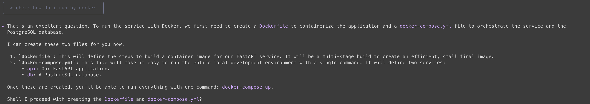
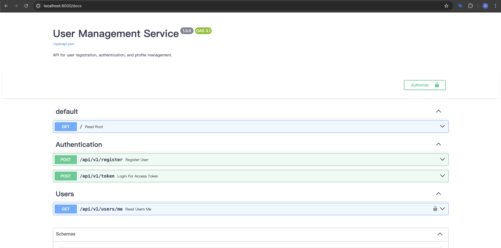

今天來試試opencode + BMad-Method 對後端FastAPI做使用者登入註冊的理解。廢話不多說，直接上prompt給analyst

<!-- more -->

```shell
[ROLE]
You are an Analyst agent in the BMAD-Method AI agent framework.
Your task is to deeply analyze the requirements of a backend system
and output a clear, structured functional specification.

[CONTEXT]
We need to build a Python FastAPI backend for user authentication and profile management.
The system will run inside Docker containers with docker-compose, and use PostgreSQL as the database.

[REQUIREMENTS]
1. Core Features:
   - User registration (with email/username and password)
   - User login (JWT-based authentication)
   - Change password (with old password validation)
   - Update personal profile (requires authentication)

2. Technical Stack:
   - Framework: FastAPI
   - Server: Uvicorn
   - ORM: SQLAlchemy
   - DB Migration: Alembic
   - Database: PostgreSQL
   - Security: Passlib (bcrypt), python-jose (JWT)
   - Config Management: pydantic-settings / dotenv
   - Containerization: Docker & docker-compose

3. Deployment:
   - Services: backend (FastAPI app), db (PostgreSQL)
   - Volumes: persistent PostgreSQL data
   - Ports: backend (8000), db (5432)

[OUTPUT FORMAT]
- Provide a structured functional specification with:
  1. User stories
  2. Functional requirements
  3. Non-functional requirements
  4. System architecture (high-level)
  5. Database schema (tables & fields)
  6. API endpoints (with methods & input/output models)
  7. Security considerations
```

然後我們開始問與答！

這次我們跑了 `5個為什麼 (Five Whys)` 跟 `Yes, and...` 方法：

> Five Whys?
>
> 是一種根本原因分析（Root Cause Analysis）的方法，用來找出問題真正的起因。它的核心做法非常簡單：針對同一個問題，連續問「為什麼」五次（或直到找出真正的根本原因為止）。

> Yes, And...
>
> 是一種溝通與合作技巧，源自**即興劇（Improv）**的核心規則，也被廣泛應用在商業會議、設計思考與腦力激盪中。它的核心精神是：先接納（Yes），再加值（And）。

雖然問題滿多的，但最後還是長出一個不錯的brief.md, prd.md, architecture.md。

```shell
$ tree docs/
docs/
├── architecture.md
├── brainstorming-session-results.md
├── brief.md
├── prd
│   ├── epic-1-foundational-user-management.md
│   ├── epic-2-enhanced-user-security.md
│   ├── epic-3-advanced-authentication.md
│   └── epic-4-user-identity-access-management.md
└── prd.md
```

之後開發完的結果，檢查之下還是差了docker, docker-compose，還是得請Gemini補一下

> run my backend by docker and try to fix error



到這邊告一段落，一連串的跑跑改改就結束了。

> 想看project的可以來這邊：https://github.com/josephMG/bmad-method-projects



### Conclusion

是的，跑完發現還是有噴`Internal Server Error`，明天就來玩一下TDD開發，再讓 dev 去修復看看。但今天跑的opencode有時候會卡卡的，感覺是token不夠又感覺是他有什麼bug，就一直在那邊loading。所以今天還是用OpenCode + Gemini CLI 兩個一起合作打完的。希望明天可以順暢一點。

今天到這邊就結束囉，喜歡我文章的再幫忙推廣一下喔！

### Reference

1. [Five Whys](https://zh.wikipedia.org/zh-tw/%E4%BA%94%E4%B8%AA%E4%B8%BA%E4%BB%80%E4%B9%88)
2. [Yes, and...](https://www.ctee.com.tw/news/20250313700002-431001)
