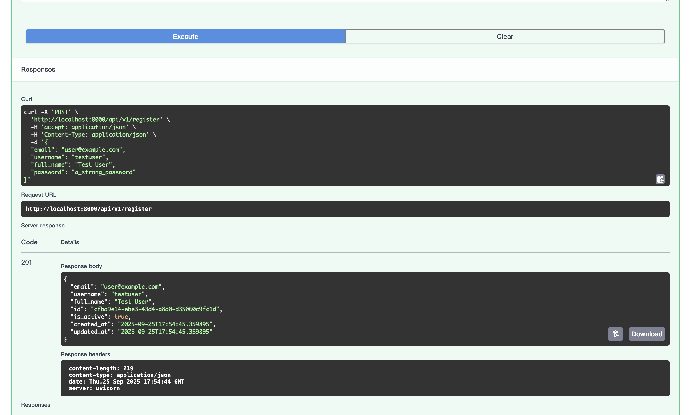

今天一上來就把[昨天](./day-8-bmad-method-fastapi-backend-and-user-management)的後端功能再補齊全一點，發現昨天只有跑起來，但一執行就Internal error，然後也只有個`register`跟`me`，就沒其他東西了，v2就來補上testing跟剩下的story。

<!-- more -->

### TOC

### 先補齊文件

因為發現昨天的問題不是在開發不完全，而是story根本沒定義完，這邊先請出ScrumMaster重新把story寫仔細，結果就多出了story 1.2, 1.3, 1.4, 1.5，然後又請architect把我的architecture.md 去 shard-doc一下，拆分成多個小文件。這樣才把文件給補齊。

### 給QA review story

這是後端專案，不用ux，現在來讓QA `review story 1.1-1.5`，然後他就會補上所有的 `qa/gates`，同時他也會有些 `CONCERN`，這時候我們可以帶回去跟SM再討論一下，都結束以後就可以把story改為`Ready for Development`

來看看到這部的文件檔

```shell
docs
├── architecture
│   ├── checklist-results-report.md
│   ├── coding-standards.md
│   ├── components.md
│   ├── core-workflows.md
│   ├── data-models.md
│   ├── database-schema.md
│   ├── error-handling-strategy.md
│   ├── external-apis.md
│   ├── high-level-architecture.md
│   ├── index.md
│   ├── infrastructure-and-deployment.md
│   ├── introduction.md
│   ├── next-steps.md
│   ├── rest-api-spec.md
│   ├── security.md
│   ├── source-tree.md
│   ├── tdd-workflow.md
│   ├── tech-stack.md
│   └── test-strategy-and-standards.md
├── architecture.md
├── brainstorming-session-results.md
├── brief.md
├── prd
│   ├── epic-1-foundational-user-management.md
│   ├── epic-2-enhanced-user-security.md
│   ├── epic-3-advanced-authentication.md
│   └── epic-4-user-identity-access-management.md
├── prd.md
├── qa
│   └── gates
│       ├── 1.1.user-registration-and-authentication-qa-gate.yml
│       ├── 1.1.user-registration-and-authentication.yml
│       ├── 1.2.implement-tdd-practices.yml
│       ├── 1.3.change-user-password.yml
│       ├── 1.4.update-user-profile-information.yml
│       └── 1.5.delete-user-account.yml
└── stories
    ├── 1.1.user-registration-and-authentication.story.md
    ├── 1.2.implement-tdd-practices.story.md
    ├── 1.3.change-user-password.story.md
    ├── 1.4.update-user-profile-information.story.md
    └── 1.5.delete-user-account.story.md
```

很多，但是很仔細。

### 接下來就給Dev。

這裡一個一個story開發，第一個story就出現問題。他們一直要我在本地運行，但我環境是在docker container裡面，連DB也是在裡面，跑起來一直失敗：

1. DB user跟db沒有建立：`/BMad:agents:dev help me run up docker-compose db and create user according the db env`
2. 每個指令都要我跑local端：`I'm using docker-compose container, please run all command by docker-compose. run every command by docker, if testing run test container, or run app container`
3. story開發完，要我review時，我還要確保testing真的可以用docker跑：` tell me how to run test by docker-compose, what's command you use`

這三步都設定完以後，才能跑得很順暢。

接下來就是等他開發剩下的story 1.2, 1.3, 1.4, 1.5。

他會邊開發邊寫測試，但不完全是TDD，他定義是`Test-After Development`，不過也行，至少都有測試。

這下子總算可以安穩的建立使用者了。



> 想看project的可以來這邊：https://github.com/josephMG/bmad-method-projects

### Conclusion

這次把story開發完的過程裡，Gemini不管在opencode還是在Gemini CLI都一直出現鬼打牆的情形，一直反覆來回修改。有兩三次是人工介入才得以化解，而且model Gemini-2.5-Flash 跟 Gemini-2.5-pro 都發生過。所以這次開發除了呼叫 agent 跟 command 外，都還會在story後面多加一點prompt，以免他又幻覺腦補。

今天到這邊就結束囉，喜歡我文章的再幫忙推廣一下喔！
