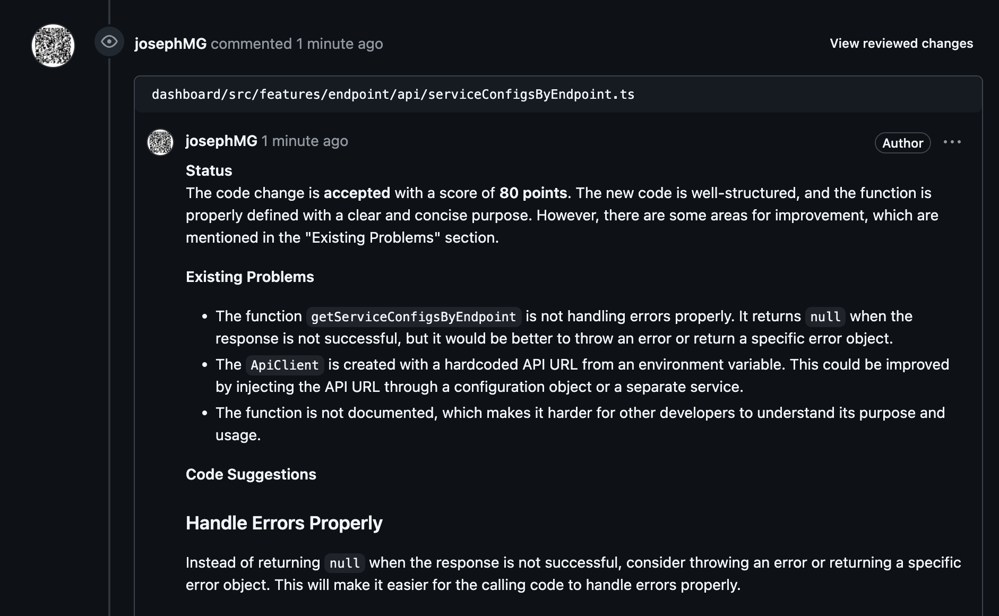

Previously I read a post ["Automate and Accelerate GitLab Code Reviews with OpenAI and n8n.io"](https://medium.com/gits-apps-insight/automate-and-accelerate-gitlab-code-reviews-with-openai-and-n8n-io-99f4b6189540).

This made me wonder: If I don’t choose GitHub Copilot for code reviews, can I still integrate AI and n8n with GitHub PR reviews?

I haven’t written a blog in a long time—it’s time to start again!

<!-- more -->

### TOC

## Prerequirement

1. [n8n](https://www.n8n.io/)
2. Github
3. [Groq](https://www.groq.com/)

I need to use n8n to build an automated workflow that reviews and comments on GitHub PRs. Additionally, I need a [Github Personal access token](https://github.com/settings/tokens) and a [Groq API key](https://console.groq.com/keys) so that the n8n workflow can authenticate with them.

## Workflow


This is the complete workflow, from start to finish. First, when I trigger the test workflow, it fetches all my PRs from GitHub and selects the latest one. Next, it retrieves the diff files, separates them, and splits them into individual items. The workflow then processes the diff by removing empty items, filtering out deleted file changes, and eliminating renamed items. After that, a random selection of files is made and organized. These selected file pairs are then passed to an AI model, which analyzes the changes. Finally, the AI-generated feedback is posted as a comment on the PR.

Let's dig into each stage now.

#### Top stage: fetch PR


In my Github Node, I set an `access token` to the `Github account`, send an operation to `Get Pull Requests` to retrive `Repository` resource and assign the owner and name.


The next two nodes filter pull requests by my name and retrieve my latest PR.


Once this stage is complete, the output is my most recent GitHub pull request, which is then passed to the next stage.

#### Second stage: organize diffs


At this stage, Firstly, I send an `HTTP Request` to fetch the PR diff, using an `Auth Header` to prevent an `Unauthorized` error. However, I must highlight that the Authorization value must be prefixed with `Bearer ` string before your GitHub token.


Soon, you will notice that the `HTTP Request` output is a string value. So I have to convert to string array by 'git --diff' and then separating the array list into multiple items.

```javascript
$json.data.split('diff --git');
```


#### Third stage: clean and select files


There are four filter nodes which is:

| Node Name                  | Condition                                                                                                               |
| -------------------------- | ----------------------------------------------------------------------------------------------------------------------- |
| Remove first empty item    | `{{ $itemIndex }}` `is not equal to` **0**                                                                              |
| Remove deleted file change | `{{ $json.data }}` `does not contain` _deleted file mode_                                                               |
| Remove rename item         | `{{ $json.data }}` `does not contain` _rename from_ <br> **AND** <br> `{{ $json.data }}` `does not contain` _rename to_ |

When this step is completed, all items should be modified in the PR. In this demo I just randomly choose five files to review, so I simply use a `Random Node` to shuffle those items, and filter out first five items.

```
# Random selection
 `{{ $itemIndex }}` `is less then` **5**
```

The important step `Organize diff` should write some code. I refer to the [blog](https://medium.com/gits-apps-insight/automate-and-accelerate-gitlab-code-reviews-with-openai-and-n8n-io-99f4b6189540) and copy the whole code from [gist](https://gist.github.com/IrfanTriHandoko/ea459d8213877faf82c67fafe69a32e9#file-parsegitdiff-js). After some try and error, I made some modification as blow:

The important step, Organize Diff, requires writing some code. I referred to the [blog](https://medium.com/gits-apps-insight/automate-and-accelerate-gitlab-code-reviews-with-openai-and-n8n-io-99f4b6189540) and copied the entire code from the [gist](https://gist.github.com/IrfanTriHandoko/ea459d8213877faf82c67fafe69a32e9#file-parsegitdiff-js). After some trial and error, I made some modifications as follows.

```javascript
function getLastDiff(inputDiff) {
  const cleanedDiff = inputDiff.replace(/\n\\ No newline at end of file/, '');
  const cleanedDiffLines = cleanedDiff.trimEnd().split('\n').reverse();

  const fileNameLine = cleanedDiffLines.find((line) => /^ a\/(.+) b\/(.+)/g.test(line));
  const [, oldFileName, newFileName] = fileNameLine.match(/^ a\/(.+) b\/(.+)/);
  const lastDiffHeaderLine = cleanedDiffLines.find((line) => /^@@ -\d+,\d+ \+(\d+),(\d+) @@/g.test(line));

  let oldFileTotalLineCount, newFileTotalLineCount;
  if (lastDiffHeaderLine) {
    const [, oldStartLineCount, oldEndLineCount, newStartLineCount, newEndLineCount] = lastDiffHeaderLine.match(
      /@@ -(\d+),(\d+) \+(\d+),(\d+) @@/
    );
    oldFileTotalLineCount = parseInt(oldStartLineCount, 10) + parseInt(oldEndLineCount, 10);
    newFileTotalLineCount = parseInt(newStartLineCount, 10) + parseInt(newEndLineCount, 10);
  } else {
    oldFileTotalLineCount = -1;
    newFileTotalLineCount = -1;
  }

  const firstCharOfLastLine = cleanedDiffLines[0]?.[0];
  const lastOldFileLine =
    oldFileTotalLineCount >= 0 ? (firstCharOfLastLine === '+' ? null : oldFileTotalLineCount - 1) : -1;
  const lastNewFileLine =
    newFileTotalLineCount >= 0 ? (firstCharOfLastLine === '-' ? null : newFileTotalLineCount - 1) : -1;

  // 5. Return the parsed data
  return {
    lastOldFileLine,
    lastNewFileLine,
    oldFileName,
    newFileName,
    cleanedDiff,
  };
}

// Processes the cleaned diff information to separate the lines of code added, deleted, and unchanged in the old and new code
function extractCodeFromDiff(cleanedDiff) {
  // 1. Split the cleaned diff into lines, removing any trailing whitespace
  const diffLines = cleanedDiff.trimEnd().split('\n');

  // 2. Initialize an object to store parsed code lines
  const parsedCodeLines = {
    original: [], // Array to hold lines from the original code
    new: [], // Array to hold lines from the new code
  };

  diffLines.forEach((line) => {
    if (line.startsWith('-')) {
      parsedCodeLines.original.push(line);
    } else if (line.startsWith('+')) {
      parsedCodeLines.new.push(line);
    } else {
      parsedCodeLines.original.push(line);
      parsedCodeLines.new.push(line);
    }
  });

  return {
    originalCode: parsedCodeLines.original.join('\n'),
    newCode: parsedCodeLines.new.join('\n'),
  };
}

function parseGitDiff() {
  const lastDiff = getLastDiff($input.item.json.data);
  const extracCode = extractCodeFromDiff(lastDiff.cleanedDiff);
  return {
    lastOldFileLine: lastDiff.lastOldFileLine,
    lastNewFileLine: lastDiff.lastNewFileLine,
    originalCode: extracCode.originalCode,
    newCode: extracCode.newCode,
    fileName: lastDiff.newFileName,
  };
}
return parseGitDiff();
```

The output contains `fileName`, `originalCode`, and `newCode`, allowing me to write a prompt and ask AI to review my codes.

#### Final stage: ask AI agent


> All the prompts and system messages can be referred to [the original blog](https://medium.com/gits-apps-insight/automate-and-accelerate-gitlab-code-reviews-with-openai-and-n8n-io-99f4b6189540). I only write down the different part.

Here I integrate the `Groq chat model` and choose `llama3` as the AI model. Just paste [Groq api key](https://console.groq.com/keys) to check whether the connection is successfully or not.


Lastly, I send an `HTTP POST request` with the following information:

| Name            | Value                                                                 |
| --------------- | --------------------------------------------------------------------- |
| URL             | `{{ $('GitHub').item.json._links.review_comments.href }}`             |
| Authentication  | Predefined Credential Type                                            |
| Cretential Type | GitHub API                                                            |
| GitHub API      | _To create an credential account with your UserName and Access token_ |
| Send Header     | `{Accept: application/vnd.github+json}`                               |
| Send Body       | JSON and specify body by _Using Fields Below_                         |

Body parameters:
|Name | value|
|-----|-----|
|body | `{{ $json.text }}` |
|commit_id|`{{ $('My PRs').item.json.head.sha }}`|
|path | `{{ $('Organize Diff').item.json.fileName }}` |
|subject_type | **file**|

In this step, I use the `review_comments.href` from **$('GitHub') node**, the `text` from the previous **LLM model node**, the `sha` from **$('My PRs') node**, and the `fileName` from **$('Organize Diff') node**. Additionally, I have created a **GitHub API Credential** using my `username` and `access token`.


Okay, now let's take a look of the review.


Amazing! I don’t need to handle either GitHub authorization or the API request/response of the AI chat model. Just a few lines of code can implement a code review workflow with an AI model. If you care about privacy, you can even try [n8n docker](https://docs.n8n.io/hosting/installation/docker/) and [ollama](https://hub.docker.com/r/ollama/ollama) on your machine—that’s so cool!

I hope this article is helpful, and I will try to design more n8n workflows with AI model. Thanks for reading!

## Reference

1. [Automate and Accelerate GitLab Code Reviews with OpenAI and n8n.io](https://medium.com/gits-apps-insight/automate-and-accelerate-gitlab-code-reviews-with-openai-and-n8n-io-99f4b6189540)
2. [n8n](https://n8n.io/)
3. [groq](https://console.groq.com/playground)
