### 前情提要

最近要將手邊的案子掛上HTTPS，機器是在Google Cloud Platform (GCP)上面開compute engine (gce)，並在裡面run docker (nginx)，讓我們來看看現在的配置。

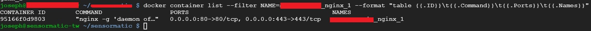
<!-- more -->
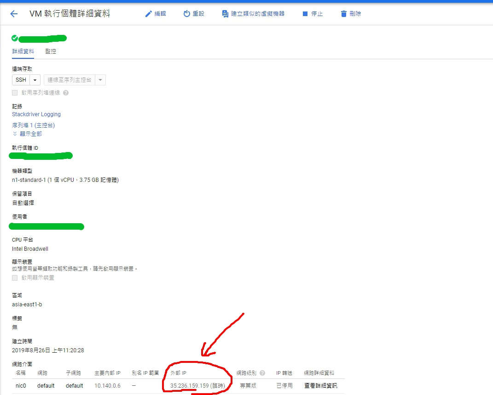

從上面兩張圖可以看到，現在GCE是有掛上static ip，好讓Godaddy DNS可以直接指向IP。並且把80/443兩個port的資料forward到nginx docker，這裡雖然有開啟443 forward，但內部nginx卻沒有listen 443，也沒有certificate。

```
server {
    listen       80;
    server_name  _;
    root   /var/www/html;
    index index.html index.htm index.php;

    location / {
      if (!-e $request_filename){
        rewrite ^/(.*)$ /index.php/$1 last;
      }
    }
    error_page   500 502 503 504  /50x.html;
    location = /50x.html {
        root   /var/www/html;
    }
    location ~ \.php(.*)$ {
        root /var/www/html;
        fastcgi_pass   php:9000;
        fastcgi_index  index.php;
        fastcgi_split_path_info ^(.+\.php)(.*)$;
        fastcgi_param  PATH_INFO  $fastcgi_path_info;
        fastcgi_param  SCRIPT_FILENAME  $document_root$fastcgi_script_name;
        fastcgi_param  PATH_TRANSLATED  $document_root$fastcgi_path_info;
        include        fastcgi_params;
    }
}
```

現在要開始掛HTTPS，目前觀察有兩種做法：
1. GCE VM或docker裡使用Let’s Encrypt自己簽certificate，並定期renew
2. 用GCP裡的HTTP(S) load balancer簽certificate

因為這次不太想增加機器運作負擔，所以我選擇第2條路，馬上來看看架構圖：
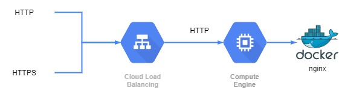

### Instance group

第一步我們要先替Instance建立一個group，可以透過**Compute Engine / 執行個體群組(Instance Groups)**建立一個新的instance group。
> 記得建立的時候選**新增非代管的執行個體群組**，並在**VM 執行個體**裡選擇你們的VM
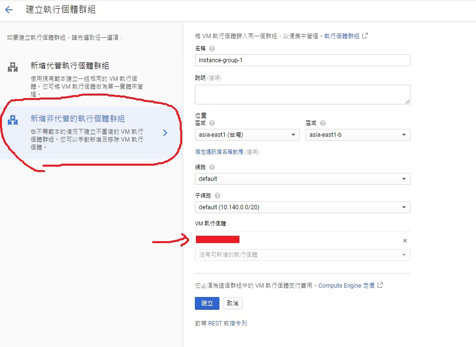

結果就會像下面這樣：
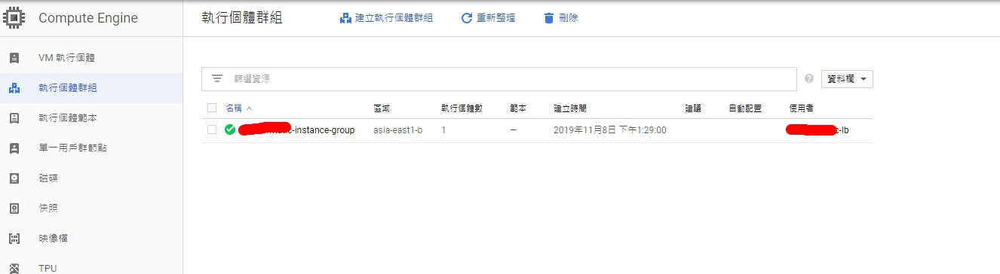

接下來我們就可以進到下一步，設定load balancer。
### HTTP(S) load balancer

打開sidebar找到**網路服務 / 負載平衡 / 建立負載平衡器**，選擇**HTTP(S)負載平衡**後，就可以開始輸入資訊：
負載平衡")

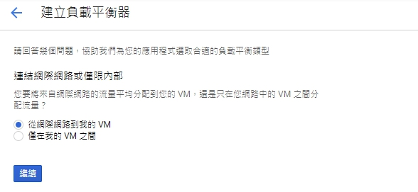


接著是**建立後端服務**，這部分相對單純，只要把instance group設定好，並把port number設定為**80, 443**，最後因為我們nginx 只有listen 80 port，所以下面有個**健康狀態檢查 (health check)**建立一個新的health check並設定port 80即可。
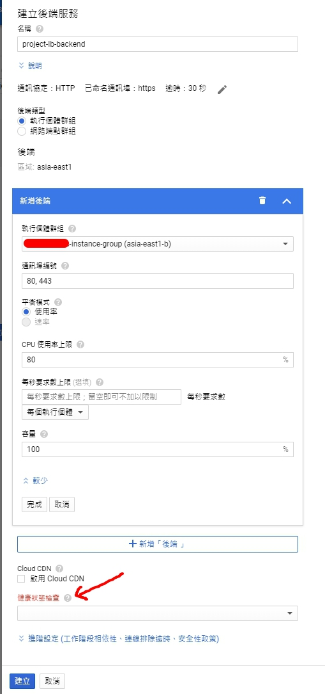
這邊建立好以後，**主機與路徑規則**會自動幫我們生成。如果沒有額外的static resource相關路徑要修改，其實這邊不用動。
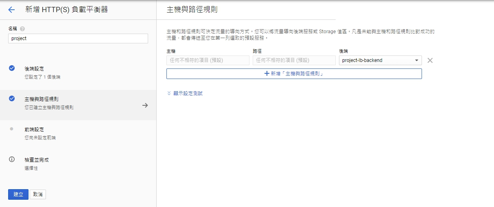

最後是卡關卡很久的地方**建立前端服務**，這邊有三個要注意的：

#### 針對HTTPS建立憑證
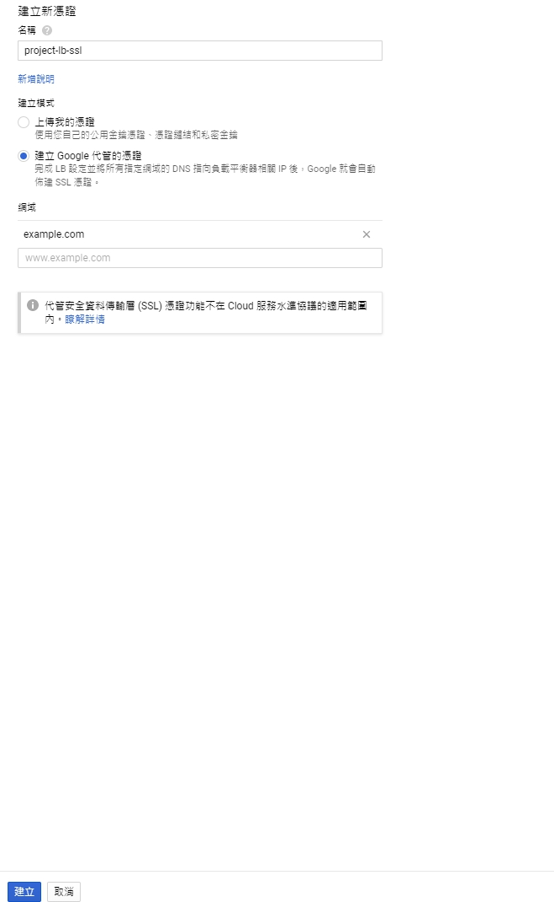
這邊因為我沒有憑證，所以我讓Google代管，只需要輸入domain即可。
#### 建立**靜態**IP位址，不要使用**臨時**的位址
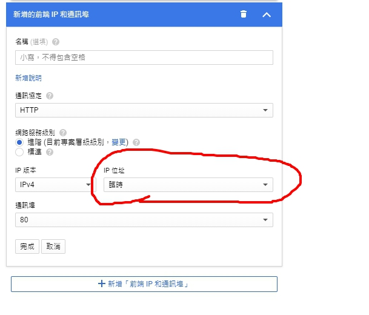
如果都選**臨時**，會發現到時候要設定DNS的時候無法分辨80/443要去哪個IP，所以這邊選擇建立一個靜態位址，只需要在**臨時**這邊改成**建立IP位址**，並輸入名稱即可。

> 之後可以在sidebar裡的**VPC網路 / 外部IP位址**，找到剛剛保留的ip address

#### 建立**兩個**前端IP和通訊埠，一個給80，一個給443
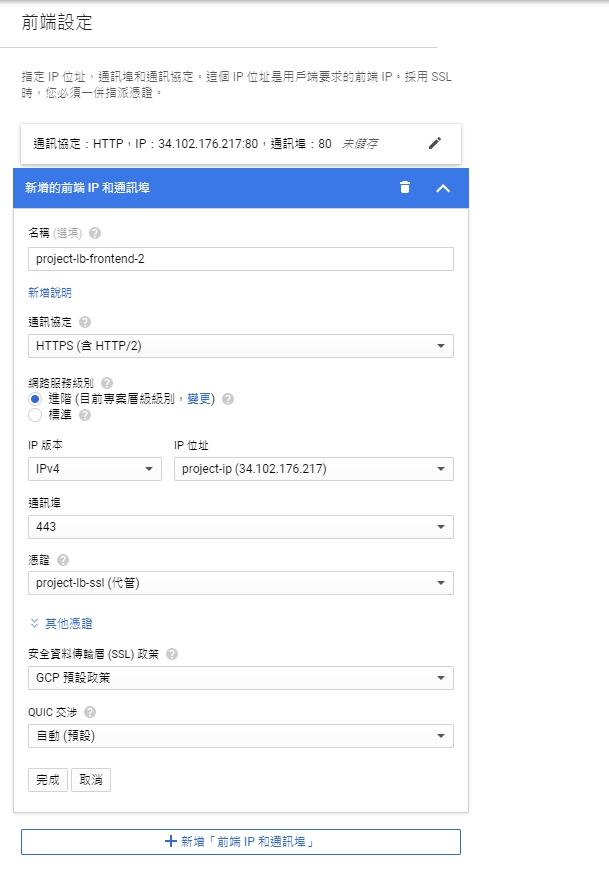
這邊可以看到兩個的IP是一樣的，port則分別為`80`跟`443`，這樣基本上就設定好了。

最後來看看設定的結果：
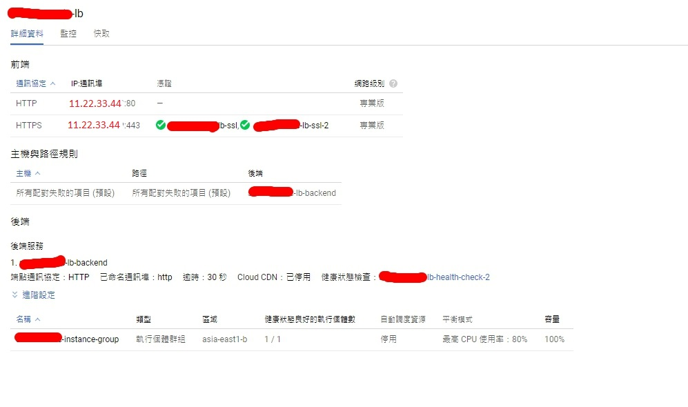

> 我把我專案名稱碼掉了...

> 這邊要注意到<b style="color: limegreen">綠色勾勾</b>，這可能要等20分鐘左右才會出現。
> 如果DNS沒設定好，讓domain找不到網站的話，他最後還會跳出**FAILED_NOT_VISIBLE**

等看到<b style="color: limegreen">綠色勾勾</b>以後，接著最後一步，就是godaddy設定DNS，把位址指到剛剛建立的IP就好。

> **省錢步驟**
> 記得最開始我們VM有掛上外部IP嗎？這時候他已經不需要了，沒用到的固定IP會被收取額外的費用
> 所以我們可以編輯VM設定，把**外部IP**取消，然後去**VPC網路 / 外部IP位址**釋放剛剛沒有用到的IP。
