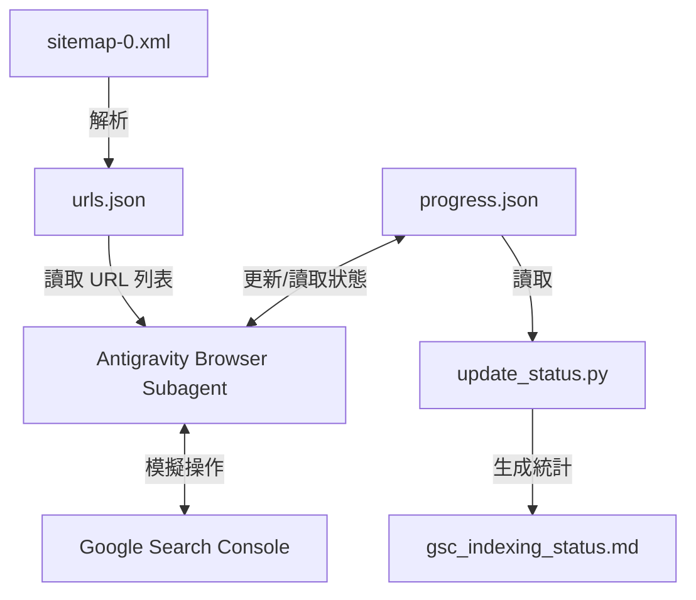
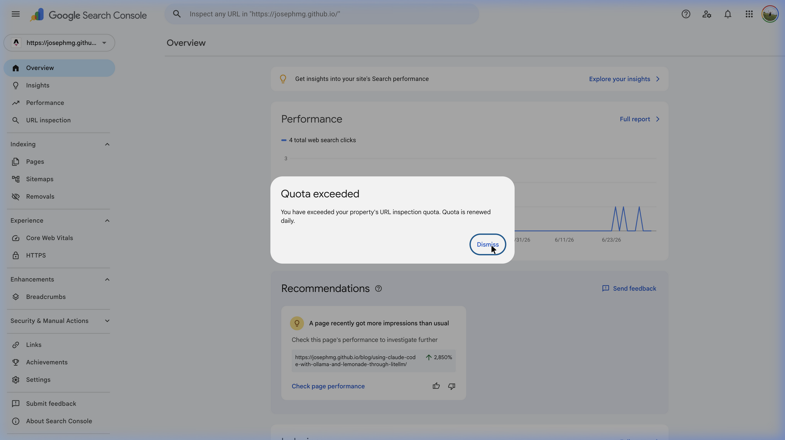

## 前言

最近把部落格從 Hexo 遷移到 Astro，重新整理了 Sitemap。然而，網址結構和路由變更後，最讓人頭痛的就是 SEO 的銜接問題。為了讓 Google 爬蟲以最快速度更新索引，我需要將 Sitemap 裡全部 **109 篇部落格文章** 一個個輸入到 Google Search Console (GSC) 進行網址審查 (URL Inspection)，並手動點擊「要求建立索引」(Request Indexing)。

「輸入網址 -> 等待載入 -> 點擊申請 -> 等待確認 -> 關閉彈窗」，這個流程手動重複 109 次，不僅耗時、枯燥，而且非常容易按錯。

於是，我決定把這個任務交給 AI 程式助手（也就是 Antigravity），我直接向他丟出了這句最原始的指令（Prompt）：

<!-- more -->

## TOC

> 💬 **我最一開始的 Prompt 需求：**
>
> 用瀏覽器把我 https://josephmg.github.io/sitemap-0.xml sitemap 每個 blog 文章塞入到 Google search console `https://search.google.com/search-console?resource_id=https://josephmg.github.io/` 上面的 inspect url 去，然後要點擊 `REQUEST INDEXING`。跑過的 url 跟有問題的 url 都幫我記錄起來，然後跳過往下一個：
>
> - 從 sitemap 整理一張 `/blog/*` 底下文章的列表，不要每次都重讀 sitemap
> - 一個一個填入 inspect url 檢查 URL
> - REQUEST INDEXING 成功、或者已經索引過的打勾
> - 失敗的打 x 紀錄
> - 下次重開可以從這個列表直接開始

Antigravity 收到後，便自動幫我設計了一個網頁自動化瀏覽器代理（Browser Subagent）！這篇文章將完整記錄 Antigravity 如何拆解這個自動化任務的設計架構、踩坑過程，以及我們如何處理 GSC 每日限額（Quota Exceeded）的挑戰。

---

## 自動化架構設計

我們需要一個具備**持久化狀態**、**可中斷重啟**，且能**自動處理網頁互動**的系統。基本架構如下：

1. **資料來源 (Urls list)**：從部落格的 `sitemap-0.xml` 抓取並解析所有部落格文章網址，輸出成一個 ordered list (`urls.json`)。
2. **狀態持久化資料庫 (Progress file)**：使用 `progress.json` 記錄每個 URL 的處理進度，包含索引狀態（如 `success (Already Indexed)`、`success (Requested Indexing)`、`quota_exceeded`、`not_found_404`）。
3. **自動化瀏覽器代理 (Antigravity Browser Subagent)**：Antigravity 內建的 Browser Subagent 會登入 Google Search Console，讀取 `urls.json` 與 `progress.json`，透過模擬點擊與鍵盤輸入逐一處理 Pending 網址。
4. **狀態看板產生器 (Checker script)**：寫一個 Python 腳本 (`update_status.py`)，隨時讀取 `progress.json` 並編譯成易讀的 Markdown 進度檢核表 (`gsc_indexing_status.md`)。



---

## 避坑指南與關鍵細節

在實作瀏覽器模擬操作的過程中，我們踩了幾個非常經典的「自動化網頁互動坑」：

### 1. 避開 GSC 的自動完成 (Autocomplete) 下拉選單

當我們點擊 GSC 頂部的搜尋框並輸入網址時，GSC 會非常「貼心」地跳出歷史網址或推薦網址的下拉選單。
如果腳本在輸入完後點擊了下拉選單的選項，很容易因為自動完成推薦了其他相似網址，導致**點進錯誤的文章網址**。

- **解決方案**：在搜尋框輸入完 EXACT URL 後，**直接模擬鍵盤按下 `Enter` 鍵送出**，絕對不要去點擊任何下拉選單。

### 2. 狀態持久化 (State Persistence)

由於 GSC 提交索引需要等待十幾秒的後端驗證，整個流程耗時較長，隨時可能因為網絡斷線、API 速率限制 (429) 或手動中止而中斷。
因此，腳本**每處理完一個網址，就必須立刻將結果寫回 `progress.json`**。如此一來，即使中途意外中止，重新啟動時只需讀取進度庫，便能無縫從上一個中斷點繼續執行，完全不重複浪費寶貴的額度。

---

## 面對 Google Search Console 的每日限額挑戰

這是整個專案最棘手的部分——**Google 的配額限制**。
GSC 對於單一資源 (Property) 設有兩種每日配額：

1. **網址審查配額 (URL Inspection Quota)**：通常每天數百次。
2. **建立索引要求配額 (Request Indexing Quota)**：通常每天只有 10 ~ 15 次。

當天配額用盡時，GSC 會彈出 `Quota exceeded` 的對話框：



> GSC 顯示：_You have exceeded your property's URL inspection quota. Quota is renewed daily._

### 我們的應對策略

當 AI Agent 偵測到 `Quota exceeded` 彈窗時，會自動執行以下步驟：

1. 點擊 Dismiss 關閉彈窗。
2. 將當前網址狀態標記為 `quota_exceeded (Not Indexed)`。
3. **終止後續的「要求建立索引」點擊動作**：對剩餘的所有 Pending 網址只進行檢索查看狀態，不再嘗試申請，避免頻繁彈窗與浪費執行時間。
4. **定時任務排程 (`/schedule`)**：由於 GSC 配額是依據世界協調時間 (UTC) 每日午夜（即台北時間早上 8:00）進行重置。我們可以在額度用盡後，自動建立排程任務，於隔天早上 8:00 後再次喚醒 Agent 繼續執行。

---

## 最終戰果

經過三天的「額度重置 -> 執行 -> 額度超限 -> 隔日再戰」循環，我們終於迎來了最終的甜美成果：

```
Updated gsc_indexing_status.md! Indexed: 109, Not Indexed: 0, Quota Exceeded: 0, Unprocessed: 0
```

- **Indexed / Requested**: `109 / 109` (100% 成功送出) 🎉
- **意外發現**：在檢索過程中，我們發現其中一個網址 `shopee-advertisement-setting/` 被 GSC 報了 **404 錯誤**。檢查後才發現是我們在搬家時遺漏了重導向，AI Agent 幫我們順便做了一次 SEO 健康檢查！

---

## 結語

在 AI Agent 時代，自動化不再只限於寫死死的 Python Selenium 或 Puppeteer 腳本。Antigravity 內建的 Browser Subagent 具備動態視覺規劃與 DOM 樹解析能力，我們只需要用自然語言描述目標，Antigravity 就能自動應對網頁佈局的變化、處理錯誤彈窗，甚至在遇到每日限額時進行優雅退避與排程任務（`/schedule`），隔天自動繼續執行。

如果你也有大量舊文章需要重新提交 Google 索引，不妨也嘗試看看用 Antigravity 來幫你打工吧！
