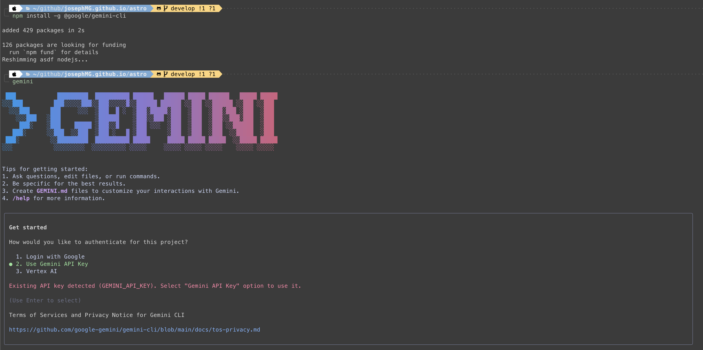
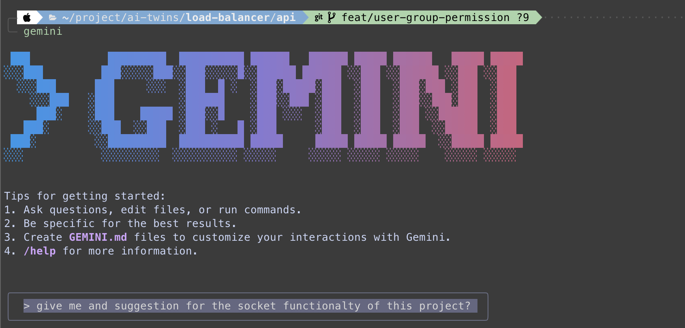

### Introduction

[Gemini CLI](https://github.com/google-gemini/gemini-cli) has been one of the most popular AI agents in the first half of 2025. It's similar to [Claude Code](https://docs.anthropic.com/zh-TW/docs/claude-code/overview), bringing its power directly into your terminal. Although other terminal AI agents exist, their pricing plans are quite different. Gemini CLI provides a [free tier](https://ai.google.dev/gemini-api/docs/rate-limits#free-tier) with 100 requests per day using Gemini 2.5 Pro, and you can unlock [Tier 1](https://ai.google.dev/gemini-api/docs/rate-limits#tier-1) by upgrading to a paid plan.

### Prerequisites

I'm going to use `npm` to install Gemini. My Node.js version is `v24.4.1`, and my npm version is `11.4.2`.

> Gemini needs Node.js version 20 or higher installed.

If you're using macOS, you can also choose `Homebrew` to install the Gemini CLI.

### Installation

Now, let's install it using `npm`. After installation, you can run `gemini` directly in your terminal.

> npm install -g @google/gemini-cli



I'm using the `Use Gemini API key` authentication method, so I need to [generate a key](https://aistudio.google.com/apikey) from Google AI Studio and set it in `.zshrc` (or `.bashrc`) by adding this line:

```
export GEMINI_API_KEY=YOUR_API_KEY
```

And then you can try Gemini now!

### Run some examples



Prompt: `give me suggestions for the socket functionality of this project?`

Response:

```markdown
✦ Thank you for sharing that. The architecture document is very clear. Using Clean Architecture with FastAPI is a solid foundation.

Given that this is a control plane for a load balancer, the most valuable use for WebSockets is to provide real-time observability and interactivity. Here are some specific suggestions for socket
functionality that would fit well with your existing architecture:

1. Real-time Health Check Monitoring
   Your system manages services and endpoints. A crucial next step is to know if they are online and healthy.

- How it would work: You could create a WebSocket endpoint like /ws/status. A background worker in your backend could periodically perform health checks on all registered ServiceConfigs. When a
  service's status changes (e.g., from "healthy" to "unhealthy"), the server pushes a JSON message to all connected clients (e.g., a UI dashboard).
- Benefit: Administrators get instant visual feedback on the state of their services without needing to constantly refresh a page or manually check endpoints.

2. Live Configuration Event Broadcasting
   When multiple users are managing the system, it's important that they all see the most current state.

- How it would work: After any use case that modifies a ServiceConfig, Group, or Endpoint (Create, Update, Delete), you could broadcast an event message over a general-purpose WebSocket like
  /ws/events. The message could specify the entity type and the change that occurred.
- Benefit: Any connected UI can listen for these events and intelligently update its state, ensuring all concurrent administrators have a consistent view of the system's configuration.

3. Real-time Log Streaming
   For debugging purposes, streaming logs from services in real-time is incredibly powerful.

- How it would work: You could implement a WebSocket endpoint like /ws/logs/{service_id}. When a client connects, the backend would start streaming logs for that specific service (e.g., by tailing a
  log file or using the Docker logs API for ContainerService).
- Benefit: Provides a powerful, integrated debugging tool directly within your management application, saving developers time and effort.

4. Live Traffic & Performance Metrics
   Since this is a load balancer API, providing insight into the traffic it's managing is a natural fit.

- How it would work: This is more advanced, as it would require your actual load-balancing data plane to push metrics (e.g., requests per second, error rates, active connections) to your API backend,
  perhaps via a message queue like Redis. Your FastAPI app could then broadcast these metrics over a WebSocket like /ws/metrics to be displayed on live charts.
- Benefit: Delivers a real-time dashboard for monitoring application performance and health, which is a key feature for any serious load balancer.

FastAPI has excellent native support for WebSockets (https://fastapi.tiangolo.com/advanced/websockets/), making the implementation of these features quite straightforward within your existing
structure. You could add a new websockets directory in the presentation layer for each module.

Would you like me to elaborate on any of these suggestions or perhaps draft a small code example for one of them, like the health check monitor?
```

### Conclusion:

The Gemini installation is very simple. Although I am using Neovim with [Avante](https://github.com/yetone/avante.nvim), Gemini gives me more power to use the terminal. Next, I will explore how to use Gemini with an MCP server and integrate the workflow into my daily tasks.
