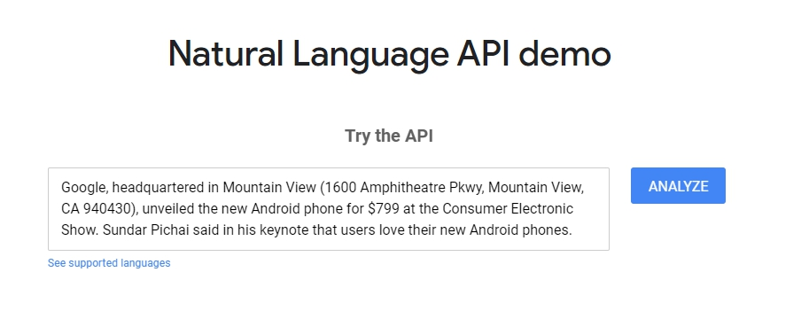
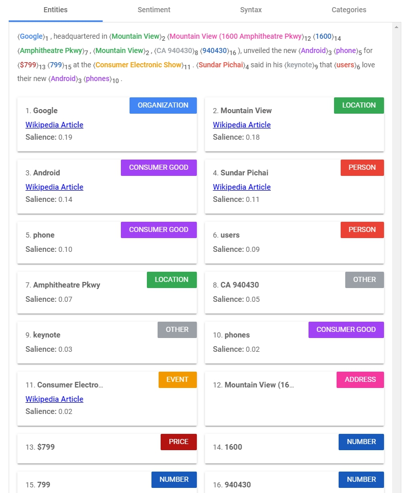
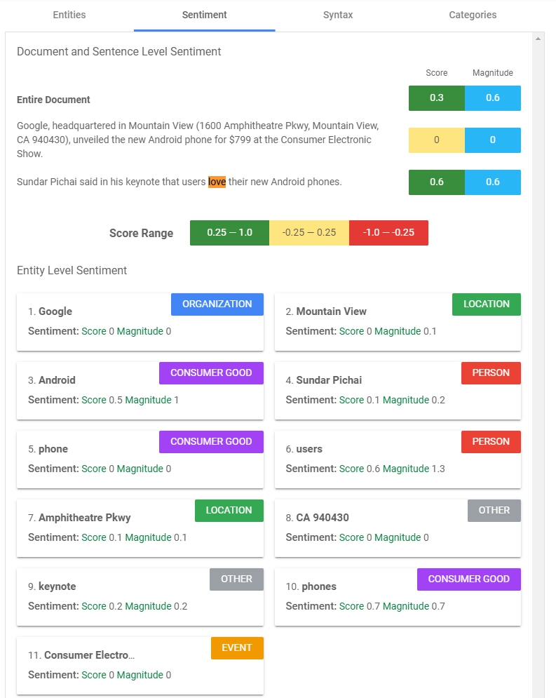
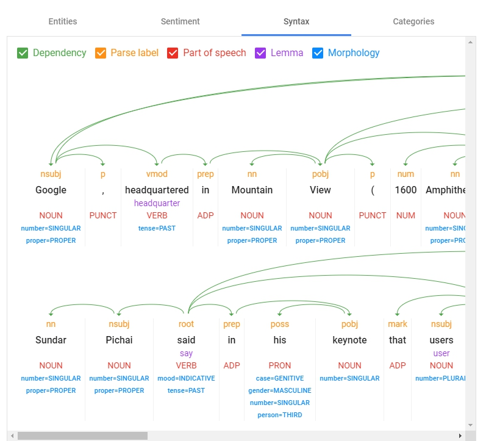
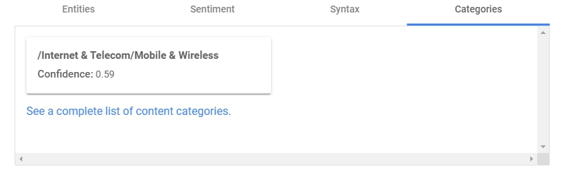
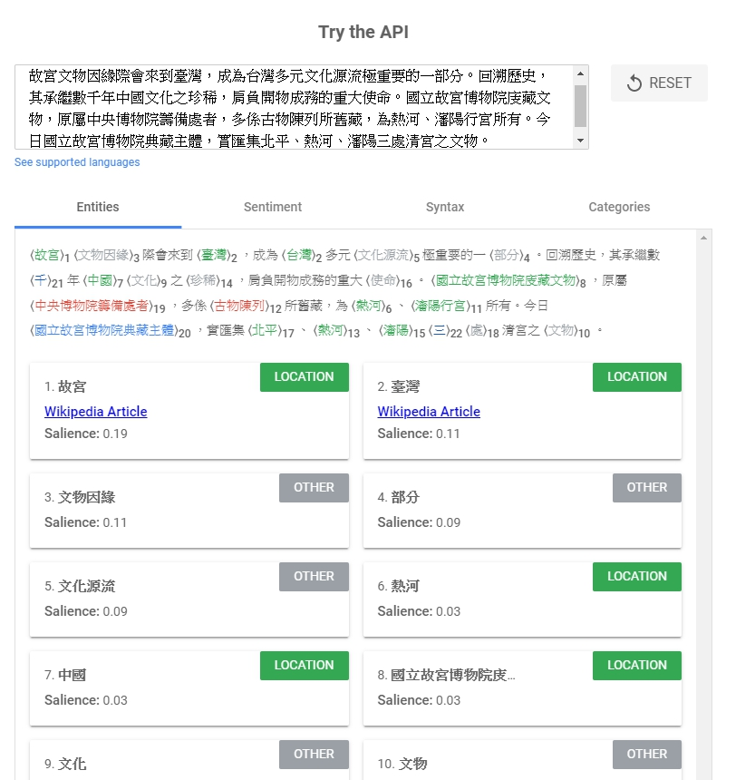

今天是[Natural Language](https://cloud.google.com/natural-language/)的第一篇，這是一個可以用來分析語意並萃取出你要的資訊的工具。跟前面的服務一樣，也分成AutoML Natural Language跟Natural Language API。
- [AutoML Natural Language](https://cloud.google.com/natural-language/docs/quickstart)：提供一個UI介面訓練自己的Model，並用自己的Model做語意分析、詞彙分類之類的工作。
- [Natural Language API](https://cloud.google.com/natural-language/docs/quickstart)：用預先訓練好的API直接給你基本的分析，讓我們更快理解Natural Language的語意、詞彙、內容分析之類的功能。
<!-- more -->

### Try the demo
好，我們也是先來玩看看它個[Demo](https://cloud.google.com/natural-language/#natural-language-api-demo)。

範例裡已經預先載好一段文字，我們就直接跑分析看看。這邊很快地分析出了一些資訊：
#### Entities

一段文字丟進去以後，快速的找到了**ORGANIZATION**、**LOCATION**、**ADDRESS**、**PERSON**、**PRICE**等等的資訊。
> 值得注意的是有個**Salience**：Salience shows importance or centrality of an entity to the entire document text, ranges from 0 (less salient) to 1 (highly salient).)
> 意思是對整段文字的重要性。

#### Sentiment

> Score = [-1.0, 1.0], Magnitude = [0, inf)
分成段落及Entities的情緒分析，整個文章可以看出第一段比較沒什麼情緒，但第二段被判斷有正向情緒。
下半段則顯示有哪些Entities有情緒及強度，可以看出`users`、`phones`這兩個字有較高的情緒與強度。

#### Syntax

這邊分析整個文章的結構，分兩段，所以有兩張結構圖。並分析出`Dependency依賴關係`、`Parse Label`、`Part of speech詞性`、`Lemma(感覺是從哪變化而來)`、`Morphology型態`。是一個對字詞結構分析很有幫助的工具

#### Categories

這邊是分析這是屬於哪個類型的文章，判斷以後AI給他分類為`/Internet & Telecom/Mobile & Wireless`也是滿準確的。
> 這邊有更多的分類：https://cloud.google.com/natural-language/docs/categories

這篇文章差不多結束，最後來玩一下中文分析，我從[故宮](https://www.npm.gov.tw/Article.aspx?sNo=03001502)官網簡介第一段擷取下來，貼進去語意分析看看結果。

在`Sentiment`跟`Categories`的部分還不是很支援，但`Entities`跟`Syntax`倒是都可以看到結果。

OK，今天工作提早結束，謝謝大家。
