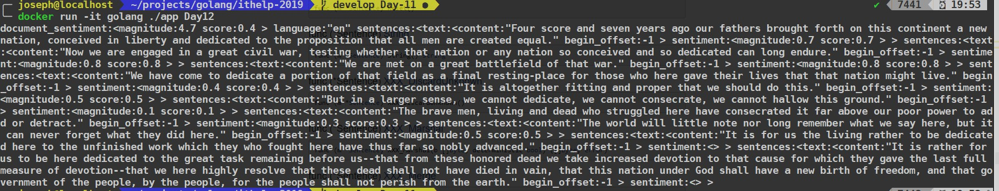
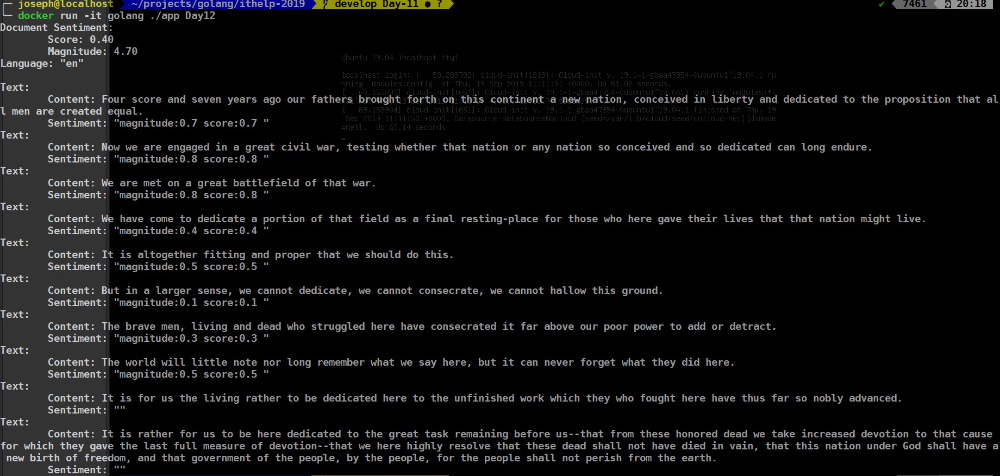
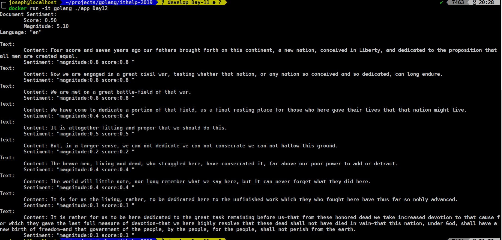

今天來Google Natural Language第三篇，我本來想按照Natural Language裡[分析情緒](https://cloud.google.com/natural-language/docs/analyzing-sentiment)這個部分實作，可是看完以後發現它code有點短，只有下面這樣：
```golang
func analyzeSentimentFromGCS(ctx context.Context, gcsURI string) (*languagepb.AnalyzeSentimentResponse, error) {
        return client.AnalyzeSentiment(ctx, &languagepb.AnalyzeSentimentRequest{
                Document: &languagepb.Document{
                        Source: &languagepb.Document_GcsContentUri{
                                GcsContentUri: gcsURI,
                        },
                        Type: languagepb.Document_PLAIN_TEXT,
                },
        })
}
```
<!-- more -->
遲遲找不到適合的範例，恰巧看到[Natural Language基礎知識](https://cloud.google.com/natural-language/docs/basics?hl=zh-tw)有一個`蓋茨堡宣言`的範例，gcsURI是`gs://cloud-samples-tests/natural-language/gettysburg.txt`，我把gcsURI帶入`gs://cloud-samples-tests/natural-language/gettysburg.txt`，發現跑出來結果很難閱讀


好吧，就照著之前Video跟Vision那樣，把它改寫得比較好閱讀一點：
```golang
func AnalyzeSentiment(gcsURI string) error {
  ctx := context.Background()

  // Creates a client.
  client, err := language.NewClient(ctx)
  if err != nil {
    log.Fatalf("Failed to create client: %v", err)
    return err
  }
  op, err := client.AnalyzeSentiment(ctx, &languagepb.AnalyzeSentimentRequest{
    Document: &languagepb.Document{
      Source: &languagepb.Document_GcsContentUri{
        GcsContentUri: gcsURI,
      },
      Type: languagepb.Document_PLAIN_TEXT,
    },
  })
  if err != nil {
    return err
  }

  fmt.Printf("Document Sentiment:\n")
  fmt.Printf("\tScore: %.2f\n", op.DocumentSentiment.Score)
  fmt.Printf("\tMagnitude: %.2f\n", op.DocumentSentiment.Magnitude)
  fmt.Printf("Language: %q\n\n", op.Language)
  for _, annotation := range op.Sentences {
    text := annotation.GetText()
    fmt.Printf("Text:\n")
    fmt.Printf("\tContent: %s\n", text.Content)
    fmt.Printf("\tSentiment: %q\n", annotation.Sentiment)
  }

  return nil
}
```

再丟入一樣的`蓋茨堡宣言`進去運算以後，我們再來看看漂亮的output。


但我始終算不出[Natural Language基礎知識](https://cloud.google.com/natural-language/docs/basics?hl=zh-tw#sentiment-request)裡的`{score: 0.2, magnitude: 3.6}`。靈機一動看看[其他版本](https://en.wikipedia.org/wiki/Gettysburg_Address#Text_of_the_Gettysburg_Address)的宣言，來研究一下其他結果。


嗯？都是`蓋茨堡宣言`，竟然結果不完全一樣，可以看到最後兩段gcs沒辨識出來，但wiki上的有結果，不過每個句子的比重差不多，可能是不同結構造成的誤差，剩下就看實際使用時的情境去做調整。

好了，今天是個很有實驗精神的一篇，測了不同的`蓋茨堡宣言`、改寫了範例程式。
今天就到這邊了，這是今天的Github: https://github.com/josephMG/ithelp-2019/tree/Day-12 。謝謝大家~
