我們今天玩的是AutoML Natural Language，可以透過GCP左邊的sidebar，找到Natural Language打開，或直接點[這個連結](https://console.cloud.google.com/natural-language)
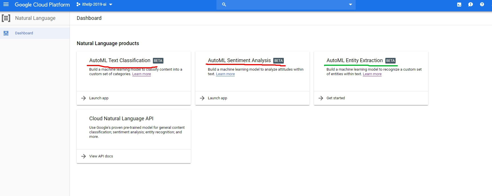

> AutoML Natural Language的收費方式記得先看這裡：https://cloud.google.com/natural-language/automl/pricing?_ga=2.125750730.-1764044900.1562297905

<!-- more -->

這邊很有意思的是在`AutoML Text Classification`跟`AutoML Sentiment Analysis`(圖中兩個紅色的項目)在寫文章的時候，如果你驗證的不是google的第一個帳號，而是選其他帳號登入的話，允許授權後會一直跳500錯誤。

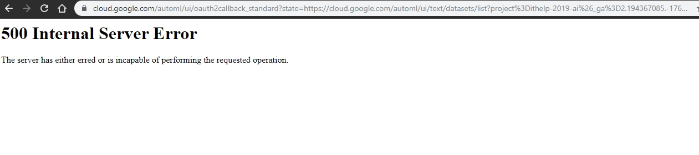

沒關係，這部份我們就選`AutoML Entity Extraction`，就玩他這個功能，至少他的授權是成功的。
然後我們就照這份[Quickstarts](https://cloud.google.com/natural-language/automl/entity-analysis/docs/quickstart)來操作，裡面也有範例檔案`gs://cloud-ml-data/NL-entity/dataset.csv`

那我們就來New一個dataset吧！
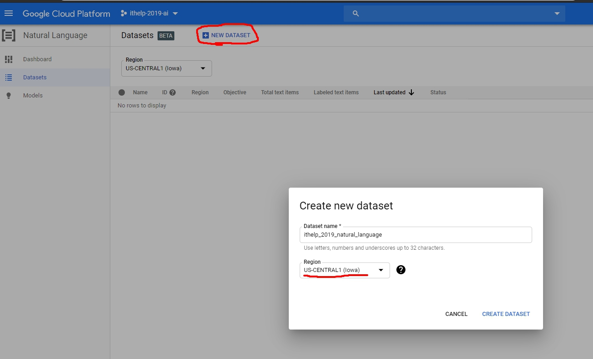

Import是吃一個CSV檔案，也有提供檔案格式，我們載下來的檔案長這個樣子
```shell
TRAIN,gs://cloud-ml-data/NL-entity/train.jsonl
TEST,gs://cloud-ml-data/NL-entity/test.jsonl
VALIDATION,gs://cloud-ml-data/NL-entity/validation.jsonl%
```
前面的SET可加可不加，但後面要個別帶入jsonl的資料集。輸入後長下面這樣
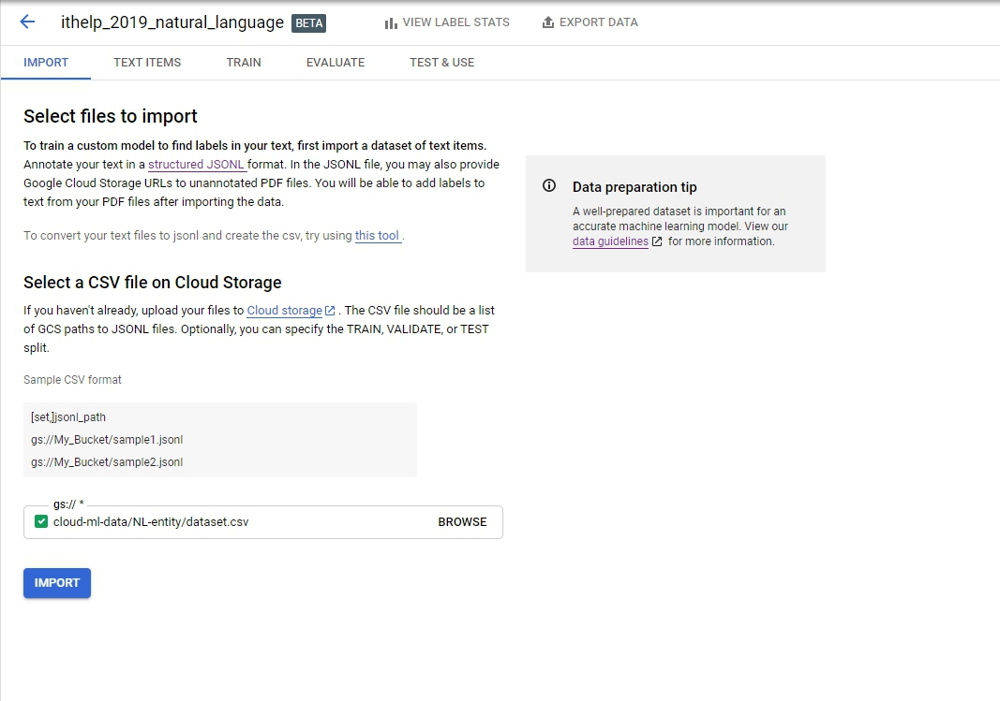

經過一段時間的`Processing text items`(大概10分鐘)，就會有結果
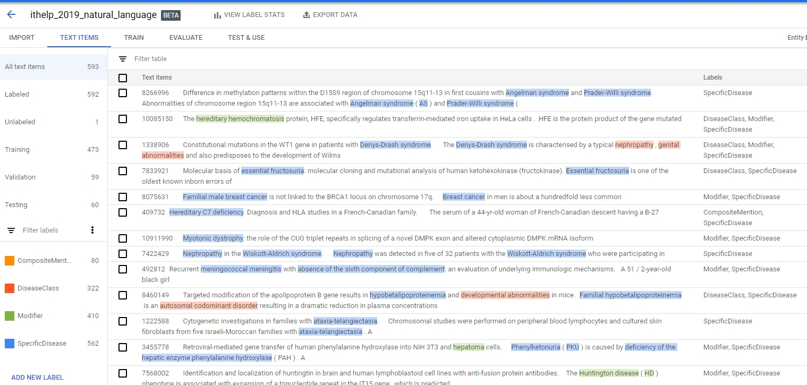
至於這些label怎麼來的？我們就來看看jsonl裡面的內容吧。
```
{"annotations": [{"text_extraction": {"text_segment": {"end_offset": 54, "start_offset": 27}}, "display_name": "SpecificDisease"}, {"text_extraction": {"text_segment": {"end_offset": 173, "start_offset": 156}}, "display_name": "SpecificDisease"}, {"text_extraction": {"text_segment": {"end_offset": 179, "start_offset": 176}}, "display_name": "SpecificDisease"}, {"text_extraction": {"text_segment": {"end_offset": 246, "start_offset": 243}}, "display_name": "Modifier"}, {"text_extraction": {"text_segment": {"end_offset": 340, "start_offset": 337}}, "display_name": "Modifier"}, {"text_extraction": {"text_segment": {"end_offset": 698, "start_offset": 695}}, "display_name": "Modifier"}], "text_snippet": {"content": "1301937\tMolecular basis of hexosaminidase A deficiency and pseudodeficiency in the Berks County Pennsylvania Dutch.\tFollowing the birth of two infants with Tay-Sachs disease ( TSD ) , a non-Jewish , Pennsylvania Dutch kindred was screened for TSD carriers using the biochemical assay . A high frequency of individuals who appeared to be TSD heterozygotes was detected ( Kelly et al . , 1975 ) . Clinical and biochemical evidence suggested that the increased carrier frequency was due to at least two altered alleles for the hexosaminidase A alpha-subunit . We now report two mutant alleles in this Pennsylvania Dutch kindred , and one polymorphism . One allele , reported originally in a French TSD patient ( Akli et al . , 1991 ) , is a GT-- > AT transition at the donor splice-site of intron 9 . The second , a C-- > T transition at nucleotide 739 ( Arg247Trp ) , has been shown by Triggs-Raine et al . ( 1992 ) to be a clinically benign \" pseudodeficient \" allele associated with reduced enzyme activity against artificial substrate . Finally , a polymorphism [ G-- > A ( 759 ) ] , which leaves valine at codon 253 unchanged , is described  .\n "}}
```
> [jsonl](http://jsonlines.org/)就是把json一列一列表達的一種格式
>  
這是train.jsonl裡的第一筆資料，就是對content裡的文字把開始跟結束index的範圍框起來，給他一個label。舉例來說`{"end_offset": 54, "start_offset": 27}`給他`SpecificDisease`這個label，而27~54就是`hexosaminidase A deficiency`這個字，看明白點就是下圖的結果。
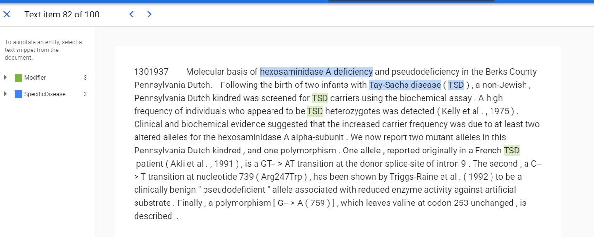

好，接下來就train了，**訓練前要注意他有建議至少要100個annotation**：
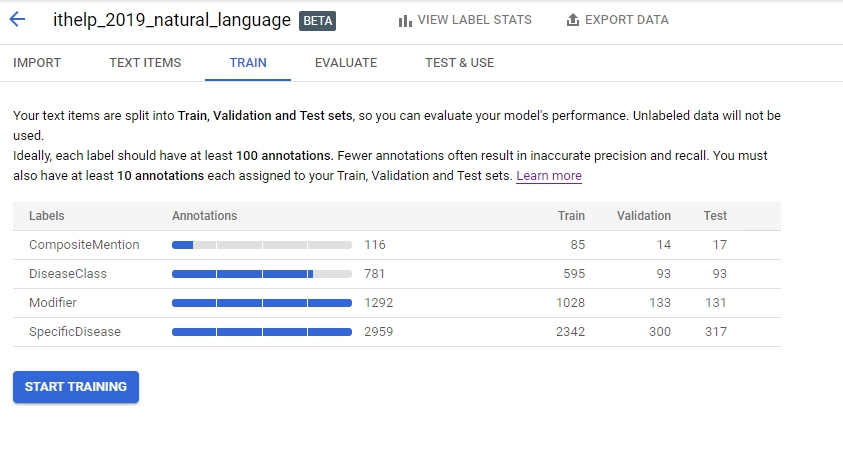

然後又要經過一段時間的訓練...。大概跑了三個小時之久，你才會看到完成的結果。
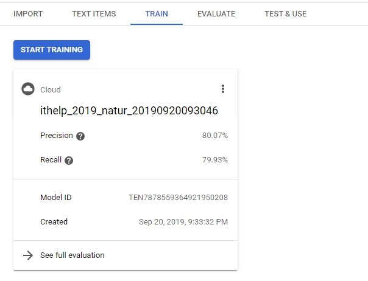

Evaluate的部分可以看到model result，裡面包含`recall`、`precision`，還可以看到每個label的`true positive`、`False positives`、`False negative`等等，就可以依照結果去做調整。
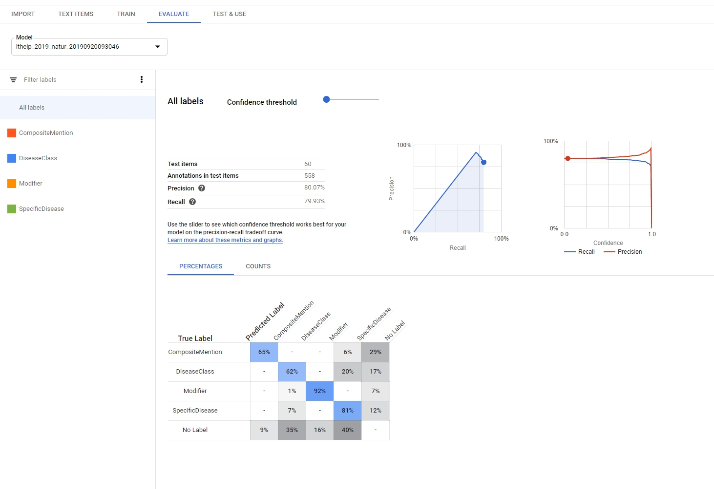

最後到了`Test & Use`階段，這邊記得要把Model deploy才能做接下來的操作。按下`Predict`以後就可以看到預測結果了~
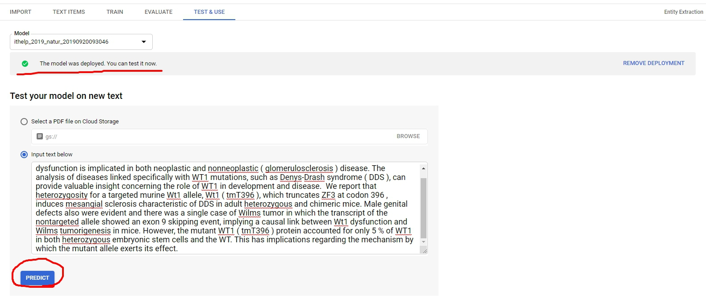
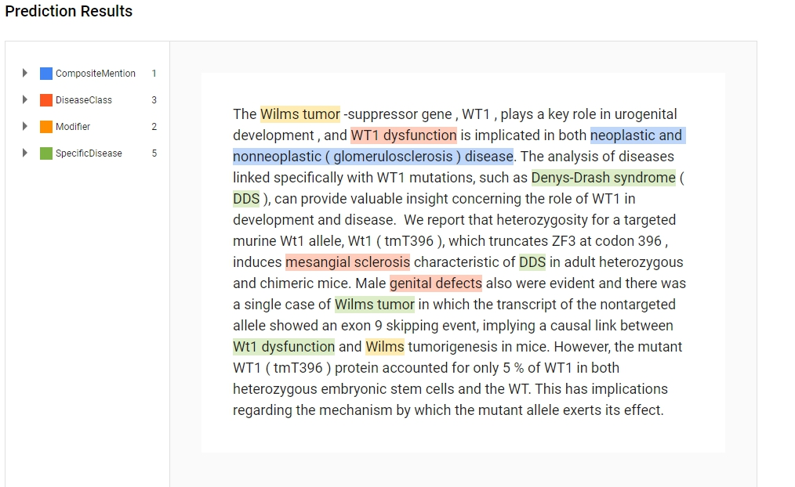

好囉，今天就寫到這邊。model跑得比我想像中的還久，而且又遇到有些GCP服務不能用，很令人尷尬的一次經驗。
OK，謝謝大家的觀看。
