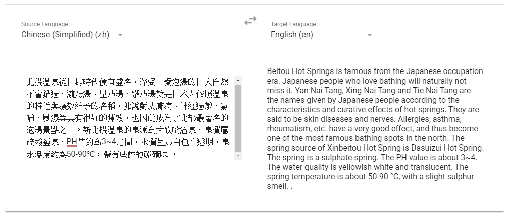
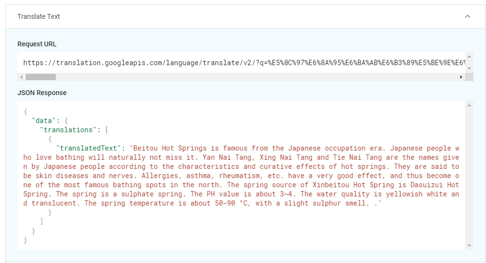
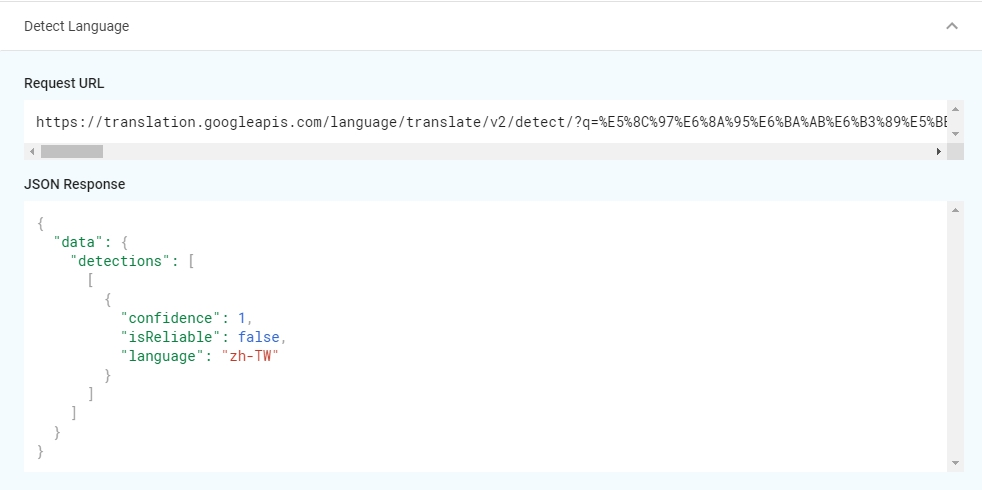
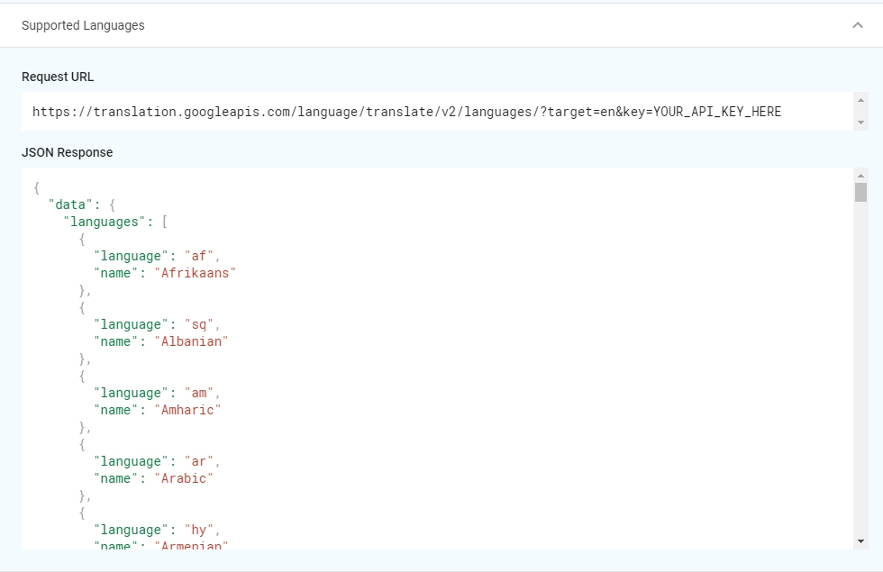

OK，今天要講一個大家常用，卻不一定知道他是Google AI & ML products之一的服務，[Google Translation API](https://cloud.google.com/translate/)。

他有什麼東西？他跟前面介紹的服務一樣，也分成兩個服務`AutoML Translation`與`Translation API`：
- [AutoML Translation](https://cloud.google.com/translate/automl/docs/beginners-guide)：透過UI介面讓一些比較沒這麼深入了解AI & ML的人可以快速操作，僅僅只要上傳固定格式的檔案，就可以訓練出你自己的model。
- [Translation API](https://cloud.google.com/translate/docs/)：透過API呼叫，可以讓你的服務**馬上**翻譯成多國語言，就有點像是在網頁上面串上Google翻譯那樣，點個兩下就做完多國語系(姑且不論正確性的問題，哈哈哈。)
<!-- more -->

### Translation API Demo
每個子系列的第一篇，都要來玩玩Demo，當然Translation API也不例外，我們趕快到[這邊](https://cloud.google.com/translate/#translation-api-demo)來看看。

點了點Demo以後，才知道他不是單純的A語言進去、B語言出來。他其實下面噴了3隻API的結果，讓我們來一個一個看看。
- Translate Text

> Request URL: `https://translation.googleapis.com/language/translate/v2/?q=SOME_TEXT&source=zh&target=en&key=YOUR_API_KEY_HERE`
仔細看他的Request URL，吃了source、target、還有q，就是把q的內容從source翻譯成target。

#### Detect Language

> Request URL：`https://translation.googleapis.com/language/translate/v2/detect/?q=SOME_TEXT&key=YOUR_API_KEY_HERE`
Google訓練已久的翻譯功能(我們默默地幫忙Train了很久)，用這隻API可以讓他快速知道你丟進去的是什麼語言。

#### Supported Languages

> Request URL：`https://translation.googleapis.com/language/translate/v2/languages/?target=en&key=YOUR_API_KEY_HERE`
可以用這隻API告訴你有哪些語言提供給你讓你翻譯，也就是除了英文，還能翻譯成`Afrikaans`、`Albanian`、`Amharic`等等。

到了這邊要進入尾聲，看起來不是這麼單純的一個服務，再來要看看明天的Code可以蹦出什麼火花。
OK，今天就到這邊結束，謝謝大家。
