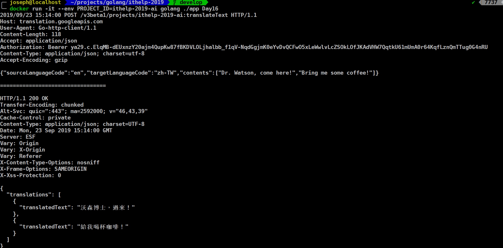

還記得[昨天](https://ithelp.ithome.com.tw/articles/10219304)在串API的時候，有特別提到Google Translate API在Go client library沒有`v3beta1`的版本。秉持著練習golang的精神，看到`v3beta1`有RESTful API，就花了點時間來串一下。

### [Google translate API v3](https://cloud.google.com/translate/docs/translating-text-v3)
我這邊參考的是`Using the command line`的內容，使用CURL的方式呼叫，並把他改寫成Go [req](https://github.com/imroc/req) (http client)這類型的RESTful API call。仔細想想，要解決的問題有兩個：1. Get Access token、2. 呼叫restful api。
<!-- more -->

#### 1. Get Access token
> 參考資料：https://godoc.org/golang.org/x/oauth2/google#example-JWTConfigFromJSON
我這邊先建立一個auth模組，並把`credential json file`傳入到裡面的`ServiceAccount` func，然後回傳一個`token` struct，
```golang
package auth

import (
  "io/ioutil"

  "golang.org/x/oauth2"
  "golang.org/x/oauth2/google"
)

func ServiceAccount(credentialFile string) (*oauth2.Token, error) {
  b, err := ioutil.ReadFile(credentialFile)
  if err != nil {
    return nil, err
  }
  config, _ := google.JWTConfigFromJSON(b, "https://www.googleapis.com/auth/cloud-translation")

  token, err := config.TokenSource(oauth2.NoContext).Token()
  if err != nil {
    return nil, err
  }

  return token, nil
}
```

#### 2. 呼叫restful api
這樣就有AccessToken了，再來看看CURL該怎麼呼叫
```shell
curl -X POST \
-H "Authorization: Bearer TOKEN" \
-H "Content-Type: application/json; charset=utf-8" \
-d @request.json \
https://translation.googleapis.com/v3beta1/projects/PROJECT_ID:translateText
```

而request.json則是 `{"sourceLanguageCode": "en", "targetLanguageCode": "ru", "contents": ["Dr. Watson, come here!", "Bring me some coffee!"]}`

翻譯的時候會打一隻`POST`到 `https://translation.googleapis.com/v3beta1/projects/PROJECT_ID:translateText`，帶著`sourceLanguage`、`targetLanguageCode`、`contents`，再呼叫的時候需要額外的PROJECT_ID，我這邊選擇用環境變數帶進去。

好，有這些知識以後，我們開始來寫呼叫的方法，直接寫在translation模組裡。

```golang
func TranslateTextV3Beta1(text []string) error {
  token, _ := auth.ServiceAccount("./authentication.json")

  header := req.Header{
    "Accept":        "application/json",
    "Content-Type":  "application/json; charset=utf-8",
    "Authorization": "Bearer " + token.AccessToken,
  }

  body := struct {
    SourceLanguageCode string   `json:"sourceLanguageCode"`
    TargetLanguageCode string   `json:"targetLanguageCode"`
    Contents           []string `json:"contents"`
  }{
    SourceLanguageCode: "en",
    TargetLanguageCode: "zh-TW",
    Contents:           text,
  }
  json_string, _ := json.Marshal(body)

  param := req.BodyJSON(json_string)
  // only url is required, others are optional.
  r, err := req.Post(
    fmt.Sprintf("https://translation.googleapis.com/v3beta1/projects/%s:translateText", os.Getenv("PROJECT_ID")),
    header,
    param,
  )
  if err != nil {
    log.Fatal(err)
  }
  log.Printf("%+v", r) // print info (try it, you may surprise)

  return nil
}
```

這有幾個重點：
- 從auth模組裡的`ServiceAccount`得到token
- 產生`header`把AccessToken帶入
- 建立body struct，然後透過這個body產生json `param`
- 呼叫req.POST，先從`os.Getenv`取得PROJECT_ID，並帶入`header`、`params`
- 然後得到response `r`。

那來看看output吧：
> docker以`docker run -it --env PROJECT_ID=ithelp-2019-ai golang ./app Day16`執行


過程中第一次建立Struct並轉換成JSON、第一次使用req之類的http client，讓我對Golang的語法又更熟悉了一些。
> 詳細github可以看這邊：https://github.com/josephMG/ithelp-2019/tree/Day-16
OK，今天就到這邊，謝謝大家的觀看。
