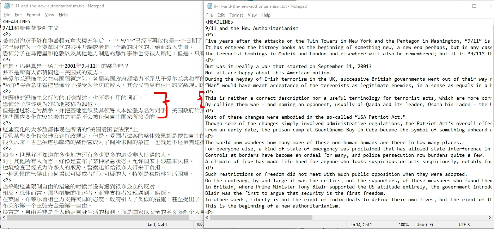
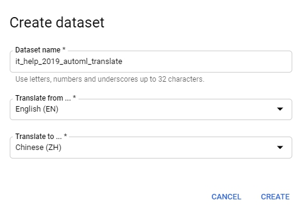
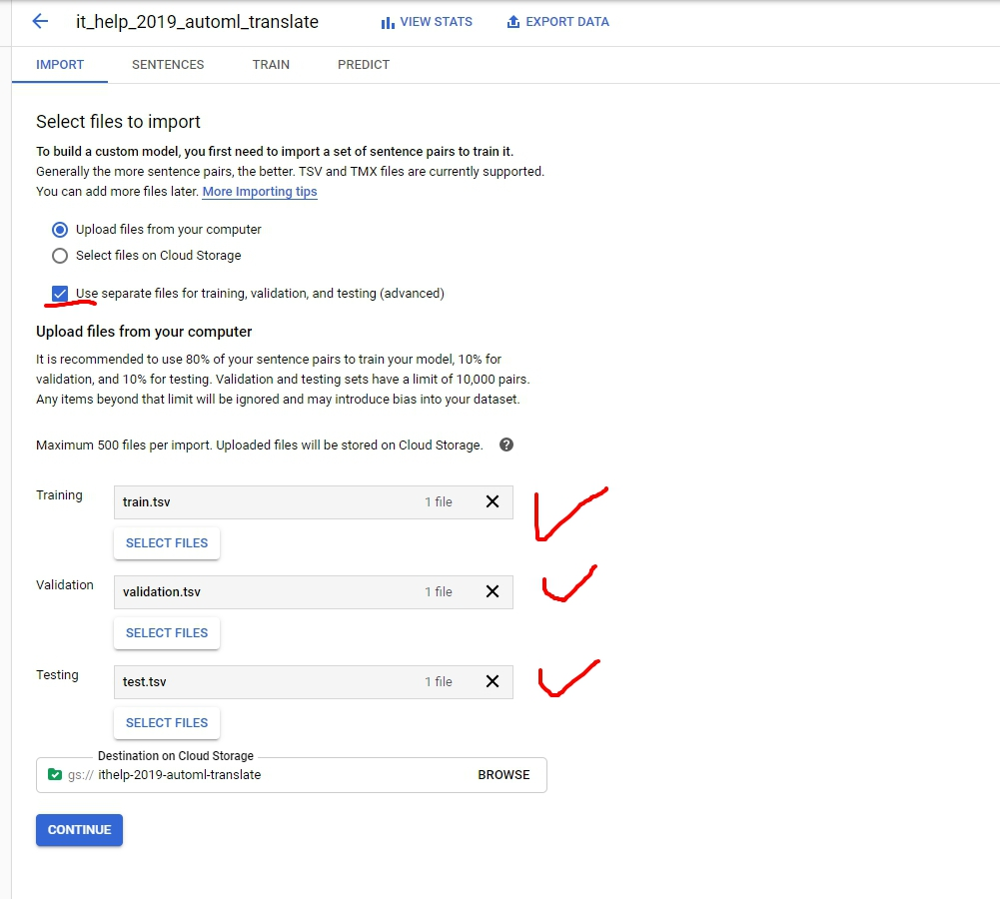
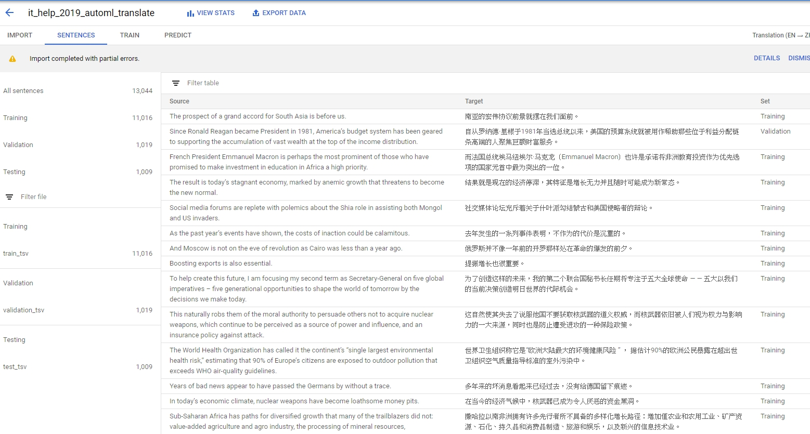
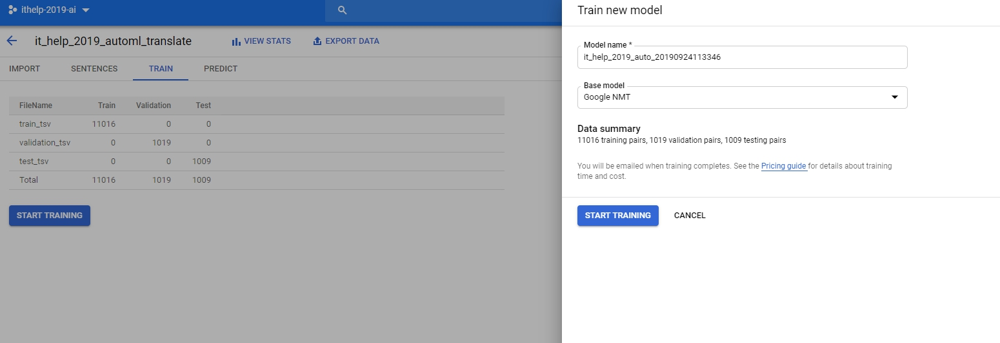

今天要講[AutoML translation](https://cloud.google.com/translate/automl/docs/)的部分，這部分在官網上一直沒找到對應的範例，很有可能範例要自己生。我只好自己在網路上找些翻譯的dataset，幸好在[這邊](http://www.statmt.org/wmt19/translation-task.html#download)有找到很多很多的資料集，只需要做一些資料處理的動作，現在就來先處理一下。

> 我下載的資料集：[News Commentary](http://data.statmt.org/news-commentary/v14/)，並取出中文跟英文的部分。

<!-- more -->

#### 處理資料
觀察一下原始資料你會發現，他基本上是透過`<P>`來做分隔，然後大概看一下，我做了一個基本假設**每一列就是對應的翻譯**。有了這個假設，我就要先把`<P>`跟`<P>`之間行數不一樣的部分刪除掉(像圖中紅色的地方要)，留下一樣的部分就好。


好來看看code：
```golang
func procTranslateFiles() {
  var (
    root            string = "./testdata/translate"
    validationCount int    = 0
    testCount       int    = 0
    trainCount      int    = 0
  )
  files, err := ioutil.ReadDir(root + "/en")
  if err != nil {
    log.Fatal(err)
  }

  for _, file := range files {
    fmt.Println(file.Name())
    if _, err := os.Stat(root + "/zh/" + file.Name()); err == nil {
      // 先把有英文也有中文的檔案，分別讀到`enLines`、`zhLines`
      var enLines, enErr = readLines(root + "/en/" + file.Name())
      var zhLines, zhErr = readLines(root + "/zh/" + file.Name())
      if enErr != nil || zhErr != nil {
        continue
      }
      
      //刪掉行數不一樣的部分
      enLines, zhLines = normalizeLines(enLines, zhLines)
      
      //塞入tsv data
      if trainCount < 11000 {
        trainCount += len(enLines)
        writeCSV(root+"/train.tsv", enLines, zhLines)
      } else if testCount < 1000 {
        testCount += len(enLines)
        writeCSV(root+"/test.tsv", enLines, zhLines)
      } else if validationCount < 1000 {
        validationCount += len(enLines)
        writeCSV(root+"/validation.tsv", enLines, zhLines)
      } else {
        fmt.Println("Done!")
        break
      }
    }
  }
}
```

> 因為是透過docker執行，所以執行時記得帶上 `-v` mount volumes
> e.g., `docker run -v ${PWD}/testdata:/app/testdata -it golang ./app Day17`

> 詳細的code可以看github：https://github.com/josephMG/ithelp-2019/blob/Day-17/main.go


確認一下，每個檔案行號都夠training。

#### train
好囉，回到[GCP AutoML Translate](https://console.cloud.google.com/translatio)，我們先建立一個dataset。

你會注意到建立的時候要你選source language & target language。


接下來import data，這邊比較人性化一點，讓我們可以分開上傳tsv。否則你會需要傳一個csv上去，裡面指定你tsv的位置，格式如下：
```shell
TRAIN,gs://my-project-vcm/csv/en-fr-train.tsv
VALIDATION,gs://my-project-vcm/csv/en-fr-validation.tsv
TEST,gs://my-project-vcm/csv/en-fr-test.tsv
```
> 記得`Destination on Cloud Storage`要選region `us-central1`

接下來你就會看到很久的**Processing sentence pairs.....**，匯完以後你會看到一堆sentences，還有他們的label。


然後呢，我們就進入到train了。


操作過前面文章的應該就知道，開始訓練又是幾個小時以後才能結束。
所以今天就到這邊，就姑且不論訓練結果好壞，之後的優化就留到實際有自己data的時候再做吧！
> 今天的github在這：https://github.com/josephMG/ithelp-2019/tree/Day-17

好，今天就到這邊了，謝謝各位的觀看。
