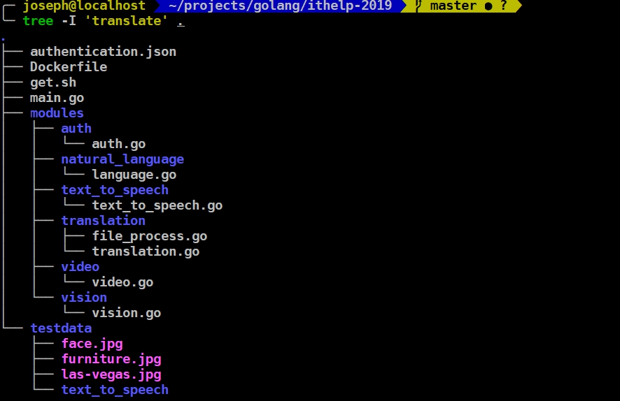
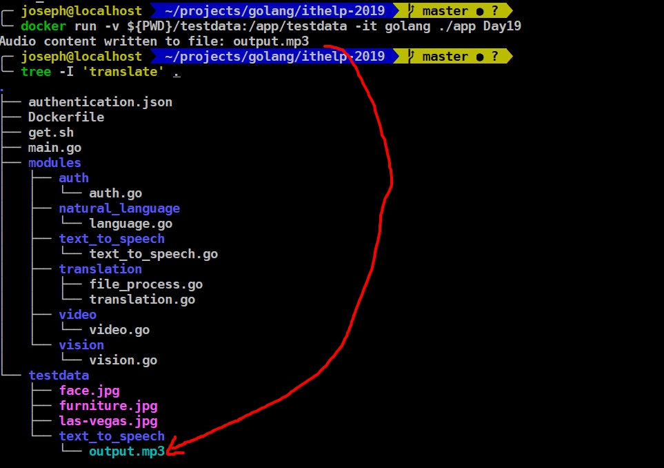

昨天玩完Cloud Text-to-Speech demo以後，大概知道他可以把文字轉成語音念給你聽。今天就來入門[Cloud Text-to-Speech API](https://cloud.google.com/text-to-speech/docs/?hl=zh-tw)吧。

> 前情提要：記得先[Enable API](https://console.cloud.google.com/apis/library)，放置環境變數的教學可以看[這系列第三天](./ithelp-2019-day3)的文章
> 語言一樣使用Golang，然後跑在docker裡，之後也會放上github
<!-- more -->

這邊因為需要output一個檔案，但在docker裡面不好直接拿出來，所以在run的時候使用了-v `mount`，先來看一下檔案目錄：


我這邊就會Mount `testdata/text_to_speech`到docker，指令如下
> `docker run -v ${PWD}/testdata:/app/testdata -it golang ./app Day19`

好，現在來看看code吧：
```golang
package text_to_speech

import (
  "context"
  "fmt"
  "io/ioutil"
  "log"

  texttospeech "cloud.google.com/go/texttospeech/apiv1"
  texttospeechpb "google.golang.org/genproto/googleapis/cloud/texttospeech/v1"
)

func ConvertToSpeech(text string) {
  var root string = "./testdata/text_to_speech"
  // Instantiates a client.
  ctx := context.Background()

  client, err := texttospeech.NewClient(ctx)
  if err != nil {
    log.Fatal(err)
  }

  // Perform the text-to-speech request on the text input with the selected
  // voice parameters and audio file type.
  req := texttospeechpb.SynthesizeSpeechRequest{
    // Set the text input to be synthesized.
    Input: &texttospeechpb.SynthesisInput{
      InputSource: &texttospeechpb.SynthesisInput_Text{Text: text},
    },
    // Build the voice request, select the language code ("en-US") and the SSML
    // voice gender ("neutral").
    Voice: &texttospeechpb.VoiceSelectionParams{
      LanguageCode: "en-US",
      SsmlGender:   texttospeechpb.SsmlVoiceGender_NEUTRAL,
    },
    // Select the type of audio file you want returned.
    AudioConfig: &texttospeechpb.AudioConfig{
      AudioEncoding: texttospeechpb.AudioEncoding_MP3,
    },
  }

  resp, err := client.SynthesizeSpeech(ctx, &req)
  if err != nil {
    log.Fatal(err)
  }

  // The resp's AudioContent is binary.
  filename := "output.mp3"
  err = ioutil.WriteFile(root+"/"+filename, resp.AudioContent, 0644)
  if err != nil {
    log.Fatal(err)
  }
  fmt.Printf("Audio content written to file: %v\n", filename)
}
```

中間有一個`AudioConfig`這是可以注意一下的地方，在[文件](https://godoc.org/google.golang.org/api/texttospeech/v1beta1#AudioConfig)裡她有很多參數可以設定：
- AudioEncoding：選擇輸出格式
- EffectsProfileId：按照[這邊](https://cloud.google.com/text-to-speech/docs/audio-profiles)的說明，他能為不同Device所產生的output做優化。
- Pitch、SampleRateHertz、SpeakingRate、VolumeGainDb：都是一些在音訊領域常用到的常數
- ForceSendFields、NullFields：使用在Patch request，可以修改一些default的API request fields。

好，我們就來看看output吧。

多了一個`output.mp3`。我只能讓你們看的到，要聽的話自己操作看看吧~

OK，今天的文章就到這邊，謝謝你的觀看。
> 今天的github：https://github.com/josephMG/ithelp-2019/tree/Day-19
