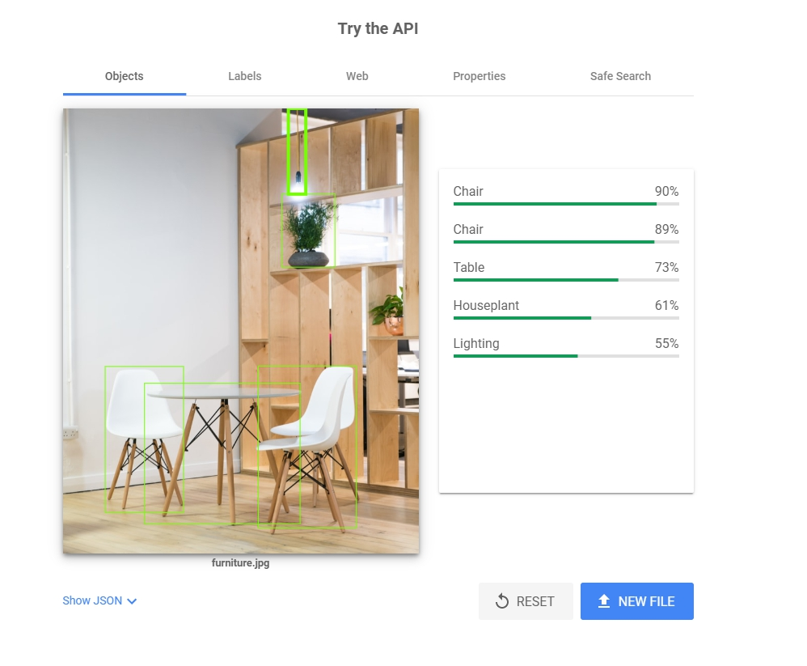
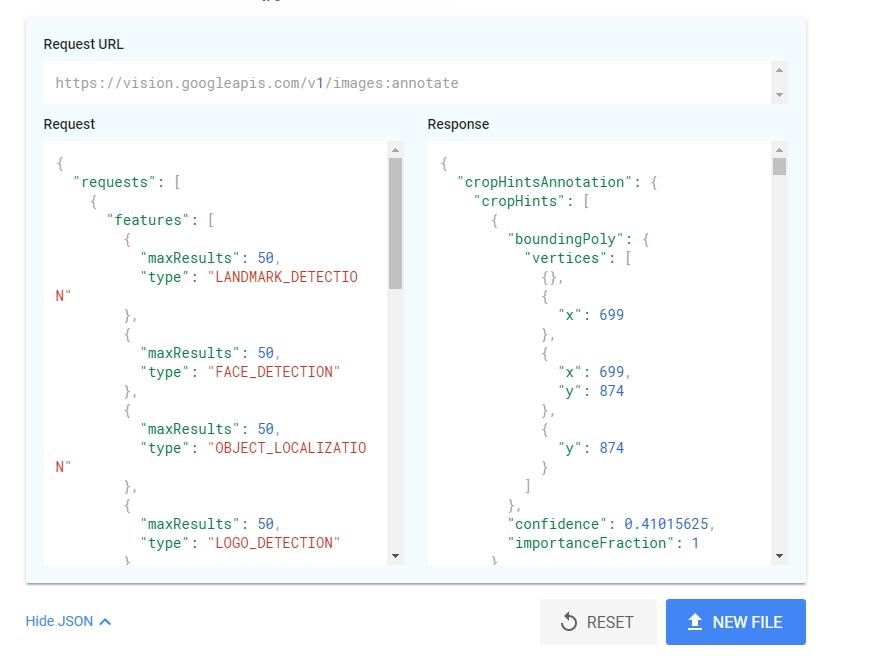

[Google Vision AI](https://cloud.google.com/vision/)分成兩個服務：AutoML Vision、Vision API，我們今天先講Vision API。

[Vision API](https://cloud.google.com/vision/)要講什麼？講什麼都比不過先來玩看看。

1. 選擇圖片：
<!-- more -->
我們先從[https://unsplash.com](https://unsplash.com/search/photos/furniture) 給些tag找個圖片。我搜尋furniture找了下面這張圖。

2. 傳到Vision API裡：
按[這裡](https://cloud.google.com/vision/#vision-api-demo)有個try the API可以使用，我們就把圖片拖曳進去。

這邊你會發現，一張圖進去有五個資訊給你：Objects, Labels, Web, Properties, Safe Search. 對於簡單的圖片分析有很大的功用。
- Objects:
  分析圖片內的物體，像這個範例找到了椅子跟桌子之類的，不過也可以看到這張圖應該有三個椅子，分析出來卻只有兩個。對於物體辨別服務來講，這個是很方便的資訊。
- Labels:
  把視野拉高，Label會告訴我們這張圖到底**屬於什麼**。是客廳、室內設計、房間、而且很多家具。同時讓你直接透過google搜尋找跟某個Label相關的資料。
- Web:
  是哪些地方*可能*含有這張圖呢？透過Web Entities讓我們連結到Google Image，也可以透過Matched pages尋找Google以外可能含有這張圖片的網站，Fully Matched跟Partially Matched Images則是以圖搜圖的概念，哪個連結的圖跟這張一模一樣，或大部分一樣。
- Properties:
  分析這張圖**像素**相關的資訊，多少顏色占百分之幾，還有各個比例的縮圖。
- Safe Search:
  分析這張圖不雅或不妥的資訊，是否包含成人(Adult)、欺騙(Spoof)、醫學(Medical)、暴力(Violence)、Racy(幼兒不宜)等等，不過這溫馨的家具配置圖還好都是非常不可能(Very Unlikely)。
  
  
只有這樣？只有這樣就不會成為一個產品了。如果你注意到圖片底下的**Show JSON**的話，會發現還有更多好玩的組合在裡面。

看到了一隻API，帶著一些Request JSON，然後會回給你Response JSON。其中Request則看到了一些沒在畫面上出現的東西：LANDMARK_DETECTION、FACE_DETECTION、LOGO_DETECTION、DOCUMENT_TEXT_DETECTION，先有這些彩蛋以後，我們明天再來深入了解Vision API的[官方文件](https://cloud.google.com/vision/overview/docs/get-started)。
