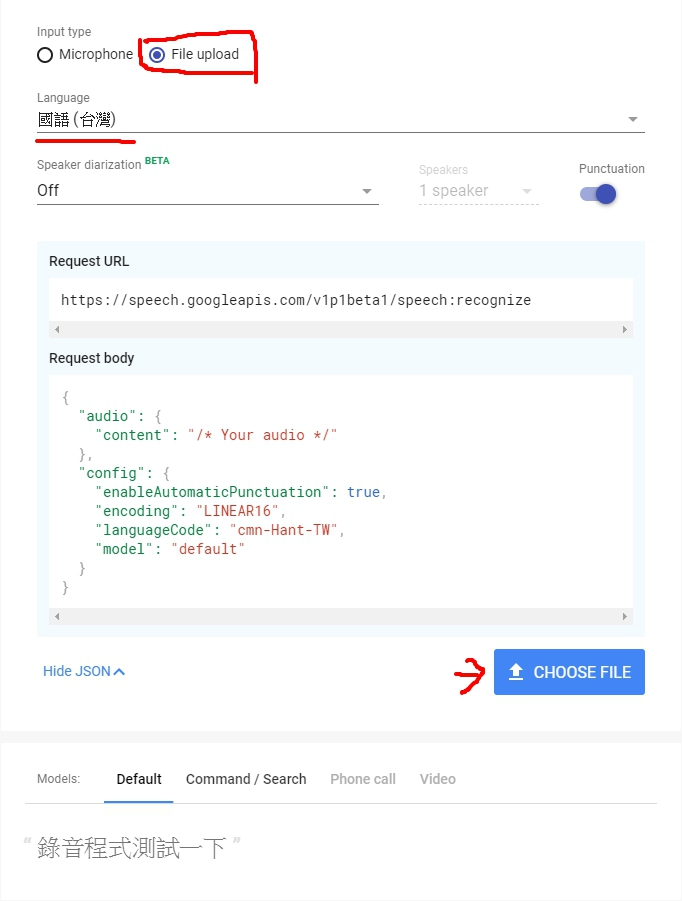

今天來講第六個服務，寫到第21天終於第六個了。這個服務跟前幾天的<a href="/blog/tags/Text-to-Speech/">Text-to-Speech</a>剛好相反，是把聲音轉成文字。這服務號稱可以辨識120種語言跟其變化，更開心的是它可以辨識**中文**，還有廣東話、日文之類的語言也都可以。

當然每個系列的第一天都是玩一下他提供的demo，不過這很像是最後一個有提供demo的服務，接下來還得要調整步調。
大家可以先透過錄音程式錄一段話，然後再將檔案上傳：

<!-- more -->

### Try Speech-to-Text
準備好錄音檔以後，我們就趕快連上[Speech-to-Text](https://cloud.google.com/speech-to-text/?authuser=1)上傳。

> 這邊奇怪的是我的麥克風輸入一直失敗，無法辨識也沒回應

我選擇檔案上傳，並設定為中文，然後就上傳剛剛錄好的音檔。很快的下面就會看到結果`錄音程式測試一下`的字句(隊就是我說的)。
> 其實我們也可以用昨天、跟前天產生的output再把他丟回去分析，看看會不會有同樣的文字輸出

如果無法錄音、也無法跑程式的各位，不用怕，[這邊](https://github.com/GoogleCloudPlatform/golang-samples/tree/master/speech/testdata)有幫大家找到測試檔案。我選擇英文並把連結內的`Google_Gnome.wav`載下來丟上去，結果就是下面這樣：

#### default

#### search/command

這幾個是針對你的情境，給你的語音做最佳化的轉換文字效果，粗略的介紹像是下面這樣

Model|Description
----|----
command_and_search|Best for short queries such as voice commands or voice search.
phone_call|Best for audio that originated from a phone call (typically recorded at an 8khz sampling rate)
video|Best for audio that originated from video or includes multiple speakers. Ideally the audio is recorded at a 16khz or greater sampling rate. This is a premium model that costs more than the standard rate.
default|Best for audio that is not one of the specific audio models. For example, long-form audio. Ideally the audio is high-fidelity, recorded at a 16khz or greater sampling rate.

> 這邊真的建議可以玩一下！！你會發現轉換出來還有很大一段進步空間(光看文字很難想像語音講了什麼)

OK，好了今天就寫到這邊，明天要來進入code的世界了。

