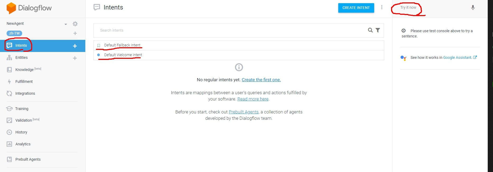
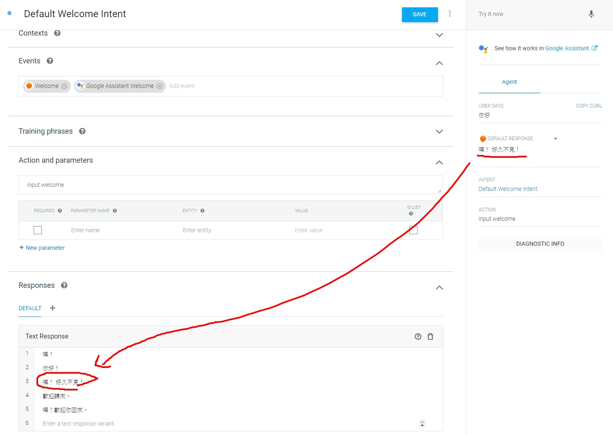
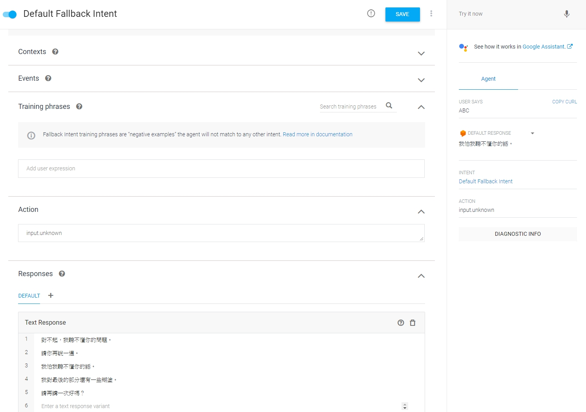

今天要介紹新的服務：[Dialogflow](https://cloud.google.com/dialogflow/)。這部分說明文件繞來繞去，最後導到新的網址：https://cloud.google.com/dialogflow/docs/how

這邊比較可惜是沒有簡易的測試可以玩，我們就先透過UI建立一個agent，建立一個簡單的Dialogflow流程體驗一下。
> 快來這邊體驗Dialogflow的UI吧：https://dialogflow.cloud.google.com/#/getStarted

#### 建立Agent：https://dialogflow.cloud.google.com/#/newAgent
選擇中文並選擇project以後，按下建立就可以建立一個新的dialogflow。

<!-- more -->

#### intents(意圖):

一打開左方的`intent`你會看到中間有建立好兩個預設的意圖，一個是`fallback`、另一個則是`welcome`。`fallback`是讓Dialogflow不知道你在說什麼的時候，可以有一個預設的內容回覆你。`welcome`則是可以接收一些歡迎訊息。
右方的`Try it now`則是讓我們立刻測試intent是否正確使用的，他會告訴你現在回傳的是哪個`intent`內容。

深入來看intent，主要會看到`training phrases`，是在講說接收到裡面的字句會觸發這個intent；另一個是`Response`則是觸發這個intent以後會回覆的內容。

#### 測試welcome：
接著我們很快來測試一下`welcome`。

可以看到輸入`training phrases`裡的文字，經過解析後會判斷為`Default welcome intent`，並回覆該intent裡的response給我們。

#### 測試fallback：

測試fallback很簡單，就隨便打個東西進入Try，然後像上面的看法，你會發現他跑進`Default Fallback Intent`，也是回個`我怕我聽不懂你的話。`提示你無法確認User的意圖。

經過這個UI的測試，我們可以大概了解到Dialogflow在做什麼，有點像是一個`互動聊天機器人`，分析你的內容、給你對應的回覆。

OK，今天的文章就到這邊，謝謝大家的觀看。

