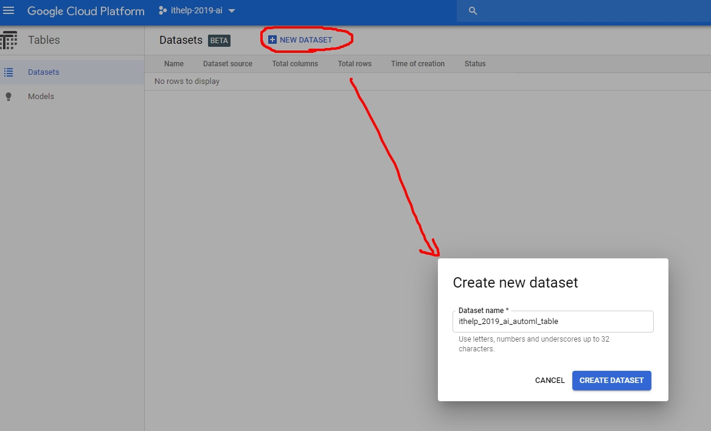
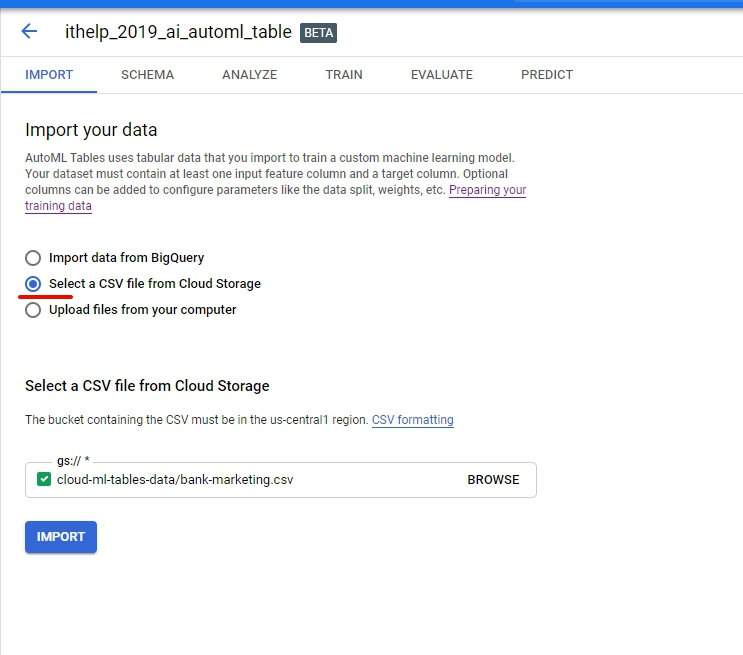
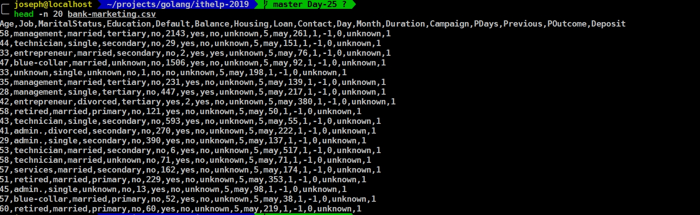
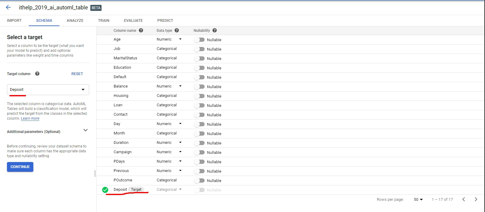
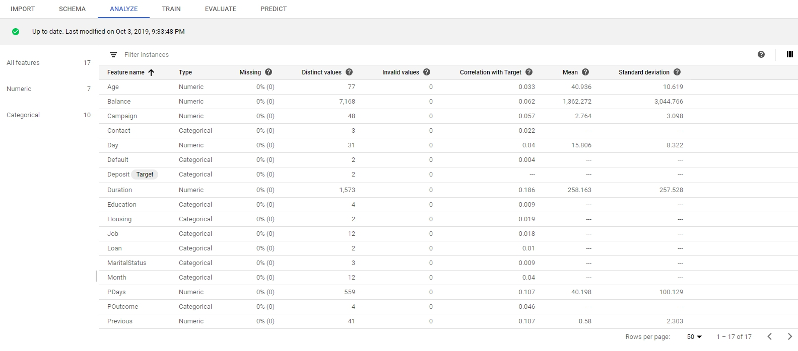
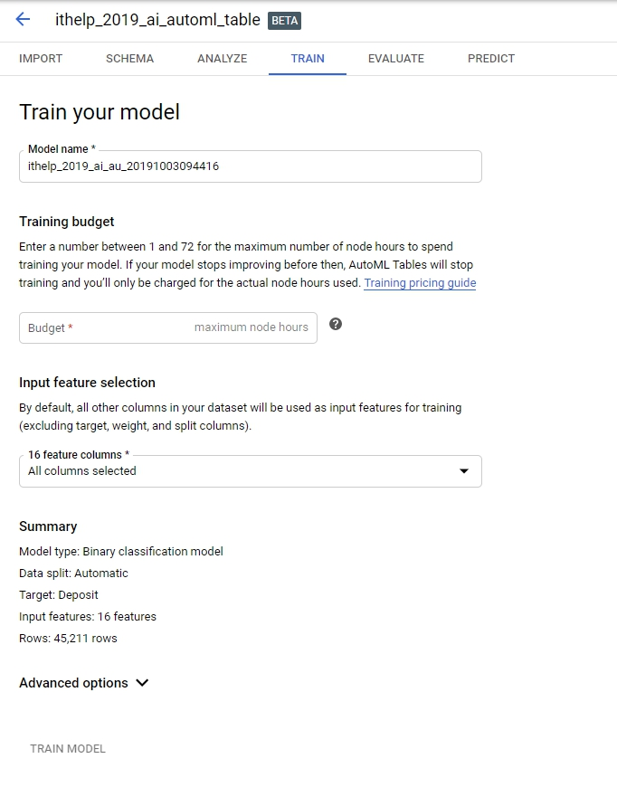
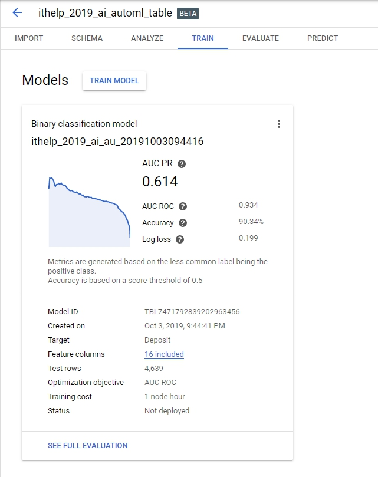
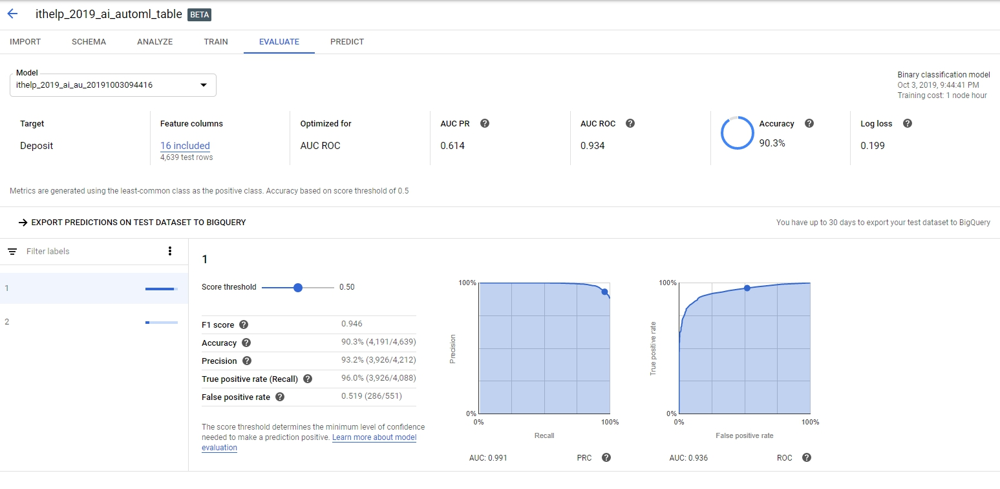
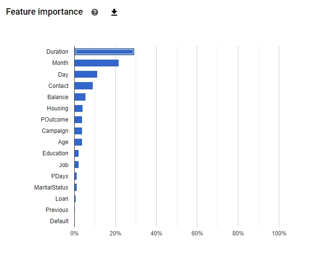
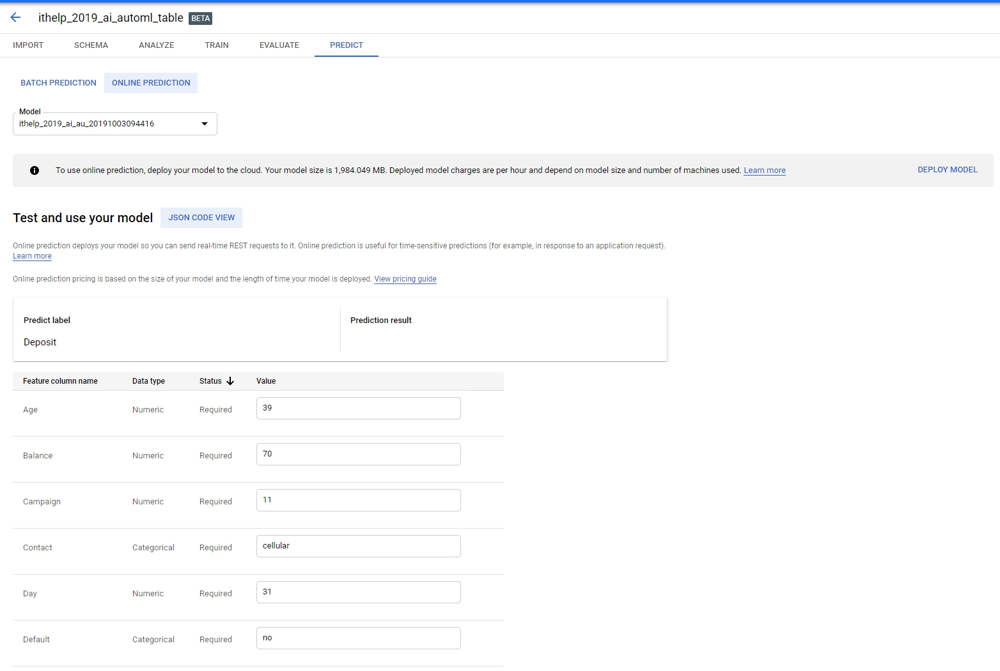

因為篇幅關係，昨天的[Dialogflow](./ithelp-2019-day25)沒有寫到最終章，就要先跳來AutoML Table了。

### 來點簡介再開始
AutoML Table是一種**supervised learning**，並透過表格資料訓練模型。用表格中的`target`欄位進行預測，還有一些用來學習的`features`特徵欄位。而在訓練之前我們該做的是：蒐集、準備資料、訓練、評估、測試、最後是預測。
> 當然還有更詳細的介紹都在這裡：https://cloud.google.com/automl-tables/docs/beginners-guide?authuser=1
<!-- more -->

### 開始動手做
我們跟著[這邊](https://cloud.google.com/automl-tables/docs/quickstart?authuser=1)的步驟，開始在AutoML Table上操作。

> 啟用API可以參考[第四天](https://ithelp.ithome.com.tw/articles/10214988)的文章

1. Create dataset
每次進到AutoML的第一步都是要先建立個資料集，名稱內符號還是只允許下底線 `_`

2. Import data

匯入資料有三種方式：從BigQuery匯入、從Google cloud storage匯入、從本地檔案匯入，範例上給了一個gcs位置`cloud-ml-tables-data/bank-marketing.csv`，我們就選**從Cloud storage匯入**的選項。

不免俗還是要觀察一下csv，至少知道以後要塞資料要怎麼塞。

恩，第一欄可以看出來是schema name，接下來每列就是每個column value。

3. Select target

匯入完會需要在schema選擇Target欄位的動作，我們這邊選的是存款欄位`deposit`，然後就continue吧。

事實上這個data來自[datahub](https://datahub.io/machine-learning/bank-marketing#data-cli)，是用來預測客戶貸款是否是由銀行辦理，所以你可以在datahub上看到[各個欄位的簡介](https://datahub.io/machine-learning/bank-marketing#attribute-information)。

4. Analyze

進到分析以後，會吐出一些基本的統計數值給你看，像是`Mean`、`Standard Deviation`，還有跟target的關聯性`correlation with Target`等等。
這邊確定沒問題就可以進到下一步Train。

5. Train

進入Train就是要準備付錢了，所以一些設定要好好考慮一下，`Budget`可以設定時數最大值，避免被索取過多費用，旁邊的`問號?`也有建議資料量級距該設定的Budget給我們參考。
> 不過根據[定價](https://cloud.google.com/automl-tables/pricing?authuser=1)說明，他們有提供一些免費用量
> **Free trial**: You can try AutoML Tables for free by using 6 free node hours each for training and for batch prediction, per billing account. Your free node hours are issued right before you create your first model, and you have up to one year to use them.

OK以後就是一陣子的訓練...，設定budget為`1`以後差不多一小時左右完成訓練，

6. Evaluate

Evaluate步驟則可以看出來，target為2的樣本數少很多，錯誤率也會比較高一點。但target為1的預測就相對精準許多。
然後`Duration`跟預測target的關聯度會比較高。

7. Prediction

在最後預測這個階段，`Batch prediction`比較沒什麼特別的，就是把檔案丟上去給model去批次預測大量使用者的`deposit`結果。但這邊有個`Online prediction`可以讓我們填入一些數值，讓他直接根據數值馬上給你預測結果。這會是UI比較吃香的部分，讓很多沒有coding能力的人可以馬上上手。
> online prediction前記得要先deploy喔。

寫到這邊差不多把AutoML table看完了，確實節省了很多寫code的困擾，只要有`整理好的資料`，隨時都可以幫我們測出結果。

OK，好，今天的文章就寫到這邊，謝謝各位的觀看。
